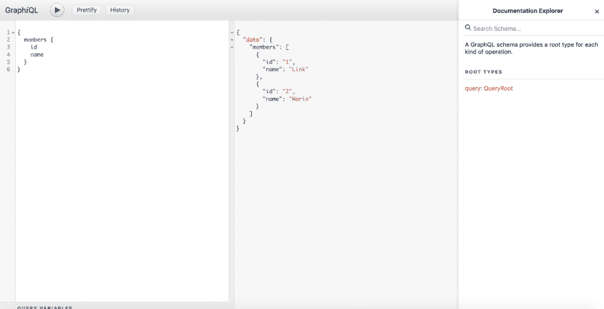
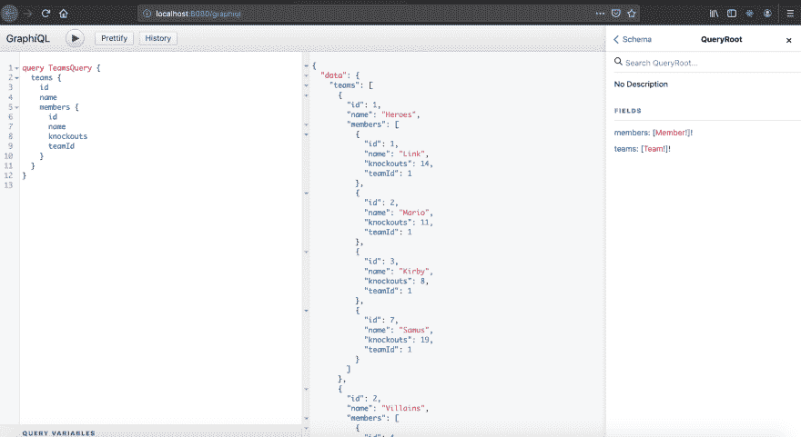

# 用 Rust 构建强大的 GraphQL 服务器

> 原文：<https://dev.to/open-graphql/building-powerful-graphql-servers-with-rust-3gla>

*比尔·牛津在 Unsplash 上拍摄的照片*

用 Rust、Juniper、Diesel 和 Actix 设置 GraphQL 服务器；了解 Rust 的 web 框架和强大的宏。

源代码:[github.com/iwilsonq/rust-graphql-example](https://github.com/iwilsonq/rust-graphql-example)

通过 GraphQL 服务应用程序正迅速成为向客户交付数据的最简单、最有效的方式。无论您是在移动设备上还是在浏览器上，它都会提供所需的数据，仅此而已。

客户端应用程序不再需要将来自不同数据源的信息拼接在一起。GraphQL 服务器负责集成，消除了对过量数据和往返数据请求的需要。

当然，这意味着服务器必须处理来自不同来源的聚合数据，比如自有后端服务、数据库或第三方 API。这可能是资源密集型的，我们如何优化 CPU 时间？

Rust 是一种语言的奇迹，它将 C 等低级语言的原始性能与现代语言的表现力结合在一起。它强调类型和内存安全，尤其是当并发操作中存在潜在的数据竞争时。

让我们看看用 Rust 构建一个 GraphQL 服务器需要什么。我们将了解

*   Juniper GraphQL 服务器
*   与 Juniper 集成的 Actix web 框架
*   diesel 用于查询 sql 数据库
*   使用这些库的有用的 Rust 宏和派生特征

> 请注意，我不会去详细说明安装生锈或货物。本文假设了 Rust 工具链的一些初步知识。

## 设置 HTTP 服务器

首先，我们需要用`cargo`初始化我们的项目，然后安装依赖项。

```
 cargo new rust-graphql-example
    cd rust-graphql-example 
```

Enter fullscreen mode Exit fullscreen mode

初始化命令引导我们的 Cargo.toml 文件，该文件包含我们的项目依赖项以及一个 [main.rs](http://main.rs) 文件，该文件包含一个简单的“Hello World”示例。

```
 // main.rs

    fn main() {
      println!("Hello, world!");
    } 
```

Enter fullscreen mode Exit fullscreen mode

作为健全性检查，可以随意运行`cargo run`来执行程序。

在 Rust 中安装必要的库意味着添加一行包含库名和版本号的代码。让我们像这样更新 Cargo.toml 的依赖项部分:

```
 # Cargo.toml

    [dependencies]
    actix-web = "1.0.0"
    diesel = { version = "1.0.0", features = ["postgres"] }
    dotenv = "0.9.0"
    env_logger = "0.6"
    futures = "0.1"
    juniper = "0.13.1"
    serde = "1.0"
    serde_derive = "1.0"
    serde_json = "1.0" 
```

Enter fullscreen mode Exit fullscreen mode

本文将介绍如何使用 [Juniper](https://github.com/graphql-rust/juniper) 作为 GraphQL 库，使用 [Actix](https://actix.rs/) 作为底层 HTTP 服务器来实现 GraphQL 服务器。Actix 有一个非常好的 API，与 Rust 的稳定版本配合得很好。

添加这些行后，下次项目编译时将包含这些库。在我们编译之前，让我们用一个基本的 HTTP 服务器更新 main.rs，处理索引路由。

```
 // main.rs
    use std::io;

    use actix_web::{web, App, HttpResponse, HttpServer, Responder};

    fn main() -> io::Result<()> {
        HttpServer::new(|| {
            App::new()
                .route("/", web::get().to(index))
        })
        .bind("localhost:8080")?
        .run()
    }

    fn index() -> impl Responder {
        HttpResponse::Ok().body("Hello world!")
    } 
```

Enter fullscreen mode Exit fullscreen mode

顶部的前两行将我们需要的模块纳入范围。这里的 main 函数返回一个`io::Result`类型，它允许我们使用问号作为处理结果的简写。

服务器的路由和配置是在`App`的实例中创建的，该实例是在 HTTP 服务器的构造函数提供的闭包中创建的。

路由本身由 index 函数处理，其名称是任意的。只要这个函数正确地实现了`Responder`,它就可以用作索引路径上 GET 请求的参数。

如果我们正在编写 REST API，我们可以继续添加更多的路由和相关的处理程序。我们很快就会看到，我们正在用一个路由处理程序列表来交换对象及其关系。

现在我们将介绍 GraphQL 库。

## 创建 GraphQL 模式

每个 GraphQL 模式的根是一个根查询。从这个根目录，我们可以查询对象列表、特定对象以及它们可能包含的任何字段。

称之为 QueryRoot，我们将在代码中用相同的名称表示它。由于我们不打算建立一个数据库或任何第三方 API，我们将对这里的少量数据进行硬编码。

为了给这个例子增加一点色彩，模式将描述一个成员的一般列表。

在 src 下，添加一个名为 graphql_schema.rs 的新文件，包含以下内容:

```
 // graphql_schema.rs
    use juniper::{EmptyMutation, RootNode};

    struct Member {
      id: i32,
      name: String,
    }

    #[juniper::object(description = "A member of a team")]
    impl Member {
      pub fn id(&self) -> i32 {
        self.id  
      }

      pub fn name(&self) -> &str {
        self.name.as_str()
      }
    }

    pub struct QueryRoot;

    #[juniper::object]
    impl QueryRoot {
      fn members() -> Vec<Member> {
        vec![
          Member {
            id: 1,
            name: "Link".to_owned(),
          },
          Member {
            id: 2,
            name: "Mario".to_owned(),
          }
        ]
      }
    } 
```

Enter fullscreen mode Exit fullscreen mode

随着我们的导入，我们定义了这个项目中的第一个 GraphQL 对象，即成员。他们是简单的生物，有身份和名字。我们稍后会考虑更复杂的字段和模式。

在将`QueryRoot`类型作为单元结构剔除之后，我们开始定义字段本身。Juniper 公开了一个名为`object`的 Rust 宏，它允许我们在整个模式的不同节点上定义字段。目前，我们只有 QueryRoot 节点，所以我们将在其上公开一个名为 members 的字段。

与标准函数相比，Rust 宏通常具有不寻常的语法。它们不仅仅接受一些参数并产生一个结果，它们在编译时扩展成更复杂的代码。

## 暴露模式

在创建 members 字段的宏调用下面，我们将定义在模式中公开的`RootNode`类型。

```
 // graphql_schema.rs

    pub type Schema = RootNode<'static, QueryRoot, EmptyMutation<()>>;

    pub fn create_schema() -> Schema {
      Schema::new(QueryRoot {}, EmptyMutation::new())
    } 
```

Enter fullscreen mode Exit fullscreen mode

由于 Rust 中的强类型，我们被迫提供突变对象参数。Juniper 为这种情况公开了一个`EmptyMutation`结构，也就是说，当我们想要创建一个只读模式时。

既然模式已经准备好了，我们可以在 main.rs 中更新我们的服务器来处理“/graphql”路由。由于拥有一个游乐场也很好，我们将为 GraphQL 添加一条路线，即交互式 graph QL 游乐场。

```
 // main.rs
    #[macro_use]
    extern crate juniper;

    use std::io;
    use std::sync::Arc;

    use actix_web::{web, App, Error, HttpResponse, HttpServer};
    use futures::future::Future;
    use juniper::http::graphiql::graphiql_source;
    use juniper::http::GraphQLRequest;

    mod graphql_schema;

    use crate::graphql_schema::{create_schema, Schema};

    fn main() -> io::Result<()> {
        let schema = std::sync::Arc::new(create_schema());
        HttpServer::new(move || {
            App::new()
                .data(schema.clone())
                .service(web::resource("/graphql").route(web::post().to_async(graphql)))
                .service(web::resource("/graphiql").route(web::get().to(graphiql)))
        })
        .bind("localhost:8080")?
        .run()
    } 
```

Enter fullscreen mode Exit fullscreen mode

您会注意到我已经指定了一些我们将使用的导入，包括我们刚刚创建的模式。另请参见:

*   我们在一个弧内调用`create_schema`(原子引用计数)，以允许线程间共享不可变状态(用🔥这里我知道)
*   我们在 HttpServer::new 内部用 **move** 标记闭包，表明闭包取得了内部变量的所有权，也就是说，它获得了`schema`的一个副本
*   `schema`被传递给`data`方法，表明它将作为两个服务之间的共享状态在应用程序内部使用

我们现在必须实现这两个服务的处理程序。从“/graphql”路径开始:

```
 // main.rs

    // fn main() ...

    fn graphql(
        st: web::Data<Arc<Schema>>,
        data: web::Json<GraphQLRequest>,
    ) -> impl Future<Item = HttpResponse, Error = Error> {
        web::block(move || {
            let res = data.execute(&st, &());
            Ok::<_, serde_json::error::Error>(serde_json::to_string(&res)?)
        })
        .map_err(Error::from)
        .and_then(|user| {
            Ok(HttpResponse::Ok()
                .content_type("application/json")
                .body(user))
        })
    } 
```

Enter fullscreen mode Exit fullscreen mode

“/graphql”路由的实现从应用程序状态对我们的模式执行 graphql 请求。这是通过从`web::block`创建一个**未来**并链接成功和错误状态的处理程序来实现的。

期货类似于 JavaScript 中的承诺，这足以理解这段代码片段。为了更好地解释 Rust 的未来，我推荐乔·杰克逊的这篇文章。

为了测试我们的 GraphQL 模式，我们还将为“/graph QL”添加一个处理程序。

```
 // main.rs

    // fn graphql() ...

    fn graphiql() -> HttpResponse {
        let html = graphiql_source("http://localhost:8080/graphql");
        HttpResponse::Ok()
            .content_type("text/html; charset=utf-8")
            .body(html)
    } 
```

Enter fullscreen mode Exit fullscreen mode

这个处理程序要简单得多，它仅仅返回 GraphiQL 交互式运动场的 html。我们只需要指定哪个路径服务于我们的 GraphQL 模式，在本例中是“/graphql”。

使用`cargo run`并导航到[http://localhost:8080/graphiql](http://localhost:8080/graphiql)，我们可以尝试我们配置的字段。

[](https://res.cloudinary.com/practicaldev/image/fetch/s--26HdPS0g--/c_limit%2Cf_auto%2Cfl_progressive%2Cq_auto%2Cw_880/https://thepracticaldev.s3.amazonaws.com/i/t22qyi7xarthf9xm2yvl.png)

这看起来确实比用 [Node.js 和 Apollo](https://www.freecodecamp.org/news/learn-to-build-a-graphql-server-with-minimal-effort-fc7fcabe8ebd/) 建立一个 GraphQL 服务器需要更多的努力，但是 Rust 的静态类型和它令人难以置信的性能使它成为一个值得的交易——如果你愿意努力的话。

## 为真实数据设置 Postgres

如果我就此打住，我甚至无法公正地看待文件中的例子。我在开发时间为自己写的两个成员*的静态列表不会出现在本出版物中。*

安装 Postgres 和建立自己的数据库属于另一篇文章，但是我将介绍如何安装 [diesel](http://diesel.rs) ，这是用于处理 SQL 数据库的流行 Rust 库。

> [点击这里在你的机器上安装 Postgres】。你也可以使用不同的数据库，如 MySQL，以防你对它更熟悉。](https://www.postgresql.org/download/)

diesel CLI 将引导我们初始化我们的表。来装吧:

```
 cargo install diesel_cli --no-default-features --features postgres 
```

Enter fullscreen mode Exit fullscreen mode

之后，我们将在工作目录中添加一个. env 文件的连接 URL:

```
 echo DATABASE_URL=postgres://localhost/rust_graphql_example > .env 
```

Enter fullscreen mode Exit fullscreen mode

一旦有了，你就可以运行:

```
 diesel setup

    # followed by

    diesel migration generate create_members 
```

Enter fullscreen mode Exit fullscreen mode

现在，您的目录中将有一个迁移文件夹。其中有两个 SQL 文件:一个 up.sql 用于设置数据库，另一个 down.sql 用于拆除数据库。

我将在 up.sql 中添加以下内容:

```
 CREATE TABLE teams (
      id SERIAL PRIMARY KEY,
      name VARCHAR NOT NULL
    );

    CREATE TABLE members (
      id SERIAL PRIMARY KEY,
      name VARCHAR NOT NULL,
      knockouts INT NOT NULL DEFAULT 0,
      team_id INT NOT NULL,
      FOREIGN KEY (team_id) REFERENCES teams(id)
    );

    INSERT INTO teams(id, name) VALUES (1, 'Heroes');
    INSERT INTO members(name, knockouts, team_id) VALUES ('Link', 14, 1);
    INSERT INTO members(name, knockouts, team_id) VALUES ('Mario', 11, 1);
    INSERT INTO members(name, knockouts, team_id) VALUES ('Kirby', 8, 1);

    INSERT INTO teams(id, name) VALUES (2, 'Villains');
    INSERT INTO members(name, knockouts, team_id) VALUES ('Ganondorf', 8, 2);
    INSERT INTO members(name, knockouts, team_id) VALUES ('Bowser', 11, 2);
    INSERT INTO members(name, knockouts, team_id) VALUES ('Mewtwo', 12, 2); 
```

Enter fullscreen mode Exit fullscreen mode

我将在 down.sql 中添加:

```
 DROP TABLE members;
    DROP TABLE teams; 
```

Enter fullscreen mode Exit fullscreen mode

如果您过去编写过 SQL，这些语句会有一些意义。我们创建了两个表，一个存储团队，另一个存储这些团队的成员。

如果你还没有注意到的话，我是基于 Smash Bros 对这些数据建模的。这有助于坚持学习。

现在运行迁移:

```
 diesel migration run 
```

Enter fullscreen mode Exit fullscreen mode

如果您想验证 down.sql 脚本可以销毁这些表，那么运行:`diesel migration redo`。

我之所以将 GraphQL 模式文件命名为 graphql_schema.rs 而不是 schema.rs，是因为默认情况下，diesel 会在 src 方向覆盖该文件。

它在那个文件中保存了我们的 SQL 表的 Rust 宏表示。知道这个`table!`宏是如何工作的并不重要，但是尽量不要编辑这个文件——字段的顺序很重要！

```
 // schema.rs (Generated by diesel cli)

    table! {
        members (id) {
            id -> Int4,
            name -> Varchar,
            knockouts -> Int4,
            team_id -> Int4,
        }
    }

    table! {
        teams (id) {
            id -> Int4,
            name -> Varchar,
        }
    }

    joinable!(members -> teams (team_id));

    allow_tables_to_appear_in_same_query!(
        members,
        teams,
    ); 
```

Enter fullscreen mode Exit fullscreen mode

最后，感谢一条注释，我们将想要导入 diesel 并在 main.rs:
中公开模式模块

```
 #[macro_use]
+   extern crate diesel;
    extern crate juniper;

    use std::io;
    use std::sync::Arc;

    use actix_web::{web, App, Error, HttpResponse, HttpServer};
    use futures::future::Future;
    use juniper::http::graphiql::graphiql_source;
    use juniper::http::GraphQLRequest;

    mod graphql_schema;
+   mod schema; 
    use crate::graphql_schema::{create_schema, Schema}; 
```

Enter fullscreen mode Exit fullscreen mode

## 给我们的搬运工装上柴油

为了提供表中的数据，我们必须首先用新字段
更新我们的`Member`结构

```
// graphql_schema.rs

+ #[derive(Queryable)]
pub struct Member {
  pub id: i32,
  pub name: String,
+ pub knockouts: i32,
+ pub team_id: i32, }

#[juniper::object(description = "A member of a team")]
impl Member {
  pub fn id(&self) -> i32 {
    self.id  
  }

  pub fn name(&self) -> &str {
    self.name.as_str()
  }

+ pub fn knockouts(&self) -> i32 {
+   self.knockouts
+ } 
+ pub fn team_id(&self) -> i32 {
+   self.team_id
+ } } 
```

Enter fullscreen mode Exit fullscreen mode

请注意，我们还向`Member`添加了`Queryable`派生属性。这告诉 Diesel 它需要知道的一切，以便在 Postgres 中查询正确的表。

另外，添加一个`Team`结构:

```
 // graphql_schema.rs

    #[derive(Queryable)]
    pub struct Team {
      pub id: i32,
      pub name: String,
    }

    #[juniper::object(description = "A team of members")]
    impl Team {
      pub fn id(&self) -> i32 {
        self.id
      }

      pub fn name(&self) -> &str {
        self.name.as_str()
      }

      pub fn members(&self) -> Vec<Member> {
        vec![]
      }
    } 
```

Enter fullscreen mode Exit fullscreen mode

一会儿，我们将更新`Team`上的`members`函数，以返回一个数据库查询。但是首先，让我们为成员添加一个根调用。

```
 // graphql_schema.rs
    + extern crate dotenv;

    + use std::env;

    + use diesel::pg::PgConnection;
    + use diesel::prelude::*;
    + use dotenv::dotenv;
    use juniper::{EmptyMutation, RootNode};

    + use crate::schema::members;

    pub struct QueryRoot;

    +  fn establish_connection() -> PgConnection {
    +    dotenv().ok();
    +    let database_url = env::var("DATABASE_URL").expect("DATABASE_URL must be set");
    +    PgConnection::establish(&database_url).expect(&format!("Error connecting to {}", database_url))
    +  }

    #[juniper::object]
    impl QueryRoot {
      fn members() -> Vec<Member> {
    -   vec![
    -     Member {
    -       id: 1,
    -       name: "Link".to_owned(),
    -     },
    -     Member {
    -       id: 2,
    -       name: "Mario".to_owned(),
    -     }
    -   ]
    +   use crate::schema::members::dsl::*;
    +   let connection = establish_connection();
    +   members
    +     .limit(100)
    +     .load::<Member>(&connection)
    +     .expect("Error loading members")
      }
    } 
```

Enter fullscreen mode Exit fullscreen mode

很好，我们第一次使用了 diesel 查询。初始化连接后，我们使用成员 dsl，它是从 schema.rs 中的`table!`宏生成的，并调用 **load** ，表明我们希望加载`Member`对象。

建立连接意味着使用我们之前声明的 env 变量连接到本地 Postgres 数据库。

假设所有的输入都是正确的，用`cargo run`重启服务器，打开 GraphiQL 并发出 members 查询，可能会添加两个新字段。

teams 查询将非常相似——不同之处在于，我们还必须将查询的一部分添加到`Team`结构上的 members 函数中，以便解析 GraphQL 类型之间的关系。

```
 // graphql_schema.rs

    #[juniper::object]
    impl QueryRoot {
      fn members() -> Vec<Member> {
        use crate::schema::members::dsl::*;
        let connection = establish_connection();
        members
          .limit(100)
          .load::<Member>(&connection)
          .expect("Error loading members")
      }

    +  fn teams() -> Vec<Team> {
    +    use crate::schema::teams::dsl::*;
    +    let connection = establish_connection();
    +    teams
    +      .limit(10)
    +      .load::<Team>(&connection)
    +      .expect("Error loading teams")
    +  }
    }

    // ...

    #[juniper::object(description = "A team of members")]
    impl Team {
      pub fn id(&self) -> i32 {
        self.id
      }

      pub fn name(&self) -> &str {
        self.name.as_str()
      }

      pub fn members(&self) -> Vec<Member> {
    -    vec![]
    +    use crate::schema::members::dsl::*;
    +    let connection = establish_connection();
    +    members
    +      .filter(team_id.eq(self.id))
    +      .limit(100)
    +      .load::<Member>(&connection)
    +      .expect("Error loading members")
      }
    } 
```

Enter fullscreen mode Exit fullscreen mode

当运行 this is GraphiQL 时，我们得到:

[](https://res.cloudinary.com/practicaldev/image/fetch/s--BnizTmBw--/c_limit%2Cf_auto%2Cfl_progressive%2Cq_auto%2Cw_880/https://thepracticaldev.s3.amazonaws.com/i/1gsj02nf5m8le9ujjbr8.png)

我真的很喜欢这样的结果，但是为了使本教程完整，我们还必须添加一点东西。

## 创建成员突变

如果服务器是只读的，不可写的，那么它有什么用呢？我相信这些也有它们的用途，但是我们想把数据写到我们的数据库中，这有多难呢？

首先，我们将创建一个`MutationRoot`结构，它将最终取代我们对`EmptyMutation`的使用。然后我们将添加 diesel 插入查询。

```
 // graphql_schema.rs

    // ...

    pub struct MutationRoot;

    #[juniper::object]
    impl MutationRoot {
      fn create_member(data: NewMember) -> Member {
        let connection = establish_connection();
        diesel::insert_into(members::table)
          .values(&data)
          .get_result(&connection)
          .expect("Error saving new post")
      }
    }

    #[derive(juniper::GraphQLInputObject, Insertable)]
    #[table_name = "members"]
    pub struct NewMember {
      pub name: String,
      pub knockouts: i32,
      pub team_id: i32,
    } 
```

Enter fullscreen mode Exit fullscreen mode

正如 GraphQL 变异通常所做的那样，我们定义了一个名为`NewMember`的输入对象，并将其作为`create_member`函数的参数。在这个函数中，我们建立了一个连接，并调用成员表上的插入查询，传递整个输入对象。

Rust 允许我们对 GraphQL 输入对象和 Diesel 可插入对象使用相同的结构，这非常方便。

让我更清楚地说明一下，对于`NewMember`结构:

*   我们派生`juniper::GraphQLInputObject`以便为我们的 GraphQL 模式创建一个输入对象
*   我们派生`Insertable`是为了让 Diesel 知道这个结构是插入 SQL 语句的有效输入
*   我们添加了`table_name`属性，以便 Diesel 知道将它插入哪个表

这里有很多神奇的事情发生。这就是我喜欢 Rust 的地方，它有很好的性能，但是代码有像宏和派生特征这样的特性来抽象样板文件和增加功能。

最后，在文件的底部，将`MutationRoot`添加到模式:

```
 // graphql_schema.rs

    pub type Schema = RootNode<'static, QueryRoot, MutationRoot>;

    pub fn create_schema() -> Schema {
      Schema::new(QueryRoot {}, MutationRoot {})
    } 
```

Enter fullscreen mode Exit fullscreen mode

我希望一切都准备好了，我们现在可以测试到目前为止所有的查询和突变:

```
 # GraphiQL  mutation  CreateMemberMutation($data:  NewMember!)  {  createMember(data:  $data)  {  id  name  knockouts  teamId  }  }  # example query variables  # {  #   "data": {  #     "name": "Samus",  #     "knockouts": 19,  #     "teamId": 1  #   }  # } 
```

Enter fullscreen mode Exit fullscreen mode

如果这种变异运行成功，您就可以打开一瓶香槟，开始用 Rust 构建高性能、类型安全的 GraphQL 服务器了。

## 感谢阅读

我希望你喜欢这篇文章，我也希望它能给你的工作带来一些启发。

如果下次我在 Rust、ReasonML、GraphQL 或软件开发领域发表文章时，你想继续关注我，请随时关注我在 [Twitter](https://twitter.com/iwilson) 、 [dev.to](https://dev.to/iwilsonq) 或我的网站 [ianwilson.io](https://ianwilson.io) 上的文章。

源代码在这里[github.com/iwilsonq/rust-graphql-example](https://github.com/iwilsonq/rust-graphql-example)。

### 其他整洁的阅读材料

这里有一些我们合作过的图书馆。他们有很棒的文档和指南，所以一定要给他们看一下:)

*   [在东京实施铁锈期货](https://tokio.rs/docs/getting-started/futures/)
*   [Juniper - GraphQL 服务器信任度](https://graphql-rust.github.io/juniper/master/index.html)
*   [柴油安全、可扩展的 ORM 和 Rust 查询生成器](http://diesel.rs/)
*   [Actix - Rust 强大的演员系统和最好玩的 web 框架](https://actix.rs/)