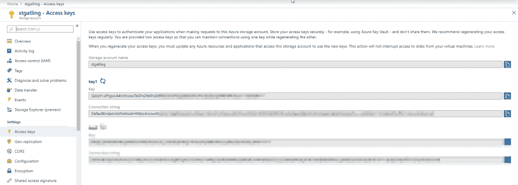
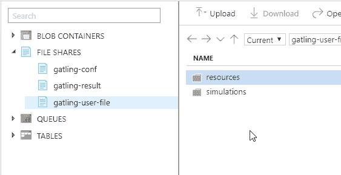

# 在 Azure 容器实例中运行 Gatling 第 1 部分——让 Gatling 在 Azure 中运行

> 原文：<https://dev.to/dantheman999301/running-gatling-in-azure-container-instances-2i59>

[第 2 部分-添加 API 来控制加特林](https://dev.to/dantheman999301/running-gatling-in-azure-container-instances-part-2-adding-an-api-to-control-gatling-3b1o)

我要先说，我对加特林整体了解甚少，所以这是最大的努力，至少让它运行起来。我找不到任何其他关于如何在 Azure 上运行加特林的教程。

我还假设如果你正在阅读这篇文章，你至少对 Azure 和 Azure CLI 有一些了解。

# 设置

如果你不知道 Azure 容器实例是什么，我建议你快速浏览一下这个页面。本质上，他们可以提供一个非常便宜的短期集装箱。

## 创建 Azure 文件共享

你首先需要的是一个 Azure 存储帐户，它可以通过门户或一个小脚本来创建。

```
az storage account create \
    --resource-group gatling \
    --name stgatling \
    --location uksouth \
    --sku Standard_LRS 
```

然后你将需要三个文件共享，`conf`、`user-files`和`results`T3】

```
az storage share create --name conf --account-name stgatling 

az storage share create --name user-files --account-name stgatling 

az storage share create --name results --account-name stgatling 
```

最后，您会想要获取帐户密钥。

```
az storage account keys list --resource-group gatling --account-name stgatling --query "[0].value" --output tsv 
```

当然，您也可以通过门户网站非常简单地获取这些信息。

[](https://res.cloudinary.com/practicaldev/image/fetch/s--CBRrJZ2T--/c_limit%2Cf_auto%2Cfl_progressive%2Cq_auto%2Cw_880/https://thepracticaldev.s3.amazonaws.com/i/48yand5qap18wsltiub4.png)

## 创建容器实例

现在，您将需要创建一个 YAML 文件来部署 Gatling 容器。为此，我们将使用容器组模板，但只部署一个容器。下面是一个可行的例子，你只需要将你的存储密钥插入到`volumes`中。

```
apiVersion: '2018-10-01'
location: uksouth
name: gatling-aci
properties:
  containers:
    - name: gatling
      properties:
        environmentVariables: []
        image: denvazh/gatling
        ports:
          - port: 80
        resources:
          requests:
            cpu: 1.0
            memoryInGB: 1.5
        volumeMounts:
          - mountPath: /opt/gatling/conf
            name: conf
          - mountPath: /opt/gatling/user-files
            name: user-files
          - mountPath: /opt/gatling/results
            name: results
  osType: Linux
  restartPolicy: Never
  ipAddress:
    type: Public
    ports:
      - port: 80
    dnsNameLabel: gatling-test
  volumes:
    - name: conf
      azureFile:
        sharename: conf
        storageAccountName: stgatling
        storageAccountKey: <insert-storage-key-here>
    - name: user-files
      azureFile:
        sharename: user-files
        storageAccountName: stgatling
        storageAccountKey: <insert-storage-key-here>
    - name: results
      azureFile:
        sharename: results
        storageAccountName: stgatling
        storageAccountKey: <insert-storage-key-here>

tags: {}
type: Microsoft.ContainerInstance/containerGroups 
```

这将创建并启动您的容器组。此时应该发生的是加特林将运行，但很快停止，因为没有模拟运行。

## 上传配置

所以我们需要继续将它们上传到文件共享`user-files`。根据您使用的操作系统，有多种方法可以做到这一点，从挂载我们之前创建的 Azure 文件共享开始:

*   windows-[https://docs . Microsoft . com/en-us/azure/storage/files/storage-how-to-use-files-windows](https://docs.microsoft.com/en-us/azure/storage/files/storage-how-to-use-files-windows)

*   Linux-[https://docs . Microsoft . com/en-us/azure/storage/files/storage-how-to-use-files-Linux](https://docs.microsoft.com/en-us/azure/storage/files/storage-how-to-use-files-linux)

*   MAC OS-[https://docs . Microsoft . com/en-us/azure/storage/files/storage-how-to-use-files-MAC](https://docs.microsoft.com/en-us/azure/storage/files/storage-how-to-use-files-mac)

或者，你可以通过 Azure Storage Explorer 或门户网站上传文件。

我们的文件夹下直接有一个`simulations`和`resources`文件夹。

[](https://res.cloudinary.com/practicaldev/image/fetch/s--obiN7euU--/c_limit%2Cf_auto%2Cfl_progressive%2Cq_auto%2Cw_880/https://thepracticaldev.s3.amazonaws.com/i/nic2k6yceeafabq488vk.png)

*(忽略不好的命名)*

最后，我们想要使用默认的 [gatling.conf](https://github.com/gatling/gatling/blob/master/gatling-core/src/main/resources/gatling-defaults.conf) 并编辑两行。

第一个要编辑的是`runDescription`不是空字符串。不管你要跑什么！

其次，编辑`simulationClass`成为您希望运行的模拟的完全限定类名。对我们来说，这是`apimsimulations.ApiMSimulation`(我们正在测试一个 API 管理集成)。

现在将它上传到`conf`文件共享中。

## 运行模拟

现在，您已经准备好运行模拟了。

```
az container start \
   --resource-group gatling
   --name gatling-aci 
```

容器启动应该相当快，它将编译您的模拟并运行它。查看它在做什么的最简单方法是通过门户查看日志，或者您可以从 cli 获取这些日志。

```
az container logs \
   --resource-group gatling
   --name gatling-aci 
```

最后，它应该说它已经生成了报告

```
Reports generated in 2s.
Please open the following file: /opt/gatling/results/apimsimulation-20190912115211503/index.html
Global: count of failed requests is 0.0 : true
Global: mean of response time is less than 500.0 : true 
```

然后，您可以使用与上传文件相同的方法从文件共享中检索这些文件。

## 待办事宜

有相当多的事情我想知道如何去做，其中一些我认为是相当简单的:

*   在非交互模式下运行加特林。这应该只是编辑容器实例的启动命令(entrypoint ),以包含您希望运行的模拟。这可以允许一定程度的自动化...
*   研究如何让容器在完成运行后停止。
*   自动化整个过程。您可以使用 Azure 函数按需创建一个容器，挂载到文件共享上。然后，它只需要指定一个模拟以非交互模式运行，等待完成并停止/删除容器。

虽然是第一次尝试，但我对自己的成功感到非常满意。这样做比启动整个虚拟机更便宜，也更容易！