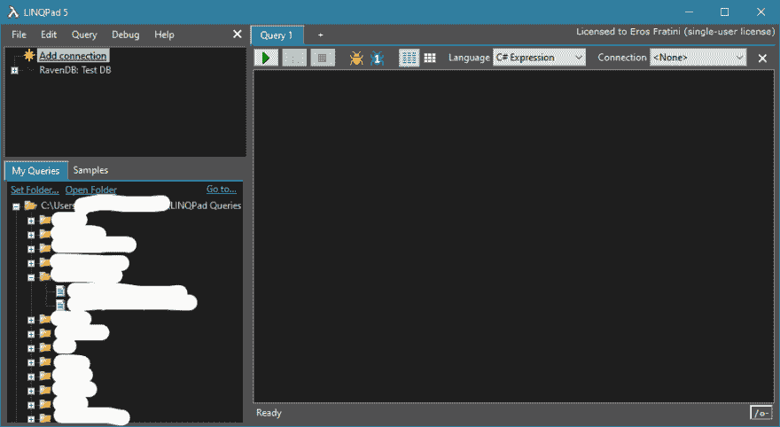
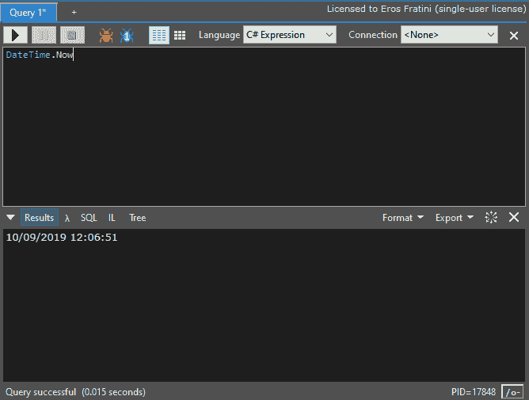

# LINQPad:为什么我喜欢它，为什么你也应该喜欢它

> 原文:[https://dev . to/tana thos/linq pad-why-I-love-it-and-why-you-should-too-5927](https://dev.to/tanathos/linqpad-why-i-love-it-and-why-you-should-too-5927)

# [](#loving-the-tool)热爱工具

我在 10 多年前开始使用 LINQPad，它伴随着我经历了无尽的机器和系统安装。这是我在每台新电脑上安装的前 5 个程序之一。

我现在被称为全栈开发人员，主要专注于. NET 中的服务器端内容。我看到了从 FW2.0 到当前 Core3.0 的发展，LINQPad 一直在我身边，帮助我学习语言，探索框架，原型想法，并(原文如此)为生产中的数据运行快速补丁。所有的好事坏事，我们一起做。

对于从未使用过它的人来说，这是一个简单的介绍。

# [](#where-and-how)地点和方式

LINQPad 可以从[https://www.linqpad.net/](https://www.linqpad.net/)下载，它有不同的风格，取决于你的需求:针对特定的框架版本/带安装程序/不带安装程序/针对 x64 程序集(AnyCPU) /等等...
对于这些，你都可以有一个免费版:免费版的限制与智能感知、NuGet 集成以及通常我们在像 Visual Studio 这样的 ide 中使用的编码自动化有关。

你只需下载并启动。exe，就这样。

# [](#ui)用户界面

一旦你到了那里，你会看到类似这样的东西:
[](https://res.cloudinary.com/practicaldev/image/fetch/s--u7KDBsdM--/c_limit%2Cf_auto%2Cfl_progressive%2Cq_auto%2Cw_880/https://thepracticaldev.s3.amazonaws.com/i/skn899eplbx2961102ne.png)

这非常简单:右边是主代码编辑器，左边是可以在查询中使用的连接列表和保存的查询列表。

让我们首先检查代码部分。

# [](#writing-code)编写代码

空查询默认为“C#表达式”(可通过“编辑”->“首选项”->“查询”覆盖)。可用的选项有 C#和 VB、SQL、ESQL 甚至 F#中的表达式、语句和程序。如果我们处于表达式模式，这意味着你只能写一个 C#表达式，它的输出会在执行时自动转储。

[T2】](https://res.cloudinary.com/practicaldev/image/fetch/s--fSKHnSrN--/c_limit%2Cf_auto%2Cfl_progressive%2Cq_auto%2Cw_880/https://thepracticaldev.s3.amazonaws.com/i/4rlaq6ig0b8hfxtziaqs.png)

执行查询(F5)将打开输出面板，显示单个表达式的结果和其他有趣的选项卡。例如，从这里你可以检查由你的代码产生的底层 SQL 查询(如果有的话)，中间语言，甚至由编译器分析的语法树。

对于单个表达式来说，没有太多事情要做，所以通常你会使用“C#程序”风格。切换到它将改变模板，创建一个 void Main()方法来表示查询代码的入口点。

为了获得相同的结果(在结果面板中显示当前日期时间)，我们现在必须显式选择要转储的值。
LINQPad 有一套扩展方法，允许我们与 LINQPad 本身进行交互，最常见的是 Dump()方法:

```
void Main()
{
    DateTime.Now.Dump();
} 
```

这将产生日期时间的字符串表示。现在，和以前一样，但是现在我们可以与变量交互并转储中间结果:

```
void Main()
{
    var date = DateTime.Now;
    date.Dump();
    date.AddDays(3).Dump();
    date.AddMonths(1).Dump();
} 
```

Dump()方法是强大的，*非常*强大，有许多重载和选项。对于这个快速介绍，我唯一要强调的是输出基本上是数据的 HTML 表示，数据本身的*类型*决定了我们看到的内容。

# [](#prototyping)原型制作

我使用 LINQPad 的主要原因是编写快速的代码片段，我可以比在 Visual Studio 中快 100 倍地进行交互式测试:还有一个分步调试，所以体验非常接近 IDE。

您不局限于查询的 Main()方法，您可以在它之外创建您需要的类和接口。

例如:

```
void Main()
{
    List<User> users = new List<User>();
    users.Add(new User("John", "Doe"));
    users.Add(new User("John", "Wick"));

    users.Dump();
}

public class User 
{
    public User(string firstName, string lastName)
    {
        FirstName = firstName;
        LastName = lastName;
    }

    public string FirstName { get; set; }
    public string LastName { get; set; }
} 
```

是一个完全合法的问题。

# [](#import-your-assembly)导入你的装配

假设你有一个应用程序。NET framework 或。NET core，对其他库有一些依赖，比如一个`MyApp.DataModel`，保存你的域类和接口。您实际上可以在 LINQPad 查询中导入它们，只需进入 Query->References and Properties:从这里您可以导入系统程序集，浏览由您的项目生成的特定 DLL，或者(使用 LINQPad 的 Pro 版本)连接到 NuGet 提要。

[T2】](https://res.cloudinary.com/practicaldev/image/fetch/s--m-EGPj1u--/c_limit%2Cf_auto%2Cfl_progressive%2Cq_auto%2Cw_880/https://thepracticaldev.s3.amazonaws.com/i/x8xxm06tikqtgxvefhs6.png)

您可以通过“Additional Namespace Imports”选项卡在查询中添加要导入的名称空间列表。

此时，您将能够在查询中使用导入的程序集中的所有内容，从而允许您快速探索和测试功能。

[T2】](https://res.cloudinary.com/practicaldev/image/fetch/s--oOAN5tJO--/c_limit%2Cf_auto%2Cfl_progressive%2Cq_auto%2Cw_880/https://thepracticaldev.s3.amazonaws.com/i/mtzarsam6qpp8h8jg412.png)

# [](#conclusions)结论

这篇介绍只是抓住了 LINQPad 所有功能的表面，但应该已经清楚这个工具在工作场景中或只是在学习语言和框架本身的新概念中会变得多么重要(只需看看左下角的“Samples”选项卡)。以正确的方式使用它极大地提高了我的整体生产力。

在以后的文章中，我将深入研究 Dump()方法、数据连接以及与 Visual Studio 的更好集成。