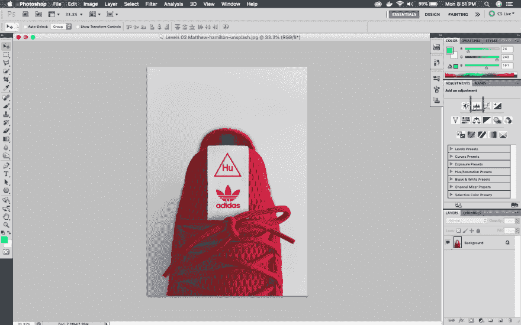
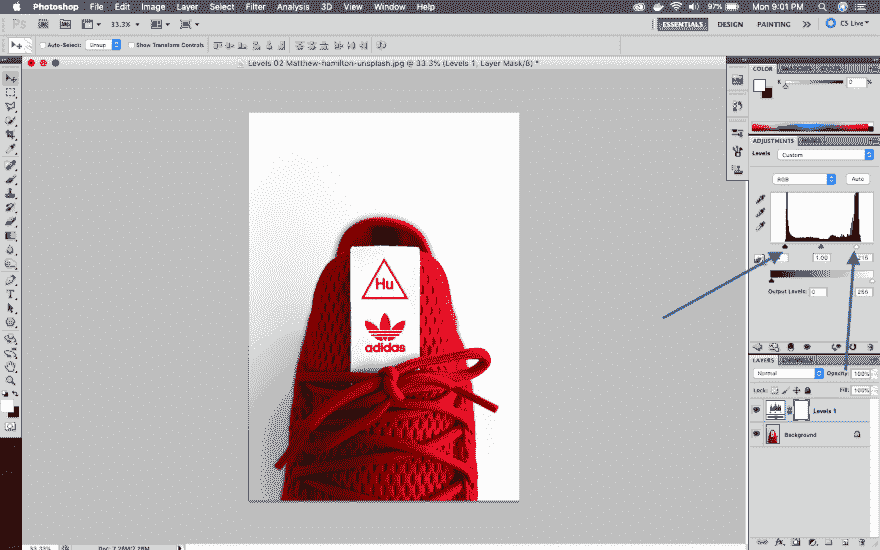
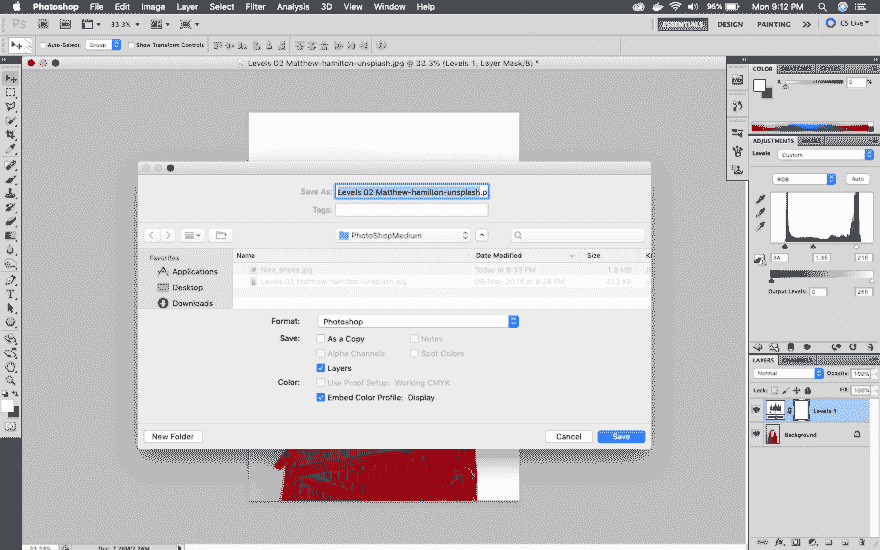
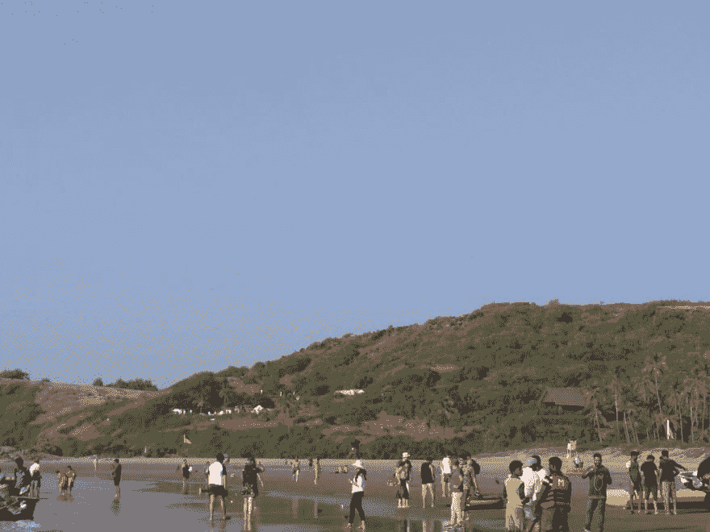
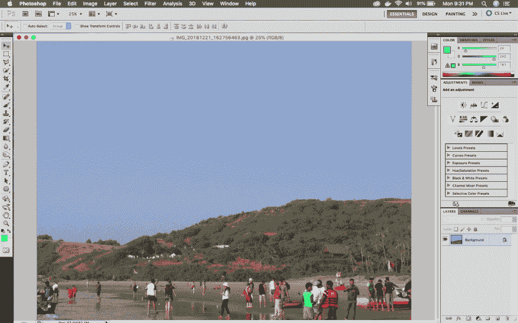
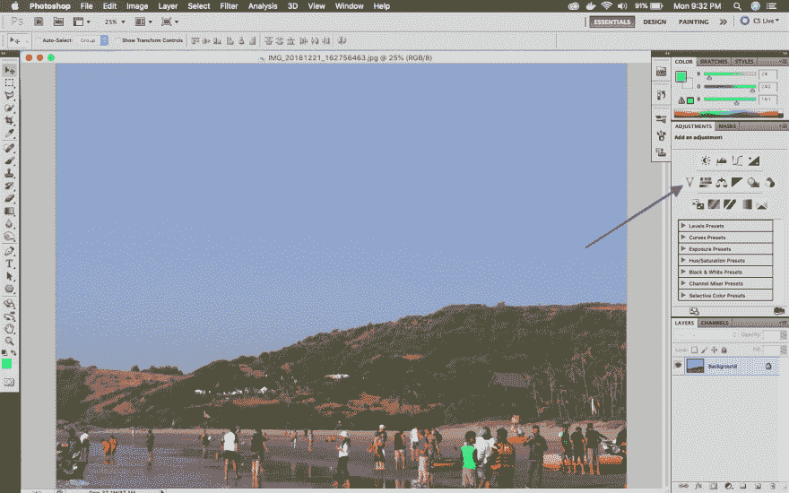
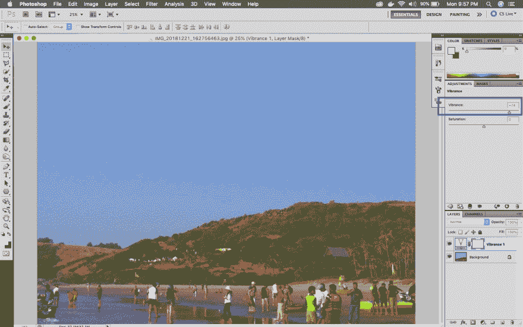

# 面向网络开发人员的 PhotoShop

> 原文：<https://dev.to/nabendu82/photoshop-for-web-developers-1-39be>

在很长一段时间里，我推迟了学习 PhotoShop，转而学习编程的其他技能。如果任何人已经创建了小型组合网站或自由职业者网站或任何网站，照片编辑是一个必须的技能。你需要裁剪图片，缩小图片。我通过 CSS 属性做了大部分的照片编辑，或者通过 Mac 的预览编辑器做了一个糟糕的工作。

终于到了学习 photoshop 技巧的时候了，所以我先搜索了 Youtube，但没能找到任何完整的课程。然后我搜索了 Udemy，发现了一个很棒的 [Dan](https://www.udemy.com/adobe-photoshop-cc-essentials-training-course/learn/lecture/10717740#overview) 的课程。这个博客里的大部分东西都是来自他的教导。

我有 PhotoShop CS5 和这个博客是基于这一点。我们先来学习一下如何修图。如果我们从像 pexels T1 或 T2 unsplash T3 这样的地方得到它们，它们几乎不需要修理。但有时我们在网站上使用手机上的图片，这时候，这些技巧就派上用场了。

### 使用色阶固定图像

让我们开始使用 photoshop 中称为色阶的调整来修复图像。所以，打开你的 PhotoShop，打开任何图像。我将使用下面的图像。

 *作者马修-汉密尔顿·昂斯普什*

T3】打开图像

现在点击调整标签，然后在下面的截图显示的 spikey 的东西。当您将鼠标悬停在它上面时，将显示**个级别**。

 *关卡*

一旦点击，一个新的层将在层标签中形成，调整标签也将显示峰值图。

 *关卡开启*

现在，在级别图中有三个滑块。黑色(或白色)图形代表图像。将外部的两个滑块拖到图表开始的位置或稍远一点的位置。您将立即看到图像的清晰度增加。

 *锐度增加*

接下来向左或向右拖动中间的滑块，看看有什么神奇之处。把它拖到你喜欢的地方。

 *中间滑块*

你可以随时检查原始图像和魔术，这是你刚刚通过点击水平层的眼睛。关了看原图，开了看自己的大作。

 *层开/关*

是时候拯救你的杰作了。记得打开水平层的水平眼。点击**文件- >另存为**。默认情况下，它会要求保存为 PhotoShop，但正如我们所知，大多数图像需要 JPEG 或 PNG 才能使用。

但是首先把它保存为 Photoshop(psd)文件，因为我们以后可以编辑它。

 *另存为 psd*

现在再次点击**文件- >另存为**并另存为 jpeg。

 *另存为 JPEG*

### 使用鲜明度增强颜色

接下来，我们将学习如何使用鲜明度来增强图像中的颜色。我们先在 Photoshop 中打开一张图片。

这是我在最近的果阿之旅中拍摄的原始照片。

 *果阿海滩*

现在用 PhotoShop 打开它。

 *在 PhotoShop 中打开*

接下来将鼠标移动到倒三角形上，这将显示活力。

 *活力*

现在，饱和度窗口有两个区域——饱和度和饱和度。如果你滑动饱和度，你会注意到它增强了所有东西的颜色。但是，如果你滑动鲜明度，它只会增强暗淡项目的颜色，并留下已经增强的颜色。

我们滑动了饱和度滑块，图像中的暗淡颜色得到了增强。

 *活力最佳*

将图像保存为 psd 和 jpeg 格式，并且不要忘记点击 Vibrance 图层中的眼睛来查看之前和之后的效果。