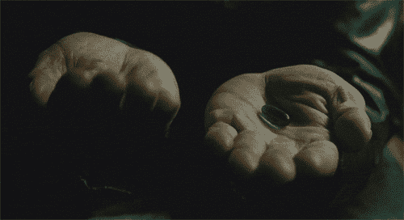
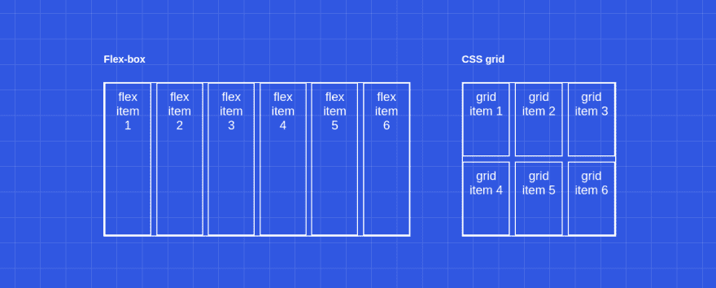
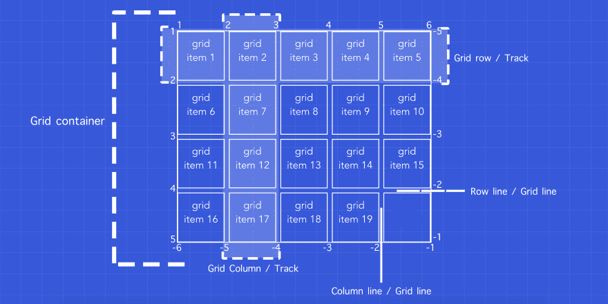
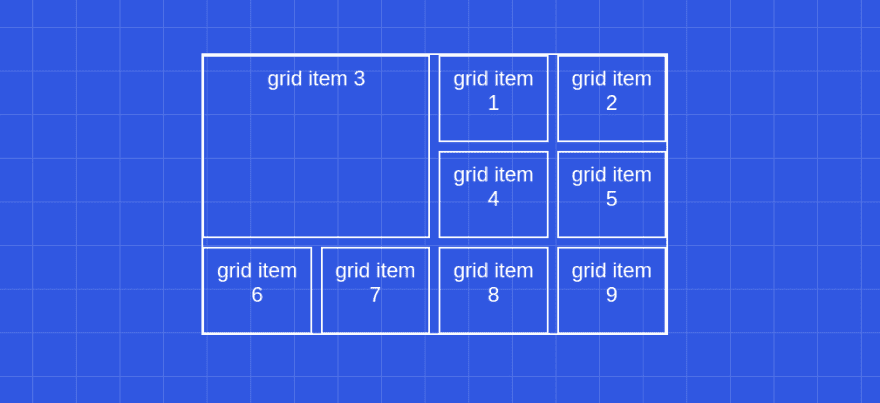
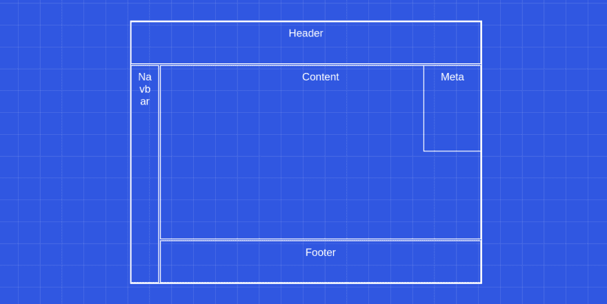
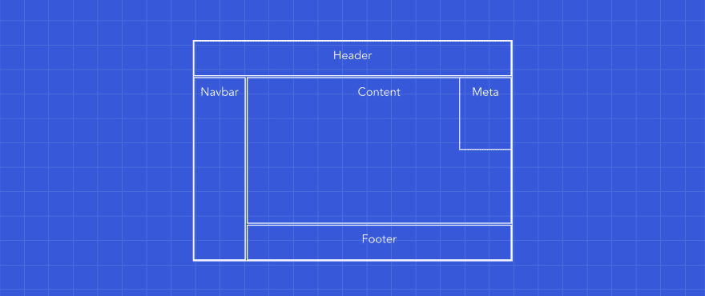
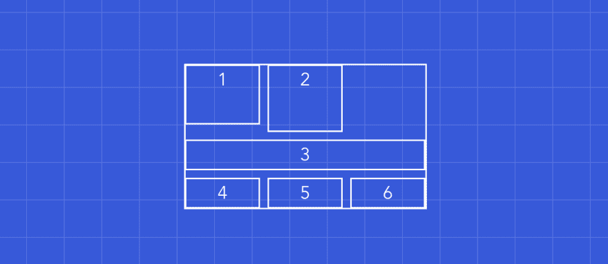
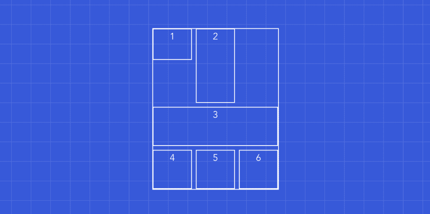
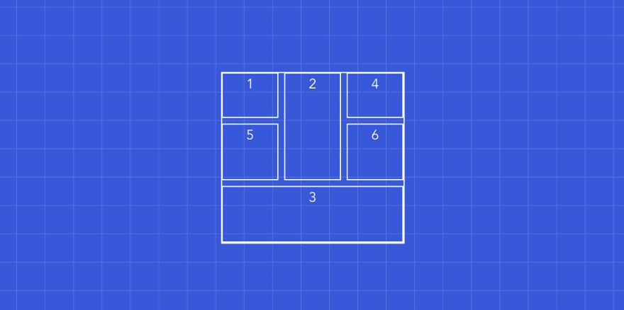

# CSS 网格:图解介绍

> 原文：<https://dev.to/mustapha/css-grid-illustrated-introduction-52l5>

本文是两部分系列的第一部分。

* * *

# 简介

我记得我第一次学习 CSS 的时候，我是多么兴奋地学习浮动和内联显示来将元素放置在想要的布局中。我在想，如果当时有二维布局系统，我会有什么反应？事实上，即使是现在，我也对此感到兴奋，因为它改变了一切:我们编写 CSS 的方式，也改变了我们编写标记的方式。使用 CSS grid，比以往任何时候都更容易构建响应迅速、动态且独立于源代码顺序的布局。

在这篇文章中，我们将学习所有的 CSS 网格属性来构建简单的和一些不太简单的布局。我们将定义一切，然后我们会挖得更深一点，看看我们可以实现 CSS 网格。话虽如此，如果你准备好学习一种思考布局的新方法，服用红色药丸，我会告诉你兔子洞有多深。

[](https://res.cloudinary.com/practicaldev/image/fetch/s--sE03pdah--/c_limit%2Cf_auto%2Cfl_progressive%2Cq_66%2Cw_880/http://giphygifs.s3.amazonaws.com/media/SCt3Miv6ugvSg/giphy.gif)

# 1。开始之前

但是在我们开始之前，我想解决一些你可能会有的问题，同时确保我们熟悉 CSS 网格的基础知识和它的术语。

## 问&答

### CSS grid 是否取代 flex-box？

CSS 网格并没有取代 flex-box。它们是用于不同目的的两种不同的工具。实际上，它们配合得非常好，我们可以在网格显示器中使用柔性显示器，反之亦然。

### CSS grid 和 flex-box 有什么区别？

有很多不同之处，但主要的一点是 flex-box 是一维布局系统，而 CSS grid 是二维布局系统。看看下面的*图 1.1* :

<figure>

[](https://res.cloudinary.com/practicaldev/image/fetch/s--AwV5oETJ--/c_limit%2Cf_auto%2Cfl_progressive%2Cq_auto%2Cw_880/https://i.ibb.co/ssCd92c/flex-vs-grid.png)

<figcaption>Figure 1.1: Flex-box vs CSS grid</figcaption>

</figure>

### 为什么不用 bootstrap 代替？

我认为这个问题的最佳答案是珍·西蒙斯的这句话:

> 我使用 CSS Grid 越多，我就越确信在其上增加一层抽象层没有任何好处。CSS Grid 是浏览器内置的布局框架——Jen Simmons

### CSS 网格生产就绪了吗？

看情况。需要支持:IE，Opera mini，黑莓浏览器，还是百度手机？如果答案是*否*，那么是的，它已经可以生产了，如果答案是*是*，那么你可以使用`@supports` CSS at-rule:
在支持它的浏览器上使用它

```
@supports (display: grid) {
  div {
    display: grid;
  }
} 
```

Enter fullscreen mode Exit fullscreen mode

## 基础知识

基本上，一个网格可以分解成两个元素:**网格容器**和**网格项目**。

<figure>

[](https://res.cloudinary.com/practicaldev/image/fetch/s--_YJvL5YJ--/c_limit%2Cf_auto%2Cfl_progressive%2Cq_auto%2Cw_880/https://i.ibb.co/dkYpKRT/grid.jpg)

<figcaption>Figure 1.2: Basic grid</figcaption>

</figure>

正如我们在图 1.2 中看到的，网格容器是一组列和行。`row`是两个连续行线(水平线)之间的空间，而`column`是两个连续列线(垂直线)之间的空间。一行可以称为一个轨迹，一列也是如此。所以网格`track`是两条平行网格线之间的空间。

每个轨迹可以有一个或多个网格单元。网格`cell`是基本的网格单元，因为它是最小的单元。它是四条相交网格线之间的空间。如果我们将多个网格单元组合在一起，我们就有了一个网格`area`。值得一提的是，网格区域必须是矩形的，例如，我们不能有 T 形网格区域。

网格线从 1 开始，直到您显式或隐式定义的行数。网格线的最后一个编号可以称为-1，它之前的网格线称为-2，依此类推。这个以后会派上用场的。
在*图 1.2* 中，列线数量从 1 到 6(从-6 到-1)，行线数量从 1 到 5(或-5 到-1)。

如果你在你的 CSS 中明确的设置了网格线的数量，那么它被认为是`explicit`。而且如果是浏览器动态设置的就认为是`implicit`。

最后，网格单元可以由空间或间隙分开。那些间隙被称为`gutters`，但我们一般称之为`gaps`:)。

# 2。CSS 网格基本属性

好了，现在我们应该准备开始实现一些网格了。我们首先将讨论网格容器中可以使用的所有属性，然后我们将看看网格项目的属性。

让我们考虑一下这个部分的模板:

```
<div class="grid-container">
    <div class="grid-item">grid item 1</div>
    <div class="grid-item">grid item 2</div>
    <div class="grid-item">grid item 3</div>
    <div class="grid-item">grid item 4</div>
    <div class="grid-item">grid item 5</div>
    <div class="grid-item">grid item 6</div>
    <div class="grid-item">grid item 7</div>
    <div class="grid-item">grid item 8</div>
    <div class="grid-item">grid item 9</div>
</div> 
```

Enter fullscreen mode Exit fullscreen mode

## 网格容器

### 显示

CSS 网格是使用`display`属性的`grid`值定义的。所以，要使用上面的模板定义网格，我们应该做:

```
.grid-container {
  display: grid;
} 
```

Enter fullscreen mode Exit fullscreen mode

### 行&列

我们可以使用`grid-template-rows`和`grid-template-columns`属性:
来定义网格上的列和行

```
.grid-container {
  grid-template-columns:  1fr 1fr 1fr 1fr;
  grid-template-rows:  1fr auto 2fr;
} 
```

Enter fullscreen mode Exit fullscreen mode

或者我们可以使用`grid-template`，首先定义`grid-template-rows`，然后定义`grid-template-columns`(用斜线分隔):

```
.grid-container {
  grid-template:  1fr auto 2fr  / 1fr 1fr 1fr 1fr;
} 
```

Enter fullscreen mode Exit fullscreen mode

顺便说一下，`fr`是一个分数单位，所以`1fr`是可用空间的 1 部分。

### 重复功能

`repeat()`函数代表曲目列表的重复片段。
所以我们可以像这样实现与上面相同的模板:

```
.grid-container {
  grid-template:  1fr auto 2fr / repeat(4, 1fr);
} 
```

Enter fullscreen mode Exit fullscreen mode

阅读文档[这里](https://developer.mozilla.org/en-US/docs/Web/CSS/repeat)看看如何使用`auto-fit`和`auto-fill`动态添加轨道。

### Minmax 函数

`minmax()` CSS 函数定义大于或等于最小值且小于或等于最大值的尺寸范围。
我们可以这样和`repeat()`一起用:

```
.grid-container {
  grid-template-columns:  repeat(3, minmax(100px, 1fr));
} 
```

Enter fullscreen mode Exit fullscreen mode

### 缺口

我们可以使用`row-gap`增加行线之间的间隙，我们也可以使用`column-gap` :
增加列线之间的间隙

```
.grid-container {
 row-gap: 5px;
 column-gap: 10px;
} 
```

Enter fullscreen mode Exit fullscreen mode

或者我们可以使用`gap`，我们首先定义`row-gap`，然后定义`column-gap` :

```
.grid-container {
  gap: 5px 10px;
} 
```

Enter fullscreen mode Exit fullscreen mode

如果行间距与列间距相同，我们只能指定一个值。

## 网格项

为了指定网格项目在网格中的开始和结束位置，我们基本上使用四个属性。让我们来看看它们的定义。

### 定义

| 性能 | 定义 |
| --- | --- |
| `grid-row-start` | grid-row-start CSS 属性通过提供一条线、一个跨度或不提供任何内容(自动)来指定网格项在网格行中的起始位置 |
| `grid-row-end` | grid-row-end CSS 属性通过提供一条线、一个跨度或不提供任何内容(自动)来指定网格项在网格行中的结束位置 |
| `grid-column-start` | grid-column-start CSS 属性通过提供一行、一个跨度或不提供任何内容(自动)来指定网格项在网格列中的起始位置 |
| `grid-column-end` | grid-column-end CSS 属性通过提供一条线、一个跨度或不提供任何内容(自动)来指定网格项在网格列中的结束位置 |

或者我们可以使用这些属性的简称:

| 性能 | 定义 |
| --- | --- |
| `grid-row` | grid-row CSS 属性是 grid-row-start 和 grid-row-end 的简写属性，用于指定网格项在网格行中的大小和位置 |
| `grid-column` | grid-column CSS 属性是 grid-column-start 和 grid-column-end 的简写属性，用于指定网格项在网格列中的大小和位置 |

### 基本模板间距

因此，考虑到我们在这一节开始时的标记，假设我们希望第三个网格项采用 4 个单元格，而不是一个(我们希望它跨越两个网格列和两个网格行)，如*图 1.3* 所示。我们怎么做呢？

<figure>

[](https://res.cloudinary.com/practicaldev/image/fetch/s--VkW6KaAG--/c_limit%2Cf_auto%2Cfl_progressive%2Cq_auto%2Cw_880/https://i.ibb.co/8ryrRvm/items.png)

<figcaption>Figure 1.3: Template spacing example</figcaption>

</figure>

我们可以这样实现:

```
// Grid container
.grid-container {
  display: grid;
  gap: 10px;
  grid-template-columns: repeat(4, 1fr);
  grid-template-rows: repeat(3, 1fr);
}

// Grid item (third)
.grid-container .grid-item:nth-child(3) {
  grid-column-start: 1;
  grid-column-end: 3;
  grid-row-start: 1;
  grid-row-end: 3;
  // or
  grid-column: 1 / 3;
  grid-row: 1 / 3;
  // or
  grid-column: 1 / span 2;
  grid-row: 1 / span 2;
  // or
  grid-column: -5 / span 2; // because we have 4 columns
  grid-row: -4 / span 2; // because we have 3 rows
} 
```

Enter fullscreen mode Exit fullscreen mode

> 注意，第三个网格项目实际上是图 1.3 中的第一个。这与 CSS grid 可以(第一次)独立于源代码顺序的事实有关。我们将在稍后讨论`grid-auto-flow`时触及这一点。

[如果您想玩它并探索不同的解决方案，请点击此处](https://codepen.io/TheAngularGuy/pen/NWKzPLY)。

# 3。高级模板

有更多的高级属性可以帮助你调整你的模板。在这一节中，我们将看看这些属性，看看如何在我们的 CSS 中使用它们。

对于这个部分，考虑下面的模板:

```
 <div class="grid-container">
   <div class="grid-item header">Header</div>
   <div class="grid-item content">Content</div>
   <div class="grid-item navbar">Navbar</div>
   <div class="grid-item meta">Meta</div>
   <div class="grid-item footer">Footer</div>
 </div> 
```

Enter fullscreen mode Exit fullscreen mode

利用我们之前所学的，我们可以实现下面的 CSS，使它看起来像一个基本的网站布局:

```
.grid-container {
  grid-template: repeat(6, 1fr) / repeat(12, 1fr);// rows then columns
}
.grid-container .header {
  grid-column: 1 / -1;  grid-row: 1 / 2;
}
.grid-container .navbar {
  grid-column: 1 / 2;  grid-row: 2 / -1;
}
.grid-container .content {
  grid-column: 2 / -1;  grid-row: 2 / -2;
}
.grid-container .footer {
  grid-column: 2 / -1;  grid-row: -2 / -1;
}
.grid-container .meta {
  grid-column: -3 / -1;  grid-row: 2 / 4;
} 
```

Enter fullscreen mode Exit fullscreen mode

<figure>

[](https://res.cloudinary.com/practicaldev/image/fetch/s--1FfLukk---/c_limit%2Cf_auto%2Cfl_progressive%2Cq_auto%2Cw_880/https://i.ibb.co/LDFmBzH/basic.png)

<figcaption>Figure 1.4: Basic website layout. [Code available here](https://codepen.io/TheAngularGuy/pen/jONKrJm)</figcaption>

</figure>

现在，假设我们想要我们的导航栏(在右边)稍微宽一点。现在，它跨越一个列线，我们希望它跨越两个列线。为此，我们必须改变`.navbar`的位置，但是我们也必须改变`.content`和`.footer`的位置，因为目前`.navbar`从列线 1 到 2，而`.footer` & `.content`从列线 2 到最后。

如果我们每次都必须改变元素的位置，这可能会很乏味，如果有一种方法可以告诉 CSS grid 自动为我们做这件事，那就太好了。不是只有一种方法，但至少有两种。

## 命名线条

第一种解决方案是命名特定的行，然后我们使用它的别名而不是它的编号来引用它。让我们尝试实现这一点。

```
.grid-container {
  grid-template-rows: repeat(6, 1fr);
  grid-template-columns: 1fr 1fr [content-start navbar-end] repeat(10, 1fr);
} 
```

Enter fullscreen mode Exit fullscreen mode

在上面的代码中，我们使用简单的括号将 tird 行命名为 alias(一行可以有多个 alias)。那么现在我们将改变之前提到的元素的 CSS:

```
.grid-container .navbar {
  grid-column: 1 / navbar-end;  grid-row: 2 / -1;
}
.grid-container .content {
  grid-column: content-start / -1;  grid-row: 2 / -2;
}
.grid-container .footer {
  grid-column: content-start / -1;  grid-row: -2 / -1;
} 
```

Enter fullscreen mode Exit fullscreen mode

<figure>

结果应该是这样的:
[](https://res.cloudinary.com/practicaldev/image/fetch/s--zWpxlWOb--/c_limit%2Cf_auto%2Cfl_progressive%2Cq_auto%2Cw_880/https://i.ibb.co/RyvJXX1/Screenshot-2019-09-12-at-21-04-33.png)

<figcaption>Figure 1.5: Basic website layout - extended navbar</figcaption>

</figure>

尝试对代码片段中的其他行(例如:header-row-end/content-row-start)[做同样的事情。](https://codepen.io/TheAngularGuy/pen/jONKrJm)

## 元素模板区域

第二个解决方案是使用模板区域。CSS 属性指定了命名的网格区域。这个属性对于 CSS 来说有一个奇怪的语法，但是我们像这样使用它们:

```
.grid-container {
  grid-template-areas:
    'h h h h h h h h h h h h'
    'n n c c c c c c c c c c'
    'n n c c c c c c c c c c'
    'n n c c c c c c c c c c'
    'n n c c c c c c c c c c'
    'n n f f f f f f f f f f';
}
.grid-container .navbar {
  grid-area: n;
}
.grid-container .content {
  grid-area: c;
}
.grid-container .footer {
  grid-area: f;
}
.grid-container .header {
  grid-area: h;
}
.grid-container .meta {
  grid-column: -3 / -1;  grid-row: 2 / 4;
} 
```

Enter fullscreen mode Exit fullscreen mode

我们使用`grid-template-areas`来定义网格容器区域，然后我们使用`grid-area`将网格项放置在所需的区域。
提醒一下，所有的区域都必须是矩形的。

> 请注意，我们没有对`.meta`元素使用`grid-area`。这是因为，就目前而言，还没有使用这种方法叠加元素的方法。至少据我所知没有。

你可以随意摆弄它，这里有[代码](https://codepen.io/TheAngularGuy/pen/OJLEbeq)。

# 4。隐式行&网格流

让我们考虑下面的代码:

```
<div class="grid-container">
  <div class="grid-item">1</div>
  <div class="grid-item">2</div>
  <div class="grid-item">3</div>
  <div class="grid-item">4</div>
  <div class="grid-item">5</div>
  <div class="grid-item">6</div>
</div>
<style>
.grid-container {
  grid-template-columns: repeat(3, minmax(100px, 1fr));
  grid-template-rows: 80px;
}
.grid-container .grid-item:nth-child(2) {
  grid-row: span 2;
}
.grid-container .grid-item:nth-child(3) {
  grid-column: span 3;
}
</style> 
```

Enter fullscreen mode Exit fullscreen mode

<figure>

我们有一个三列的网格，我们希望第二个网格项目跨越两行，第三个跨越三列。这就导致了:
[](https://res.cloudinary.com/practicaldev/image/fetch/s--TSr8M2Fn--/c_limit%2Cf_auto%2Cfl_progressive%2Cq_auto%2Cw_880/https://i.ibb.co/hFZFDWz/Screenshot-2019-09-12-at-23-09-31.png)

<figcaption>Figure 1.6 Bad looking grid</figcaption>

</figure>

情况不妙，这里发生了什么？首先，第二个元素比第一个元素稍微高一点，因为我们告诉它要高两倍，但是它看起来一点也没有高两倍。此外，从 3 到 6 的网格项目没有拳头高。

## 隐含行

这与我们显式设置第一行的事实有关:`grid-template-rows: 80px;`。但是其他行是隐式创建的，所以第二行几乎不可见，因为它是空的，其他行的大小取决于它们的内容。
我们可以通过使用`grid-auto-rows`像这样设置隐式创建的行的高度来解决这个问题:

```
.grid-container {
  grid-template-columns: repeat(4, minmax(100px, 1fr));
  grid-template-rows: 80px;
  grid-auto-rows: 100px; 
} 
```

Enter fullscreen mode Exit fullscreen mode

<figure>

而这个应该是这样的:
[](https://res.cloudinary.com/practicaldev/image/fetch/s--ShzZqxDf--/c_limit%2Cf_auto%2Cfl_progressive%2Cq_auto%2Cw_880/https://i.ibb.co/H2NS868/Screenshot-2019-09-12-at-23-09-53.png)

<figcaption>Figure 1.7 Better grid, but still</figcaption>

</figure>

这看起来更好，但我们仍然可以做得更好。注意空白处，为什么我们不用它们来放置网格项目 4、5 和 6 呢？为此，我们可以使用`grid-auto-flow`。

## 网格流

CSS 属性控制自动放置算法的工作方式，确切地指定自动放置的项目如何流入网格。它可以接受多个参数(你可以在这里阅读更多关于它的[，但是这里我们只对一个参数感兴趣:`dense`。
这将告诉浏览器将项目放置在任何足够大的空间:](https://developer.mozilla.org/en-US/docs/Web/CSS/grid-auto-flow) 

```
.grid-container {
  grid-auto-flow: dense; // default is row
} 
```

Enter fullscreen mode Exit fullscreen mode

有了它，我们的网格终于看起来不错了:)

<figure>

[](https://res.cloudinary.com/practicaldev/image/fetch/s--HFkM_5GT--/c_limit%2Cf_auto%2Cfl_progressive%2Cq_auto%2Cw_880/https://i.ibb.co/PDdFPLd/Screenshot-2019-09-12-at-23-10-06.png)

<figcaption>Figure 1.8 Correctly implemented grid</figcaption>

</figure>

# 结论

这是相当多的信息需要处理，但是我们已经介绍了许多 CSS 网格属性，所以你应该可以放心地在你的应用程序中使用 CSS 网格。这篇文章是一系列文章中的第一篇，在下一篇文章中，我们将使用网格实现 3 个实际例子，请继续关注。

我希望你学到了有用的东西，并一如既往地快乐编码！

* * *

### 嘿，我们保持联系吧！

我正在准备很多精彩的帖子和教程。如果你喜欢这本书，请在 Twitter 上关注我，了解下一本书的最新消息。

* * *

### 接下来读什么？

[](/mustapha) [## CSS 网格:3 个实际例子

### 穆斯塔法·奥瓦斯 11 月 13 日 197 分钟阅读

#css #webdev #beginners #tutorial](/mustapha/css-grid-3-practical-examples-51p9)