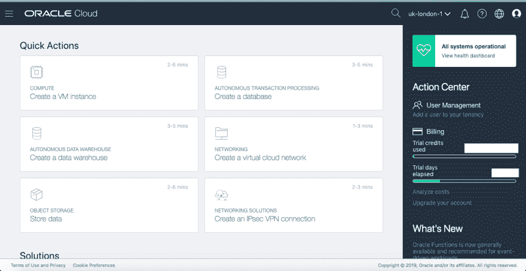
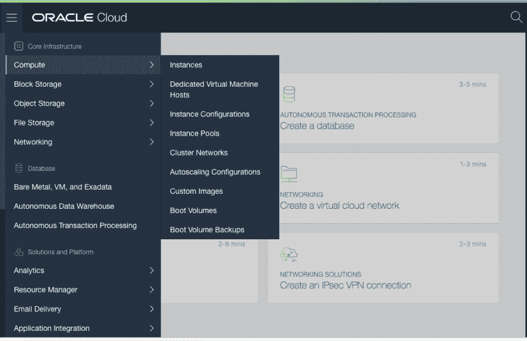
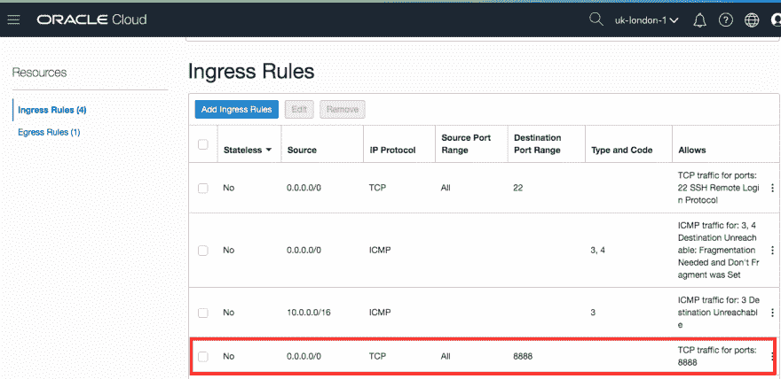
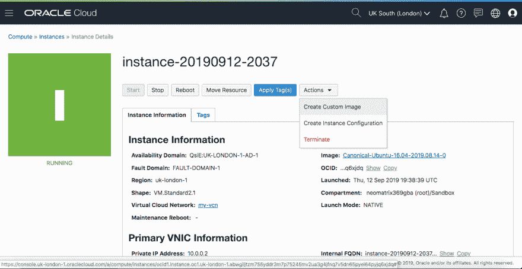
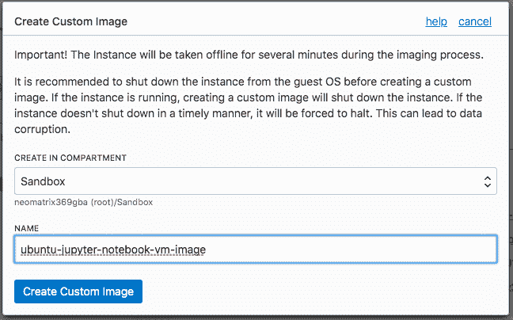
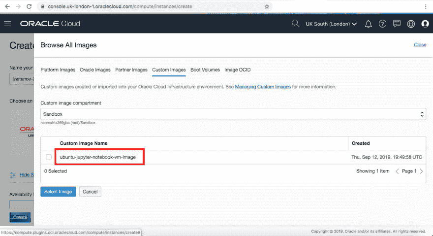
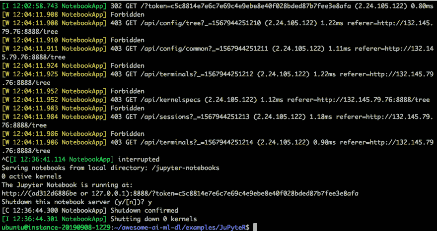

# 在云端运行您的木星笔记本

> 原文:[https://dev . to/neo matrix 369/running-your-jupyter-notebooks-on-the-cloud-36pf](https://dev.to/neomatrix369/running-your-jupyter-notebooks-on-the-cloud-36pf)

# [](#introduction)**简介**

在我之前关于如何用 Jupyter 构建和运行 docker 容器的分享之后，我将进一步讨论如何在云平台上运行。

我们将尝试在[甲骨文云基础设施(OCI)](http://cloud.oracle.com/) 上完成这项工作。理论上，我们应该能够在任何虚拟机或裸机实例上做博客中的任何事情。如果您是 Oracle 云的新手，我建议您熟悉一下[文档](https://docs.cloud.oracle.com/iaas/Content/GSG/Concepts/baremetalintro.htm)中的[文档](https://docs.cloud.oracle.com/iaas/Content/GSG/Concepts/baremetalintro.htm)和[入门](https://docs.cloud.oracle.com/iaas/Content/GSG/Concepts/baremetalintro.htm)部分。在这篇文章的底部，在**资源**部分，你还可以找到几个信息丰富的链接。

我发现设置 VM 实例的[教程简单而有用——我建议浏览一下并按照步骤操作。在真正开始创建虚拟机实例和 ***ssh*** 之前，记下先决条件——这将涉及在创建虚拟机之前创建隔离专区、子网、安全列表等。](https://docs.cloud.oracle.com/iaas/Content/GSG/Reference/overviewworkflow.htm)

# [](#signing-up)**报名**

您会注意到，您必须拥有一个帐户才能访问云控制面板并继续操作。

你可以去[oracle.com](http://oracle.com/)和[cloud.oracle.com](https://myservices.us.oraclecloud.com/mycloud/signup?sourceType=_ref_coc-asset-opcSignIn&language=en)报名——推荐通过这些门户网站报名。一旦你这么做了，你甚至可能有资格获得**免费**积分(足够你周末运行你最喜欢的实例)。

# [](#setup)**设置**

**仪表板—登录**
一旦注册，你就可以通过[cloud.oracle.com/sign-in](https://cloud.oracle.com/sign-in)登录，它会带你进入这样一个页面

[T2】](https://res.cloudinary.com/practicaldev/image/fetch/s--3hLl-6Kn--/c_limit%2Cf_auto%2Cfl_progressive%2Cq_auto%2Cw_880/https://miro.medium.com/max/1408/0%2AbmsehoRRIZ3BXe5F.png)

按照[教程中描述的说明来设置一个 VM 实例](https://docs.cloud.oracle.com/iaas/Content/GSG/Reference/overviewworkflow.htm)，并给你的 VM 和其他资源起一个容易识别的名字(用首字母作为前缀)。这将启动创建虚拟机的请求(如果您的所有条目都有效)，并且在不到 15 秒的时间内，您应该有一个可以使用的虚拟机。

创建虚拟机实例后，记下实例的**公共 IP 地址**。通过转到左侧导航菜单上的**计算>实例**，可以找到所有正在运行的虚拟机:

[T2】](https://res.cloudinary.com/practicaldev/image/fetch/s--5pzEgWQy--/c_limit%2Cf_auto%2Cfl_progressive%2Cq_auto%2Cw_880/https://miro.medium.com/max/1081/0%2Ag0NsbLE6B-oy_Pva.png)

通过单击选择正在运行的虚拟机:

[T2】](https://res.cloudinary.com/practicaldev/image/fetch/s--blh5A6WU--/c_limit%2Cf_auto%2Cfl_progressive%2Cq_auto%2Cw_880/https://miro.medium.com/max/1408/1%2AfSnyOupmBeemvNPVWMMFgw.png)

这将带您进入虚拟机详细信息页面，在这里您可以找到**公共 IP 地址**:

[T2】](https://res.cloudinary.com/practicaldev/image/fetch/s--gnGwin_g--/c_limit%2Cf_auto%2Cfl_progressive%2Cq_auto%2Cw_880/https://miro.medium.com/max/1408/1%2AoBRoXojahvyHq11qL3XIxQ.png)

***注意:公共 IP 地址对于每个创建的虚拟机都是不同的，以上是临时的。*T3】**

CLI

可以使用名为 **oci-cli** 的命令行工具访问 OCI，可以按照 [CLI 文档](https://docs.cloud.oracle.com/iaas/Content/API/Concepts/cliconcepts.htm?Highlight=CLI)中提到的指令安装该工具[。安装后，调用它的命令称为 **oci** ，您可以通过执行以下操作来调用它:](https://docs.cloud.oracle.com/iaas/Content/API/SDKDocs/cliinstall.htm)

# [](#actions-to-get-on-the-cloud)**行动上云**

```
 $ oci --help
    Usage: oci [OPTIONS] COMMAND [ARGS]...
    Oracle Cloud Infrastructure command line interface, with support for
    Audit, Block Volume, Compute, Database, IAM, Load Balancing, 
Networking, DNS, File Storage, Email Delivery and Object Storage 
Services.
    Most commands must specify a service, followed by a resource type 
and then an action. For example, to list users (where $T contains the 
OCID of the current tenant):

    oci iam user list --compartment-id $T

    Output is in JSON format.

    For information on configuration, see
    https://docs.cloud.oracle.com/Content/API/Concepts/sdkconfig.htm.

    Options:
    <-- snipped -->

    Commands:
    <-- snipped --> 
```

因此，从现在开始，我们将不再需要仪表板。在本文中，我们也不会涉及 CLI 工具的使用。

**登录虚拟机实例**
然后可以将 ***ssh*** 放入该框中(参见关于通过 ssh 连接的[文档)并继续下面的其余操作:](https://docs.cloud.oracle.com/iaas/Content/Compute/Tasks/accessinginstance.htm?Highlight=ssh) 

```
 ### Oracle Linux and CentOS images, user name: opc
    ### the Ubuntu image, user name: ubuntu
    $ ssh -i ~/.ssh/id_rsa ubuntu@132.145.78.136
    or
    $ ssh ubuntu@132.145.78.136 
```

**安装 git**
对于这篇博文，我们选择了**Canonical Ubuntu Linux**(*Canonical-Ubuntu-16.04–2019 . 08 . 14–0*)作为我们的操作系统镜像，它附带了 ***apt-get*** 和 ***git*** ，因此我们不需要在那里做任何事情。

# [](#running-jupyter-notebooks)**跑 Jupyter 笔记本**

**克隆我们的回购**
我们可以克隆我们的回购，并执行其余步骤:

```
 $ git clone https://github.com/neomatrix369/awesome-ai-ml-dl
    $ cd awesome-ai-ml-dl/examples/JuPyteR 
```

**安装 Docker**
在 Ubuntu 上安装 Docker 的 Docker 文档可以在 Docker 网站上[找到。一个 bash 脚本也被提供来加速这个过程，尽管这里的目标操作系统是 Ubuntu 16.04 或更高版本:](https://docs.docker.com/install/linux/docker-ce/ubuntu/) 

```
 $ cd build-docker-image
    $ ./installDocker.sh 
```

***注意:*** *如果您在创建虚拟机时选择了另一个操作系统映像，您将需要使用 Docker 中的文档手动安装 Docker，或者修改上述脚本以使其适用于目标操作系统。*

**打造码头工人形象**

```
 $ cd build-docker-image
    $ sudo ./buildDockerImage.sh 
```

*在这个特定的环境中，我们需要在每个 docker 命令之前传递* ***sudo*** *关键字。在您的本地环境或其他地方，您可能不必这样做。*

**将 Jupyter 笔记本作为 Docker 容器运行**

```
 $ cd [back into the project root folder]
    $ sudo ./runDockerContainer.sh 
```

这将向您显示一个类似这样的控制台:

```
 <--- snipped --->
    OpenJDK Runtime Environment (build 9.0.4+11)
    OpenJDK 64-Bit Server VM (build 9.0.4+11, mixed mode)
    PATH=/home/jupyter/.local/bin:/opt/java/openjdk/bin:/usr/local/sbin:/usr
/local/bin:/usr/sbin:/usr/bin:/sbin:/bin
    ~~~ JDK9, Linux only: We are enabling JVMCI flags (enabling Graal as 
Tier-2 compiler) ~~~
    ~~~ Graal setting: please check docs for higher versions of Java and 
for other platforms ~~~
    JAVA_OPTS=-XX:+UnlockExperimentalVMOptions -XX:+EnableJVMCI 
-XX:+UseJVMCICompiler
    JAVA_TOOL_OPTIONS=-XX:+UnlockExperimentalVMOptions 
-XX:+UseCGroupMemoryLimitForHeap -XX:+UnlockExperimentalVMOptions 
-XX:+EnableJVMCI -XX:+UseJVMCICompiler
    Available kernels:
      python2    /home/jupyter/.local/share/jupyter/kernels/python2
      java       /usr/share/jupyter/kernels/java
    [I 13:39:35.993 NotebookApp] Writing notebook server cookie secret 
to /home/jupyter/.local/share/jupyter/runtime/notebook_cookie_secret
    [I 13:39:36.293 NotebookApp] Serving notebooks from local directory: 
/home/jupyter
    [I 13:39:36.294 NotebookApp] The Jupyter Notebook is running at:
    [I 13:39:36.295 NotebookApp] http://(81dde8675279 or 
127.0.0.1):8888/?token=bb0c81ef7e9f3932355b953163702aa2d9f75e18005e6e48
    [I 13:39:36.297 NotebookApp] Use Control-C to stop this server and 
shut down all kernels (twice to skip confirmation).
    [C 13:39:36.310 NotebookApp]
    To access the notebook, open this file in a browser:
            file:///home/jupyter/.local/share/jupyter/runtime/nbserver-
28-open.html
        Or copy and paste one of these URLs:
            http://(81dde8675279 or 127.0.0.1):8888/?
token=bb0c81ef7e9f3932355b953163702aa2d9f75e18005e6e48 
```

记下网址，将 *127.0.0.1* 替换为您的**公共 IP 地址**，即【132.145.78.136】的*。
您还可以从上面的日志中看到，我们正在使用 Java 9(构建在 [AdoptOpenJDK](http://adoptopenjdk.net/) farm 上)并启用 [GraalVM 编译器](https://github.com/oracle/graal/blob/master/compiler/README.md)作为 HotSpot 的 [C2 编译器](http://openjdk.java.net/groups/hotspot/docs/HotSpotGlossary.html)(参见[切换以启用 Java 9 中的 GraalVM 编译器](https://github.com/neomatrix369/awesome-ai-ml-dl/blob/master/examples/JuPyteR/README.md#switches-to-enable-the-graalvm-compiler-in-java-9)来启用 [GraalVM 编译器](https://github.com/oracle/graal/blob/master/compiler/README.md))。也是因为 Jupyter 的 [Java 扩展需要 Java 9 或更高版本才能工作。](https://github.com/SpencerPark/IJava)*

 ***在浏览器中打开 Jupyter 笔记本**
进入浏览器并尝试打开这个:

```
 http://132.145.78.136:8888/?token=bb0c81ef7e9f3932355b953163702aa2d9f75e18005e6e48 
```

啊！它不起作用！
这是因为我们还没有从我们的云网络内部(通过**入口规则，**了解更多信息[此处](https://docs.cloud.oracle.com/iaas/Content/Network/Concepts/securityrules.htm?Highlight=egress))向外界(公众)开放 8888 端口:

[T2】](https://res.cloudinary.com/practicaldev/image/fetch/s--MBQatKgW--/c_limit%2Cf_auto%2Cfl_progressive%2Cq_auto%2Cw_880/https://miro.medium.com/max/1388/0%2A40xrtw73GvkKkIgK.png)

我们需要将上述条目添加到**入口规则**部分，您可以通过导航菜单进入**入口规则**页面:**网络** > **虚拟云网络** > **虚拟云网络详细信息** > **安全列表，**这将带您进入带有**默认安全列表**的页面。****点击与您的* *虚拟云网络(VCN)** 对应的安全列表，您将进入上述**入口规则**页面。

如果您仍然找不到，请在云控制台的任何页面上使用搜索工具搜索术语 ***安全*** **(参见放大镜🔍在页面的顶部)。这将向您显示所有* *默认安全列表**，单击它会将您带到上面的**进入规则**页面(您可能只有一个安全列表条目)。 ***注意:入口表示流量进入网络/虚拟机实例。*T11】**

为什么是端口 8888，那是因为我们在 docker 脚本中像那样设置了它，看看[源](https://github.com/neomatrix369/awesome-ai-ml-dl/tree/master/examples/JuPyteR#jupyter)来找出原因和方法。

完成以上所有工作后:瞧！我们在浏览器中看到 Jupyter 启动页面:

[T2】](https://res.cloudinary.com/practicaldev/image/fetch/s--AsQLBMON--/c_limit%2Cf_auto%2Cfl_progressive%2Cq_auto%2Cw_880/https://miro.medium.com/max/33/0%2AiMaX8fhr3Kd_Jdrp.png%3Fq%3D20)

[T2】](https://res.cloudinary.com/practicaldev/image/fetch/s--5hNluAY2--/c_limit%2Cf_auto%2Cfl_progressive%2Cq_auto%2Cw_880/https://miro.medium.com/max/1408/0%2AiMaX8fhr3Kd_Jdrp.png)

您可以看到一个基于 Java 的笔记本可供使用！通过在浏览器中创建新的 Java 笔记本来尝试以下内容:

[T2】](https://res.cloudinary.com/practicaldev/image/fetch/s--502AxHRR--/c_limit%2Cf_auto%2Cfl_progressive%2Cq_auto%2Cw_880/https://miro.medium.com/max/1274/0%2ArquvjgoX8Ra1QT0K.png)

https://github . com/ligee/kot Lin-jupyter/raw/master/samples/screenshotinjupyter . png
你也可以自由地创建 Python 笔记本，而不仅仅是 Java 笔记本——这就是 Jupyter 笔记本的美妙之处。

# [](#installing-jupyter-on-a-baremetal-or-vm-environment)**在裸机或虚拟机环境中安装 Jupyter**

为了简洁起见，我们没有涉及这一方面，但是如果您查看与构建和运行 Jupyter 实例相关的脚本，您将会看到 docker 构建脚本在单独脚本的帮助下构建和运行实例，这些脚本可以按以下顺序单独执行:

$ cd build-docker-image
$【安装 Java 9 SDK 并设置路径和 Java _ HOME】
$。/install-jupyter-notebooks . sh
$。/install-java-kernel.sh
$。/runLocal.sh

如果您想了解这是如何工作的，请在实例的本地环境中运行上面的脚本，其余的指令应该会像预期的那样工作。

# [](#create-custom-image-for-reuse)**创建自定义图像供重用**

由于我们已经能够从虚拟机实例内部成功运行 Jupyter Notebook，因此我们可以保存此映像以供将来重复使用或与其他人共享。创建虚拟机实例的映像可以通过**计算>实例>实例详细信息**导航菜单完成，并从操作下拉菜单创建自定义映像:

[T2】](https://res.cloudinary.com/practicaldev/image/fetch/s--Bq7IOwtv--/c_limit%2Cf_auto%2Cfl_progressive%2Cq_auto%2Cw_880/https://miro.medium.com/max/1408/1%2Am0c2CNpEQ4DBVE8mP6If4Q.png)

[T2】](https://res.cloudinary.com/practicaldev/image/fetch/s---S_YPUd0--/c_limit%2Cf_auto%2Cfl_progressive%2Cq_auto%2Cw_880/https://miro.medium.com/max/713/1%2AzhaCtQeh4_h4IICLqRKRyw.png)

***注意:*** *在创建自定义映像的过程中，您的原始虚拟机实例被关闭。根据原始虚拟机实例的大小，这可能需要几分钟才能完成。*
成功创建后，它就可以从自定义映像列表中选择，下次我们去创建一个新的 VM 实例:

[T2】](https://res.cloudinary.com/practicaldev/image/fetch/s--VrWXiCLp--/c_limit%2Cf_auto%2Cfl_progressive%2Cq_auto%2Cw_880/https://miro.medium.com/max/1408/1%2Awaim__0FsC1ApNoRnqwj8w.png)

# [](#poweruser)**超级用户**

如果所有这些对你来说都是小菜一碟，或者你没有太多麻烦就挺过来了，那么试试这里的 [README 页面中提到的所有深层内容。
为了能够在 Jupyter 环境中用其他语言编码，你所需要的只是一个 Jupyter 扩展——这只是安装和配置的问题。你可以在这里](https://github.com/neomatrix369/awesome-ai-ml-dl/tree/master/examples/JuPyteR#jupyter)了解这个[的一切。](https://github.com/neomatrix369/awesome-ai-ml-dl/tree/master/examples/JuPyteR#get-started-manual-steps-via-cli)

# [](#signing-off)**签约下线**

[T2】](https://res.cloudinary.com/practicaldev/image/fetch/s--jGMWSyBc--/c_limit%2Cf_auto%2Cfl_progressive%2Cq_auto%2Cw_880/https://miro.medium.com/max/1408/0%2AgRwXOOQ8q2TtHmnO.png)

如果你已经创建了一个笔记本，它被保存在名为 *jupyter/notebooks* 的子目录中，你可以使用 ***scp*** 从你的本地机器中检索它(见[这里](https://linuxize.com/post/how-to-use-scp-command-to-securely-transfer-files/)关于如何做)。
确保你已经从[oracle.com](http://oracle.com/)和[cloud.oracle.com](http://cloud.oracle.com/)的登录会话中退出 ***，很容易忘记其中一个。但是在这之前，也请看看文档中的[清理资源](https://docs.cloud.oracle.com/iaas/Content/GSG/Tasks/terminating_resources.htm)页面——您不希望您的实例在您不查看它的时候永远运行！***

[T2】](https://res.cloudinary.com/practicaldev/image/fetch/s--EPtlbhBl--/c_limit%2Cf_auto%2Cfl_progressive%2Cq_auto%2Cw_880/https://paper-attachments.dropbox.com/s_E4A05684460F7D532506C16E09E20D37F6AFF25A9B5381BF1A442679901C1AD7_1568321451272_image.png)

# [](#conclusion)结论

一套好的脚本(包括 Docker)和一个易于使用的云环境可以在许多方面提供帮助。在这种情况下，使我们能够运行 Jupyter 笔记本实例，根据您的网络安全设置，可以公开或私下共享该实例。

Jupyter 环境非常灵活，允许通过配置和扩展来扩展功能。

我们没有涉及诸如云安全和用户实例分区之类的东西——这超出了本文的范围。如果这些对你很重要，请进一步调查。请确保它满足您的应用程序或用例所需的安全级别。查看 OCI 文档页面上关于[安全性的文档，了解更多信息。](https://docs.cloud.oracle.com/iaas/Content/Security/Concepts/security.htm)

# [](#resources)**资源**

**通用**

*   [用 Jupyter 构建并运行 docker 容器](https://github.com/neomatrix369/awesome-ai-ml-dl/tree/master/examples/JuPyteR#jupyter)
*   [牛逼 Graal](https://github.com/neomatrix369/awesome-graal)
*   [Awesome AI-ML-DL](https://github.com/neomatrix369/awesome-ai-ml-dl)

**码头工人**

*   码头枢纽签字
*   [在 Ubuntu 16.04 或更高版本上安装 Docker](https://docs.docker.com/install/linux/docker-ce/ubuntu/)
*   [Bash 脚本构建 Docker 容器](https://github.com/neomatrix369/awesome-ai-ml-dl/blob/master/examples/JuPyteR/buildJuPyteRDockerImage.sh)

**OCI/云**

*   [入门](https://docs.cloud.oracle.com/iaas/Content/GSG/Concepts/baremetalintro.htm)
*   [设置虚拟机实例的教程](https://docs.cloud.oracle.com/iaas/Content/GSG/Reference/overviewworkflow.htm)
*   [安装 CLI](https://docs.cloud.oracle.com/iaas/Content/API/SDKDocs/cliinstall.htm)
*   CLI 文档
*   [资源清理](https://docs.cloud.oracle.com/iaas/Content/GSG/Tasks/terminating_resources.htm)
*   [关于通过 ssh 连接到 OCI 的文档](https://docs.cloud.oracle.com/iaas/Content/Compute/Tasks/accessinginstance.htm?Highlight=ssh)
*   新签到:[https://cloud.oracle.com/en_US/sign-in](https://cloud.oracle.com/en_US/sign-in)
*   传统签到:[https://myaccount.cloud.oracle.com/](https://myaccount.cloud.oracle.com/)
*   [联系支持人员](https://docs.cloud.oracle.com/iaas/Content/GSG/Tasks/contactingsupport.htm)
*   [开发者工具](https://docs.cloud.oracle.com/iaas/Content/devtoolshome.htm?tocpath=Developer%20Tools%20%7C_____0)
*   [文档](https://docs.cloud.oracle.com/iaas/Content/home.htm)
*   [甲骨文云社区论坛](https://cloudcustomerconnect.oracle.com/resources/9c8fa8f96f/summary)
*   [甲骨文云合规性](https://cloud.oracle.com/en_US/cloud-compliance)
*   [甲骨文云基础设施博客](https://blogs.oracle.com/cloud-infrastructure/)

**安全**

*   [安全规则/进入规则](https://docs.cloud.oracle.com/iaas/Content/Network/Concepts/securityrules.htm?Highlight=egress)
*   [OCI 安全文件](https://docs.cloud.oracle.com/iaas/Content/Security/Concepts/security.htm)

## [](#about-me)关于我

Mani Sarkar 是一名充满激情的开发人员，主要从事 Java/JVM 领域的工作，目前作为一名自由软件工程师/数据/ml 工程师，他正在加强团队，并帮助他们在与小型团队和初创公司合作时加快速度。

**Twitter:**[@ the neomatrix 369](https://twitter.com/@theNeomatrix369)|**github:**[@ new matrix 369](https://github.com/neomatrix369)*