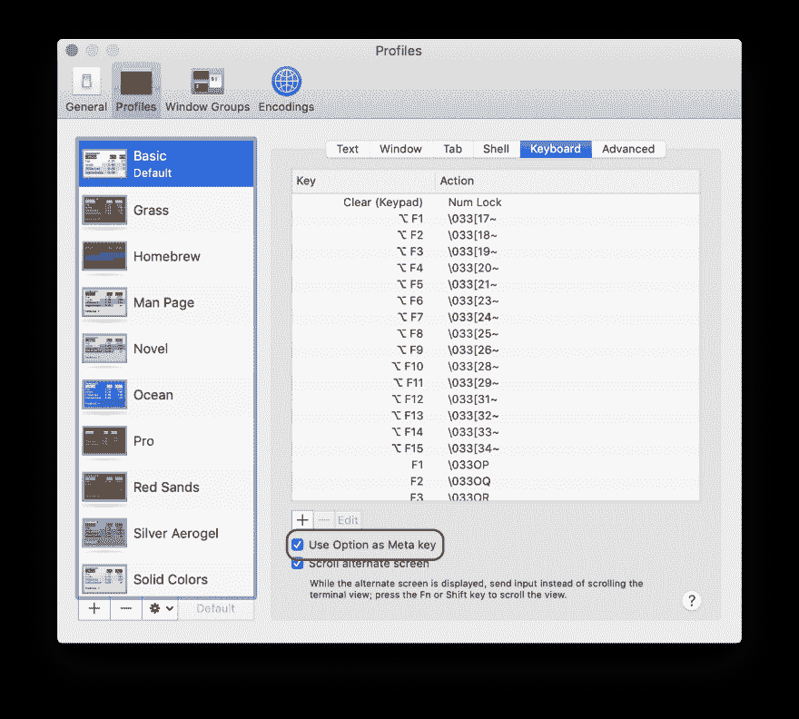

# 重温在 vim 中记笔记

> 原文：<https://dev.to/konstantin/taking-notes-in-vim-revisited-558k>

在我之前的帖子中，我谈到了一个用于记笔记的`vimwiki`插件:

[](/konstantin) [## 使用 vim 做笔记

### 康斯坦丁 5 月 31 日 192 分钟阅读

#vim #notes #vimwiki #markdown](/konstantin/taking-notes-with-vim-3619)

我仍然对结果不满意，比如重新定义降价行为和丢失一些重要的快捷方式。然后我偶然发现了一篇文章[你(可能)不需要维姆维基](http://joereynoldsaudio.com/2018/07/07/you-dont-need-vimwiki.html)作者是乔·雷诺兹。

## 取代`vimwiki`

因此，要替换`vimwiki`,我们需要配置以下功能:

*   在光标下打开/创建新文件。
*   从任何位置打开便笺(用`Leader` `w` `w`)
*   切换复选框以制作待办事项列表的快捷方式
*   在 markdown 中对齐表格
*   预览 html

### 在光标下创建新文件。

我上面提到的那篇文章确实说过，你可以用`gf`(在光标下打开文件)来替换新建降价文件的`vimwiki's` `enter`快捷方式。不幸的是，它只有在文件确实存在时才起作用。我们希望能够在键入名称后快速创建并打开一个新便笺。然而，plasticboy 的 [markdown 插件中有一个替代的快捷方式](https://github.com/plasticboy/vim-markdown)––`ge`，它允许你在光标下打开文件(如果它是一个 markdown 链接),即使它不存在...除非它位于不存在的子文件夹中。幸运的是，有一个插件可以创建文件路径中的所有子文件夹(vim 的`mkdir -p`):

## [pbrisbin](https://github.com/pbrisbin)/[vim-mkdir](https://github.com/pbrisbin/vim-mkdir)

### 在写入缓冲区之前，自动创建任何不存在的目录。

<article class="markdown-body entry-content container-lg" itemprop="text">

# Mkdir

> 玛吉。别问了。带着它。走吧。

*——飞车手罗德*

## 装置

使用您首选的 vim 插件管理插件进行安装。

## 使用

```
:e this/does/not/exist/file.txt
:w 
```

当你没有遇到错误时，微笑。相反，请注意 vim 已经自动为您创建了不存在的目录。

</article>

[View on GitHub](https://github.com/pbrisbin/vim-mkdir)

因此，如果你在你的`.vimrc`或`init.vim`中添加以下插件:

```
Plug 'pbrisbin/vim-mkdir'
Plug 'plasticboy/vim-markdown', { 'for': 'markdown' } 
```

<svg width="20px" height="20px" viewBox="0 0 24 24" class="highlight-action crayons-icon highlight-action--fullscreen-on"><title>Enter fullscreen mode</title></svg> <svg width="20px" height="20px" viewBox="0 0 24 24" class="highlight-action crayons-icon highlight-action--fullscreen-off"><title>Exit fullscreen mode</title></svg>

假设您使用 [vim-plug](https://github.com/junegunn/vim-plug) 作为插件管理器，您应该能够在`md`文件中键入`ge`(在一个降价链接上)，vim 将在光标下创建该文件，以及所有子文件夹，并打开该文件进行编辑。

你可以在 [README](https://github.com/plasticboy/vim-markdown#mappings) 中找到更多关于 markdown 插件映射的信息。

### 从任何位置打开便笺

我把我所有的笔记都存储在`~/Documents/notes`文件夹中(而在 MacOS 中所有的文件都会自动与`iCloud`同步)。

我们的快捷方式实际上应该打开`~/Documents/notes/index.md`文件:

```
" open ~/Documents/notes/index.md
nnoremap <Leader>ww :e ~/Documents/notes/index.md<cr> 
```

<svg width="20px" height="20px" viewBox="0 0 24 24" class="highlight-action crayons-icon highlight-action--fullscreen-on"><title>Enter fullscreen mode</title></svg> <svg width="20px" height="20px" viewBox="0 0 24 24" class="highlight-action crayons-icon highlight-action--fullscreen-off"><title>Exit fullscreen mode</title></svg>

因为我们已经配置了创建子文件夹的插件，它应该也会自动创建`notes`文件夹。

### 切换复选框制作待办事项列表

为此我找到了一个不错的插件:

## [j Kramer](https://github.com/jkramer)/[vim-checkbox](https://github.com/jkramer/vim-checkbox)

### 用于切换复选框的 Vim 插件。

<article class="markdown-body entry-content container-lg" itemprop="text">

# Vim 复选框

## 描述

在 Vim 中切换文本复选框的简单插件。如果你用一个减价文件来做笔记和待办事项，效果会很好。

## 装置

只需将脚本复制到您的插件文件夹中，例如`~/.vim/plugin/`。如果您使用病原体，只需在`~/.vim/bundle`中克隆这个库。

## 使用

按`<leader>tt`切换当前行上的(第一个)复选框(如有)。也就是说，`[ ]`将被`[x]`取代，`[x]`将被`[ ]`取代。如果您想要更多或不同的复选框状态，您可以用一个字符数组覆盖`g:checkbox_states`的内容，插件将循环遍历该数组。默认值为:

```
let g:checkbox_states = [' ', 'x'] 
```

当当前行没有复选框时，`<leader>tt`会在`g:insert_checkbox`定义的模式中插入一个。新复选框的状态将是`g:checkbox_states`的第一个元素。`g:insert_checkbox`默认为`'\<'`，它…

</article>

[View on GitHub](https://github.com/jkramer/vim-checkbox)

让我们感兴趣的快捷方式是`Leader` `tt`，它搜索并切换光标行上的复选框。在可视模式下，它会切换选中行上的所有复选框。

### 在降价中对齐表格

前面提到的 markdown 插件已经以命令的形式包含了这个特性:`:TableFormat`。它将在光标下对齐一个表格。

### 预览 html

为了在浏览器中预览 markdown，我使用了这个神奇的插件:

## [iamcco](https://github.com/iamcco)/[markdown-preview . nvim](https://github.com/iamcco/markdown-preview.nvim)

### (neo)vim 的降价预览插件

<article class="markdown-body entry-content container-lg" itemprop="text">

# <g-emoji class="g-emoji" alias="sparkles" fallback-src="https://github.githubassets.cimg/icons/emoji/unicode/2728.png">✨</g-emoji> (新)vim 的降价预告 <g-emoji class="g-emoji" alias="sparkles" fallback-src="https://github.githubassets.cimg/icons/emoji/unicode/2728.png">✨</g-emoji>

> 由<g-emoji class="g-emoji" alias="heart" fallback-src="https://github.githubassets.cimg/icons/emoji/unicode/2764.png">驱动</g-emoji>

### 介绍

> 它仅适用于 vim >= 8.1 和 neovim

通过同步滚动和灵活配置，在您的现代浏览器上预览降价

主要特点:

*   跨平台(macos/linux/windows)
*   同步滚动
*   快速异步更新
*   [Katex](https://github.com/Khan/KaTeX) 用于数学排版
*   [计划](https://github.com/plantuml/plantuml)
*   [美人鱼](https://github.com/knsv/mermaid)
*   [Chart.js](https://github.com/chartjs/Chart.js)
*   [序列图](https://github.com/bramp/js-sequence-diagrams)
*   [流程图](https://github.com/adrai/flowchart.js)
*   [点](https://github.com/mdaines/viz.js)
*   [Toc](https://github.com/nagaozen/markdown-it-toc-done-right)
*   表情符号
*   任务列表
*   本地图像
*   灵活的配置

**注意**数学排版不需要`mathjax-support-for-mkdp`插件

[](https://user-images.githubusercontent.com/5492542/47603494-28e90000-da1f-11e8-9079-30646e551e7a.gif)

### 安装和使用

用 [vim 塞](https://github.com/junegunn/vim-plug)安装:

```
" If you don't have nodejs and yarn
" use pre build, add 'vim-plug' to the filetype list so vim-plug can update this plugin
" see: https://github.com/iamcco/markdown-preview.nvim/issues/50
Plug 'iamcco/markdown-preview.nvim', { 'do': { -> mkdp#util#install() }, 'for': ['markdown', 'vim-plug']}
" If you have nodejs and yarn
Plug 'iamcco/markdown-preview.nvim', { 'do': 
```

…<svg width="20px" height="20px" viewBox="0 0 24 24" class="highlight-action crayons-icon highlight-action--fullscreen-on"><title>Enter fullscreen mode</title></svg> <svg width="20px" height="20px" viewBox="0 0 24 24" class="highlight-action crayons-icon highlight-action--fullscreen-off"><title>Exit fullscreen mode</title></svg></article>

[View on GitHub](https://github.com/iamcco/markdown-preview.nvim)

要开始预览，你只需输入`:MarkdownPreview`，它将打开一个浏览器并同步你所有的修改。要停止预览，你可以输入`:MarkdownPreviewStop`。

所以最后你的`.vimrc`文件应该看起来像这样:

```
call plug#begin('~/.vim/plugged')

Plug 'pbrisbin/vim-mkdir'

Plug 'jkramer/vim-checkbox', { 'for': 'markdown' }
Plug 'plasticboy/vim-markdown', { 'for': 'markdown' }

if executable('npm')
    Plug 'iamcco/markdown-preview.nvim', { 'do': 'cd app & npm install' }
endif

" Initialize plugin system
call plug#begin('~/.vim/plugged')

" open ~/Documents/notes/index.md
nnoremap <Leader>ww :e ~/Documents/notes/index.md<cr> 
```

<svg width="20px" height="20px" viewBox="0 0 24 24" class="highlight-action crayons-icon highlight-action--fullscreen-on"><title>Enter fullscreen mode</title></svg> <svg width="20px" height="20px" viewBox="0 0 24 24" class="highlight-action crayons-icon highlight-action--fullscreen-off"><title>Exit fullscreen mode</title></svg>

您可以在我的 vim 配置报告中找到这些配置和更多内容:

## [【gko】](https://github.com/gko)/[vimio](https://github.com/gko/vimio)

### 🎩易于安装/使用 vim 设置

<article class="markdown-body entry-content container-lg" itemprop="text">

# Vim 设置

[](https://github.com/gko/vimio/screenshot.png)

一篇[文章](https://dev.to/konstantin/configuring-a-perfect-editor-for-frontend-development-1pe5)描述了该配置的主要特性。

## 先决条件

为了获得所有功能，您可能需要安装以下软件包:

*   [fzf](https://github.com/junegunn/fzf)
*   [ripgrep](https://github.com/BurntSushi/ripgrep)
*   [npm](https://www.npmjs.com/get-npm)

## 装置

在 unix 和 windows 上(使用 bash，可以用 [git](http://msysgit.github.io/) 安装):

```
curl -L https://raw.github.com/gko/vimio/main/install.sh | bash
```

<svg width="20px" height="20px" viewBox="0 0 24 24" class="highlight-action crayons-icon highlight-action--fullscreen-on"><title>Enter fullscreen mode</title></svg> <svg width="20px" height="20px" viewBox="0 0 24 24" class="highlight-action crayons-icon highlight-action--fullscreen-off"><title>Exit fullscreen mode</title></svg>

### 马科斯

在 macOS terminal.app 中，不要忘记选中“使用”选项作为元键:

[](https://raw.githubusercontent.com/gko/upside-down/master/terminal.png)

iterm2 中的 Esc+选项:

[](https://raw.githubusercontent.com/gko/upside-down/master/iterm2.png)

## 快捷指令

一些快捷键(`Leader`键是逗号):

*   `Ctrl` + `s`保存当前文件
*   在`select`和`normal`模式下的`Leader` + `s`启动搜索和替换
*   `Alt` + `Up` / `Down`在当前行的上方或下方移动行或选择(更多信息见[颠倒](https://github.com/gko/upside-down)
*   `Alt` + `Left` / `Right`向左或向右移动字符或选择
*   `Leader` + `n` toggles NERDTree
*   `Leader` + `m`显示 NERDTree 中的当前文件
*   当处于选择模式`'`、`"`、`(`时，相应地对选择进行包装
*   `y` …

</article>

[View on GitHub](https://github.com/gko/vimio)

你也可以在推特上找到我:[https://twitter.com/konstantin](https://twitter.com/konstantin)