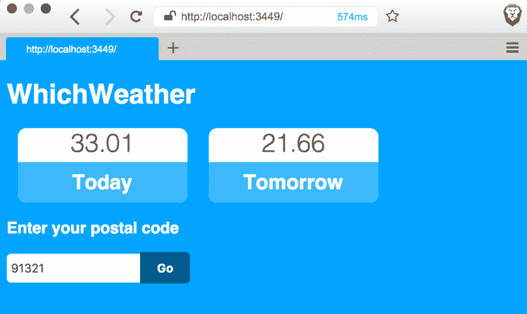
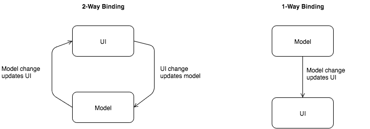

# 顶点 1:天气预报应用

> 原文：<https://dev.to/kendru/capstone-1-weather-forecasting-app-3o92>

这篇文章是安德鲁的书[第八课](https://www.learn-clojurescript.com/section-1/lesson-8-capstone-weather-forecasting-app/)，[T3】学 ClojureScriptT5】](https://gum.co/learn-cljs)

* * *

在过去的几章中，我们已经熟悉了 ClojureScript 开发人员最常用的工具。虽然我们已经写了一些代码，但是重点还是在项目本身上。这一章将稍微改变一下路线，集中于编写一个最小的应用程序。这一章会稍微难一点，我们会忽略代码的大部分细节。这里的目的是展示一个典型的 ClojureScript 开发工作流的样子，而不是深入代码的本质细节。在学习了这门语言的基本语法和习惯用法之后，我们应该能够带着对正在发生的事情的更深刻的理解回到这一章。

*本章内容:*

*   应用我们的 ClojureScript 工具知识来创建一个新项目
*   使用 REPL 驱动的工作流开发 ClojureScript 应用程序
*   体验一下试剂框架

在本章中，我们将利用我们在过去几章中学到的技能，开发一个简单的天气预报应用程序，该应用程序将接受用户输入，从第三方 API 获取数据，并利用 React 和*试剂* ClojureScript 库进行高效渲染。这个应用程序足够简单，只需要很少的 ClojureScript 知识就可以理解，但也足够有代表性，可以让我们清楚地了解 ClojureScript 的开发。就这样，让我们卷起袖子开始写代码吧！

[](https://res.cloudinary.com/practicaldev/image/fetch/s--SOWZ0Tyu--/c_limit%2Cf_auto%2Cfl_progressive%2Cq_auto%2Cw_880/https://kendru.github.io/img/learn-cljs/chapter8/complete_app.png)

运行中的 ClojureScript 单页应用程序

## 用试剂创建 App

我们已经看到了典型的 ClojureScript 应用程序是如何布局的，并且我们已经使用 Leiningen 引导了一个 ClojureScript 项目。我们还探索了 Figwheel 提供的实时重载功能和 REPL，以快速迭代小段代码。我们将通过一个简单的 ClojureScript 应用程序来完成对 ClojureScript 开发的高级介绍。我们将返回到用 Leiningen 生成的应用程序。我们将看到如何快速地编写一个 ClojureScript 应用程序。这一章的完整代码可以在本书的 GitHub 库中找到，所以你可以随意地获取代码并跟着做。这里的目标不是学习 ClojureScript 作为一种语言的来龙去脉，而是感受一下生产 ClojureScript 是什么样子的。

### 创建试剂组件

在继续之前，让我们清理一下核心名称空间，以便它只包含一个试剂组件并呈现它。

#### [T1】src/cljs _ weather/core . cljs](#srccljsweathercorecljs)

```
(ns  cljs-weather.core  ;; <1>  (:require  [reagent.core  :as  reagent  :refer  [atom]]))  (enable-console-print!)  ;; <2>  (defn  hello-world  []  ;; <3>  [:h1  {:class  "app-title"}  "Hello, World"])  (reagent/render-component  [hello-world]  ;; <4>  (.  js/document  (getElementById  "app"))) 
```

<svg width="20px" height="20px" viewBox="0 0 24 24" class="highlight-action crayons-icon highlight-action--fullscreen-on"><title>Enter fullscreen mode</title></svg> <svg width="20px" height="20px" viewBox="0 0 24 24" class="highlight-action crayons-icon highlight-action--fullscreen-off"><title>Exit fullscreen mode</title></svg>

1.  声明名称空间并加载试剂框架
2.  让 ClojureScript 的打印函数像`println`一样输出到 JavaScript 开发控制台
3.  声明一个简单的试剂成分
4.  将试剂组件呈现给 DOM

大多数 ClojureScript 用户界面优先考虑声明性组件。也就是说，组件描述了它们应该如何呈现，而不是直接操作 DOM。我们应用程序中的`hello-world`组件看起来有点像封闭的 HTML。事实上，试剂组件的语法被设计成使用 ClojureScript 数据结构来模拟 HTML。与 ClojureScript 的其他方面一样，Reagent 鼓励小组件可以从小结构组合成更大、更有用的片段。

这个`hello-world`组件只是一个返回 ClojureScript 数据结构的函数。想象这个函数的 JavaScript 等价物是相当直接的:

```
function helloWorld() {
    return ["h1", {"class": "title"}, "Hello, World"];
} 
```

<svg width="20px" height="20px" viewBox="0 0 24 24" class="highlight-action crayons-icon highlight-action--fullscreen-on"><title>Enter fullscreen mode</title></svg> <svg width="20px" height="20px" viewBox="0 0 24 24" class="highlight-action crayons-icon highlight-action--fullscreen-off"><title>Exit fullscreen mode</title></svg>

### 快速回顾

*   `hello-world`组件现在有了一个`app-title`类。向组件添加一个 id 属性，并使用浏览器的开发工具来验证更改是否有效。

### 管理原子中的状态

Reagent 运行这个函数，并将它转换成与 DOM 结构平行的结构。每当函数返回不同的值时，试剂会重新渲染该组件。然而，在这个组件的情况下，一切都是静态的。要使组件成为动态的，它必须呈现一些可以改变的数据。在 Reagent 中，我们将用于渲染应用程序的所有数据保存在 atom 中，atom 只是一个可能发生变化的数据容器。我们已经在 Leiningen 在第 5 章搭建的样板代码中看到了一个原子:

```
(defonce  app-state  (atom  {:text  "Hello world!"})) 
```

<svg width="20px" height="20px" viewBox="0 0 24 24" class="highlight-action crayons-icon highlight-action--fullscreen-on"><title>Enter fullscreen mode</title></svg> <svg width="20px" height="20px" viewBox="0 0 24 24" class="highlight-action crayons-icon highlight-action--fullscreen-off"><title>Exit fullscreen mode</title></svg>

任何 Clojure 数据结构都可以简单地用`(atom ...)`包装在原子中。每当原子内部的数据发生变化时，使用原子的试剂组件将自动重新呈现。这种自动重新呈现过程使我们能够编写声明性组件，而不必担心繁琐的 DOM 操作。

对于天气预报应用程序，我们将把整个应用程序状态保存在包装 ClojureScript map 的 atom 中:`(atom {})`。这将使我们能够在一个位置管理我们需要的所有数据。与一些最流行的 JavaScript 框架中管理数据的各种方法相比，这种方法非常简单。我们的天气预报应用程序的状态将非常简单，由一个标题、用户输入的邮政编码和我们将从远程 API 检索的几个温度组成。我们可以在`cljs-weather.core`名称空间中创建这个应用程序状态的框架。

#### 初始应用状态

```
(defonce  app-state  (atom  {:title  "WhichWeather"  :postal-code  ""  :data-received?  false  :temperatures  {:today  {:label  "Today"  :value  nil}  :tomorrow  {:label  "Tomorrow"  :value  nil}}})) 
```

<svg width="20px" height="20px" viewBox="0 0 24 24" class="highlight-action crayons-icon highlight-action--fullscreen-on"><title>Enter fullscreen mode</title></svg> <svg width="20px" height="20px" viewBox="0 0 24 24" class="highlight-action crayons-icon highlight-action--fullscreen-off"><title>Exit fullscreen mode</title></svg>

有了基本的数据结构，我们就可以识别和定义组成我们界面的组件:

[](https://res.cloudinary.com/practicaldev/image/fetch/s--ddQ4xVdj--/c_limit%2Cf_auto%2Cfl_progressive%2Cq_auto%2Cw_880/https://kendru.github.io/img/learn-cljs/chapter8/components_annotated.png)

*我们应用程序的组件*

#### 试剂成分

```
(defn  title  []  [:h1  (:title  @app-state)])  (defn  temperature  [temp]  ;; <1>  [:div  {:class  "temperature"}  [:div  {:class  "value"}  (:value  temp)]  [:h2  (:label  temp)]])  (defn  postal-code  []  [:div  {:class-name  "postal-code"}  [:h3  "Enter your postal code"]  [:input  {:type  "text"  :placeholder  "Postal Code"  :value  (:postal-code  @app-state)}]  [:button  "Go"]])  (defn  app  []  [:div  {:class  "app"}  [title]  ;; <2>  [:div  {:class  "temperatures"}  (for  [temp  (vals  (:temperatures  @app-state))]  ;; <3>  [temperature  temp])]  [postal-code]])  (reagent/render-component  [app]  ;; <4>  (.  js/document  (getElementById  "app"))) 
```

<svg width="20px" height="20px" viewBox="0 0 24 24" class="highlight-action crayons-icon highlight-action--fullscreen-on"><title>Enter fullscreen mode</title></svg> <svg width="20px" height="20px" viewBox="0 0 24 24" class="highlight-action crayons-icon highlight-action--fullscreen-off"><title>Exit fullscreen mode</title></svg>

1.  期望传入`temp`的试剂组件
2.  将一个组件嵌套在另一个组件中
3.  从处于应用状态的每个`:temperatures`中呈现一个`temperature`组件
4.  指示试剂呈现`app`而不是`hello-world`成分

## 响应用户输入

既然我们已经有了一个运行并呈现数据的应用程序，下一步就是让用户与页面进行交互。我们将允许用户输入他们的邮政编码，以便我们可以获取他们所在位置的天气数据。就像在 JavaScript 中一样，我们将事件处理程序附加到 input 元素上。该处理程序将在每次击键时更新应用程序状态。`postal-code`已经从应用程序状态中获取了它的值。我们需要采取的唯一步骤是附加处理程序，输入将保持同步。

#### 处理输入用试剂

```
[:input  {:type  "text"  :placeholder  "Postal Code"  :value  (:postal-code  @app-state)  :on-change  #(swap!  app-state  assoc  :postal-code  (->  %  .-target  .-value))}] 
```

<svg width="20px" height="20px" viewBox="0 0 24 24" class="highlight-action crayons-icon highlight-action--fullscreen-on"><title>Enter fullscreen mode</title></svg> <svg width="20px" height="20px" viewBox="0 0 24 24" class="highlight-action crayons-icon highlight-action--fullscreen-off"><title>Exit fullscreen mode</title></svg>

注意，这个流程不同于 Vue 或 Angular 1 等 JavaScript 框架的“双向”数据绑定。例如，为了在 AngularJS 中实现类似的效果，我们将创建一个控制器来管理一些名为`postalCode`的状态，并将这个状态绑定到一个输入。在内部，框架确保每当状态被更新时，输入元素用新值更新，并且每当用户改变输入值时，状态被更新。因为框架确保了变化在 UI 到模型以及模型到 UI 的方向上传播，所以它被称为双向绑定。

#### 用 AngularJS 处理输入

```
<div ng-app="whichWeather" ng-controller="inputCtrl">  <1>
  <input ng-model="postalCode">                        <2>
</div>

<script>
var app = angular.module('whichWeather', []);        // <3>
app.controller('inputCtrl', function($scope) {
    $scope.postalCode = '';                          // <4>
});
</script> 
```

<svg width="20px" height="20px" viewBox="0 0 24 24" class="highlight-action crayons-icon highlight-action--fullscreen-on"><title>Enter fullscreen mode</title></svg> <svg width="20px" height="20px" viewBox="0 0 24 24" class="highlight-action crayons-icon highlight-action--fullscreen-off"><title>Exit fullscreen mode</title></svg>

1.  在我们的标记中提供指示器，以便框架知道在子元素中管理哪个状态。
2.  创建一个 input 元素并声明它所绑定到的状态
3.  创建一个应用程序和控制器来处理数据和流程交互
4.  初始化将绑定到输入的状态

虽然双向绑定对于非常简单的应用程序来说很方便，但它往往会有性能问题，对于具有大量状态(尤其是派生数据)的大型应用程序来说可能会更困难。我们将在本书的大部分应用中采用的方法稍有不同，实际上更简单。Reagent(和底层 React 框架)不是以双向方式自动同步应用程序状态和 UI，而是仅在底层状态改变时更新 UI。因此，我们根据我们的数据模式描述我们的组件，当我们接收输入时更新该模型，并让框架处理确保 UI 反映新的状态。

[](https://res.cloudinary.com/practicaldev/image/fetch/s--oAdPKCjX--/c_limit%2Cf_auto%2Cfl_progressive%2Cq_auto%2Cw_880/https://kendru.github.io/img/learn-cljs/chapter8/data_binding_strategies.png)

*数据绑定策略*

使用单向数据绑定，模型被认为是真实的单一来源，并且对模型的所有更改都是显式的。虽然与自动化程度更高的双向绑定相比，这似乎不太方便，但推理和调试起来要容易得多，而且在较大的应用程序中，逻辑也简单得多。

### 快速回顾

*   让我们假设邮政编码应该总是一个数字。将组件更改为使用 HTML5 `number`输入类型。
*   每当一些输入改变时，双向数据绑定主动更新模型，并且当模型改变时也更新视图。解释这一过程有何不同。

为了验证输入是否确实在更新应用程序状态，我们可以使用 REPL 来检查应用程序状态的当前值。虽然应用程序状态变量的名称是`app-state`，但是 UI 组件将其称为`@app-state`。我们将在后面详细探讨这个操作符，但是为了我们现在的目的，我们需要知道它将提取一个原子的当前值。我们可以从 REPL 使用这个操作符，就像从 UI 组件查看当前应用程序状态一样。

```
@cljs-weather.core/app-state  ;; {:title "WhichWeather", :postal-code "81235", :data-received? false,  ;;  :temperatures {:today {:label "Today", :value nil}, :tomorrow {:label "Tomorrow", :value nil}}} 
```

<svg width="20px" height="20px" viewBox="0 0 24 24" class="highlight-action crayons-icon highlight-action--fullscreen-on"><title>Enter fullscreen mode</title></svg> <svg width="20px" height="20px" viewBox="0 0 24 24" class="highlight-action crayons-icon highlight-action--fullscreen-off"><title>Exit fullscreen mode</title></svg>

## 调用外部 API

我们天气预报应用程序的最后一部分是从远程 API 获取数据。虽然完全可以只使用 CLojureScript 内置的 Google Closure 库来发出 Ajax 请求，但是使用外部库将大大简化这个过程。我们只需要将`cljs-ajax`库添加到`project.clj`的`:dependencies`部分，然后重启 Figwheel。此时，我们可以要求名称空间中的库，并开始发出请求。

#### .project.clj

```
:dependencies  [[org.clojure/clojure  "1.7.0"]  [org.clojure/clojurescript  "1.7.170"]  [org.clojure/core.async  "0.2.374"  :exclusions  [org.clojure/tools.reader]]  [reagent  "0.5.1"]  [cljs-ajax  "0.5.3"]] 
```

<svg width="20px" height="20px" viewBox="0 0 24 24" class="highlight-action crayons-icon highlight-action--fullscreen-on"><title>Enter fullscreen mode</title></svg> <svg width="20px" height="20px" viewBox="0 0 24 24" class="highlight-action crayons-icon highlight-action--fullscreen-off"><title>Exit fullscreen mode</title></svg>

对于这个应用程序，我们将使用 OpenWeatherMap 的预测数据 API。API 的使用是免费的，但是需要一个帐户来获得 API 密钥。

只需两个额外的函数，我们就可以实现与远程 API 的通信，并将结果挂钩到我们的用户界面中。虽然前面的代码中有一些不熟悉的地方，但我们可以很快理解基本内容。首先，我们将考虑如何处理来自 OpenWeatherMap API 的结果:

#### 处理响应

```
(defn  handle-response  [resp]  (let  [today  (get-in  resp  ["list"  0  "main"  "temp"])  ;; <1>  tomorrow  (get-in  resp  ["list"  24  "main"  "temp"])]  (swap!  app-state  update-in  [:temperatures  :today  :value]  (constantly  today))  ;; <2>  (swap!  app-state  update-in  [:temperatures  :tomorrow  :value]  (constantly  tomorrow)))) 
```

<svg width="20px" height="20px" viewBox="0 0 24 24" class="highlight-action crayons-icon highlight-action--fullscreen-on"><title>Enter fullscreen mode</title></svg> <svg width="20px" height="20px" viewBox="0 0 24 24" class="highlight-action crayons-icon highlight-action--fullscreen-off"><title>Exit fullscreen mode</title></svg>

1.  从响应中提取数据
2.  用检索到的数据更新应用程序状态

我们关心 API 提供的两个数据——当前温度和未来一天的预测温度。`handle-response`负责提取嵌套在响应中的这些数据，并在应用程序状态中更新今天和明天的温度值。接下来，我们将看看发出远程 API 请求所必需的代码。

### 执行请求

```
(defn  get-forecast!  []  (let  [postal-code  (:postal-code  @app-state)]  ;; <1>  (GET  "http://api.openweathermap.org/data/2.5/forecast"  {:params  {"q"  postal-code  "appid"  "API_KEY"  "units"  "imperial"}  :handler  handle-response})))  ;; <2> 
```

<svg width="20px" height="20px" viewBox="0 0 24 24" class="highlight-action crayons-icon highlight-action--fullscreen-on"><title>Enter fullscreen mode</title></svg> <svg width="20px" height="20px" viewBox="0 0 24 24" class="highlight-action crayons-icon highlight-action--fullscreen-off"><title>Exit fullscreen mode</title></svg>

1.  从`app-state`中获取邮政编码，并将其作为 API 请求参数提供
2.  用上面的`handle-response`函数处理响应

在`get-forecast!`函数中，我们从应用程序状态中提取`postal-code`,以便从 OpenWeatherMap API 中请求本地化的预测。注意，我们将`handle-response`函数指定为响应处理程序，因此当 API 返回数据时，我们将处理它并相应地更新应用程序状态。最后，我们希望创建一个用户可以用来获取数据的 UI 组件。在我们的例子中，我们将使用一个简单的按钮，单击它将启动 API 请求:

```
[:button  {:on-click  get-forecast!}  "Go"] 
```

<svg width="20px" height="20px" viewBox="0 0 24 24" class="highlight-action crayons-icon highlight-action--fullscreen-on"><title>Enter fullscreen mode</title></svg> <svg width="20px" height="20px" viewBox="0 0 24 24" class="highlight-action crayons-icon highlight-action--fullscreen-off"><title>Exit fullscreen mode</title></svg>

我们只需在按钮上附加`get-forecast!`函数作为事件处理程序，我们的工作就完成了。本章的全部代码打印如下，以供参考。为了正确地与 API 通信，请用您的 OpenWeatherMap 帐户的实际密钥替换下面列表中的`"API_KEY"`。

#### 天气预报 App

```
(ns  cljs-weather.core  (:require  [reagent.core  :as  reagent  :refer  [atom]]  [ajax.core  :refer  [GET]]))  (enable-console-print!)  (defonce  app-state  (atom  {:title  "WhichWeather"  ;; <1>  :postal-code  ""  :data-received?  false  :temperatures  {:today  {:label  "Today"  :value  nil}  :tomorrow  {:label  "Tomorrow"  :value  nil}}}))  (def  api-key  "API_KEY")  (defn  handle-response  [resp]  ;; <2>  (let  [today  (get-in  resp  ["list"  0  "main"  "temp"])  tomorrow  (get-in  resp  ["list"  24  "main"  "temp"])]  (swap!  app-state  update-in  [:temperatures  :today  :value]  (constantly  today))  (swap!  app-state  update-in  [:temperatures  :tomorrow  :value]  (constantly  tomorrow))))  (defn  get-forecast!  []  ;; <3>  (let  [postal-code  (:postal-code  @app-state)]  (GET  "http://api.openweathermap.org/data/2.5/forecast"  {:params  {"q"  postal-code  "units"  "imperial"  "appid"  api-key}  :handler  handle-response})))  (defn  title  []  ;; <4>  [:h1  (:title  @app-state)])  (defn  temperature  [temp]  [:div  {:class  "temperature"}  [:div  {:class  "value"}  (:value  temp)]  [:h2  (:label  temp)]])  (defn  postal-code  []  [:div  {:class-name  "postal-code"}  [:h3  "Enter your postal code"]  [:input  {:type  "text"  :placeholder  "Postal Code"  :value  (:postal-code  @app-state)  :on-change  #(swap!  app-state  assoc  :postal-code  (->  %  .-target  .-value))}]  [:button  {:on-click  get-forecast!}  "Go"]])  (defn  app  []  [:div  {:class  "app"}  [title]  [:div  {:class  "temperatures"}  (for  [temp  (vals  (:temperatures  @app-state))]  [temperature  temp])]  [postal-code]])  (reagent/render-component  [app]  ;; <5>  (.  js/document  (getElementById  "app"))) 
```

<svg width="20px" height="20px" viewBox="0 0 24 24" class="highlight-action crayons-icon highlight-action--fullscreen-on"><title>Enter fullscreen mode</title></svg> <svg width="20px" height="20px" viewBox="0 0 24 24" class="highlight-action crayons-icon highlight-action--fullscreen-off"><title>Exit fullscreen mode</title></svg>

1.  加载时初始化应用程序状态
2.  处理 API 响应
3.  执行 API 请求
4.  定义 UI 组件
5.  指示试剂呈现用户界面

虽然这个应用程序可能不是单页应用程序设计的光辉典范，但它代表了我们将使用 ClojureScript 创建的应用程序的类型。虽然它的设计很简单，但这个应用程序展示了我们在任何前端应用程序中都可能面临的主要问题:组件设计、用户交互和与数据源的通信。总而言之，我们已经用不到 60 行代码创建了一个完整的天气预报应用程序，包括试剂组件的伪标记。

### 你试试

*   修改应用程序以显示未来 4 小时的预测
*   将“开始”按钮分离到它自己的试剂组件中

## 总结

在本章中，我们已经考察了一个典型的 ClojureScript 应用程序。虽然随着我们对语法和习惯用法的更好掌握，我们在本章中开发的应用程序的细节将变得更加清晰，但我们有一个具体的例子来说明 ClojureScript 如何给开发过程带来乐趣。我们已经看到:

*   试剂应用程序如何定义 UI 组件
*   双向和单向数据绑定的区别
*   如何与 API 交互