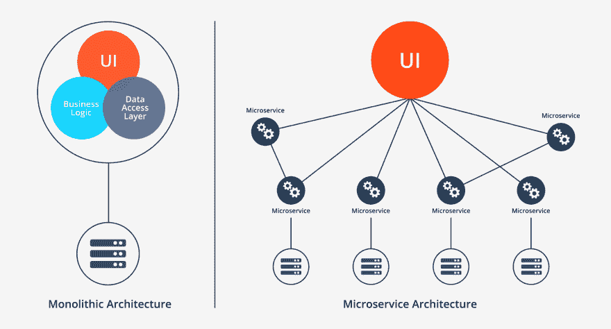
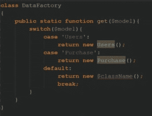
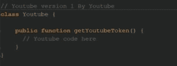
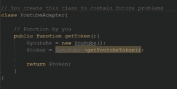

# 软件体系结构:体系结构与设计的区别

> [https://dev . to/oieduardorabelo/软件体系结构-a-差异-体系结构-e-设计-1j9e](https://dev.to/oieduardorabelo/arquitetura-de-software-a-diferenca-entre-arquitetura-e-design-1j9e)

*学分图片[ [图片 1](https://unsplash.com/photos/wVoMvN5NsU0) ，[图片 2](https://unsplash.com/photos/kP1AxmCyEXM)*

很多人真的不知道软件体系结构和软件设计之间的区别。即使对于开发人员来说，该系列通常是杂乱无章的，他们可以混合软件体系结构标准和设计标准的元素。身为开发人员，我想简化这些概念，并说明软体设计与软体架构之间的差异。此外，我还将展示开发人员了解软件体系结构和大量软件设计的重要性。那我们开始吧。

# 软件体系结构的定义

简而言之，软件体系结构是将软件功能(如灵活性、可扩展性、可行性、重用性和安全性)转换为满足业务和技术期望的结构化解决方案的过程。这一定义使我们对可能影响体系结构设计的软件功能产生疑问主要代表业务或运营要求以及技术要求的功能列表很长。

# 软件体系结构的特点

如前所述，软件功能描述了软件在操作和技术层面的要求和期望。因此，当一个产品领导者说他在快速变化的市场上竞争，必须迅速调整自己的业务模式。如果公司要处理需要在短时间内成功完成的紧急请求，则该软件必须是“可扩展的、模块化的和可维护的”。作为一名软件设计师，请注意性能和低容错能力、可扩展性和可靠性是其主要特征。现在，定义了上述特性后，公司所有者报告说，他们对此项目的预算有限，这里出现了另一个特性，即“可行性”。

您可以在此找到完整的软件功能列表，也称为“质量属性”。

# 软件体系结构标准

大多数人可能听说过“微服务”一词。微服务是许多其他软件体系结构标准之一，如分层标准、面向事件的标准、无服务器标准等。其中一些将在本文后面讨论。微服务模式在亚马逊和 Netflix 采用后获得了声誉，表现出了巨大的影响。现在，让我们深入了解建筑标准。

快速观察:不要将诸如**工厂**或**适配器**等设计标准与建筑标准混为一谈。我待会再讨论。

# 无服务器体系结构

此体系结构是指依赖第三方服务来管理服务器复杂性和后端管理的应用程序解决方案。无服务器体系结构分为两大类。第一个是“后端即服务(BaaS)”，第二个是“功能即服务(FaaS)”。无服务器体系结构可帮助您通过解决和纠正常规服务器和部署任务中的错误来节省大量时间。
无服务器 API 最著名的提供者是 Amazon AWS“lambda”。

你可以在这里读到更多关于它的内容。

# 面向事件的体系结构

此体系结构依赖于事件的制造者和消费者。主要想法是将系统的各个部分解耦，当触发另一方的有趣事件时，每个部分都会触发。很复杂吗？让我们简化一下。假设您创建了一个网上商店系统，它有两个部分。一个采购模块和一个供应商模块。如果客户进行采购，则采购模块将生成一个事件**【order pending】**。由于供应商模块对**【订单待决】**事件感兴趣，因此如果触发此类事件，将会进行侦听。当供应商模块收到此事件时，它将执行某些任务，或者可能触发另一个事件，向特定供应商请求更多产品。

请记住，事件的制作者不知道哪个事件消费者正在收听哪个事件。另外，其他消费者也不知道其中哪一个听得见什么活动。因此，主要的想法是使系统的各个部分分离。

如果您有兴趣了解更多信息，请单击此处。

# 微服务体系结构

微服务体系结构近年来已成为最受欢迎的体系结构。这取决于小型、独立的模块化服务的开发，在这些服务中，每个服务都可以解决特定的问题或执行独特的任务，并且这些模块通过定义完善的 API 进行通信以实现业务目标。我不用再解释了，只要看看这张图片。

# 设计德软件

软件体系结构负责软件的高级框架和基础架构，而软件设计则负责代码级别的设计，如每个模块所做的工作、类的范围和功能的目标等。

如果你是一个开发者，重要的是要知道 **SOLID** 的原理是什么，以及设计模式应该如何解决常规问题。

**坚实**参照-se aos 原则: ***S** 单一责任*， ***‌O** 笔合*， ***‌L** 伊斯科夫换人*， ***‌I** 界面分离*e*d‌
依赖**倒置* *

*   **责任原则:**是指每一类都必须有单一的目标、责任和改变的理由。
*   **封闭原理:**一类必须开放进行扩展，但封闭进行修改。简而言之，您可以向类中添加更多功能，但不能编辑当前函数以破坏使用该类的现有代码。
*   **替代原则:**该原则指导开发人员在任何时候都不中断应用逻辑的方式使用继承。因此，如果名为" XyClass "的子类继承自父类" abclass "，则子类不应以更改父类行为的方式复制父类的功能。因此，您可以轻松地使用 XyClass 对象而不是 abclass 对象，而不会破坏应用程序逻辑。
*   **隔离原则:**简单地说，由于类可以实现多个接口，因此其代码的结构决不要求类实现对其目的不重要的功能。因此，对其接口进行分类。
*   **反转原理:**如果您按照 TDD 开发应用程序，那么您知道如何解耦代码对于测试性和模块性很重要。也就是说，如果特定的" ex: Purchase "类依赖于" Users "类，则 User 对象的实例化必须来自于" Purchase "类之外。

# 设计标准

*   **模式:**是 OOP 世界中最常用的设计模式，因为将来需要修改使用过的类之一时，它可以节省很多时间。

请参见以下示例:

假设您要实例化一个模型类 **Users()** ，有两种方法可以做到这一点:

1.  $ Users = new Users()；
2.  $ Users = data factory::get(" Users ")；

我更喜欢第二条路，有两个原因。首先，将类名称从“Users”更改为“UsersData”只需更改“data factory”中的一个位置，其馀代码将保持不变。二、Users 类是否开始使用诸如**等参数；**那么您还需要在一个位置进行更改，而不是在需要用户对象的所有功能上进行更改。所以，如果你认为第一条路比较好，再想想。

*   **模式:**适配器模式是结构设计模式之一。按名称，您会希望他将意外的类用法转换为预期的用法。

假设您的应用程序处理 YouTube API，并且要获取访问令牌，您需要调用一个名为“**”getyoutubetoken()的函数；**。

因此，您在应用程序中的 20 个不同位置调用了此函数。

Google 随后推出了 YouTube API 的新版本，并将其重命名为“**getaccessoken()；**。

现在，您需要查找并替换应用程序中所有位置的角色名称，或者创建 Adapter 类，如下例所示:

在这种情况下，只需更改一行，应用程序的其馀部分将继续正常运行。

由于本文并未详细讨论设计模式，因此如果您想了解更多信息，以下是一些有用的链接:

*   https://code.tutsplus.com/series/design-patterns-in-php-CMS-747
*   [http://www.phptherightway.com/pages/Design-Patterns.html](http://www.phptherightway.com/pages/Design-Patterns.html)

请记住，软件架构师和软件开发人员之间存在区别。软件设计师通常有经验丰富的团队领导，他们对现有解决方案有很好的了解，可帮助他们在规划阶段做出正确的决策。软件开发人员应了解更多软件设计和软件体系结构，以便于团队内部沟通。

* * *

# 克雷蒂托

*   [软件架构——架构与设计的区别](https://codeburst.io/software-architecture-the-difference-between-architecture-and-design-7936abdd5830)，escrito origination por[@ maladinsayed](https://codeburst.io/@maladdinsayed)