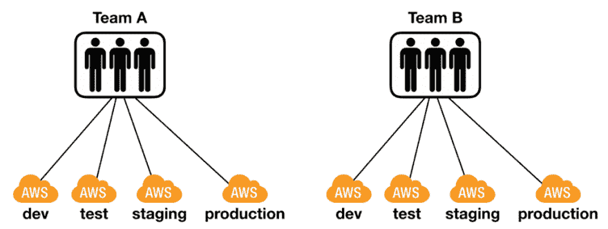

# 为什么在使用无服务器时应该使用临时堆栈

> 原文:[https://dev . to/the burning monk/why-you-should-use-temporary-stacks-when-you-do-server less-2 ai 0](https://dev.to/theburningmonk/why-you-should-use-temporary-stacks-when-you-do-serverless-2ai0)

无服务器的好处之一是你从平台上获得的按使用付费的定价模式。也就是说，如果你的代码不运行，你就不用为它们付费！

结合简化的部署流程(与在容器或虚拟机中运行的应用程序相比)，它使许多团队能够利用临时云形成堆栈。

在这篇文章中，让我们来谈谈你应该使用临时 CloudFormation 堆栈的两种方式，以及为什么。 ***免责声明*** *:这个不应该当药方。这是一种有优点和缺点的通用方法，我们将在后面讨论。*

# 用于特征分支的临时堆栈

团队拥有多个 AWS 帐户是很常见的，每个环境一个帐户。虽然对于如何使用这些环境似乎没有一致的意见，但我倾向于遵循以下惯例:

*   由团队共享，这是部署最新开发变更并进行端到端测试的地方。这种环境本质上是不稳定的，不应该被其他团队使用。
*   是其他团队可以与您团队的工作相结合的地方。这种环境应该是相当稳定的，以便不拖累其他团队。
*   应该非常类似于生产，并且通常包含生产数据的转储。这是您可以在类似生产的环境中对您的发布候选进行压力测试的地方。
*   然后还有`production`

每个环境拥有一个帐户被认为是最佳实践。我的一些 AWS 朋友甚至更进一步，每个开发者都有一个 AWS 账户。

就我个人而言，我从来不觉得有必要给每个开发者一个账号。毕竟，拥有一个 AWS 帐户会有一些开销。相反，我通常满足于每个环境每个团队一个 AWS 帐户。

[T2】](https://res.cloudinary.com/practicaldev/image/fetch/s--1F95zdW2--/c_limit%2Cf_auto%2Cfl_progressive%2Cq_auto%2Cw_880/https://theburningmonk.com/wp-content/uploads/2019/09/img_5d7a1784cfff9.png)

然而，对于一个特定的项目，我通常会为每个开发人员提供一个单独的部署 CloudFormation 堆栈(但是在同一个`dev`帐户中)。这在我处理特征分支时特别有用。

当我开始开发一个新功能时，我仍然在摸索解决问题的最佳方案。代码库仍然不稳定，许多错误还没有解决。将我半生不熟的更改部署到`dev`环境中可能会造成相当大的破坏:

*   这有破坏团队共享环境的风险
*   它会覆盖团队正在开发的其他功能
*   团队成员会为(不是字面意思！)谁可以将他们的特性分支部署到共享环境中

这些挑战中的一部分可以通过特性切换来缓解。不同的特性分支可以同时存在，并且只对开发人员开放。像 launch crystally 这样的服务非常适合这一点，即使它与 Lambda [一起使用需要额外的工作](https://lumigo.io/blog/canary-deployment-with-launchdarkly-and-aws-lambda/)。

但是当你需要部署和测试一些未完成的变更时，你会怎么做呢？也就是说，变更还没有完成，还没有准备好被审查和合并回`master`。在这种情况下，功能切换对您没有帮助。

相反，我可以将特性分支部署到一个专用的环境中，例如`dev-my-feature`。使用[无服务器框架](https://serverless.com/framework/)，就像运行命令`sls deploy -s dev-my-feature`一样简单。这将部署所有的 Lambda 函数、API 网关和任何其他相关资源(DynamoDB 等。)在它自己的 CloudFormation 堆栈中。我将能够在一个真实的 AWS 环境中测试我的工作进展特性。

为每个特征分支建立这些临时云形成栈的开销可以忽略不计。由于仅由团队使用，`dev`账户中没有流量。当开发人员完成该特性时，可以通过运行`sls remove -s dev-my-feature`轻松移除临时堆栈。

但是，由于这些临时堆栈是您的特征分支的扩展。当您拥有长期的特性分支时，它们会表现出相同的问题。也就是说，它们与需要集成的其他系统不同步。就进入你功能的事件而言，比如来自 SQS/社交网络/Kinesis 的有效载荷等。以及函数所依赖的数据，比如驻留在 DynamoDB 中的数据。

虽然这不是无服务器技术本身的问题，但是我发现当团队使用无服务器技术时，他们移动得更快。这意味着长期特性分支的问题也变得更加突出和明显。

不要让特色分支停留超过一周。如果工作很大并且需要更长的时间来实现，那么就把它分成更小的部分。当你在一个特性分支上工作时，定期从 master 上集成(每天不少于一次)。

## 运行 localstack vs 与 AWS 对话

我发现在 AWS 中部署一个临时的 CloudFormation 堆栈并运行真实的东西会更有效率，而不是花费大量的时间来让诸如 [localstack](https://github.com/localstack/localstack) 这样的工具工作。

主要缺点是:

*   你需要互联网连接
*   部署到 AWS 比在本地运行代码要慢，这会减慢反馈循环

互联网接入的争论只与少数大部分时间都在路上的人有关。当我在机场的时候，我比大多数人出差更多，做了很多工作，上网对我来说很少是问题。

至于更慢的反馈循环，感觉可能比实际情况更糟。我的大多数部署都不到 30 秒。但是当我盯着屏幕等待它完成的时候，他们确实感觉像是一个永恒。为了补偿反馈回路的损失，我还使用测试和`sls invoke local`在本地运行我的函数，同时与真正的 AWS 服务对话。

# 用于端到端测试的临时堆栈

说到测试，临时 CloudFormation 堆栈的另一个常见用途是运行端到端测试。

这些测试的一个常见问题是，您需要将测试数据插入到一个实时的共享 AWS 环境中。根据经验，我总是:

*   在测试之前插入测试用例需要的数据
*   测试完成后删除数据

这些有助于保持我的测试的健壮性和自包含性，因为它们不隐含地依赖于数据的存在。它们也有助于减少在共享环境中漂浮的垃圾数量。

然而，尽管我们的意图是好的，错误还是会发生，有时我们故意走捷径来获得短期的灵活性。随着时间的推移，这些共享环境充满了测试数据，这有时会干扰正常的操作。

作为应对措施，许多团队会不时地使用 cron 作业来清除这些环境。

一种应对这些挑战的新兴实践是在 CI/CD 流水线期间创建临时云形成堆栈。临时堆栈用于执行端到端测试，然后被销毁。

这样，就不需要清理测试数据，无论是作为测试夹具的一部分还是通过 cron 作业。

缺点是:

*   CI/CD 管道运行时间更长
*   您仍然将测试数据留在外部系统中，所以这不是一个完整的解决方案

您应该权衡这种方法的好处和它给 CI/CD 管道带来的延迟，并决定它是否适合某个项目。就个人而言，我认为这是一个很好的方法，我鼓励更多的团队采用它。但是，您必须在外部系统(即未作为临时堆栈的一部分进行配置的系统)中清理的数据越多，它的用处就越小。

# 总结

总之，这里有两种方法可以使用临时 CloudFormation 堆栈来改进无服务器应用程序的开发流程:

*   为特性分支使用临时堆栈，以避免破坏共享环境的稳定性
*   在 CI/CD 管道期间使用临时堆栈来运行端到端测试，以消除清理测试数据的开销

这些方法不应被视为处方。你需要考虑它们的优缺点，看看它们是否符合你的限制和你的团队的工作方式。

[T2】](https://res.cloudinary.com/practicaldev/image/fetch/s--Bk6FK0kn--/c_limit%2Cf_auto%2Cfl_progressive%2Cq_auto%2Cw_880/https://theburningmonk.com/wp-content/uploads/2019/03/img_5c8ca195210d5.png)

嗨，我的名字是**崔琰**。我是一个 **[AWS 无服务器英雄](https://aws.amazon.com/developer/community/heroes/yan-cui/)** 和 [**量产无服务器**](https://bit.ly/production-ready-serverless) 的作者。我已经在 AWS 中运行了近 10 年的大规模生产工作负载，我是一名架构师或首席工程师，涉足从银行、电子商务、体育流媒体到移动游戏等多个行业。我目前是一名专注于 AWS 和无服务器的独立顾问。

你可以通过[邮箱](//mailto:theburningmonk.com)、[推特](https://twitter.com/theburningmonk)和 [LinkedIn](https://www.linkedin.com/in/theburningmonk/) 联系我。

雇用我。

帖子[为什么你在做无服务器](https://theburningmonk.com/2019/09/why-you-should-use-temporary-stacks-when-you-do-serverless/)时应该使用临时栈最早出现在 theburningmonk.com 的[上。](https://theburningmonk.com)

[T2】](https://res.cloudinary.com/practicaldev/image/fetch/s--gjfzsdmz--/c_limit%2Cf_auto%2Cfl_progressive%2Cq_auto%2Cw_880/http://feeds.feedburner.com/%257Er/theburningmonk/%257E4/mT4TZMKHaZM)