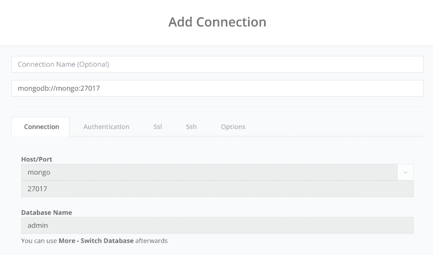
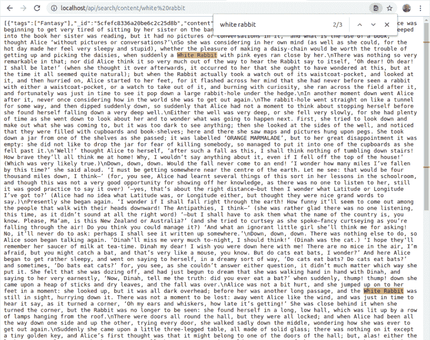

# Hugo + Node.js Koa App 连接 MongoDB 第二部分

> 原文:[https://dev . to/jimfrenette/Hugo-node-js-KOA-app-connected-to-MongoDB-part-ii-HJ](https://dev.to/jimfrenette/hugo-node-js-koa-app-connected-to-mongodb-part-ii-hj)

在本系列的第 2 部分中，我们在构建 Hugo 静态站点时将站点内容添加到一个`search.json`文件中，并将其导入到一个 MongoDB 集合中。然后在 Node.js Koa 应用程序中，我们创建一个 API 端点，从 MongoDB 中的集合返回搜索结果。

> 本教程是连接到 MongoDB 的 Hugo + Node.js Koa 应用程序的延续，因此需要在开始本教程之前完成其中的所有步骤。这个系列的[源代码](https://github.com/jimfrenette/hugo-koa-mongo/tree/part-2)在 GitHub 上。

### [](#environment-settings)环境设置

为了更容易更改和跟踪，添加一个`.env`文件来维护项目设置。举个例子，

##### [T1。包封/包围（动词 envelop 的简写）](#env)

```
### PROJECT SETTINGS

DEV_PROJECT_NAME=hkm
DEV_PROJECT_HOST=localhost 
```

现在更新`docker-compose.yml`文件以使用`.env`文件设置，如下所示。

1.  将`hkm_`替换为`${DEV_PROJECT_NAME}_`
2.  将`localhost`替换为`${DEV_PROJECT_HOST}`

### [](#nosql-client)NoSQL 客户端

在我们更新`docker-compose.yml`文件的同时，让我们添加一个 MongoDB [NoSql 客户端](https://www.nosqlclient.com/) Docker 容器到堆栈中，这样我们就可以使用 GUI 管理 MongoDB。

在`docker-compose.yml`文件中，在`mongo`服务下添加这个块。我们正在添加的`mongoclient`服务使用了 [mongoclient](https://hub.docker.com/r/mongoclient/mongoclient/) docker 映像。

##### [](#dockercomposeyml)码头工-化合物. yml

```
 mongoclient:
    image: mongoclient/mongoclient
    container_name: "${DEV_PROJECT_NAME}_mongoclient"
    labels:
      - 'traefik.backend=${DEV_PROJECT_NAME}_mongoclient'
    ports:
      - "3000:3000"    
    volumes:
      - mongoclientdata:/data/db 
```

在文件的底部，在`mongodata`下添加`mongoclientdata`命名的卷，以保存使用容器所做的任何保存的数据更改。

##### [](#dockercomposeyml)码头工-化合物. yml

```
volumes:
  mongodata:
  mongoclientdata: 
```

使用`docker-compose up`调出堆栈，并在浏览器
中打开 Nosqlclient。例如，`localhost:3000`

在菜单中，选择**连接** >创建新的

从`api/src/server/chinook/connect.js`复制`connStr`值并粘贴到添加连接表单的连接 URL 输入中。

[T2】](https://res.cloudinary.com/practicaldev/image/fetch/s--DVXdQnKh--/c_limit%2Cf_auto%2Cfl_progressive%2Cq_auto%2Cw_880/https://thepracticaldev.s3.amazonaws.com/i/b7aq3gdxeijcvg3jie21.png)

切换到 chinook 数据库，您应该能够浏览集合。

稍后我们将使用这个客户端将搜索索引`json`导入到一个新的数据库中。

### [](#search-index)搜索索引

接下来的这些步骤将允许我们创建一个搜索索引`json`文件，该文件可以导入到 MongoDB 中，以便为静态网站内容的自由文本搜索创建一个 api 端点。

创建一个布局来输出搜索索引`json`。例如，在通用的`/layouts`文件夹中，创建一个名为`list.search.json`的新文件，如下所示:

##### [](#listsearchjson)list.search.json

```
{{- $.Scratch.Add "search" slice -}}
{{- range $index, $element := (where .Site.Pages "Kind" "page") -}}
    {{- $.Scratch.Add "search" (dict "title" $element.Title "uri" $element.Permalink "tags" $element.Params.tags "section" $element.Section "content" $element.Plain "summary" $element.Summary "date" ($element.Date.Format "2006-01-02")) -}}
{{- end -}}
{{- $.Scratch.Get "search" | jsonify -}} 
```

通过添加一个`Search`输出来更新站点配置。为了添加另一个输出，我们还需要包含预先存在的`HTML`和`RSS`输出配置设置。如下更新`config.toml`，添加`Search`输出和格式设置。

##### [](#configtoml)config.toml

```
...

[outputs]
home = ["HTML", "RSS", "Search"]

[outputFormats.Search]
baseName = "search"
isPlainText = true
mediaType = "application/json"
notAlternative = true 
```

> 请注意，代码片段中的省略号…不是代码的一部分，它只是用来表示被跳过的代码，不适用于该示例。

生成站点，现在在`public`文件夹的根目录下应该有一个`search.json`文件。

```
cd www
hugo 
```

### [](#content)内容

为了测试，我使用了免费的公共领域书籍摘录，其中有大量的文本来填充搜索索引。例如，[内容文件夹](https://github.com/jimfrenette/hugo-koa-mongo/tree/master/www/content)

### [](#mongodb-import-search-index)MongoDB -导入搜索索引

#### [](#option-a)选项 A

Shell 到正在运行的 MongoDB 容器中，例如

```
# start/restart environment as needed
docker-compose up -d

docker exec -it hkm_mongo /bin/bash 
```

将`search.json`文件复制到 mongo 容器`/home`目录中。如

```
docker cp www/public/search.json hkm_mongo:/home/search.json 
```

使用`--jsonArray`选项将`search.json`文件导入名为`search`的数据库和名为`Content`的集合。如

```
cd home

mongoimport --db search --collection Content --file search.json --jsonArray 
```

#### [](#option-b-rebuild-mongo-image)选项 B(重建 Mongo 镜像)

> 这种方法需要移除预先存在的`mongodata`卷。

如果 Docker 映像找到任何扩展名为`.sh`的文件。sh 在/docker-entrypoint-initdb.d 文件夹中，它将执行它们。使用`mongo.dockerfile`将`search.json`和运行`mongoimport`命令的 shell 脚本复制到`docker-entrypoint-initdb.d`中。例如，

```
cp www/public/search.json docker/entrypoint-initdb.d/ 
```

在包含这个`mongoimport`命令的`docker/entrypoint-initdb.d`文件夹中创建一个 shell 脚本:

```
mongoimport --db search --collection Content --file /docker-entrypoint-initdb.d/search.json --jsonArray 
```

重建 docker 映像。例如

```
# rebuild
docker-compose build 
```

### [](#mongodb-text-search)MongoDB -文本搜索

在`title`和`content`字段上创建文本索引。如

```
db.Content.createIndex( { title: "text", content: "text" } ) 
```

> 要运行 MongoDB 命令，请使用 localhost:3000 中的 Nosqlclient 或 shell 进入容器，例如`docker exec -it hkm_mongo /bin/bash`并运行`mongo`。确保切换到`search`数据库，例如`use search`

使用`$text`查询操作符执行文本搜索。例如

```
db.Content.find( { $text: { $search: "wonderland" } } ) 
```

#### [](#content-data-model)内容数据模型

在`src/server/search`文件夹中，创建`content`数据模型。举个例子，

##### [](#contentjs)content.js

```
const mongoose = require('mongoose');
const Schema = mongoose.Schema;

/*
 notice there is no ID. That's because Mongoose will assign
 an ID by default to all schemas

 by default, Mongoose produces a collection name by passing the model name to the utils.toCollectionName method.
 This method pluralizes the name Content to Contents.
 Set this option if you need a different name for your collection.
 e.g., `collection: 'Content'`
*/

const ContentSchema = new Schema({
    content: String,
    date: Date,
    section: String,
    summary: String,
    tags: Array
},{ 
    collection: 'Content'
});

const search = mongoose.connection.useDb('search');

module.exports = search.model('Content', ContentSchema); 
```

#### [](#search-route)搜索路线

在`src/server/routes/search`文件夹中，创建`api/search`路线。举个例子，

##### [](#contentjs)content.js

```
const Router = require('koa-router');

const router = new Router();
const BASE_URL = `/api/search`;

const Content = require('../../search/content');

function getContent(phrase) {

    // put quotes around search phrase
    phrase = JSON.stringify(phrase);

    return new Promise((resolve, reject) => {
        var query = Content.find({ $text: { $search: phrase } });
        query.exec((err, results) => {
            if (err) return handleError(err);
            resolve(results);
        });
    });
}

router.get(BASE_URL + '/content/:phrase', async (ctx) => {
    try {
        ctx.body = await getContent(ctx.params.phrase);
    } catch (err) {
        console.log(err)
    }
})

module.exports = router; 
```

#### [](#app-entrypoint)App Entrypoint

更新 Koa 应用入口点，`src/server/index.js`以包含和使用新的内容文本搜索路线。

##### [](#indexjs)index.js

```
const Koa = require('koa');
const mongoose = require('mongoose');

...

const contentRoutes = require('./routes/search/content');

/**
 * Koa app */
const app = new Koa();
const PORT = process.env.PORT || 1337;
const server = app.listen(PORT, () => {
    console.log(`Server listening on port: ${PORT}`);
});

/**
 * MongoDB connection */
const connStr =  'mongodb://mongo:27017/default';
mongoose.connect(connStr);
const db = mongoose.connection;
db.on('error', console.error.bind(console, 'connection error:'));
db.once('open', () => {
    console.log('connected');
});

...

app.use(contentRoutes.routes());

module.exports = server; 
```

### [](#api-test)API 测试

在项目根目录中，运行`docker-compose up -d`，这将在后台启动容器并保持它们运行。`-d`用于分离模式。

> 要监控终端中的 docker 输出，运行`docker-compose up`而不使用断开(`-d`)选项，例如`docker-compose up`。

为了测试内容搜索 API 端点，在浏览器中加载[localhost/API/search/content/white rabbit](http://localhost/api/search/content/white%20rabbit)来查看 json 响应。在本例中，我们要搜索“白兔”。

[T2】](https://res.cloudinary.com/practicaldev/image/fetch/s--SY2s180V--/c_limit%2Cf_auto%2Cfl_progressive%2Cq_auto%2Cw_880/https://thepracticaldev.s3.amazonaws.com/i/hcpgwyxnujuqm2ubkzkc.png)

* * *

本教程的所有源代码都可以在 GitHub 上获得。

##### *[源代码](https://github.com/jimfrenette/hugo-koa-mongo/tree/part-2)*

 *最初发布于[jimfrenette . com/2019/08/Hugo-plus-nodejs-KOA-app-MongoDB-connection-part-2](https://jimfrenette.com/2019/08/hugo-plus-nodejs-koa-app-mongodb-connection-part-2/)*