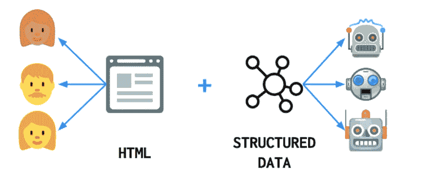

# Web 开发人员的 SEO 使用 JSON-LD 还是微数据？

> 原文:[https://dev . to/tonyfrenzy/SEO-for-web-developers-to-use-JSON-LD-or-microdata-2d4p](https://dev.to/tonyfrenzy/seo-for-web-developers-to-use-json-ld-or-microdata-2d4p)

### —结构化数据

 

<figcaption>图片来源: [**提词**](https://wordlift.io/blog/en/entity/structured-data/)</figcaption>

### SEO 中什么是结构化数据？

虽然结构化数据简单地指的是任何被组织的数据或者“[给定结构](https://moz.com/blog/structured-data-for-seo-1)”，但是它可以被实现为页面上的标记，使得搜索引擎能够更好地理解给定网页上可用的信息，然后使用该信息来改进搜索结果列表。可以使用**微数据、JSON-LD** 或 **RDFa** **模式**类型在网站上实现。结构化数据既是技术上的**又是页面上的 **SEO** 但是经常在技术 SEO 下讨论。**

 **结构化数据是一种页面上的 SEO，因为它是在一个网站内实现的，不像 [**离页**(离站)SEO](https://www.reliablesoft.net/what-is-the-difference-between-onsite-and-offsite-seo/) 处理目标网站外部资源发生的优化，如链接建设、社交媒体&影响者营销、[客座博文](https://moz.com/learn/seo/off-site-seo)等。页面搜索引擎优化决定了一个页面如何在网络应用程序和引擎上显示，例如链接预览、站点链接搜索框、丰富的卡片片段、知识图表面板和许多其他增强的片段。

> 模式是一种标记或组织内容的方式，这样搜索引擎就能更好地理解网页上的某些元素。这些代码为您的数据提供了结构，这就是为什么 schema 通常被称为“结构化数据”的原因——[***【墨子亲***](https://moz.com/beginners-guide-to-seo/technical-seo) 。

搜索引擎巨头，如 Google、Bing 和其他在线搜索公司[一起在 schema.org](https://searchengineland.com/schema-org-google-bing-yahoo-unite-79554)[的项目中标准化和开发模式标记](http://www.schema.org.)，然而他们有着截然不同的偏好。Google 偏好 JSON-LD，而 Bing 偏好的标记类型是微数据格式(Bing 现在[支持 JSON-LD](https://blogs.bing.com/webmaster/august-2018/Introducing-JSON-LD-Support-in-Bing-Webmaster-Tools) )。这两种技术都很受欢迎，有助于增强搜索引擎数据挖掘的网页。我们将根据可用性、可移植性、可维护性等来比较每种方法的优缺点。RDFa 和微数据在语义上是相似的，因此本文中关于微数据的讨论也适用于 RDFa(不太流行)。

一个相关但标准化的著名实体结构化数据在线存储库是维基媒体的 Wikidata.org。Wikidata 向搜索引擎提供关于重要主题的定义明确的结构化数据。

### 什么是微数据？

> **微数据**是一个 WHATWG HTML 规范，用于在网页上的现有内容中嵌套[元数据](https://en.wikipedia.org/wiki/Metadata) *。[搜索引擎](https://en.wikipedia.org/wiki/Search_engines)、[网络爬虫](https://en.wikipedia.org/wiki/Web_crawlers)、[浏览器](https://en.wikipedia.org/wiki/Web_browser)可以从一个网页中提取和处理微数据，并利用它为用户提供更丰富的浏览体验——[维基百科](https://en.wikipedia.org/wiki/Microdata_(HTML))。*

微数据标记是勉强内联的，并且紧紧地附着在 HTML 标记上，作为 HTML 标记代码中的附加属性。参见下面维基百科中的一个例子:**