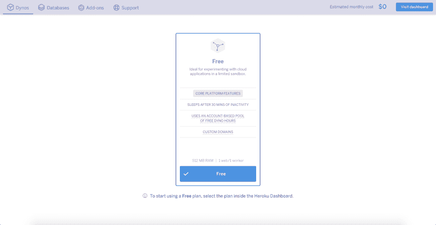

# 泛音:让我保持清醒的音乐

> 原文:[https://dev . to/alekcz/overtone-music-to-keep-my-dynos-awake-2jpl](https://dev.to/alekcz/overtone-music-to-keep-my-dynos-awake-2jpl)

在我早年的时候，我和创业公司以及“创意人”一起工作，也就是“帮我编码，我会给你我的创意的股份”。因此，我很快学会了控制我参与的多个项目的成本。

我和`nohup`、`upstart`以及`systemctl`遭遇了许多不幸。我选择的基础设施很快成为(现在仍然是)Heroku。没有虚饰。不废话。就`git push`。他们有一个免费计划，可以达到 1000 小时(一个月最多 744 小时)。你所要做的就是验证你的账户，又名**，加上你的信用卡**，你就完全正确了。

[T2】](https://res.cloudinary.com/practicaldev/image/fetch/s--JbwZk-qu--/c_limit%2Cf_auto%2Cfl_progressive%2Cq_auto%2Cw_880/https://alexanderoloo.cimg/blog/heroku-dyno-pricing.png)

> *“已验证的账户每月有 1000 个免费动态小时；未经核实的账户收 550。”*

唯一有点烦人的是，dyno 会在 30 分钟不活动后休眠。这不仅仅是有点烦人。时不时地，您会点击站点或 API，并且您必须冷启动 JVM。在我眼皮底下不行！

当时我还是 Clojure 的新手，被调度库的复杂性吓到了。所以我想，如果我能找到一个音乐库(肯定有，因为 Java ),它肯定会有节拍器或波形发生器。所以我找到了`overtone`:用于设计合成器和与音乐合作的开源工具包。

在费力地阅读了源代码之后，我找到了库的计时部分:`overtone.music.time`。我的方法非常直接。我会运行`interspaced`函数，每 5 分钟 ping 一次 dyno。

所以我唱歌来保持清醒。

这里有一个 REPL。

```
; in your REPL with [overtone "0.10.3"] as a depdency  keepawake.core  =>  (use  'overtone.music.time)  keepawake.core  =>  (defn  ping!  []  (println  "HTTP GET request"))  ; this would be the actual get request  keepawake.core  =>  (interspaced  1000  ping!)  ; this was originally 300000 milliseconds 
```

最终，我意识到只要用`overtone/at-at`就可以了，因为`overtone.music.time`已经在用了。所以这些天`at-at`解决了我所有的日程安排需求，同时带我沿着记忆之路去一个很远很远的星系…

祝你的身材永远过关。

亚历克斯

## [](#references)参考文献

*   [https://github.com/overtone/overtone](https://github.com/overtone/overtone)
*   深入阅读源代码