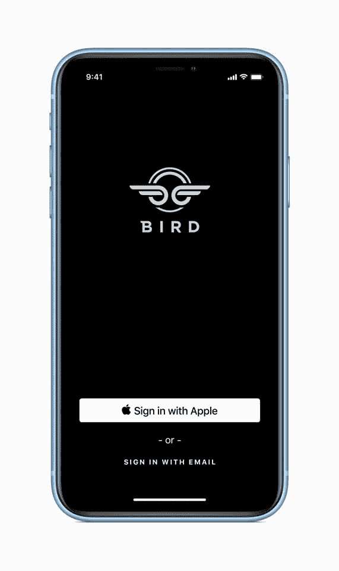

# iOS 13:你的应用现在需要的 5 大功能

> 原文：<https://dev.to/semaphore/ios-13-the-top-5-features-your-app-needs-now-1n9p>

在 [WWDC 2019](https://semaphoreci.com/blog/ios-developer-community-wwdc) 大会上，苹果宣布了 iOS 13 的许多改进，例如大肆宣传的黑暗模式和增加的隐私功能。苹果倾向于在应用商店中突出显示实现新功能的应用，所以现在是时候为 iOS 13 的新功能优化你的应用了。

今天，我将强调作为 iOS 开发者，你应该计划实现的五个最重要的特性。

## 1。深色模式

为 iOS 13 中的黑暗模式功能准备好您的应用程序。苹果如此强调黑暗模式，以至于 WWDC 2019 活动环境完全黑暗。

在本次更新之前，您可能已经看到应用程序通过使用 UIAppearence 类创建自己的主题来模拟这一功能。但是现在苹果官方支持了，你就可以准备整个系统无缝集成的 iOS 13 黑暗模式了。

[](https://res.cloudinary.com/practicaldev/image/fetch/s--FSp2m8zy--/c_limit%2Cf_auto%2Cfl_progressive%2Cq_auto%2Cw_880/https://lh3.googleusercontent.com/fzD4ZSO6H9mEE3z3ZhtYZdDt8KycyuvYtpFpqcI7dFSHUfCWQB0-UbKjrpwHBCGi0QhPsRQqcnOFN99sKbsWMNwqvBstXkzmqGIwIHlYMkSWWYit1rt6uRRe9RtQSp0nSUjChI6j)
iOS 13 的黑暗模式功能截图([图片鸣谢](https://www.apple.com/newsroom/2019/06/apple-previews-ios-13/))。

[正如苹果公司所说](https://developer.apple.com/news/?id=0829019a):

当用户打开黑暗模式时，所有使用 iOS 13 SDK 构建的应用程序都将在黑暗模式下运行。

如果你需要更多的时间来优化你的应用程序，或者黑暗模式不适合你的应用程序，你可以学习如何退出。

然而，因为苹果在今年的 WWDC 上对它的强调，我建议如果可能的话把它添加到你的应用程序的界面上。

### 黑暗模式最佳实践

通过在资产目录中定义自定义颜色，为您的 UI 选择自适应颜色。
例如，通过名称
从资产目录中加载颜色值

```
let labelColor = UIColor(named: “customControlColor”) 
```

<svg width="20px" height="20px" viewBox="0 0 24 24" class="highlight-action crayons-icon highlight-action--fullscreen-on"><title>Enter fullscreen mode</title></svg> <svg width="20px" height="20px" viewBox="0 0 24 24" class="highlight-action crayons-icon highlight-action--fullscreen-off"><title>Exit fullscreen mode</title></svg>

*   你创建的图像应该在明暗两个方面看起来都不错。

*   用特定的方法更新自定义视图。一种方法是将您的代码移动到 updateLayer()方法，这样每当 UI 刷新时，背景颜色也会改变。

你可以在这里阅读苹果官方文档[关于 iOS 13 实现黑暗模式的完整介绍。](https://developer.apple.com/documentation/appkit/supporting_dark_mode_in_your_interface/)

## 2。登录 Apple

在此次更新中，苹果大幅改进了隐私功能。现在，用户可以使用苹果的原生登录功能登录应用程序，就像他们使用脸书和谷歌的授权码一样。iOS 13 中引入的[登录苹果](https://developer.apple.com/sign-in-with-apple/)功能，提供快速、简单的登录，无需跟踪。用户只需点击一个按钮，就可以使用他们的 FaceID。

[](https://res.cloudinary.com/practicaldev/image/fetch/s--2-GP29OZ--/c_limit%2Cf_auto%2Cfl_progressive%2Cq_auto%2Cw_880/https://lh6.googleusercontent.com/Aa3w-3rYSKaRi0TzJXRYkeeZz30gtShGLeyKgYDAG4OFmQje6y4u1ljQwfbsmJH70pTWw24rqbb79DWOuwjKwBkG13IEfF5Y2YQxJIHGfhPKaFd2M3pWSt3I03hZCoZp3qa1PTVq) 
在 iOS 13 中，用户可以使用苹果安全登录功能([图片信用](https://www.apple.com/newsroom/2019/06/apple-previews-ios-13/))登录应用。

与新的苹果认证选项的区别在于它的隐私保护功能。它使用户的数据更加安全，并允许他们对广告商隐藏他们的活动。

更好的是，每当你的应用程序询问姓名和电子邮件地址时，你可以选择不问。或者，如果您愿意，您可以允许 Apple 为您的用户创建一个随机的电子邮件地址。因此，当你的应用程序向用户发送消息时，它会转到他们的 Apple ID 电子邮件，所以没有人知道他们的电子邮件。

当然，你是否应该实现这一点取决于你的商业模式。不过，如果你的业务有可能的话，这项功能将向你的用户传达你对他们的数据是透明和安全的，没有兴趣跟踪他们并发送未经请求的电子邮件或广告。

登录 Apple 的主要优势在于:

*   隐藏用户的电子邮件，这可能会让他们更愿意使用你的应用程序。
*   适用于任何地方，包括浏览器、watchOS、tvOS 等等。
*   表明你尊重用户的隐私，并有助于加强你的品牌。
*   集成了内置的安全性，无需开发人员付出太多努力。

如果你想实现这个特性，看一看创建苹果登录按钮的`ASAuthorizationAppleIDButton`类。这个类允许不同的视觉样式和标签。然后，它在身份验证请求中捕获返回的结果，包括用户 ID、验证数据、全名、经过验证的电子邮件、真实用户指示符、凭证状态等数据。此外，密码自动填充似乎与苹果登录集成在一起。

你可以在[这里](https://developer.apple.com/sign-in-with-apple/get-started/)了解更多关于 Apple Sign 的信息。

## 3。Siri 快捷方式

如果你从未将 Siri 集成到你的应用程序中，现在是时候评估一下了。Siri 的功能现在提供了更好的语音体验、额外的定制等等。例如，一个食品交付应用程序可以让人们询问他们订单的交付状态，一个活动应用程序可以提醒用户准时离开参加聚会。

根据你的应用程序的核心功能，你可能会发现 Siri 为你的用户体验增加了显著的价值。

以对话快捷方式为例。Siri 现在可以问后续问题，这使得你的应用程序的语音快捷方式更加出色。例如，当用户说“订单状态”时，你可以让 Siri 询问用户指的是哪个订单。

Siri 在消费者中的采用率较低的一个可能原因是，用户必须导航到 Siri 的设置来记录他们自己的自定义语音命令。在 iOS 13 中，开发人员可以在应用程序中建议一个语音命令，并允许用户通过点击一个按钮来创建它。这消除了用户手动记录他们的自定义语音命令的需要，并使他们更容易与您的应用程序交互。

考虑在你的应用程序中添加一个 Siri 快捷按钮，用于重复的任务，如下单或检查某样东西的状态。花些时间使用 [SiriKit 文档](https://developer.apple.com/documentation/sirikit)来探索 Siri 的更新。

## 4。SwiftUI

SwiftUI 是一个用户界面工具包，让你以声明的方式设计应用程序。这意味着您可以编写代码，清楚地说明您希望它做什么。使用新的 Xcode 设计工具来编写和工作是很自然的，可以保持代码和设计同步。

[](https://res.cloudinary.com/practicaldev/image/fetch/s--2fNEZKTG--/c_limit%2Cf_auto%2Cfl_progressive%2Cq_auto%2Cw_880/https://lh6.googleusercontent.com/NpaYXD_TJukRTsBogrYifLUgSg9QVkqvEJXH8lzZFx-00HeItwb-oj-EXJC92emgpDkuFzODf7P6Bjz8e9PVWUXIuVqFLPfYTn4EFErVkGcq1ZIXme8mfTsNHwIS-yjPaFzXGTzZ) 
乔希·谢弗在 WWDC 2019 展示 SwiftUI 的界面([图片鸣谢](https://www.apple.com/newsroom/2019/06/highlights-from-wwdc-2019/))。

SwiftUI 给我留下的第一印象是它如何同时融合了故事板和代码的优势。例如，当您将 UI 元素拖放到画布中时，代码会更新。这可以帮助组织代码并修复[大规模视图控制器问题](https://www.hackingwithswift.com/articles/159/how-to-refactor-massive-view-controllers)。

另一个优势是 SwiftUI 是一个跨平台的、真正的原生工具包。它允许你的应用程序通过少量代码和交互式设计画布直接访问苹果的每个操作系统。

对于我之前用 SwiftUI 强调的所有东西，我建议现在只对它进行试验，而不是将其快速放入您的生产代码库。这是苹果的第一步，包括这些新的直观设计工具，使构建界面像拖放一样简单。但是你应该注意先试验，再决定！

## 5。核心 NFC

核心 NFC 可能是我推荐的最困难的特性，但它将开放您的应用程序连接到物理世界的能力。

使用核心 NFC，您的应用程序可以读取近场通信(NFC)标签，为用户提供有关其物理环境和其中真实世界对象的更多信息。想象一下可能性！

因此，使用核心 NFC，您的应用程序可能会向用户提供他们在商店找到的产品或他们在博物馆参观的展品的信息。

苹果今年改善了核心 NFC 的使用，增加了在 iPhone 7 及以上设备上读取非接触式智能卡、护照和其他政府颁发的身份证的功能。

要使用核心 NFC，您需要启用 Xcode 功能，使用核心 NFC 会话对象之一，如`NFCTagReaderSession`或`NFCNDEFReaderSession`，并在发现回调中接收标签。连接到标记以执行操作，然后使会话无效。

如果您以前从未使用过 NFC，这听起来可能有点令人困惑。为了开始(并受到可能性的启发)，我推荐阅读一些苹果的文档。

## 更快、更简单的 iOS 13 应用开发

请记住，苹果经常在 App Store 中突出显示那些融入了最新更新中的顶级功能和创意的应用程序。如果你希望提高你的应用程序的可发现性，并跻身于顶级应用程序之列，这可能是你的机会。

如果这一切听起来让人不知所措，那么自动化开发过程的某些部分可以帮助您专注于开发，并将重复的任务设置为自动驾驶。

一种方法是使用 iOS [持续集成和持续交付](https://semaphoreci.com/blog/2017/07/27/what-is-the-difference-between-continuous-integration-continuous-deployment-and-continuous-delivery.html) (CI/CD)。Semaphore 刚刚完成了支持 iOS 13 的倡议，因此现在您可以使用我们的 CI/CD 平台来编译和测试您的 iOS 应用程序。

先从简单的事情开始，如果有任何问题，可以随时联系 Twitter 上的信号量团队( [@semaphoreci](https://twitter.com/semaphoreci) )！