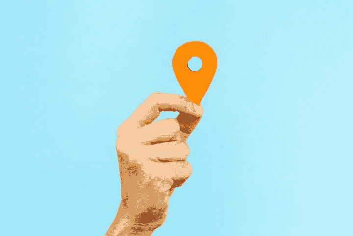
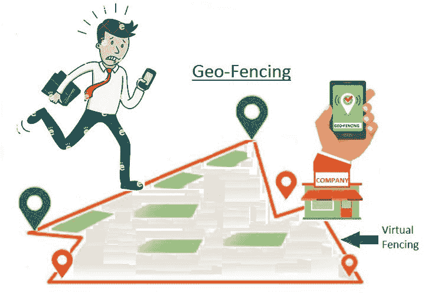
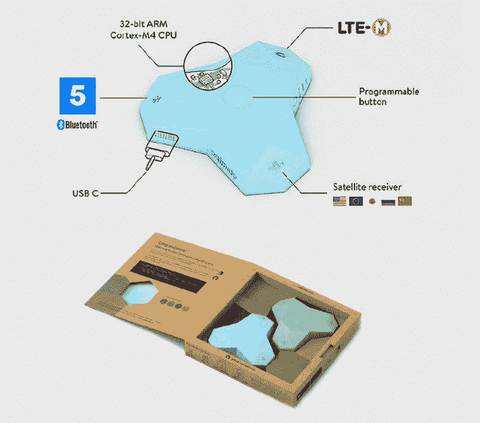
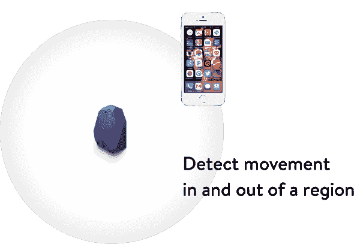
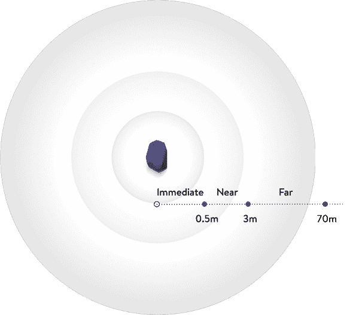
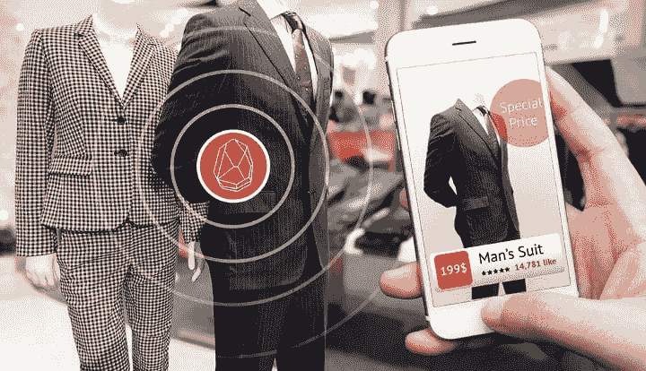
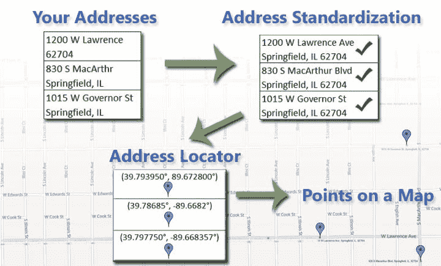

# 如何在 Ionic 4 中使用地理定位、地理围栏和信标插件

> 原文:[https://dev . to/enappd/how-to-use-geolocation-geo fencing-and-beacon-plugins-in-ion-4-67i](https://dev.to/enappd/how-to-use-geolocation-geofencing-and-beacon-plugins-in-ionic-4-67i)

* * *

如今，地理定位、全球定位系统对任何人来说都不再是新奇的词汇。每个智能手机用户都知道他们可以使用 GPS 来了解他们在世界上的位置(在谷歌/苹果地图中)。优步、Lyft 等知名应用利用位置数据来预订乘车服务等。送餐应用使用 GPS 数据实时跟踪送餐员。

Ionic 4 中有几个有趣的功能和插件，可以充分利用用户的位置。这些包括近场以及基于 GPS 的定位功能。在这篇博客中，我们深入探讨了这些功能，以及如何在我们自己的 Ionic 应用程序中使用它们。让我们开始吧


<figure>

<figcaption class="imageCaption">Oops !</figcaption>

</figure>

### 1.地理定位



<figure>

<figcaption class="imageCaption">Here I am !</figcaption>

</figure>

最著名和最熟悉的定位功能—地理定位是使用 GPS、手机信号发射塔、WiFi 接入点或这些功能的组合来跟踪设备位置的能力。由于设备是由个人使用的，地理定位使用定位系统来跟踪个人的位置，精确到纬度和经度坐标，或者更实际地，一个物理地址。移动和桌面设备都可以使用地理定位。地理定位可用于确定时区和精确的定位坐标，例如用于跟踪野生动物或货物运输。

一些使用地理定位的著名应用程序有

*   优步/ Lyft —出租车预订
*   谷歌地图(当然)——地图服务
*   swi ggy/zom ATO——食品配送
*   Fitbit —健身应用程序
*   Instagram /脸书——用于标记照片

让我们简单看看如何在 Ionic 4 应用中使用地理定位。要安装插件，请使用

```
ionic cordova plugin add cordova-plugin-geolocation
```

```
npm install @ionic-native/geolocation
```

对于所有插件，在组件中导入插件的步骤将保持不变(只需更改插件名称)

```
import { Geolocation } from '@ionic-native/geolocation/ngx';

constructor(private geolocation: Geolocation) {}
```

一旦插件被导入，(并确保 deviceReady 已经启动)，您可以使用

```
this.geolocation.**getCurrentPosition**().then((resp) => {
 // resp.coords.latitude
 // resp.coords.longitude
}).catch((error) => {
  console.log('Error getting location', error);
});
```

如果你想持续跟踪你的位置，使用这个

```
let watch = this.geolocation.**watchPosition**();
watch.subscribe((data) => {
 // data can be a set of coordinates, or an error (if an error occurred).
 // data.coords.latitude
 // data.coords.longitude
});
```

这些是地理定位的基础，但是你可以使用基本的免费和开源 API 做更多的事情。一旦你有了你的位置，你就可以

*   使用来自[【http://openweathermap.org/】](http://openweathermap.org/)的开放天气 API 查找您所在地区的天气
*   在你的应用程序中使用谷歌地图在地图上定位自己，并在你的位置上设置标记
*   使用谷歌地图 API 查找附近的餐馆
*   使用`Flickr` API 查看周围事物的图片

```
https://api.flickr.com/services/rest/?method=flickr.photos.search&amp;api_key=Your_API_Key&amp;lat="
    + latitude + "&lon=" + longitude + "&format=json&jsoncallback=?
```

关于这个插件的更多信息，你可以访问[https://github.com/apache/cordova-plugin-geolocation](https://github.com/apache/cordova-plugin-geolocation)

### 2.地理围栏



<figure>

<figcaption class="imageCaption">Don’t leave that … geofence</figcaption>

</figure>

一个**地理围栏**是一个真实世界[地理区域](https://en.wikipedia.org/wiki/Geographic_area "Geographic area")的[虚拟](https://en.wikipedia.org/wiki/Virtuality "Virtuality") [周界](https://en.wikipedia.org/wiki/Perimeter "Perimeter")。地理围栏将对用户当前位置的感知与对用户可能感兴趣的位置的接近度的感知相结合。想象一下在地图上画了一个区域，你应该呆在这个区域里面(或者外面)。这是地理围栏的完美用例。

要标记感兴趣的位置，您需要指定其纬度和经度。要调整位置的接近度，可以添加半径。纬度、经度和半径定义地理围栏，在感兴趣的位置周围创建圆形区域或围栏。

地理围栏的一些好的使用案例是

*   [儿童位置](https://en.wikipedia.org/wiki/Parental_controls)服务，如果儿童离开指定区域，可以通知家长。
*   监狱区域或高度敏感的政府建筑可以被地理围栏，每个进入该区域/在该区域工作的人都可以被跟踪
*   一个隔离区可以在地图上被标记为危险，如果你要进入那个区域，一个应用程序可以提醒你

因此，让我们简单看看如何在 Ionic 4 应用程序中使用地理围栏。要安装插件，请使用

```
ionic cordova plugin add cordova-plugin-geofence
```

```
npm install @ionic-native/geofence
```

对于所有插件，在组件中导入插件的步骤将保持不变(只需更改插件名称)

```
import { Geofence } from '@ionic-native/geofence/ngx';

constructor(private geofence: Geofence) {
  // initialize the plugin
  geofence.initialize().then(
    // resolved promise does not return a value
    () => console.log('Geofence Plugin Ready'),
    (err) => console.log(err)
  )
}
```

一旦插件被导入并初始化，您就可以使用

```
private addGeofence() {
  //options describing geofence
  let fence = {
    id: '69ca1b88-6fbe-4e80-a4d4-ff4d3748acdb', //any unique ID
    latitude:       37.285951, //center of geofence radius
    longitude:      -121.936650,
    radius:         100, //radius to edge of geofence in meters
    transitionType: 3, //see 'Transition Types' below
    notification: { //notification settings
        id:             1, //any unique ID
        title:          'You crossed a fence', //notification title
        text:           'You just arrived to Bangalore city center.', //notification body
        openAppOnClick: true //open app when notification is tapped
    }
  }

  this.geofence.**addOrUpdate**(fence).then(
     () => console.log('Geofence added'),
     (err) => console.log('Geofence failed to add')
   );
}
```

`transitionType`用于定义用户的哪个过渡应该触发警报。它支持三种价值观

*   1:输入
*   2:离开
*   3:两者都有

您可以通过覆盖`this.geofence.onTransitionReceived()`函数来覆盖默认的`transition`行为。

`this.geofence.remove()`将移除具有特定 Id 的地理围栏，因此也会停止追踪。

#### Javascript 后台执行

这是一个已知的限制。在后台时，您的应用程序可能/将被暂停，以不使用系统资源。所以任何 javascript 代码都不会运行，只有后台服务可以在后台运行。当用户跨越地理围栏区域时，本地通知仍然有效，但任何自定义 javascript 代码都不行。如果您想在 geofence crossing 上执行自定义操作，[尝试用本机代码](https://github.com/cowbell/cordova-plugin-geofence#listening-for-geofence-transitions-in-native-code)编写。

### 3\. Estimote Beacons

[](https://estimote.com/)

<figure>

<figcaption class="imageCaption">Estimote beacons — you beauty</figcaption>

</figure>

这里的事情变得有点无聊。估计信标是近场传感器，可以感应附近的设备。这些无线传感器(信标)与移动设备上的应用程序通信，以触发上下文相关的操作，从个性化通知和无摩擦支付到室内导航和自动化。

想象一下在购物中心走来走去。你可能不想走进每一家商店，探索陈列的东西，或者有什么优惠等等。每个商店或中心位置的信标可以向你的应用程序发送通知，告诉你有什么优惠，以便你选择正确的。

让我们快速看看如何在我们的 Ionic 4 应用程序中使用 Estimote 信标。首先，要使用这个特性，你需要**信标**。这些都可以在[旅游网站](https://estimote.com/)上找到。要安装插件，请使用

```
ionic cordova plugin add cordova-plugin-estimote
```

```
npm install @ionic-native/estimote-beacons
```

在组件中导入插件

```
import { EstimoteBeacons } from '@ionic-native/estimote-beacons/ngx';

constructor(private eb: EstimoteBeacons) { }
```

```
// Request permission to use location on iOS
this.eb.requestAlwaysAuthorization();
```

应用程序通过两种方式检测信标并与之交互:

*   监控:进入/退出区域范围时触发的动作；**无论应用程序是否运行、暂停或终止**都有效(如果当进入/退出时应用程序没有运行，iOS 会将其启动到后台几秒钟来处理该事件)



<figure>

<figcaption class="imageCaption">Monitoring beacons</figcaption>

</figure>

一旦插件被导入并初始化，您就可以使用监控功能了

```
// Start ranging
this.eb.startMonitoringForRegion(region)
  .then(
    () => console.log('received the request to monitoring'),
    error => console.error('failed to begin monitoring: ', error)
  );
```

```
// Stop ranging
this.eb.stopMonitoringForRegion()
```

*   测距:基于接近信标触发的动作；仅当应用程序运行时**才起作用(例如，它显示在屏幕上，或在后台运行以响应监控事件等。)**



<figure>

<figcaption class="imageCaption">Ranging Beacons</figcaption>

</figure>

一旦插件被导入并初始化，您就可以使用测距功能了

```
// Start ranging
this.eb.startRangingBeaconsInRegion(region)
  .then(
    () => console.log('received the request to monitoring'),
    error => console.error('failed to begin monitoring: ', error)
  );
```

```
// Stop ranging
this.eb.stopRangingBeaconsInRegion()
```

重要的是要记住，监视允许您扫描信标区域，而测距是为了与单个信标进行交互。

这个插件有很多尝试和错误。如果没有真正的信标，你可以使用一个[信标模拟器应用](https://itunes.apple.com/us/app/estimote-virtual-beacon/id686915066)，它的作用就像一个演示信标。

### 4.iBeacon



<figure>

<figcaption class="imageCaption">Use beacons for shopping related apps</figcaption>

</figure>

这非常类似于 Estimote 信标技术。iBeacon 是苹果技术标准的名称，该标准允许移动应用程序(在 iOS 和 Android 设备上运行)侦听来自物理世界的信号并做出相应的反应。本质上，iBeacon 技术允许移动应用[在微观本地尺度上了解自己的位置](http://www.ibeacon.com/apples-ibeacon-future-mobile-shopping/)，并根据位置向用户提供超上下文内容。底层通信技术是蓝牙低能耗(BLE)。

BLE 通信主要由信标或其他 BLE 设备通过无线电波定期广播的“广告”或小数据包组成。这些数据包旨在由智能手机等设备收集，可用于各种智能手机应用程序，以触发推送消息、应用程序操作和提示等内容。
标准 BLE 的广播范围可达 100 米，这使得信标成为室内位置跟踪和感知的理想选择。

要安装插件，请使用

```
ionic cordova plugin add cordova-plugin-ibeacon
```

```
npm install @ionic-native/ibeacon
```

使用导入组件中的插件，并开始使用

```
import { IBeacon } from '@ionic-native/ibeacon/ngx';

constructor(private ibeacon: IBeacon) { }
```

```
// Request permission to use location on iOS
this.ibeacon.requestAlwaysAuthorization();
```

```
// create a new delegate and register it with the native layer
let delegate = this.ibeacon.Delegate();

// Subscribe to some of the delegate's event handlers
delegate.didRangeBeaconsInRegion()
  .subscribe(
    data => console.log('didRangeBeaconsInRegion: ', data),
    error => console.error()
  );
delegate.didStartMonitoringForRegion()
  .subscribe(
    data => console.log('didStartMonitoringForRegion: ', data),
    error => console.error()
  );
delegate.didEnterRegion()
  .subscribe(
    data => {
      console.log('didEnterRegion: ', data);
    }
  );
```

您可以创建一个带有名称和 UUID 的信标区域

```
let beaconRegion = this.ibeacon.BeaconRegion('deskBeacon','F7826DA6-ASDF-ASDF-8024-BC5B71E0893E');

this.ibeacon.**startMonitoringForRegion**(beaconRegion)
  .then(
    () => console.log('Native layer received the request to monitoring'),
    error => console.error('Native layer failed to begin monitoring: ', error)
  );
```

你可以在这里查看更多插件详情—[https://github.com/petermetz/cordova-plugin-ibeacon](https://github.com/petermetz/cordova-plugin-ibeacon)

### 5.国家足球联盟


<figure>

<figcaption class="imageCaption">Near-field communication can be used for payments</figcaption>

</figure>

**近场通信** ( **NFC** )是一组[通信协议](https://en.wikipedia.org/wiki/Communications_protocol "Communications protocol")，使两个电子设备(其中一个通常是便携设备，如[智能手机](https://en.wikipedia.org/wiki/Smartphone "Smartphone"))能够通过将它们带到彼此 4 厘米(1.6 英寸)以内来建立[通信](https://en.wikipedia.org/wiki/Data_communication "Data communication")。

NFC 设备用于[非接触式支付](https://en.wikipedia.org/wiki/Contactless_payment "Contactless payment")系统，类似于信用卡和[电子票](https://en.wikipedia.org/wiki/Electronic_ticket "Electronic ticket")智能卡中使用的设备，并允许[移动支付](https://en.wikipedia.org/wiki/Mobile_payment "Mobile payment")取代或补充这些系统。

NFC 还可以用于[社交网络](https://en.wikipedia.org/wiki/Social_networking_service "Social networking service")，用于分享联系人、照片、视频或文件。支持 NFC 的设备可以充当电子[身份证件](https://en.wikipedia.org/wiki/Identity_document "Identity document")和[钥匙卡](https://en.wikipedia.org/wiki/Keycard_lock "Keycard lock")。NFC 传输通常比大多数其他传输方式更快、更容易执行。

要安装插件，请使用

```
ionic cordova plugin add phonegap-nfc
```

```
npm install @ionic-native/nfc
```

在组件中导入插件

```
import { NFC, Ndef } from '@ionic-native/nfc/ngx';

constructor(private nfc: NFC, private ndef: Ndef) { }
```

然后开始使用带有监听器的 NFC 插件

```
this.nfc.**addNdefListener**(() => {
  console.log('successfully attached ndef listener');
}, (err) => {
  console.log('error attaching ndef listener', err);
}).subscribe((event) => {
  console.log('received ndef message. the tag contains: ', event.tag);
  console.log('decoded tag id', this.nfc.bytesToHexString(event.tag.id));

  let message = this.ndef.textRecord('Hello world');
  this.nfc.share([message]).then(onSuccess).catch(onError);
});
```

`removeNdefListener`删除先前启动的监听器。

`addTagDiscoveredListener`为匹配任何标签类型的标签注册一个事件监听器。

`removeTagDiscoveredListener`删除通过`nfc.addTagDiscoveredListener`添加的先前注册的事件监听器。

关于功能和问题的详细信息，可以访问[https://github . com/chariot solutions/phonegap-NFC # nfcaddndeflistener](https://github.com/chariotsolutions/phonegap-nfc#nfcaddndeflistener)

### 6.本地地理编码器



<figure>

<figcaption class="imageCaption">Geocoding and reverse-geocoding — It’s all Math :|</figcaption>

</figure>

**地理编码**是将街道地址或其他位置描述转换为(纬度、经度)坐标的过程。
**反向地理编码**是将一个(纬度，经度)坐标转换成一个(部分)地址的过程。反向地理编码位置描述的详细程度可能会有所不同，例如，一个描述可能包含最近建筑物的完整街道地址，而另一个描述可能仅包含城市名称和邮政编码。

要安装插件，请使用

```
ionic cordova plugin add cordova-plugin-nativegeocoder
```

```
npm install @ionic-native/native-geocoder
```

在组件中导入插件

```
import { NativeGeocoder, NativeGeocoderReverseResult, NativeGeocoderForwardResult, NativeGeocoderOptions } from '@ionic-native/native-geocoder/ngx';

constructor(private nativeGeocoder: NativeGeocoder) { }
```

然后开始使用地理编码插件

```
let options: NativeGeocoderOptions = {
    useLocale: true,
    maxResults: 5
};

this.nativeGeocoder.reverseGeocode(52.5072095, 13.1452818, options)
  .then((result: NativeGeocoderReverseResult[]) => console.log(JSON.stringify(result[0])))
  .catch((error: any) => console.log(error));

this.nativeGeocoder.forwardGeocode('Berlin', options)
  .then((coordinates: NativeGeocoderForwardResult[]) => console.log('The coordinates are latitude=' + coordinates[0].latitude + ' and longitude=' + coordinates[0].longitude))
  .catch((error: any) => console.log(error));
```

### 7.定位精度


<figure>

<figcaption class="imageCaption">In today’s world, location accuracy is paramount</figcaption>

</figure>

此插件允许应用程序请求定位服务的特定精度。如果请求的精度高于设备的当前位置模式设置，则要求用户通过是/否对话框来确认更改。

例如，如果一个导航应用程序需要 GPS，该插件能够打开位置服务或将位置模式从低精度更改为高精度，而用户无需离开应用程序，在位置设置页面上手动执行此操作。

精确度更高，误差更小。不会再拐错弯了


<figure>

<figcaption class="imageCaption">Turn left at .. the .. what</figcaption>

</figure>

**重要提示**:这个插件依赖于 Google Play 服务库，所以你必须在 Android SDK 管理器的“Extras”部分下安装“Google Repository”包。否则构建将会失败。

要安装插件，请使用

```
ionic cordova plugin add cordova-plugin-request-location-accuracy
```

```
npm install @ionic-native/location-accuracy
```

在组件中导入插件

```
import { LocationAccuracy } from '@ionic-native/location-accuracy/ngx';

constructor(private locationAccuracy: LocationAccuracy) { }
```

然后开始使用插件

```
this.locationAccuracy.canRequest().then((canRequest: boolean) => {

  if(canRequest) {
    // the accuracy option will be ignored by iOS
    this.locationAccuracy.request(this.locationAccuracy.REQUEST_PRIORITY_HIGH_ACCURACY).then(
      () => console.log('Request successful'),
      error => console.log('Error requesting location permissions', error)
    );
  }

});
```

### 结论

在这篇文章中，我们了解了几个不同的插件，可以用于我们的应用程序中的位置相关功能。其中一些是远场(GPS)，而一些是近场传感器插件。您可以将这些插件用于各种目的，从跟踪您的位置，到向附近的客户发送相关数据并请求准确的位置。

敬请关注更多 Ionic 4 博客！

### 觉得这个帖子有意思？

还可以看看我们的其他博客文章，包括与 Ionic 4 中的[Firebase](https://medium.com/enappd/how-to-use-firebase-with-ionic-4-complete-guide-for-beginners-1888b1034024)、Ionic 4 中的[地理定位](https://medium.com/enappd/using-geolocation-and-beacon-plugins-in-ionic-4-754b41304007)、Ionic 4 中的[二维码和扫描仪](https://medium.com/enappd/qr-code-scanning-and-optical-character-recognition-ocr-in-ionic-4-95fd46be91dd)以及 Ionic 4 中的[支付网关](https://medium.com/enappd/payment-solutions-in-ionic-8c4bb28ce5cc)

也可以看看这个有趣的帖子[如何用 Phaser](https://medium.com/enappd/how-to-create-mobile-games-pwa-with-ionic4-and-phaser-7fb1e917678e) 在 Ionic 4 中创建游戏

### 需要免费离子 4 启动器？

你也可以在我们的网站[enappd.com](http://enappd.com)找到免费的离子 4 启动器

*   【Ionic 4 的免费聊天主题启动器
*   [游离离子 4 —燃烧基启动器](https://store.enappd.com/product/ionic4-firebase-starter/)

你也可以使用 [Ionic 4 完整版应用](https://store.enappd.com/product/ionic-4-full-app/)制作你的下一个精彩应用

### 参考

*   [离子文件](https://ionicframework.com/docs)

* * *

*本博客最初发表于* [*Enappd*](https://enappd.com/blog/) *。*