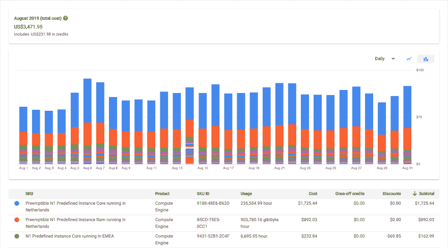

# 花费数千英镑的错误(库伯内特，GKE)

> 原文：<https://dev.to/gajus/mistake-that-cost-thousands-kubernetes-gke-46ij>

不夸张，很不幸。作为免责声明，我要补充一点，这是一个非常愚蠢的错误，表明我缺乏管理自动伸缩部署的经验。然而，这一切都是从一个没有答案的问题开始的，我觉得有必要分享我的学习，以帮助其他人避免类似的陷阱。

> 使用 100 个`n1-standard-1` (1 个 vCPU)虚拟机的 Kubernetes 集群与使用 1 个`n1-standard-96` (vCPU 96)或 6 个`n1-standard-16`虚拟机(vCPU 16)的 Kubernetes 集群有什么区别？

这个问题我在 Kubernetes 社区问了好多次。没有人提出答案。如果你不确定答案，那么从我的经历中你可以学到一些东西(或者跳到不耐烦的地方回答)。这是这样的:

## 前提

我半夜醒来，下定决心要降低我们的基础设施成本。

我们正在运行一个大型 Kubernetes 集群。“大”当然是相对的。在我们的案例中，正常工作时间有 600 个 vCPUs。这个数字在高峰时段会翻倍，在夜间的某些时段会接近 0。

上个月的发票是 3500 美元。

[](https://res.cloudinary.com/practicaldev/image/fetch/s--PD1qHsec--/c_limit%2Cf_auto%2Cfl_progressive%2Cq_auto%2Cw_880/https://thepracticaldev.s3.amazonaws.com/i/2372ghbuifyyeh2u2n7z.png)

考虑到我们的计算能力，这已经很不错了，谷歌 Kubernetes 引擎(GKE)让成本管理变得非常简单:

*   我们使用最便宜的数据中心(`europe-west2`(伦敦)比`europe-west4`(荷兰)贵大约 15%)
*   我们针对不同的部署使用不同的机器类型(内存密集型与 CPU 密集型)
*   我们使用水平机架自动扩展(HPA)和自定义指标来扩展部署
*   我们使用集群自动缩放器([https://cloud . Google . com/kubernetes-engine/docs/concepts/cluster-auto scaler](https://cloud.google.com/kubernetes-engine/docs/concepts/cluster-autoscaler))来缩放节点池
*   我们使用[可抢占的虚拟机](https://cloud.google.com/preemptible-vms/)

使用独占的虚拟机使我们能够保持低成本。为了说明节省，在`europe-west4`中托管的`n1-standard-1`机器类型的情况下，专用虚拟机和可抢占虚拟机之间的差异是 26.73 美元/月和 8.03 美元/月。成本降低了 3.25 倍。当然，可抢占的虚拟机有它们的[限制](https://cloud.google.com/compute/docs/instances/preemptible#limitations)，你需要熟悉并应对，但这是一个完全不同的话题。

具备了以上所有条件，我们似乎做了所有正确的事情来保持低成本。然而，我总有一种挥之不去的感觉，好像有什么不对劲。

# 主要红旗🚩

关于那种挥之不去的感觉:

每个节点的平均 CPU 使用率较低(10%-20%)。这似乎不对。

我的第一个想法是我错误配置了[计算资源](https://kubernetes.io/docs/concepts/configuration/manage-compute-resources-container/)。需要什么资源完全取决于你正在运行的程序。因此，最好的做法是在没有资源限制的情况下部署您的程序，观察您的程序在空闲/正常和峰值负载期间的行为，并根据观察到的值设置请求/限制的资源。

我将通过一个单一部署“admdesl”的例子来说明我的错误。

在我们的例子中，资源需求是零星的:

```
NAME                       CPU(cores)   MEMORY(bytes)
admdesl-5fcfbb5544-lq7wc   3m           112Mi
admdesl-5fcfbb5544-mfsvf   3m           118Mi
admdesl-5fcfbb5544-nj49v   4m           107Mi
admdesl-5fcfbb5544-nkvk9   3m           103Mi
admdesl-5fcfbb5544-nxbrd   3m           117Mi
admdesl-5fcfbb5544-pb726   3m           98Mi
admdesl-5fcfbb5544-rhhgn   83m          119Mi
admdesl-5fcfbb5544-rhp76   2m           105Mi
admdesl-5fcfbb5544-scqgq   4m           117Mi
admdesl-5fcfbb5544-tn556   49m          101Mi
admdesl-5fcfbb5544-tngv4   2m           135Mi
admdesl-5fcfbb5544-vcmjm   22m          106Mi
admdesl-5fcfbb5544-w9dsv   180m         100Mi
admdesl-5fcfbb5544-whwtk   3m           103Mi
admdesl-5fcfbb5544-wjnnk   132m         110Mi
admdesl-5fcfbb5544-xrrvt   4m           124Mi
admdesl-5fcfbb5544-zhbqw   4m           112Mi
admdesl-5fcfbb5544-zs75s   144m         103Mi 
```

<svg width="20px" height="20px" viewBox="0 0 24 24" class="highlight-action crayons-icon highlight-action--fullscreen-on"><title>Enter fullscreen mode</title></svg> <svg width="20px" height="20px" viewBox="0 0 24 24" class="highlight-action crayons-icon highlight-action--fullscreen-off"><title>Exit fullscreen mode</title></svg>

平均 5m 的 pod 是“空闲的”:在队列中有一个任务等待它们处理，但是我们在继续之前等待一些(外部)条件清除。在这种特殊部署的情况下，这些 pod 将每分钟在空闲/活动状态之间转换多次，并且 70%以上处于空闲状态。

一分钟后，同一套豆荚看起来会有所不同:

```
NAME                       CPU(cores)   MEMORY(bytes)
admdesl-5fcfbb5544-lq7wc   152m         107Mi
admdesl-5fcfbb5544-mfsvf   49m          102Mi
admdesl-5fcfbb5544-nj49v   151m         116Mi
admdesl-5fcfbb5544-nkvk9   105m         100Mi
admdesl-5fcfbb5544-nxbrd   160m         119Mi
admdesl-5fcfbb5544-pb726   6m           103Mi
admdesl-5fcfbb5544-rhhgn   20m          109Mi
admdesl-5fcfbb5544-rhp76   110m         103Mi
admdesl-5fcfbb5544-scqgq   13m          120Mi
admdesl-5fcfbb5544-tn556   131m         115Mi
admdesl-5fcfbb5544-tngv4   52m          113Mi
admdesl-5fcfbb5544-vcmjm   102m         104Mi
admdesl-5fcfbb5544-w9dsv   18m          125Mi
admdesl-5fcfbb5544-whwtk   173m         122Mi
admdesl-5fcfbb5544-wjnnk   31m          110Mi
admdesl-5fcfbb5544-xrrvt   91m          126Mi
admdesl-5fcfbb5544-zhbqw   49m          107Mi
admdesl-5fcfbb5544-zs75s   87m          148Mi 
```

<svg width="20px" height="20px" viewBox="0 0 24 24" class="highlight-action crayons-icon highlight-action--fullscreen-on"><title>Enter fullscreen mode</title></svg> <svg width="20px" height="20px" viewBox="0 0 24 24" class="highlight-action crayons-icon highlight-action--fullscreen-off"><title>Exit fullscreen mode</title></svg>

看着上面的内容，我认为使用如下配置是有意义的:

```
resources:
  requests:
    memory: '150Mi'
    cpu: '20m'
  limits:
    memory: '250Mi'
    cpu: '200m' 
```

<svg width="20px" height="20px" viewBox="0 0 24 24" class="highlight-action crayons-icon highlight-action--fullscreen-on"><title>Enter fullscreen mode</title></svg> <svg width="20px" height="20px" viewBox="0 0 24 24" class="highlight-action crayons-icon highlight-action--fullscreen-off"><title>Exit fullscreen mode</title></svg>

这翻译成:

*   闲置吊舱消耗不超过 20m
*   活跃(健康)的豆荚在 200 米处达到峰值

然而，当我使用这种配置时，它使部署变得非常繁忙。

```
admdesl-78fc6f5fc9-xftgr  0/1    Terminating                3         21m
admdesl-78fc6f5fc9-xgbcq  0/1    Init:CreateContainerError  0         10m
admdesl-78fc6f5fc9-xhfmh  0/1    Init:CreateContainerError  1         9m44s
admdesl-78fc6f5fc9-xjf4r  0/1    Init:CreateContainerError  0         10m
admdesl-78fc6f5fc9-xkcfw  0/1    Terminating                0         20m
admdesl-78fc6f5fc9-xksc9  0/1    Init:0/1                   0         10m
admdesl-78fc6f5fc9-xktzq  1/1    Running                    0         10m
admdesl-78fc6f5fc9-xkwmw  0/1    Init:CreateContainerError  0         9m43s
admdesl-78fc6f5fc9-xm8pt  0/1    Init:0/1                   0         10m
admdesl-78fc6f5fc9-xmhpn  0/1    CreateContainerError       0         8m56s
admdesl-78fc6f5fc9-xn25n  0/1    Init:0/1                   0         9m6s
admdesl-78fc6f5fc9-xnv4c  0/1    Terminating                0         20m
admdesl-78fc6f5fc9-xp8tf  0/1    Init:0/1                   0         10m
admdesl-78fc6f5fc9-xpc2h  0/1    Init:0/1                   0         10m
admdesl-78fc6f5fc9-xpdhr  0/1    Terminating                0         131m
admdesl-78fc6f5fc9-xqflf  0/1    CreateContainerError       0         10m
admdesl-78fc6f5fc9-xrqjv  1/1    Running                    0         10m
admdesl-78fc6f5fc9-xrrwx  0/1    Terminating                0         21m
admdesl-78fc6f5fc9-xs79k  0/1    Terminating                0         21m 
```

<svg width="20px" height="20px" viewBox="0 0 24 24" class="highlight-action crayons-icon highlight-action--fullscreen-on"><title>Enter fullscreen mode</title></svg> <svg width="20px" height="20px" viewBox="0 0 24 24" class="highlight-action crayons-icon highlight-action--fullscreen-off"><title>Exit fullscreen mode</title></svg>

每当一个新节点被引入/带出集群时，就会发生这种情况(由于自动扩展，这种情况经常发生)。

因此，我一直在增加请求的 pod 资源，直到我最终为这个部署提供了以下配置:

```
resources:
  requests:
    memory: '150Mi'
    cpu: '100m'
  limits:
    memory: '250Mi'
    cpu: '500m' 
```

<svg width="20px" height="20px" viewBox="0 0 24 24" class="highlight-action crayons-icon highlight-action--fullscreen-on"><title>Enter fullscreen mode</title></svg> <svg width="20px" height="20px" viewBox="0 0 24 24" class="highlight-action crayons-icon highlight-action--fullscreen-off"><title>Exit fullscreen mode</title></svg>

使用这种配置，集群可以平稳地运行，但是这意味着即使空闲的 Pods 也会被预先分配比它们需要的更多的 CPU 时间。这就是每个节点的平均 CPU 使用率低的原因。但是，我不知道解决方案是什么(减少请求的资源会导致繁忙的集群状态/停机)，因此我为所有部署提供了大量资源分配。

## 答案

回到我的问题:

> 使用 100 个`n1-standard-1` (1 个 vCPU)虚拟机的 Kubernetes 集群与使用 1 个`n1-standard-96` (vCPU 96)或 6 个`n1-standard-16`虚拟机(vCPU 16)的 Kubernetes 集群有什么区别？

首先，`n1-standard-1`和`n1-standard-96`之间没有每 vCPU 价格差异。因此，我认为使用 vCPUs 更少的机器可以让我更好地控制价格。

我考虑的另一个问题是集群自动扩展的速度，也就是说，如果突然激增，集群自动缩放器为未计划的单元配置新节点的速度有多快。不过这并不重要——我们的资源需求会逐渐增加和减少。

因此，我主要选择 1 个 vCPU 节点，其结果我已经在前提中描述过了。

回顾过去，这是一个明显的错误:在具有单个 vCPU 的节点之间分布 pod 不允许有效的资源利用，因为单个部署在空闲和活动状态之间变化。换句话说，同一台机器上的 vCPUs 越多，就可以越紧密地打包许多 pod，因为当一部分 pod 超过其所需配额时，就有现成的资源可供使用。

什么有效:

*   我改用 16 个 vCPU 机器，因为它们在自动扩展集群时提供了一个良好的资源控制平衡解决方案，并且每台机器都有足够的资源来实现对处于空闲/活动状态的 pod 的紧密调度。
*   我使用的资源配置只比空闲状态下需要的资源稍微多一点，但是有很大的限制。当大多数 pod 处于空闲状态时，它允许在同一台机器上调度许多 pod，但仍然允许资源密集型突发。
*   我换成了 [n2](https://cloud.google.com/compute/docs/machine-types#n2_machine_types) 机种:n2 机种更贵，但是有 2.8 GHz 的基频(相比之下`n1-*`机种可用~2.2 GHz)。我们正在利用更高的时钟频率来尽可能快地处理资源密集型任务，并尽可能快地将 pod 置于之前描述的空闲状态。

当前平均节点 vCPU 利用率高达 60%。这听起来差不多是对的。需要一些时间来总结有哪些节省。但是，今天我们使用的 vCPUs 还不到昨天同一时间的一半。