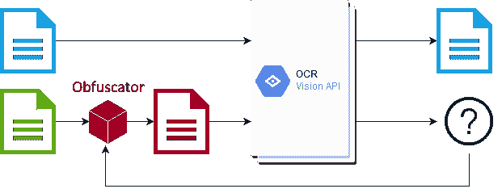
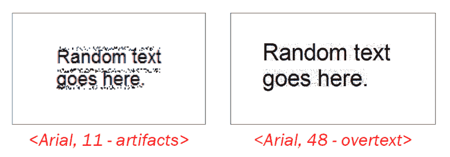
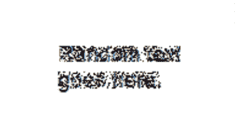
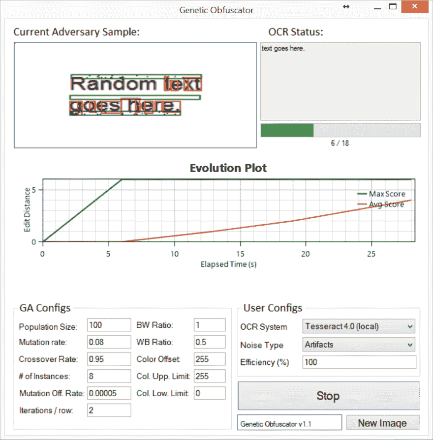
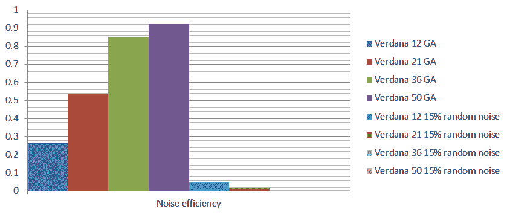

# 模糊宇宙魔方和云视觉:生成防 OCR 图像

> 原文:[https://dev . to/apex 95/fuzzing-tessera CT-cloud-vision-generating-ocr-proof-images-210 l](https://dev.to/apex95/fuzzing-tesseract-cloud-vision-generating-ocr-proof-images-210l)

在这篇文章中，我将讨论我的学士学位期末项目，该项目是关于评估当对立样本作为输入时 **OCR 系统**(如**宇宙魔方**或**谷歌的云视觉**)的鲁棒性。它在一个黑盒上，介于**模糊化**和**对立样本制作**之间。

这是一个老项目，我最近在帕多瓦大学主办的国际安全暑期学校上展示了这个项目。我决定也在这里发表，主要是因为在暑期学校发表时收到了积极的反馈。

我将试着把重点放在我认为感兴趣的方法和结果上，而不是深入实现细节。

##### 我在大约 1 年前发表了这篇文章——不确定它是否还像这里描述的那样有效。希望如此，但我很确定谷歌从那以后对视觉引擎进行了修改。

## 动机

让我们从我认为这个项目可能的用例以及它能够解决的问题开始。

*   **图像中包含的文字的保密性**？-对于我们来说，大型服务(就是你，谷歌)会扫描托管图像中的文本，以改善分类或提取用户信息，这并不奇怪。我们可能希望这些信息保持私密。

*   智能**验证码**？-这旨在通过创建人类更容易阅读的图像来提高验证码的效率，从而减少不适感，同时也使基于 OCR 的机器人无效。

*   防御**内容生成者**？-这可以作为一种防御机制，抵御扫描文档和重新发布内容(有时使用不同的名称)以获得不应得的价值的程序。

## 挑战

现在，让我们关注不同的限制和挑战:

### 1。复杂/闭源架构

T2】](https://res.cloudinary.com/practicaldev/image/fetch/s--L8cx-VOL--/c_limit%2Cf_auto%2Cfl_progressive%2Cq_auto%2Cw_880/https://codingvision.net/imgs/posts/evaluating-the-robustness-of-ocr-systems/tess-pipeline.png)

现代 OCR 系统比基本卷积神经网络更复杂，因为它们需要执行多种操作(例如:去歪斜、布局检测、文本行分割)，因此找到正确计算梯度的方法是一项艰巨的任务。此外，他们中的许多人不提供对源代码的访问，因此很难使用像 **FGSM** 或 **GAN** s 这样的技术

### 2。二值化

[T2】](https://res.cloudinary.com/practicaldev/image/fetch/s--NO17VPhA--/c_limit%2Cf_auto%2Cfl_progressive%2Cq_auto%2Cw_880/https://codingvision.net/imgs/posts/evaluating-the-robustness-of-ocr-systems/binarization.png)

OCR 系统通常在通过主分类器之前对图像应用二值化过程(例如: **Otsu** 的方法),以便将文本从背景中分离出来，理想的输出是干净的白色背景上的纯黑色文本。

这被证明是麻烦的，因为它限制了样本生成器使用小的值来改变像素:例如，将黑色像素转换为浅灰色将在二值化过程中被还原，因此不生成反馈。

### 3。适应性分类

[T2】](https://res.cloudinary.com/practicaldev/image/fetch/s--lhxycglD--/c_limit%2Cf_auto%2Cfl_progressive%2Cq_auto%2Cw_880/https://codingvision.net/imgs/posts/evaluating-the-robustness-of-ocr-systems/adaptive-classifier.png)

这是特定于 Tesseract 的，它现在已经被弃用了——尽管仍然非常流行。现代分类器可能也在使用这种方法。它包括对相同的输入图像执行 2 次迭代。在第一遍中，可以以一定置信度识别的字符被选择并用作临时训练数据。在第二遍中，OCR 尝试对在第一次迭代中未被识别的字符进行分类，但是使用它先前学习的内容。

考虑到这一点，一次改变一个字符的对抗性生成器可能不会像预期的那样工作，因为该字符可能会出现在图像的后面。

### 4。低熵

这指的是输入数据对于 OCR 系统来说相当“有限”的事实...比方说物体识别。例如，包含 3D 对象的图像比包含字符的图像具有更大的差异，因为字符具有相当固定的形状和格式。这将使得在不应用扭曲的情况下为字符分类器创建对立样本变得更加困难。

一个直接的结果是，它极大地限制了可以添加到图像中的噪声量，从而保持了可读性。

[T2】](https://res.cloudinary.com/practicaldev/image/fetch/s---I7UC78h--/c_limit%2Cf_auto%2Cfl_progressive%2Cq_auto%2Cw_880/https://codingvision.net/imgs/posts/evaluating-the-robustness-of-ocr-systems/noise-readability.png)

### 5。字典

OCR 系统将尝试通过使用带有预定义单词的词典来提高其准确性。在这种情况下，改变单词中的单个字符(即:增量方法)可能无效。

## 有针对性的 OCR 系统

[T2】](https://res.cloudinary.com/practicaldev/image/fetch/s--W5lp5sN9--/c_limit%2Cf_auto%2Cfl_progressive%2Cq_auto%2Cw_880/https://codingvision.net/imgs/posts/evaluating-the-robustness-of-ocr-systems/tesseract-gocr.png)

对于这个项目，我使用 **Tesseract 4.0** 进行原型开发和测试，因为它没有时间限制，允许我以高吞吐量运行快速的并行模型，这样我就可以测试实现是否如预期那样工作。后来，我搬到了**谷歌的云视觉 OCR** ，并尝试通过 API 进行一些“远程”模糊处理。

## 方法论

[T2】](https://res.cloudinary.com/practicaldev/image/fetch/s--Q1GnRCHr--/c_limit%2Cf_auto%2Cfl_progressive%2Cq_auto%2Cw_880/https://codingvision.net/imgs/posts/evaluating-the-robustness-of-ocr-systems/architecture.png)

为了能够涵盖甚至是黑盒的情况，我使用了由目标 OCR 系统的反馈引导的**遗传算法**。我们观察到，单独的分类器的置信度对于这个问题来说不是一个好的度量，采用了基于 [Levenshtein 距离](https://en.wikipedia.org/wiki/Levenshtein_distance)和**噪声量**的评分函数。

这里的一个主要问题是搜索空间的大小，通过识别图像中感兴趣的区域并只关注这些区域，可以部分解决这个问题。此外，还有许多参数调整...

## 噪声属性

给定约束，噪声模型的以下属性必须匹配:

*   **高对比度** -因此它绕过二值化过程并产生反馈
*   **低密度** -通过利用人类视觉的自然**低过滤**能力来保持可读性

以一种聪明的方式应用**椒盐噪声**将有望满足约束条件。

## 工作模式

[T2】](https://res.cloudinary.com/practicaldev/image/fetch/s--CWftqyjE--/c_limit%2Cf_auto%2Cfl_progressive%2Cq_auto%2Cw_880/https://codingvision.net/imgs/posts/evaluating-the-robustness-of-ocr-systems/modes.png)

最初，该算法仅使用 **overtext** 模式工作，该模式在包含字符的矩形中应用噪声。但是，对于使用较小字符书写的文本，这种方法并不是最佳选择，主要是因为可以改变的像素较少，因此即使有少量的噪声，可读性也会大大降低。对于这种特殊情况，为了保留原始字符，决定在文本行之间插入噪声(**工件**)。这两种方法在对目标 OCR 系统隐藏文本方面表现出相似的成功率。

只是为了好玩，下面是如果 score 函数反转会发生什么，翻译过来就是“生成一个尽可能多的噪声，但可以被 OCR 软件读取的图像”。很奇怪，但还是被认出来了...

[T2】](https://res.cloudinary.com/practicaldev/image/fetch/s--X6GSm-n---/c_limit%2Cf_auto%2Cfl_progressive%2Cq_auto%2Cw_880/https://codingvision.net/imgs/posts/evaluating-the-robustness-of-ocr-systems/inverted-function.png)

## 对宇宙魔方的结果

在对 Tesseract 4.0 进行测试时，取得了令人鼓舞的结果。下图显示了一个早期(非最终)样本，其中单词“ **Random** 不被 Tesseract 识别:

[T2】](https://res.cloudinary.com/practicaldev/image/fetch/s--UI1tyyM0--/c_limit%2Cf_auto%2Cfl_progressive%2Cq_auto%2Cw_880/https://codingvision.net/imgs/posts/evaluating-the-robustness-of-ocr-systems/tess-results-ui.png)

## 在谷歌的云视觉平台上测试

这就是事情变得有趣的地方。

##### 实现的分数函数可以通过两种方式最大化:隐藏字符或欺骗 OCR 引擎添加不应该出现的字符。

其中一个样本设法在**谷歌的云视觉 OCR** 的识别过程中创建了一个**循环**，基本上多次识别出同一文本。没有 **DoS** 或任何东西(或者我不知道)，我仍然不确定循环是否持续——它要么产生了少量的迭代，失败(超时？)或者他们有负载平衡器来对此进行补偿，并使用不同的实例。

[T2】](https://res.cloudinary.com/practicaldev/image/fetch/s--Z1p1CJmX--/c_limit%2Cf_auto%2Cfl_progressive%2Cq_auto%2Cw_880/https://codingvision.net/imgs/posts/evaluating-the-robustness-of-ocr-systems/cloud_ocr_bug.png)

让我们仔细看看这个样本:在下面，你可以看到这个对抗性的样本是如何被谷歌的云视觉 OCR 系统解读的。图像通过[“尝试 API”](https://cloud.google.com/vision/)选项直接提交到云视觉平台，因此在测试时，结果可以轻松重现。
T3T5】

还有“无聊”的情况下人物被隐藏:

## 结论

它工作了，但是项目达到了它的目标，不再开发了。似乎很难创建适用于所有 OCR 系统的样本(**一般化**)。

此外，样本在 OCR 管道中的**预处理**阶段容易发生变化，例如:

*   噪声过滤(例如:中值过滤器)
*   压缩技术(例如:傅立叶压缩)
*   向下扩展->向上扩展(例如:自动编码器)

然而，我们可以得出结论，使用这种方法，在不使文本难以阅读的情况下屏蔽小字符更具挑战性。我整理了下面这张图，在图中进行了比较:算法生成的图像(低于 **7%** 噪声密度)和一组含有随机噪声的图像( **15%** 噪声密度)。这两组包含不同的图像，字符大小为:12、21、36、50。每个随机噪声集包含 62 个样本，每种大小都使用平均值。

**噪声效率**通过考虑图像中的 **Levenshtein 距离**和总的**噪声量**来计算。

[T2】](https://res.cloudinary.com/practicaldev/image/fetch/s--ZvCqaSuc--/c_limit%2Cf_auto%2Cfl_progressive%2Cq_auto%2Cw_880/https://codingvision.net/imgs/posts/evaluating-the-robustness-of-ocr-systems/noise-eff-cloudocr.png)

## 有趣的待办事项

*   从样本中提取模板并训练生成器？
*   直接利用行分段特性？
*   攻击大津的二值化方法？

也许有一天...