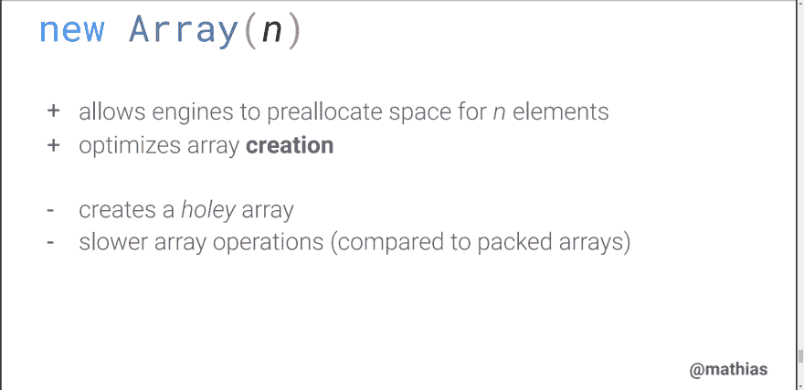

# 编写 JavaScript 的另一种方式

> 原文：<https://dev.to/zeyadetman/another-way-to-write-your-javascript-nch>

[最初发表在我的博客上](https://zeyadetman.github.io/blog/posts/Another-way-to-write-your-JavaScript/)

大家好，在这篇文章中，我将与大家分享一些前端代码，我们可以用另一种方式来编写它，
一切都很好，没有违反规则或在代码中添加气味，很酷。

## 1。生成一个序列号数组`[1, 2, 3, ...., n]`

如果我们想生成一个像这样的数组`[1, 2, 3, 4, 5, 6, ...., n]`，我们可以用`new Array()`和
[`Array.fill()`](https://developer.mozilla.org/en-US/docs/Web/JavaScript/Reference/Global_Objects/Array/fill) 来写代码，所以它就是

```
const N = 10;
new Array(N).fill().map((_, indx) => indx + 1); // [1, 2, 3, 4, 5, 6, 7, 8, 9, 10] 
```

Enter fullscreen mode Exit fullscreen mode

[***为什么`new Array(N).map()`不起作用？***](https://docs.google.com/document/d/1FBxDuUJmUt_udO9ofJGXF4GAM2ZoiWI-PTEeq9Gbf1w/edit#heading=h.yf7gjfvrq7gx)

酷，但是如果我们正在处理一个大的序列数数组，这种方法是最好的吗？
嗯，不！因为`new Array()`创建了[一个多孔数组](https://v8.dev/blog/elements-kinds)
，它比[打包数组](https://v8.dev/blog/elements-kinds)要慢。所以我们可以避免这种情况，用 [`Array.from()`](https://developer.mozilla.org/en-US/docs/Web/JavaScript/Reference/Global_Objects/Array/from)
重写这个方法
，这样代码就是

```
const N = 10;
Array.from({ length: N }, (_, indx) => indx + 1); // [1, 2, 3, 4, 5, 6, 7, 8, 9, 10] 
```

Enter fullscreen mode Exit fullscreen mode

[](https://res.cloudinary.com/practicaldev/image/fetch/s--6N1_uUBe--/c_limit%2Cf_auto%2Cfl_progressive%2Cq_auto%2Cw_880/https://i.imgur.com/UWkajiz.png) 
来源:  [https://slidrio-decks . global . SSL . fastly . net/1259/original . pdf？1521622174](https://slidrio-decks.global.ssl.fastly.net/1259/original.pdf?1521622174)
幻灯片:102

你可以在你的 Chrome 控制台中检查多孔数组，所以如果我们写这个`new Array(10)`，你的控制台将显示
`[empty × 10]`，这是一个空值数组。

更多资源:

1.  [https://v8.dev/blog/elements-kinds](https://v8.dev/blog/elements-kinds)
2.  [https://stack overflow . com/questions/3746725/how-to-create-a-array-containing-1-n](https://stackoverflow.com/questions/3746725/how-to-create-an-array-containing-1-n)

## 2。数字格式

有时你想用特定的货币`EGP 1000`或某种大小的东西`50 kB`来写一个钱，其中一种写法是
，简单来说就是`const money = '1000 EGP'`。但是使用 [`Intl.NumberFormat`](https://developer.mozilla.org/en-US/docs/Web/JavaScript/Reference/Global_Objects/NumberFormat) 编写格式化数字有一种更好的方式。所以这个字符串将会是

```
const money = new Intl.NumberFormat("en", {
  style: "currency",
  currency: "EGP",
  useGrouping: false,
  maximumSignificantDigits: 1
}).format(1000);
// "EGP 1000"

const storage = new Intl.NumberFormat("en", {
  style: "unit",
  unit: "kilobyte"
}).format(50);
// "50 kB" 
```

Enter fullscreen mode Exit fullscreen mode

*注:style `units`在 chrome 77+上工作，可以用 babel 编译。*

这太酷了，如果你在多种语言环境下工作，想以一种更好的完全定制的方式在它们之间切换。来自 V8 博客的更多信息。数字格式

## 3。在焦点上设计非交互元素的样式

没有`tabindex`和根据 [MDN](https://developer.mozilla.org/en-US/docs/Web/HTML/Global_attributes/tabindex#Accessibility_concerns) ，你不能使用 css/html 来做这件事:

> 避免将`tabindex`属性与非交互内容结合使用，以使键盘输入的内容具有交互焦点。一个例子是使用一个`<div>`元素来描述一个按钮，而不是`<button>`元素。

[和 w3 表示:](https://www.w3.org/TR/html401/interact/forms.html#adef-tabindex)

> 应该使用交互元素(`<a>`、`<button>`、`<details>`、`<input>`、`<select>`、`<textarea>`等)对内容进行语义描述。)反而。

所以最好的做法是在`JavaScript`中使用`addEventListener()`，但是如果你想使用`tabindex`，不要忘记在内部 html 内容中添加`tabindex`。

### 别解

如果你只是想改变`div`的边框，你不必使用`tabindex`。
您可以使用`:focus-within`，只需更改边框即可。

```
.search-box {
  margin-left: 1%;
  outline: red;
  border: 1px solid #fc3;
}

.search-input {
  border: none;
}

.search-input:focus {
  outline: none;
}

.search-box:focus-within {
  border: 2px solid #53c9fc;
} 
```

Enter fullscreen mode Exit fullscreen mode

```
<div class="search-box">
  <Row>
    <div class="search-box-icon"></div>
    <input class="search-input" placeholder="search in listbox" />
  </Row>
</div> 
```

Enter fullscreen mode Exit fullscreen mode

[*我在 stackoverflow*](https://stackoverflow.com/a/55087153/5721245) 上发表了这个作为回答

最后，我相信我们每个人都有写代码的风格，他最喜欢的做法是不违反规则，或者在代码中加入味道。