# Quasar - Utility Belt 应用程序扩展，加速 SSR 和离线优先应用程序的开发。

> 原文：<https://dev.to/tobymosque/quasar-utility-belt-app-extension-to-speedup-the-development-of-ssr-and-offline-first-apps-175h>

# 目录

*   [1 简介](#1-introduction)
*   [2 安装](#2-installing)
*   [3 个小时](#3-timer)
    *   [3.1 睡眠](#31-sleep)
*   [4 UUID](#4-uuid)
    *   [4.1 梳子](#41-comb)
        *   [4.1.1 参数](#411-parameters)
    *   [4.2 提取日期](#42-extractdate)
        *   [4.2.1 参数](#421-parameters)
    *   [4.3 演示](#43-demos)
        *   [4.3.1 基本用法](#431-basic-usage)
        *   [4.3.2 分类](#432-sorting)
*   [5 号店](#5-store)
    *   [5.1 地图存储突变](#51-mapstoremutations)
        *   [5.1.1 参数](#511-parameters)
        *   [5.1.2 演示](#512-demos)
        *   [5.1.2.1 基本用法](#5121-basic-usage)
    *   [5.2 mapStoreCollections](#52-mapsStorecollections)
        *   [5.2.1 参数](#521-parameters)
        *   [5.2.1.1 收藏信息对象](#5211-collection-info-object)
        *   [5.2.2 演示](#522-demos)
        *   [5.2.2.1 基本用法](#5221-basic-usage)
        *   [5.2.3 没有助手的场景](#523-scenario-without-the-helper)
    *   [5.3 地图状态](#53-mapstate)
        *   [5.3.1 参数](#531-parameters)
        *   [5.3.2 演示](#532-demos)
        *   [5.3.2.1 基本用法](#5321-basic-usage)
*   [6 家工厂](#6-factories)
    *   [6.1 组件](#61-component)
        *   [6.1.1 参数](#611-parameters)
        *   [6.1.1.1 期权](#6111-options)
        *   6.1.2 演示
        *   [6.1.2.1 基本用法](#6121-basic-usage)
        *   [6.1.2.2 更可重用](#6122-more-reusable)
    *   [6.2 商店](#62-store)
        *   [6.2.1 参数](#621-parameters)
        *   [6.2.1.1 期权](#6211-options)
        *   6.2.2 演示
        *   [6.2.2.1 基本用法](#6221-basic-usage)
    *   [6.3 页](#63-page)
        *   [6.3.1 参数](#631-parameters)
        *   [6.3.1.1 期权](#6311-options)
        *   6.3.2 演示
        *   [6.3.2.1 基本用法](#6321-basic-usage)
    *   [6.4 页面和存储](#64-page-and-store)
        *   6.4.1 演示
        *   [6.4.1.1 基本用法](#6411-basic-usage)

## 1 简介

我开发了一个小的应用程序扩展，目标是加速 SSR 和离线优先应用程序的开发/原型。我会试着解释所有的助手，如何使用它们，以及它们试图解决什么问题。

## 2 安装

```
quasar ext add "@toby.mosque/utils" 
```

记住，完整的包名是`@toby.mosque/quasar-app-extension-utils`，但是为了方便，扩展会将`@toby.mosque/utils`注册为`@toby.mosque/quasar-app-extension-utils/src/utils`的别名。

## 3 个小时

### 3.1 睡眠

`time.sleep`简单到:

```
export default function (delay) {
  return new Promise(resolve => setTimeout(resolve, delay))
} 
```

目标是使开发人员能够暂停一个异步方法一段时间。

```
import { timer } from '@toby.mosque/utils'

const timestamp = function (date) {
  date = date || new Date()
  return JSON.stringify({ time: date.getTime(), iso: date.toISOString() })
}

export default async (context) => {
  console.log('start: ', timestamp())
  await timer.sleep(5000)
  console.log('end: ', timestamp())
} 
```

输出:

```
start:  {"time":1567290656567,"iso":"2019-08-31T22:30:56.567Z"}
end:    {"time":1567290661570,"iso":"2019-08-31T22:31:01.570Z"} 
```

## 4 UUID

当您使用 UUID/GUID 作为主键时，一个常见的问题是您的记录/文档的插入顺序变得不可预测，这可能会降低新记录/文档的插入速度，甚至会使`order by id`成为 UX 的一个问题，因为记录/文档看起来好像被打乱了。

### 4.1 梳子

`comb`方法受到 C# lib [RT.Comb](https://github.com/richardtallent/RT.Comb) 的启发，但是我只实现了`Postgre`提供程序，它用当前日期替换 UUID 的前 6 个字节。

#### 4.1.1 参数

| 命令 | 名字 | 需要 | 系统默认值 | 描述 |
| --- | --- | --- | --- | --- |
| one | 日期 | 错误的 | 新日期() | 用于创建梳子的日期 |

### 4.2 提取日期

`extractDate`方法允许开发人员检索用于创建梳子的日期。

#### 4.2.1 参数

| 命令 | 名字 | 需要 | 系统默认值 | 描述 |
| --- | --- | --- | --- | --- |
| one | 梳子 | 真实的 |  | 梳理以提取日期部分 |

### 4.3 演示

#### 4.3.1 基本用法

```
// import something here
import { uuid } from '@toby.mosque/utils'

// "async" is optional
export default async (context) => {
  let date = new Date(2019, 8, 1, 17, 25, 40, 123)
  let comba = uuid.comb()
  let combb = uuid.comb(date)
  console.log('comb a: ', comba)
  console.log('comb b: ', combb)
  console.log('date a: ', timestamp(uuid.extractDate(comba)))
  console.log('date b: ', timestamp(uuid.extractDate(combb)))
} 
```

输出

```
comb a:  016ce9d4-cb8f-4b88-b049-8569e9bec009
comb b:  016cee81-321b-f5ee-92ab-fdafda9612fe
date a:  {"time":1567291132815,"iso":"2019-08-31T22:38:52.815Z"}
date b:  {"time":1567369540123,"iso":"2019-09-01T20:25:40.123Z"} 
```

#### 4.3.2 排序

```
import { uuid, timer } from '@toby.mosque/utils'

// "async" is optional
export default async (context) => {
  let combs = []
  for (let i = 1; i <= 10; i++) {
    await timer.sleep(1)
    combs.push({ index: i, value: uuid.comb() })
  }

  combs.sort((a, b) => a.value > b.value ? 1 : -1)
  console.log('ascending:')
  for (let item of combs) {
    console.log(JSON.stringify(item))
  }
  combs.sort((a, b) => a.value < b.value ? 1 : -1)
  console.log('descending: ')
  for (let item of combs) {
    console.log(JSON.stringify(item))
  }
} 
```

输出

```
ascending:
{"index":1,"value":"016ce9dc-9422-be1b-d70f-8769fa62380c"}
{"index":2,"value":"016ce9dc-94e1-40e4-5a16-7db2c0fb109d"}
{"index":3,"value":"016ce9dc-94e3-1316-8633-23694b929895"}
{"index":4,"value":"016ce9dc-94e5-04e3-d043-2b147af04f19"}
{"index":5,"value":"016ce9dc-98ca-8307-1ea1-54a488a1195c"}
{"index":6,"value":"016ce9dc-9cb2-468b-23d6-3bbe47c70539"}
{"index":7,"value":"016ce9dc-a099-fc93-8edf-68f3c00b4fcc"}
{"index":8,"value":"016ce9dc-a482-5f80-b40d-a64b0e8a23a9"}
{"index":9,"value":"016ce9dc-a86a-d6c5-1359-ce0c7b9d053e"}
{"index":10,"value":"016ce9dc-abc4-7d81-e27b-9f1868a48be8"}
descending: 
{"index":10,"value":"016ce9dc-abc4-7d81-e27b-9f1868a48be8"}
{"index":9,"value":"016ce9dc-a86a-d6c5-1359-ce0c7b9d053e"}
{"index":8,"value":"016ce9dc-a482-5f80-b40d-a64b0e8a23a9"}
{"index":7,"value":"016ce9dc-a099-fc93-8edf-68f3c00b4fcc"}
{"index":6,"value":"016ce9dc-9cb2-468b-23d6-3bbe47c70539"}
{"index":5,"value":"016ce9dc-98ca-8307-1ea1-54a488a1195c"}
{"index":4,"value":"016ce9dc-94e5-04e3-d043-2b147af04f19"}
{"index":3,"value":"016ce9dc-94e3-1316-8633-23694b929895"}
{"index":2,"value":"016ce9dc-94e1-40e4-5a16-7db2c0fb109d"}
{"index":1,"value":"016ce9dc-9422-be1b-d70f-8769fa62380c"} 
```

## 5 店

如果你正在开发一个 SSR 或离线优先应用，你可能会过度使用 Vuex 模块；我知道，你没有太多的选择。因此，让我们试着使模块定义的一部分更加可重用。

### 5.1 mapStoreMutations

将所有类字段映射到一个类似突变的对象。

#### 5.1.1 参数

| 命令 | 名字 | 需要 | 系统默认值 | 描述 |
| --- | --- | --- | --- | --- |
| one | 模型 | 真实的 |  | 用于对突变对象建模的类 |

#### 5.1.2 演示

##### 5.1.2.1 基本用法

```
import { store } from '@toby.mosque/utils'
const { mapStoreMutations } = store

class Model {
  text = ''
  number = 0
  collection = []
}

const storeModule = {
  namespaced: true,
  state () {
    return new Model()
  },
  mutations: {
    ...mapStoreMutations(Model)
  }
}
console.log(storeModule)
export default storeModule
export { Model } 
```

预期产出

[](https://res.cloudinary.com/practicaldev/image/fetch/s--PIVEMCAI--/c_limit%2Cf_auto%2Cfl_progressive%2Cq_auto%2Cw_880/https://thepracticaldev.s3.amazonaws.com/i/z0e2vphbp4mo50u75d64.png)

#### 5.1.3 没有助手的场景

这是在不使用`mapStoreMutations`助手
的情况下创建上述模块所需的代码

```
const storeModule = {
  namespaced: true,
  state () {
    return {
      text: '',
      number: 0,
      collection: []
    }
  },
  mutations: {
    text (state, value) { state.text = value },
    number (state, value) { state.number = value },
    collection (state, value) { state.collection = value }
  }
}
console.log(storeModule)
export default storeModule 
```

### 5.2 mapStoreCollections

这里的目标是创建与数组字段相关的`mutations`(创建、更新、删除)、`actions`(更新、删除)和`getters`(索引、获取标识)。

#### 5.2.1 参数

| 命令 | 名字 | 需要 | 系统默认值 | 描述 |
| --- | --- | --- | --- | --- |
| one | 收集 | 真实的 |  | 描述您的集合的对象数组 |

#### 5.2.1.1 收藏信息对象

| 领域 | 需要 | 描述 |
| --- | --- | --- |
| 单一的 | 真实的 | 集合的单一形式(项目、人员、作业) |
| 复数 | 真实的 | 集合的复数形式(list、people、jobs)将与 state 中的相同 |
| 身份证明（identification） | 真实的 | 集合中对象的 id 字段的名称 |

#### 5.2.2 演示

##### 5.2.2.1 基本用法

```
import { store } from '@toby.mosque/utils'
const { mapStoreMutations, mapStoreCollections } = store

class Model {
  text = ''
  number = 0
  collection = []
}

const collection = mapStoreCollections([
  { single: 'item', plural: 'collection', id: 'id' }
])

const storeModule = {
  namespaced: true,
  state () {
    return new Model()
  },
  mutations: {
    ...mapStoreMutations(Model),
    ...collection.mutations
  },
  actions: {
    ...collection.actions
  },
  getters: {
    ...collection.getters
  }
}
console.log(storeModule)
export default storeModule
export { Model } 
```

预期产出

[](https://res.cloudinary.com/practicaldev/image/fetch/s--jWxvegxv--/c_limit%2Cf_auto%2Cfl_progressive%2Cq_auto%2Cw_880/https://thepracticaldev.s3.amazonaws.com/i/yvk78wwfreq4rl0ln0ek.png)

#### 5.2.3 无助手场景

这是在没有`mapStoreMutations`和`mapStoreCollections`助手
的帮助下创建上述模块所需要写的内容

```
import Vue from 'vue'

const storeModule = {
  namespaced: true,
  state () {
    return {
      text: '',
      number: 0,
      collection: []
    }
  },
  mutations: {
    text (state, value) { state.text = value },
    number (state, value) { state.number = value },
    collection (state, value) { state.collection = value },
    updateItem (state, { index, item }) { Vue.set(state.collection, index, item) },
    createItem (state, item) { state.collection.push(item) },
    deleteItem (state, index) { Vue.delete(state.collection, index) }
  },
  actions: {
    deleteItem ({ commit, getters }, id) {
      let index = getters.collectionIndex.get(id)
      if (index !== void 0) {
        commit('deleteItem', index)
      }
    },
    saveOrUpdateItem ({ commit, getters }, item) {
      let index = getters.collectionIndex.get(item.id)
      if (index !== void 0) {
        commit('updateItem', { index, item })
      } else {
        commit('createItem', item)
      }
    }
  },
  getters: {
    collectionIndex (state) {
      return state.collection.reduce((map, item, index) => {
        map.set(item.id, index)
        return map
      }, new Map())
    },
    itemById (state, getters) {
      return (id) => {
        let index = getters.collectionIndex.get(id)
        return index !== void 0 ? state.collection[index] : void 0
      }
    }
  }
}
console.log(storeModule)
export default storeModule 
```

### 5.3 mapState

我不知道您是否注意到了，但是我们的存储现在有了一个模式，其中状态字段和突变名称具有相同的名称，这是有原因的。

我们需要两者具有相同的名称，以便将它们映射到一个计算属性，确切地说，状态将被映射到一个`get`，而变异将被映射到一个`set`。

#### 5.3.1 参数

这些参数将非常类似于 Vuex mapState 的参数。

| 命令 | 名字 | 需要 | 系统默认值 | 描述 |
| --- | --- | --- | --- | --- |
| one | moduleName | 真实的 |  | 模块名称 |
| Two | 田地（复数）；场；域；字段 | 真实的 |  | 字段可以是字符串数组，也可以是一个对象，其中的键和值都是字符串。例如:`['text', number, 'list']`或`{ text: 'text', number: 'number', collection: 'list' }` |

#### 5.3.2 演示

##### 5.3.2.1 基本用法

```
import { store, uuid, timer } from '@toby.mosque/utils'
import { Model } from 'src/store/test'
import { mapActions, mapGetters } from 'vuex'
const { mapState } = store

export default {
  name: 'TestPage',
  computed: {
    ...mapState('test', Object.keys(new Model())),
    ...mapGetters('test', ['itemById'])
  },
  methods: {
    ...mapActions('test', ['saveOrUpdateItem', 'deleteItem']),
    remove (id) {
      let item = this.itemById(id)
      this.$q.dialog({
        parent: this,
        message: `delete ${item.index}:${item.date}?`
      }).onOk(() => {
        this.deleteItem(id)
      })
    }
  },
  async mounted () {
    this.text = 'Hello World'
    this.number = 123
    for (let i = 1; i <= 10; i++) {
      await timer.sleep(1)
      let comb = uuid.comb()
      this.saveOrUpdateItem({ id: comb, index: i, date: uuid.extract(comb).toISOString() })
    }
  }
} 
```

```
<template>
  <q-page class="q-pa-md q-gutter-y-md">
    <q-input type="text" v-model="text" />
    <q-input type="number" v-model.number="number" />
    <q-markup-table>
      <thead>
        <tr>
          <th class="text-left">Id</th>
          <th class="text-left">Index</th>
          <th class="text-left">Date</th>
          <th class="text-left">Actions</th>
        </tr>
      </thead>
      <tbody>
        <tr v-for="item in collection" :key="item.id">
          <td class="text-left">{{item.id}}</td>
          <td class="text-left">{{item.index}}</td>
          <td class="text-left">{{item.date}}</td>
          <td class="text-left">
            <q-btn icon="delete" label="Delete" @click="remove(item.id)" />
          </td>
        </tr>
      </tbody>
    </q-markup-table>
  </q-page>
</template>

<style>
</style>

<script src="./Index.vue.js">
</script> 
```

预期产出

安慰

[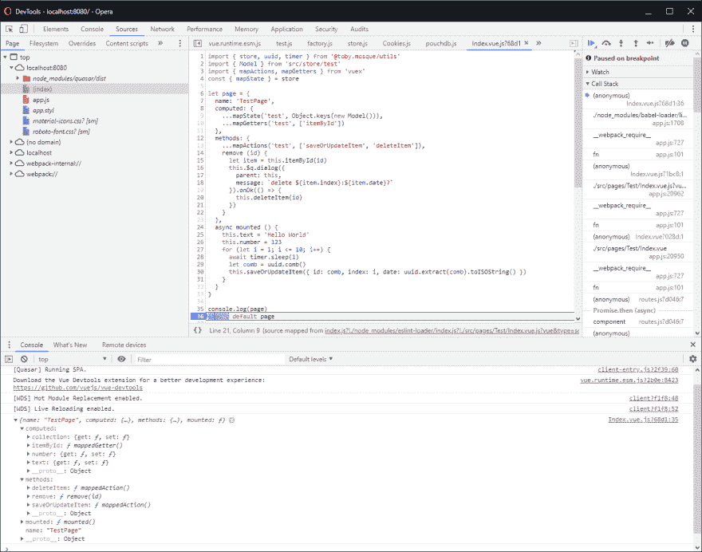](https://res.cloudinary.com/practicaldev/image/fetch/s--gwN0ayVs--/c_limit%2Cf_auto%2Cfl_progressive%2Cq_auto%2Cw_880/https://thepracticaldev.s3.amazonaws.com/i/43p1xsnr8lq4nd288u5x.png)

已安装页面

[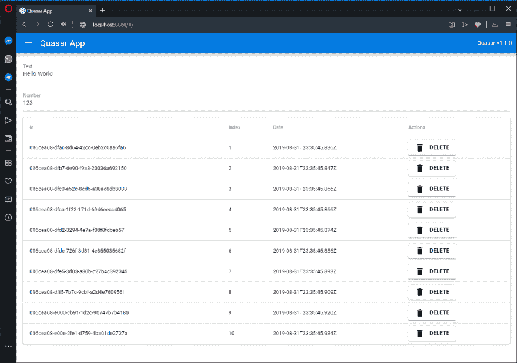](https://res.cloudinary.com/practicaldev/image/fetch/s--KEFss33g--/c_limit%2Cf_auto%2Cfl_progressive%2Cq_auto%2Cw_880/https://thepracticaldev.s3.amazonaws.com/i/fzuicamtqegakbom9jt3.png)

根据您的 id 获取记录/文档

[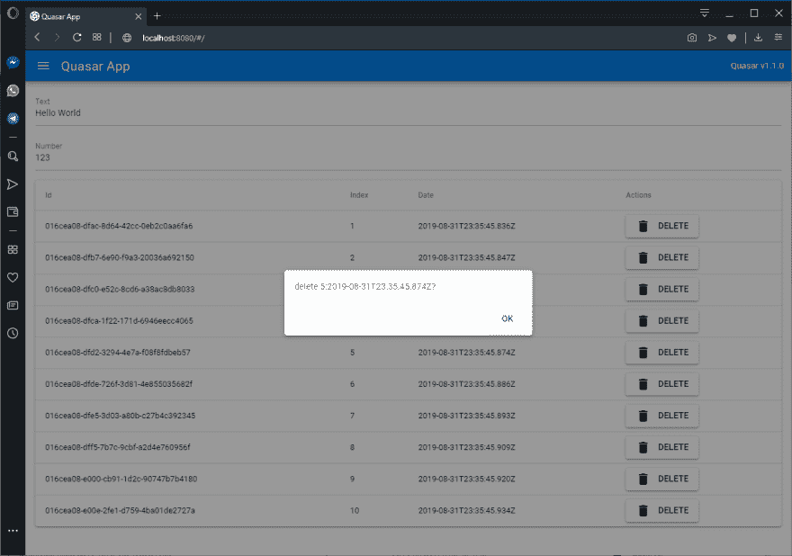](https://res.cloudinary.com/practicaldev/image/fetch/s--_VJY-em1--/c_limit%2Cf_auto%2Cfl_progressive%2Cq_auto%2Cw_880/https://thepracticaldev.s3.amazonaws.com/i/b3rjq2vfgqcvkx6r9j6d.png)

项目已移除

[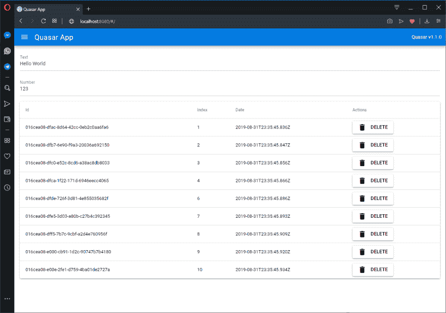](https://res.cloudinary.com/practicaldev/image/fetch/s--NtJClaEc--/c_limit%2Cf_auto%2Cfl_progressive%2Cq_auto%2Cw_880/https://thepracticaldev.s3.amazonaws.com/i/wvdx3a8reegqvsctqla4.png)

## 6 家工厂

这里的主要目标是包装组件或生成整个商店和/或页面。

### 6.1 组件

目标是包装其他组件，并允许开发人员在渲染时修改它们，甚至设置你的属性、插槽等。

#### 6.1.1 参数

| 命令 | 名字 | 需要 | 系统默认值 | 描述 |
| --- | --- | --- | --- | --- |
| one | 选择 | 真实的 |  | 用于生成组件的选项 |

##### 6.1.1.1 选项

| 领域 | 需要 | 描述 |
| --- | --- | --- |
| 名字 | 真实的 | 组件的名称 |
| 成分 | 真实的 | 要包装的组件 |
| 提供；给予 | 错误的 | 每次渲染组件时调用的回调函数:`render ({ self, options }) { }` |
| 提供；给予 | 错误的 | 组件准备返回时调用的回调函数:`setup({ component }) { }` |
| 工厂 | 错误的 | 具有渲染和/或设置字段的对象数组 |

#### 6.1.2 演示

##### 6.1.2.1 基本用法

我们将在 QInput 中注入 reverse 属性，当该属性被设置为`true`时，标签将被反转。除此之外，我们将设置黑暗和轮廓属性为真。QMarkupTable 也将黑暗属性改为`true`

```
// import something here
import { factory } from '@toby.mosque/utils'
import { QInput, QMarkupTable } from 'quasar'
const { component } = factory

// "async" is optional
export default async ({ Vue }) => {
  let input = component({
    name: QInput.options.name,
    component: QInput,
    // eslint-disable-next-line vue/require-render-return
    render ({ self, options }) {
      options.props.dark = true
      options.props.outlined = true
      if (options.props.label && options.props.reverse) {
        options.props.label = options.props.label.split('').reverse().join('')
      }
    },
    setup ({ component }) {
      component.props.reverse = Boolean
    }
  })

  let markupTable = component({
    name: QMarkupTable.options.name,
    component: QMarkupTable,
    // eslint-disable-next-line vue/require-render-return
    render ({ self, options }) {
      options.props.dark = true
    }
  })

  Vue.component('q-input', input)
  Vue.component('q-markup-table', markupTable)
} 
```

预期产出

```
<q-input type="text" label="Text" reverse v-model="text" />
<q-input type="number" label="Number" v-model.number="number" /> 
```

[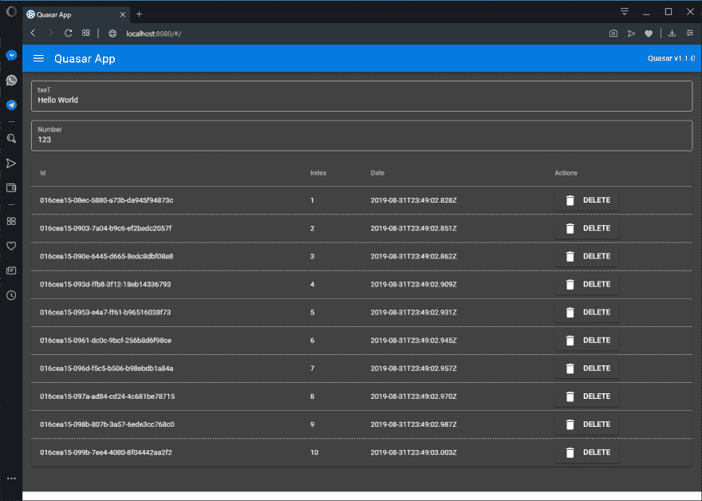](https://res.cloudinary.com/practicaldev/image/fetch/s--1-vtg5nv--/c_limit%2Cf_auto%2Cfl_progressive%2Cq_auto%2Cw_880/https://thepracticaldev.s3.amazonaws.com/i/qenz0ertiikaq4fbjl85.png)

##### 6.1.2.2 更可重用

好了，我们只有 2 个组件，而且已经有了很多样板文件。我们可以改进:

```
import { factory } from '@toby.mosque/utils'
import { QInput, QSelect, QField, QMarkupTable, QList, QItem } from 'quasar'
const { component } = factory
const factories = {}

factories.common = {
  render ({ self, options }) {
    options.props.dark = true
  }
}

factories.field = {
  render ({ self, options }) {
    options.props.outlined = true
    if (options.props.label && options.props.reverse) {
      options.props.label = options.props.label.split('').reverse().join('')
    }
  },
  setup ({ component }) {
    component.props.reverse = Boolean
  }
}

const fields = [
  { name: 'q-input', component: QInput },
  { name: 'q-select', component: QSelect },
  { name: 'q-field', component: QField }
]
const layout = [
  { name: 'q-markup-table', component: QMarkupTable },
  { name: 'q-list', component: QList },
  { name: 'q-item', component: QItem }
]

// "async" is optional
export default async ({ Vue }) => {
  for (let item of fields) {
    let branded = component({
      name: item.component.options.name,
      component: item.component,
      factories: [ factories.common, factories.field ]
    })
    Vue.component(item.name, branded)
  }

  for (let item of layout) {
    let branded = component({
      name: item.component.options.name,
      component: item.component,
      factories: [ factories.common ]
    })
    Vue.component(item.name, branded)
  }
} 
```

现在，我们正在更名`QInput`、`QSelect`、`QField`、`QMarkupTable`、`QList`和`QItem`

预期产出

[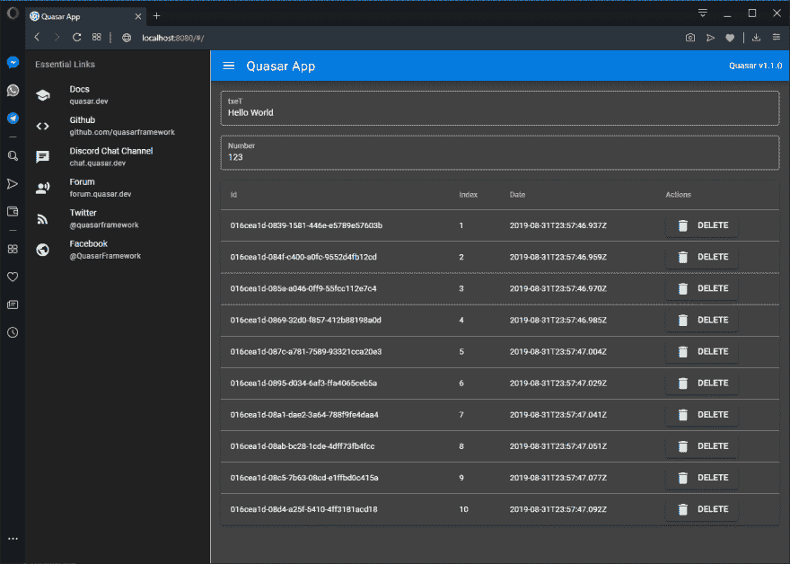](https://res.cloudinary.com/practicaldev/image/fetch/s--Ct9Tyv8a--/c_limit%2Cf_auto%2Cfl_progressive%2Cq_auto%2Cw_880/https://thepracticaldev.s3.amazonaws.com/i/eh8gelsgfhhr2ootjgu6.png)

### 6.2 商店

`factory.store`结合了`store.mapStoreMutations`和`store.mapStoreCollections`。

#### 6.2.1 参数

| 命令 | 名字 | 需要 | 系统默认值 | 描述 |
| --- | --- | --- | --- | --- |
| one | 选择 | 真实的 |  | 用于生成商店的选项 |
| Two | 状态 | 错误的 |  | 将被合并到最终模块中的模块状态 |
| three | 突变 | 错误的 |  | 模块的变化，将被合并到最终模块中 |
| four | 行动 | 错误的 |  | 模块的动作，将被合并到最终模块中 |
| five | 吸气剂 | 错误的 |  | 模块的 getters，它们将被合并到最终的模块中 |

##### 6.2.1.1 选项

| 领域 | 需要 | 描述 |
| --- | --- | --- |
| 模型 | 错误的 | 用于对状态和突变建模的类 |
| 收集 | 错误的 | 描述你的收藏的对象数组(更多细节见`store.mapStoreMutations`) |

#### 6.2.2 演示

##### 6.2.2.1 基本用法

```
import { factory } from '@toby.mosque/utils'
const { store } = factory

const options = {
  model: class Model {
    text = ''
    number = 0
    collection = []
  },
  collections: [
    { single: 'item', plural: 'collection', id: 'id' }
  ]
}

const storeModule = store({
  options
})
console.log(storeModule)
export default storeModule
export { options } 
```

预期产出

[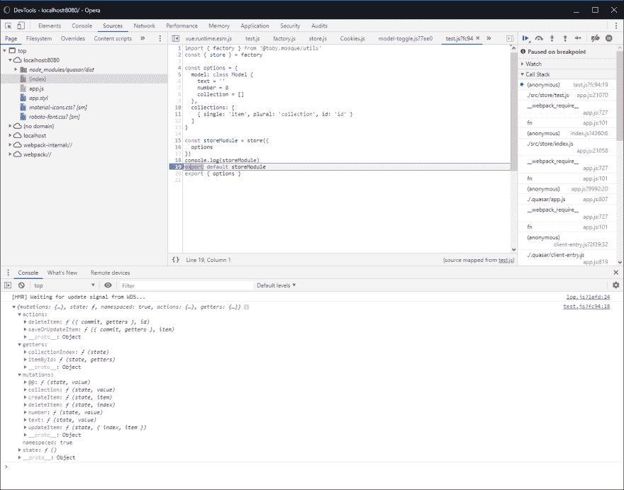](https://res.cloudinary.com/practicaldev/image/fetch/s--MG53u-_l--/c_limit%2Cf_auto%2Cfl_progressive%2Cq_auto%2Cw_880/https://thepracticaldev.s3.amazonaws.com/i/zdz57c0etwz171u9cf12.png)

### 6.3 页

`factory.page`将期待与`factory.store`相同的选项，并将由`factory.store`生成的`state`、`mutations`、`actions`和`getters`映射到页面。

#### 6.3.1 参数

| 命令 | 名字 | 需要 | 系统默认值 | 描述 |
| --- | --- | --- | --- | --- |
| one | 选择 | 真实的 |  | 用于生成页面的选项 |
| Two | moduleName | 真实的 |  | 模块的名称 |
| three | 存储模块 | 错误的 |  | 如果不为空，将在`preFetch`或`mounted`钩子中注册，并在`destroyed`钩子中删除。 |
| four | * | 错误的 |  | 任何其他属性将按原样复制到页面中 |

##### 6.3.1.1 选项

| 领域 | 需要 | 描述 |
| --- | --- | --- |
| 模型 | 错误的 | 用于对状态和突变建模的类 |
| 收集 | 错误的 | 描述你的收藏的对象数组(更多细节见`store.mapStoreMutations`) |

#### 6.3.2 演示

##### 6.3.2.1 基本用法

```
import { factory, uuid, timer } from '@toby.mosque/utils'
import { options } from 'src/store/test'
const { page } = factory

let testPage = page({
  name: 'TestPage',
  options,
  moduleName: 'test',
  methods: {
    remove (id) {
      let item = this.itemById(id)
      this.$q.dialog({
        parent: this,
        message: `delete ${item.index}:${item.date}?`
      }).onOk(() => {
        this.deleteItem(id)
      })
    }
  },
  async mounted () {
    this.text = 'Hello World'
    this.number = 123
    for (let i = 1; i <= 10; i++) {
      await timer.sleep(1)
      let comb = uuid.comb()
      this.saveOrUpdateItem({ id: comb, index: i, date: uuid.extract(comb).toISOString() })
    }
  }
})

console.log(testPage)
export default testPage 
```

预期产出

[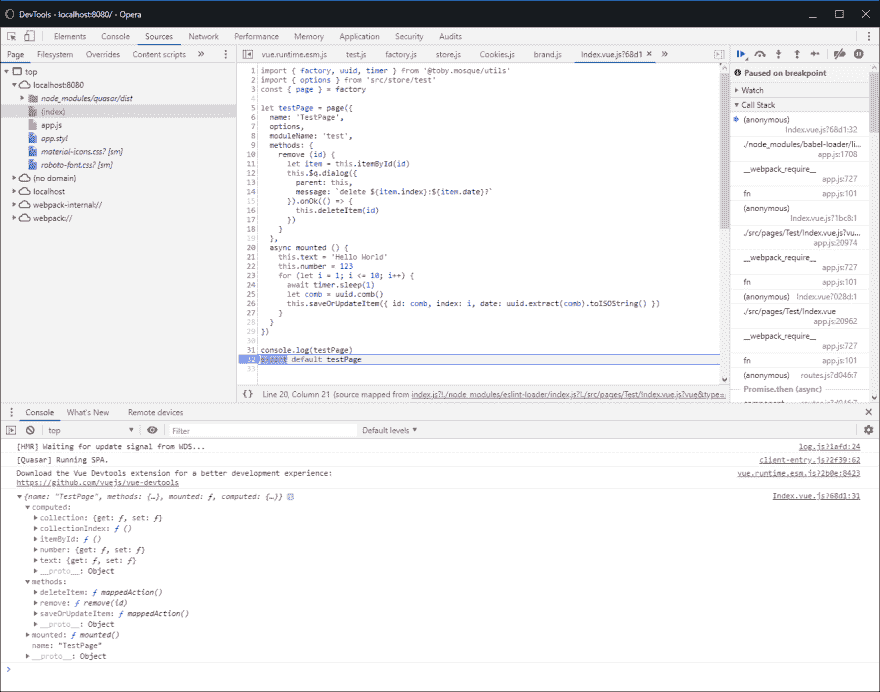](https://res.cloudinary.com/practicaldev/image/fetch/s--7OU_sezy--/c_limit%2Cf_auto%2Cfl_progressive%2Cq_auto%2Cw_880/https://thepracticaldev.s3.amazonaws.com/i/05gbrn6r30ewtaegige0.png)

### 6.4 页面和存储

让我们把`factory.page`和`factory.store`结合起来，看看会发生什么。

#### [6 . 4 . 1 演示](#641-demos)

##### 6.4.1.1 基本用法

请特别注意 initialize 操作，它接收 route 作为参数，并在注册存储后立即调用(这是加载状态数据的最佳位置)。

```
import { factory, uuid, timer } from '@toby.mosque/utils'
const { store, page } = factory

const options = {
  model: class Model {
    text = ''
    number = 0
    collection = []
  },
  collections: [
    { single: 'item', plural: 'collection', id: 'id' }
  ]
}

const storeModule = store({
  options,
  actions: {
    async initialize ({ commit, dispatch }, { route }) {
      commit('text', 'Hello World')
      commit('number', 123)
      this.number = 123
      for (let i = 1; i <= 10; i++) {
        await timer.sleep(1)
        let comb = uuid.comb()
        await dispatch('saveOrUpdateItem', { id: comb, index: i, date: uuid.extract(comb).toISOString() })
      }
    }
  }
})

let testPage = page({
  name: 'TestPage',
  options,
  moduleName: 'test',
  storeModule,
  methods: {
    remove (id) {
      let item = this.itemById(id)
      this.$q.dialog({
        parent: this,
        message: `delete ${item.index}:${item.date}?`
      }).onOk(() => {
        this.deleteItem(id)
      })
    }
  }
})

console.log(testPage, storeModule)
export default testPage 
```

预期产出

控制台-无初始化操作

[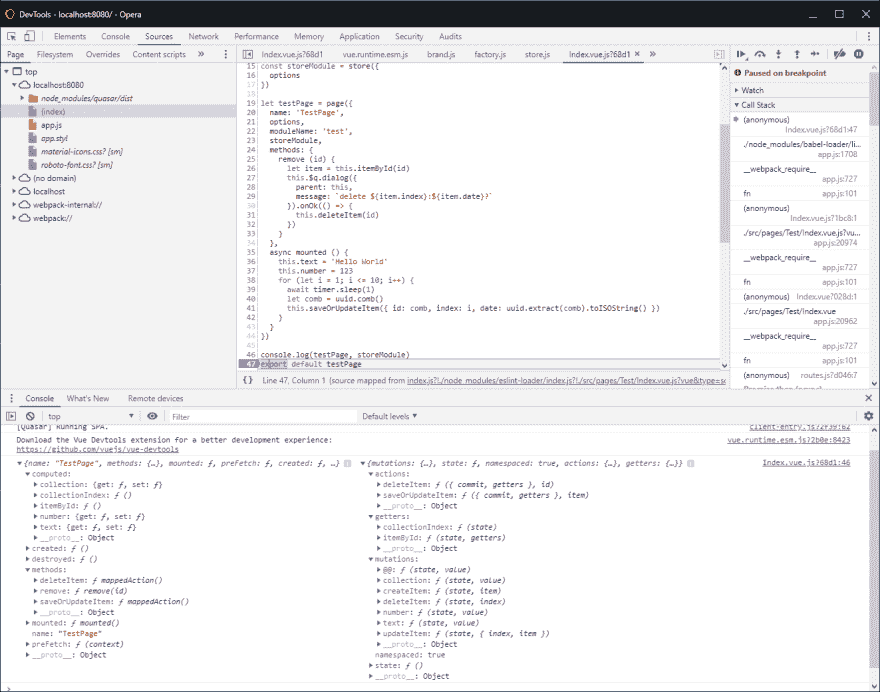](https://res.cloudinary.com/practicaldev/image/fetch/s--ajDw2fpu--/c_limit%2Cf_auto%2Cfl_progressive%2Cq_auto%2Cw_880/https://thepracticaldev.s3.amazonaws.com/i/hh7yj9z91sb0fs25zpsn.png)

控制台-带初始化操作

[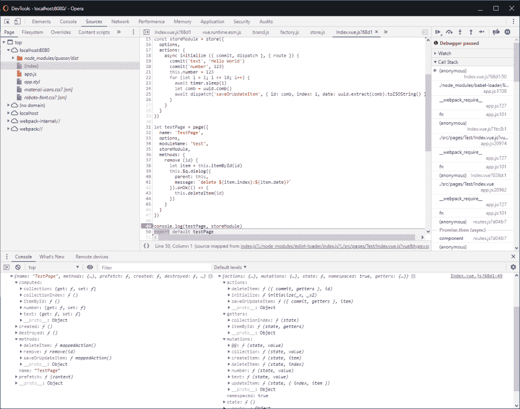](https://res.cloudinary.com/practicaldev/image/fetch/s--PnLIBxkw--/c_limit%2Cf_auto%2Cfl_progressive%2Cq_auto%2Cw_880/https://thepracticaldev.s3.amazonaws.com/i/3odpwmw8ihrf94itsufp.png)

渲染页面

[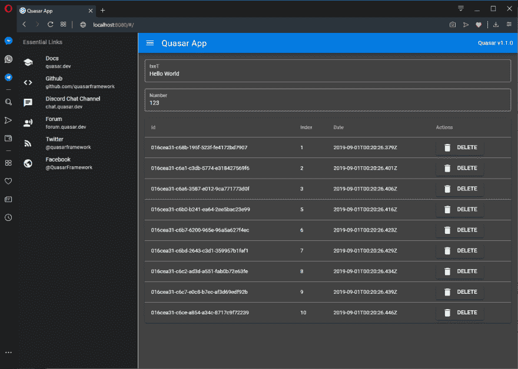](https://res.cloudinary.com/practicaldev/image/fetch/s--w5cGfqs_--/c_limit%2Cf_auto%2Cfl_progressive%2Cq_auto%2Cw_880/https://thepracticaldev.s3.amazonaws.com/i/j8ci6zlg6hynf6ohtjbu.png)