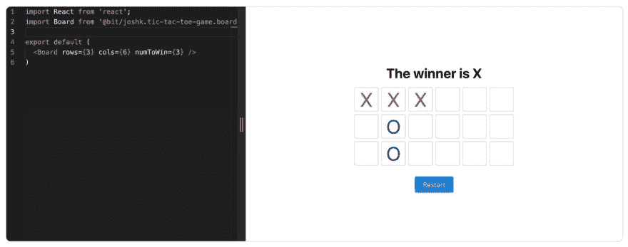
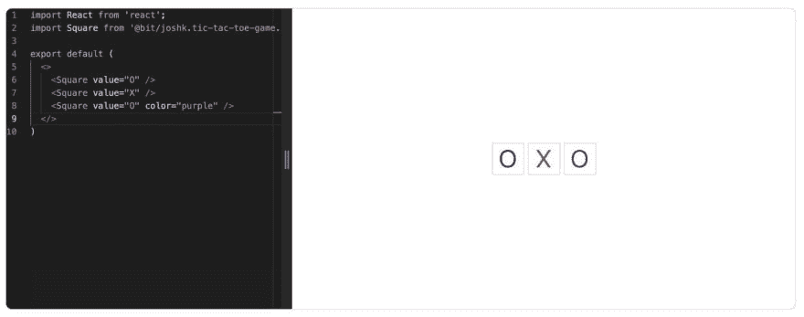

# 用 TypeScript、React 和 Mocha 构建一个井字游戏应用程序

> 原文:[https://dev . to/Josh k2/build-a-TIC-tac-toe-app-with-type script-react-and-mocha-2 n1](https://dev.to/joshk2/build-a-tic-tac-toe-app-with-typescript-react-and-mocha-2n1)

了解如何使用 React 和 TypeScript 组件编写井字游戏应用程序。

[T2】](https://res.cloudinary.com/practicaldev/image/fetch/s--mrmJRbSC--/c_limit%2Cf_auto%2Cfl_progressive%2Cq_auto%2Cw_880/https://cdn-images-1.medium.com/max/3200/1%2A9C55x7B7mv86eILwKfmBJA.jpeg)

一个简单的井字游戏，以模块化的思想构建，并在 Bit 上共享[。分享后，我的游戏的组件可以在 Bit 的 live PlayGround 上进行调整和测试。](https://bit.dev/joshk/tic-tac-toe-game)[在 Bit 上进入我的组件集合](https://bit.dev/joshk/tic-tac-toe-game)使用 NPM、纱或 Bit 来测试或消耗整个游戏或只是其中的一些组件。

##  [约什克 2 ](https://github.com/JoshK2) / [井字游戏用位](https://github.com/JoshK2/tic-tac-toe-game-using-bit)

### 用 react-typescript 组件构建的简单井字游戏

<article class="markdown-body entry-content container-lg" itemprop="text">

# 模块化井字游戏用 TypeScript 构建，用摩卡 [](https://bit.dev/joshk/tic-tac-toe-game) 测试

一个简单的井字游戏用 TypeScript 组件构建，用 Mocha tester 测试，然后将它们分享给 [bit](https://bit.dev/joshk/tic-tac-toe-game) 在现场操场上进行测试，并查看 bit 中运行的测试结果。
允许用户使用 NPM 和 Yarn 来消费整个游戏或者只是游戏组件的一部分，或者使用 bit 来直接在项目内部消费和修改组件。

该游戏有多个选项来修改游戏规则，如桌子的动态尺寸，以及赢得游戏的匹配值的数量。

在项目[集合](https://bit.dev/joshk/tic-tac-toe-game)中的真人游乐场试玩游戏

[T2】](https://bit.dev/joshk/tic-tac-toe-game)

## 辅导的

请参阅完整教程——使用 React TypeScript 组件构建您自己的模块化应用程序。

**[用 TypeScript、React 和摩卡](https://blog.bitsrc.io/build-a-tic-tac-toe-game-with-typescript-react-and-mocha-ce6f1e74c996)** 搭建一个井字游戏 App。

## 导入并使用整个游戏组件

…</article>

[View on GitHub](https://github.com/JoshK2/tic-tac-toe-game-using-bit)

当构建一个像井字游戏这样的游戏时，“考虑到模块性”，很难想出 UI 组件被再次重用的理由，所以我主要关注游戏的实用功能。

我选择 TypeScript 作为我的编码语言——由 [Bit 的 TypeScript 编译器](https://bit.dev/bit/envs/compilers/react-typescript)编译，并使用 Mocha 进行测试。

要安装我的项目中的组件，首先将 [bit.dev](https://bit.dev) 配置为一个作用域注册表(复制并粘贴到您的终端上)——这只需做一次！以后使用 bit 不需要您再次配置。

```
npm config set '@bit:registry' [https://node.bit.dev](https://node.bit.dev) 
```

然后使用纱线或 NPM 安装组件:

```
npm i [@bit/joshk](http://twitter.com/bit/joshk).tic-tac-toe-game.game
yarn add [@bit/joshk](http://twitter.com/bit/joshk).tic-tac-toe-game.game 
```

## [](#game-component)游戏组件

“游戏”组件是我的应用程序的主要组件，由“棋盘”中的一个组件和“ [Prime React](https://bit.dev/primefaces/primereact) ”中的两个组件组成。

我在配置屏幕上使用了[按钮](https://bit.dev/primefaces/primereact/button)和[输入文本](https://bit.dev/primefaces/primereact/inputtext)——在这里测试并查看代码。

在项目中安装 PrimeReact 组件:

```
yarn add @bit/primefaces.primereact.inputtext
yarn add @bit/primefaces.primereact.button 
```

设置好参数后，您可以点击“播放”并…播放！

## [](#board-component)板组件

[棋盘](https://bit.dev/joshk/tic-tac-toe-game/board)组件根据道具创建一个动态表，管理玩家回合并检查获胜者。在这里测试并查看代码[。](https://bit.dev/joshk/tic-tac-toe-game/board/~code#Board/Board.tsx)

[T2】](https://res.cloudinary.com/practicaldev/image/fetch/s--k3NYlxR6--/c_limit%2Cf_auto%2Cfl_progressive%2Cq_auto%2Cw_880/https://cdn-images-1.medium.com/max/3200/1%2A8WrsQcJZFho4LUIXEO51_w.jpeg)

## [](#square-component)方形构件

square 组件是一个简单的单元格，它接收可选颜色的值，并在值改变时向 board 组件发送一个事件。在这里测试并查看代码[。](https://bit.dev/joshk/tic-tac-toe-game/square/~code#Square.tsx)

[T2】](https://res.cloudinary.com/practicaldev/image/fetch/s--uVcVltOe--/c_limit%2Cf_auto%2Cfl_progressive%2Cq_auto%2Cw_880/https://cdn-images-1.medium.com/max/3200/1%2AgZzWS8eCMyEUbdWYauEegA.jpeg)

## [](#empty-cell-function)空单元格功能

“空单元格函数”是[赢家计算函数](https://bit.dev/joshk/tic-tac-toe-game/utils/winner-calc)的助手[函数](https://bit.dev/joshk/tic-tac-toe-game/utils/have-empty-cell)，用于检查游戏桌面上是否有空单元格。

Bit 让你看到组件的文档和测试结果:

[T2】](https://res.cloudinary.com/practicaldev/image/fetch/s--_auka6eK--/c_limit%2Cf_auto%2Cfl_progressive%2Cq_auto%2Cw_880/https://cdn-images-1.medium.com/max/3200/1%2AWu-MLh7hczWOLELoZrw70A.jpeg)

函数的代码: