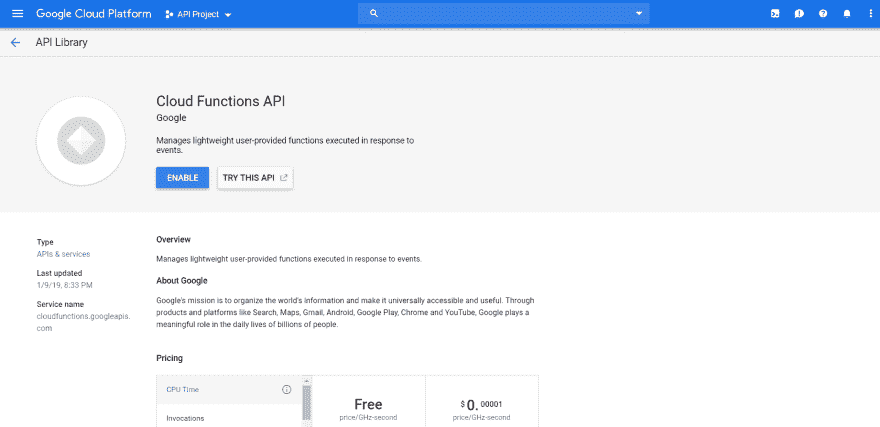

# 谷歌云功能-> Node.js

> 原文：<https://dev.to/gelopfalcon/google-cloud-functions-node-js-82c>

Google Cloud Functions 是一个无需服务器即可创建和连接云服务的运行环境。使用云功能，您可以编写简单的单用途功能，这些功能附加到从云基础架构和服务发出的事件中。触发正在查看的事件时，其云功能将激活。您的程式码会在完全受管理的环境中执行。您不需要配置基础架构或管理服务器，也就是说，您只需要“像疯子一样删除代码”。

[](https://i.giphy.com/media/QHE5gWI0QjqF2/giphy.gif)

Google Cloud 函数可以写入 Node.js、Python 和 Go，并在语言特定的运行时运行。云函数的运行环境取决于您选择的运行时间。

## 云功能提示

Hay 2 distintos tipos de Cloud 函数:HTTP y 后台函数。

### HTTP 函数

从标准 HTTP 请求调用 HTTP 函数。这些 HTTP 请求等待常见 HTTP 请求方法(如 GET、PUT、POST、DELETE 和 OPTIONS)的响应和支持处理。使用云函数时，会自动提供 TLS 证书，因此所有 HTTP 函数都可以通过安全连接调用。

### Background 函数

后台功能可以处理来自云基础架构的事件，如 Pub / Sub 云主题中的消息或对云存储库的更改。

对于这个帖子，我将谈论 HTTP 功能，对于其他帖子，我将谈论后台功能，所以，让我们开始吧。

## 必需品

开始之前，应确保您的计算机上安装了 Node，创建了 Google Cloud 项目，并安装了 Google cloud SDK。

要验证 Node 是否已安装，应运行以下命令。

`npm -v
node -v`

此外，您还可以验证 Google Cloud SDK 是否已使用类似命令进行安装:

`gcloud --version`

## 设置 Google 云

一旦您创建了 Google Cloud 项目，我们就可以启用云功能 API。在 Google Cloud 控制台中，导航到 apis & services，然后在库中查找 cloud function API。它应该如下图所示。继续并启用 API。

[](https://res.cloudinary.com/practicaldev/image/fetch/s---TLJAM7h--/c_limit%2Cf_auto%2Cfl_progressive%2Cq_auto%2Cw_880/https://miro.medium.com/max/3682/1%2AC0ktoHf6yMD999CTc7JQPg.png)

或者，如果您像我一样是控制台的粉丝，则可以运行此命令，其效果与以下命令相同:

`gcloud services enable cloudfunctions.googleapis.com`

如果安装成功，则应使用以下命令查看此活动 API:

`gcloud services list --available`

[](https://res.cloudinary.com/practicaldev/image/fetch/s--SHGlPnUH--/c_limit%2Cf_auto%2Cfl_progressive%2Cq_auto%2Cw_880/https://thepracticaldev.s3.amazonaws.com/i/gxu83qklfsingum3jzdm.png)

## creamdo 联合国快递应用程序

为了初始化应用程序，我们将使用`package.json`工具创建`package.json`，然后创建要在其中编写代码的文件。

在您偏好的目录中，我们会建立名为「`cloud-functions-nodejs`」的资料夹，在此资料夹中，我们执行以下指令`npm init`，此指令会建立我们`package.json`。

下一步是为我们的项目安装 Express，我们将通过运行以下命令做到这一点:

`npm install express --save`

最后，创建一个名为`index.js`的文件，我们将在其中编写代码。好的，我们已经有了开始开发的必要条件，打开以前用您最喜欢的编辑器创建的文件，并编码如下:

` ` const express = require(' express ')；
const app = express()；

const PORT = 5555

app.listen(PORT，()= > {
console . log(`Server ejecutándose en el puerto ${PORT}`)；
})；` ``

通过命令运行您的应用程序:

`node index.js`

。

你应该能在你的控制台上看到以下信息:

`Server ejecutándose en el puerto 5555`

。

∞天啊！∞创建了您的第一个 Express 应用程序！唯一的问题是，如果你想在`http: // localhost: 5555`上执行任何动作，你将看不到任何东西，因为我们没有配置应用程序来听请求。

让我们用以下代码修改我们的 index.js 以创建一些端点:

```
const express = require('express');
const app = express();

const PORT = 5555;
const USERS = [
    {
        id: 1,
        firstName: 'Gerardo',
        lastName: 'Lopez'
    },
    {
        id: 2,
        firstName: 'Yirian',
        lastName: 'Acuña'
    }
];

app.listen(PORT, () => {
    console.log(`Server ejecutándose en el puerto ${PORT}`);
});

app.get('/users', (req, res, next) => {
    res.json(USERS);
});

app.get('/users/:userId', (req, res, next) => {
    res.json(USERS.find(user => user.id === parseInt(req.params.userId)));
});

module.exports = {
    app
}; 
```

Enter fullscreen mode Exit fullscreen mode

重新运行该应用程序，您应该可以转到“
t0]”并查看我们的用户列表。

我们的第二个端点演示了如何在 Express 中使用路径参数，所以如果你去`http://localhost:5555/users/2`，你会看到我们的用户“yirian acuña”。

## 部署云功能

现在，我们将在云功能中实施我们的应用程序。为了实施我们的应用程序，我们只需要一个命令。在应用程序根目录(包含 index.js)中，运行命令:

`gcloud functions deploy mi-primer-funcion --runtime nodejs8 --trigger-http --entry-point app`

这将需要几分钟的时间，但完成后，您应该会在控制台上看到以下打印内容。

```
Deploying function (may take a while - up to 2 minutes)...done.
httpsTrigger:
  url: https://us-central1-<GCP-PROJECT-ID>.cloudfunctions.net/mi-primer-funcion
labels:
  deployment-tool: cli-gcloud
name: projects/<GCP-PROJECT-ID>/locations/us-central1/functions/mi-primer-funcion
runtime: nodejs8 
```

Enter fullscreen mode Exit fullscreen mode

让我们简单回顾一下我们执行的命令。实现 gcloud 函数后，以下参数是其函数的名称。`--runtime`指标告诉 GCP 它的应用需要多少运行时间。`--entry-point`旗标指向要汇出为云端函数的 index.js 中的方法或物件，换句话说，就是函数的输入点。

实施该功能后，您应该可以在 Google Cloud 控制台中看到它，并可以使用`https://us-central1-<GCP-PROJECT-ID>.cloudfunctions.net/mi-primer-funcion/users`调用您的功能。

[](https://i.giphy.com/media/MGdfeiKtEiEPS/giphy.gif)

这很容易，但至少你已经有足够的想法如何创建 Google cloud run (HTTP events)。不久的将来，我将写关于其他类型函数的文章。

我很感激与大家分享。如果你想和我一起继续学习，我邀请你跟随我的社交网络:

*   推特[https://twitter.com/gelopfalcon](https://twitter.com/gelopfalcon)
*   开发到[https://dev.to/gelopfalcon](https://dev.to/gelopfalcon)
*   twitch[【https://www . twitch . TV/gelheadalcon】](https://www.twitch.tv/gelopfalcon)(每周我都谈论一些话题。(通常为半周)