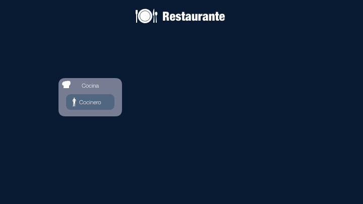
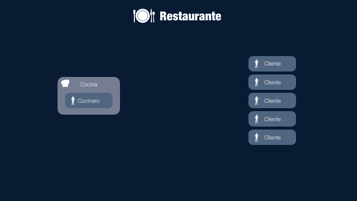
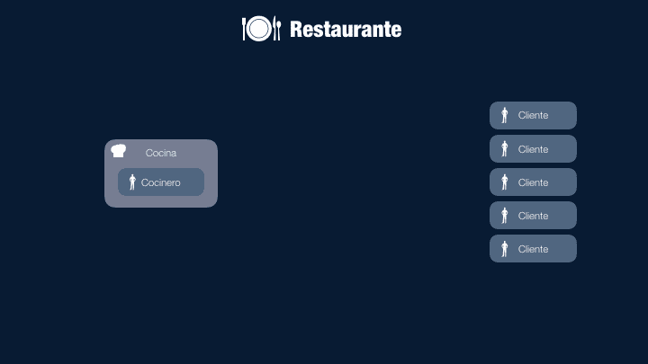
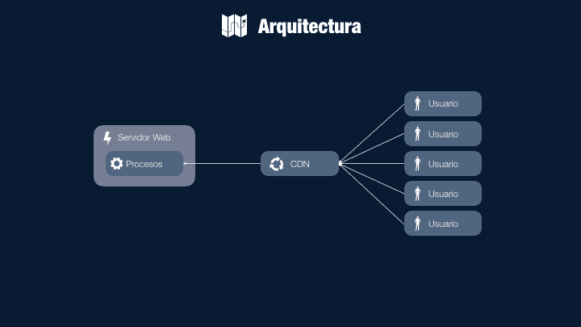
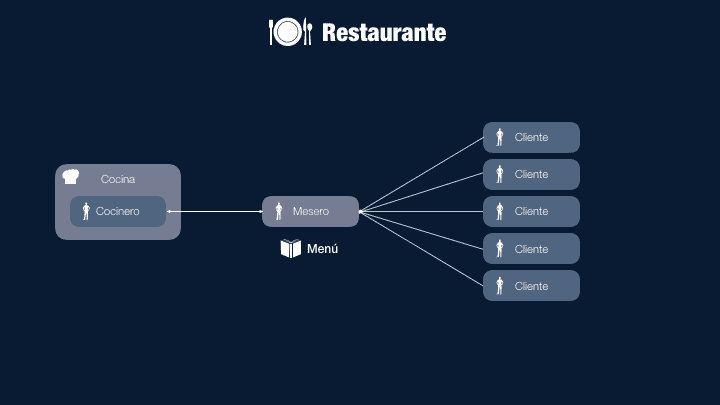

# 缓存虚拟替身:盗梦空间

> 原文:[https://dev . to/omarcarpintyro/cache-para-dummies-inception-229 b](https://dev.to/omarcarpinteyro/cache-para-dummies-inception-229b)

缓存的主题是剧烈的头痛。这是一片黑暗的森林，如果你不做好准备，你就会迷失自我，成本会对你的业务和用户造成致命的影响。这就是为什么我们要做一个**缓存感知**。

我们将从头开始学习基本定义。以一种简单快捷的方式。我会用一个类比来解释快取，我们希望你参考一下，以免忘记概念。

## 类比

想象一下一家餐厅，在那里我们有**厨房**，里面有**厨师**。餐厅开始营业。**顾客**将开始进入。

顾客会走进餐厅直接去厨房问厨师:*是菜单吗？配料有盘子吗？贵吗？要喝酒吗？*等。一旦客户掌握了所有信息，他将向我们的厨师订货，厨师将在所要求的盘子上工作，一旦准备就绪，他就服务。

顾客吃完盘子，现在要甜点。然后你再去厨房找厨师，问相关问题要你的甜点:*甜点有吗？味道有吗？贵吗？*等。一旦顾客掌握了全部信息，他就会向厨师订购甜点，厨师将再次加工所要求的甜点，一旦准备好，就把它交给厨师。

<figure>

[T2】](https://res.cloudinary.com/practicaldev/image/fetch/s--Fo-gGs7C--/c_limit%2Cf_auto%2Cfl_progressive%2Cq_66%2Cw_880/https://thepracticaldev.s3.amazonaws.com/i/dz3unugtqvxern73dgcr.gif)

<figcaption>Primer escenario del Restaurante</figcaption>

</figure>

这种情况运行良好，双方都得到他们想要的，过程自然地进行。

当有多个客户时会发生什么？突然我们有五个客户。他们每个人都和厨师交谈，问同样的问题:*是菜单吗？配料有盘子吗？贵吗？要喝酒吗？甜点有吗？*等。

此时景色不再有利可图，因为厨师不会供应，盘子会坏，会冷，很长时间，顾客会反感。

<figure>

[T2】](https://res.cloudinary.com/practicaldev/image/fetch/s--Ol9Cw1w7--/c_limit%2Cf_auto%2Cfl_progressive%2Cq_66%2Cw_880/https://thepracticaldev.s3.amazonaws.com/i/rcm2f3b71dgef2x0ur1z.gif)

<figcaption>Escenario complicado, no rentable.</figcaption>

</figure>

为了解决这种情况，我们加入了服务员的服务。现在，客户将向服务员询问订购盘子所需的一切知识。在这个新的过程中，服务员接到命令，进入厨房，厨师在那里下命令，致力于准备好盘子。

一旦订单准备就绪，服务员会把您的订单和客户一起拿走。

<figure>

[T2】](https://res.cloudinary.com/practicaldev/image/fetch/s--Jpjqv8hq--/c_limit%2Cf_auto%2Cfl_progressive%2Cq_66%2Cw_880/https://thepracticaldev.s3.amazonaws.com/i/teekoiccwlthqcc1mg3n.gif)

<figcaption>Incorporación de Mesero</figcaption>

</figure>

> *我们希望你注意到，通过这个新的过程，顾客不会知道我们有多少厨师，我们可以根据需要增加多少厨师来满足需求，就像厨师的数量一样。*

## Arquitectura Web

接下来，让我们来稍微理解一下我们的类比，带着一个**网路架构的技术部分**。

厨房，将会是我们的**网络服务器**，厨师由我们实例的**计算过程和能力**代表，顾客将会是我们的**最终用户**，他们将开始提出要求(【TT

<figure>

[T2】](https://res.cloudinary.com/practicaldev/image/fetch/s--UIXLyyIu--/c_limit%2Cf_auto%2Cfl_progressive%2Cq_66%2Cw_880/https://thepracticaldev.s3.amazonaws.com/i/nnyocs0cmiio8fcn4zoh.gif)

<figcaption>Arquitectura Web</figcaption>

</figure>

流的工作方式与我们的餐厅一样，用户向我们的服务器提出请求，我们的服务器处理来自*网页、资产、*等的请求，并将信息返回给客户:浏览器。

同样，当用户的要求太多时，我们加入了一项由我们的服务员代表的 CDN 服务(“T0”内容交付网络【t1])。国家数据中心将负责接收请求并将其发送到我们的服务器，服务器是所提供数据的来源。

<figure>

[T2】](https://res.cloudinary.com/practicaldev/image/fetch/s--YGf_2TtB--/c_limit%2Cf_auto%2Cfl_progressive%2Cq_66%2Cw_880/https://thepracticaldev.s3.amazonaws.com/i/3xgnnvhyj3vftk7il9ud.gif)

<figcaption>Origen, CDN, Cliente (Browser)</figcaption>

</figure>

我们可以根据需要平衡多个服务器以支持负载。

## 缓存嵌入

我们整合了我们的缓存概念。我们将把我们的**缓存感知**，并把缓存理解为**一种记忆，它保存了一个来源为响应我们提出的请求而提供给我们的信息。**。

在我们的餐厅里，我们将加入两种记忆，这将有助于我们回忆起来源于我们的信息，在本例中是厨师。我们称之为菜单。菜单将有助于我们了解厨师生产的东西、食谱、价格、配料等。

我们把菜单给服务员，他不用再和厨师一起去了，如果他不用看菜单的话。顾客询问盘子时，服务员可以迅速回答。

<figure>

[T2】](https://res.cloudinary.com/practicaldev/image/fetch/s--tin53ijr--/c_limit%2Cf_auto%2Cfl_progressive%2Cq_66%2Cw_880/https://thepracticaldev.s3.amazonaws.com/i/nwalgrzg47vj704zobsc.gif)

<figcaption>Incorporación de un menú</figcaption>

</figure>

在我们的 web 架构中，以上称为缓存边缘或**cdn 缓存**，负责存储服务器提供的信息。

因此，如果服务器向我们提供 HTML 或 JPG 或 CSS 类型的资产，则 CDN 将负责缓存该资产，当客户请求此资源时，CDN 将为您提供服务，而无需再次请求服务器。

<figure>

[T2】](https://res.cloudinary.com/practicaldev/image/fetch/s---MnHcdbV--/c_limit%2Cf_auto%2Cfl_progressive%2Cq_66%2Cw_880/https://thepracticaldev.s3.amazonaws.com/i/sypunfvmn8gwbiyy7s82.gif)

<figcaption>Incorporación del Cache Edge o Cache de CDN</figcaption>

</figure>

我们将把它提升到一个新的层次，因为客户在需要任何盘子或服务时仍要去服务员那里索取信息。

为了改进这一过程，我们将包括一个新菜单，每次我到达餐厅时都会交给客户。在此菜单中，客户可以查看订购其食品所需的信息。你可以看到成分，价格等等。这是一个重要的改进，使我们的主人能够放松一点。

<figure>

[T2】](https://res.cloudinary.com/practicaldev/image/fetch/s--SPeW294M--/c_limit%2Cf_auto%2Cfl_progressive%2Cq_66%2Cw_880/https://thepracticaldev.s3.amazonaws.com/i/f0x0icdgrd7e8qyn9kil.gif)

<figcaption>Incorporación del menú para el cliente</figcaption>

</figure>

在我们的 web 体系结构中，我们将其命名为客户端缓存，即浏览器(*浏览器*将使用的内存，以记住源提供给您的结果，并将其保存到磁盘上，以便在需要时随时可用。

<figure>

[T2】](https://res.cloudinary.com/practicaldev/image/fetch/s--pMIRSCg8--/c_limit%2Cf_auto%2Cfl_progressive%2Cq_66%2Cw_880/https://thepracticaldev.s3.amazonaws.com/i/dolifnd98nr8y53qiorf.gif)

<figcaption>Incorporación de Cache de Cliente o de Browser</figcaption>

</figure>

因此，如果我们的 CDN 已经提供了资源，则浏览器会缓存该资源，当浏览器请求相同的资源时，您不必转到 CDN，而是转到其缓存，转到您的硬盘。

因此，有两个缓存:来自 **CDN** 和**客户端**。

## 结论

你现在可以提出如下有效问题:
*如果价格改变会发生什么情况？我是否更新菜单中的托盘？我做它是为了开另一家餐馆吗？服务员不上班时会发生吗？如果厨师不在呢？*

过去的问题可能相当于:

*更新客户端(浏览器)中此缓存的 CSS 或 JS？∞我是否告诉用户有一个新页面？我做它是为了在欧洲或其他大陆的缓存中可用吗？如果 CDN 或我的源服务器没有响应，会发生什么情况？*

我们将在其他文章中回答这些问题。

我们相信这种**缓存感知**每一个面对这个问题的人都要牢记这一点。

###### Foto por[Kvistholt](https://unsplash.com/@freeche)de[Unsplash](https://unsplash.com/photos/oZPwn40zCK4)