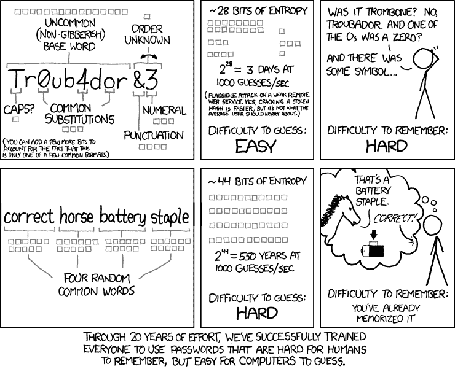

# 代表全世界的密码管理器用户，停止强制密码要求。

> 原文：<https://dev.to/caseywebb/on-behalf-of-password-manager-users-of-the-world-stop-enforcing-password-requirements-4jda>

让我带你经历一个场景，我想你们很多人都经历过一次又一次。

我在一个网站上注册了一个账户，最后，我得到了可怕的输入:密码和密码确认。

我打开我的密码管理器，生成一个新的 pass，将其复制到剪贴板，并粘贴到输入中(如果允许的话，我们会用到它...).

> "请输入有效的密码。"

愤怒随之而来。

毫无疑问，有一个不允许的特殊字符...或者太长了...或者没有要求的大写字母的最小数量...或者<insert other="" archaic="" requirements="" here="">。有时他们很友好地告诉我是什么阻止了我继续操作，但这种情况很少见，更多的时候我不得不将密码复制到文本编辑器中，并一个接一个地删除字符，直到最后密码满足，通常是未声明的或模糊的(必须包含特殊字符，但 ope，不是那个，我不喜欢那个...)，要求。或者更糟的是，我会说“Foobar1234！”。安全*胜利*。如果我忘记返回我的密码管理器来更新条目，下次我尝试登录时，我会很高兴地再次浏览整个歌曲和舞蹈，因为我现在需要重新设置密码。</insert>

这远远不是一个理论场景；这种事情一直在发生。每次*都让我气呼呼的。*

拜托，看在 UX 的份上，别这样了。银行网站似乎是最糟糕的。

问题是，在我看来，如果宣称的目标是增加安全性，那充其量也只是适得其反。我不是安全研究人员，但我确实了解暴力破解是如何工作的(据我所知，这是这里唯一试图缓解的攻击手段。如果 app/公司对数据不负责任/不称职，反正都不重要)。

在没有限制的情况下，可能的密码数量是一个简单的 95^lengthOfPassword.(95 是 ASCII 可打印字符的数量:26 个大写，26 个小写，10 个数字，33 个特殊字符)。

对于每一个列入黑名单的人物，基数减一。虽然没有什么比长度对密码强度更重要，但这仍然会导致最坏情况下运行时间的大幅减少。

但情况变得更糟了。

比方说，像很多很多网站一样，至少需要一个大写字母。这意味着我们可以忽略每个仅包含小写字母、数字和/或特殊字符的密码(仍然假设每个特殊字符都是允许的)。

95^lengthofpassword-(95-26)^lengthofpassword

有了 8 个字符的密码，这立刻消除了大约 513.8 万亿种可能性。

实际上，数学要复杂得多，包括求和等等(除非指定了明确的长度，这是非常糟糕的*)我承认可能的密码集仍然非常大，但我想表达的观点希望是清楚的；每个增加的复杂性需求只会进一步缩小可能的解决方案集，*降低*安全性，而不是增加安全性。这与宣称的目标完全背道而驰。更重要的是——它阻碍了比任何东西都更能保护我在线安全的工具——我的密码管理器的可用性，并使我更有可能依赖那个“Foobar1234！”完全出于沮丧。*

 *所以请停下来。不要这样做。如果你真的想保护你的用户，强制最小密码长度，禁止常用密码，和/或要求 [*实际*复杂度](https://github.com/dropbox/zxcvbn)。

通常情况下，XKCD 比我说得更清楚、更简洁。我们训练人们使用难以记忆且容易破解的密码。

【https://www.xkcd.com/936/】T4

而且，因为我说过我会去做，所以停止做另一件事:不允许粘贴。我真的不确定人们认为这到底能实现什么。它不仅会使输错密码的可能性无限增加(因为输错粘贴密码的可能性为零)，而且完全无效:F12 -> `document.querySelectorAll('input[type=password]').forEach((el) => el.value = 'mypassword')`。就叫我哈克曼吧。

抱歉，我咆哮了。Bridgecrest 的网站真的真的很烂。*