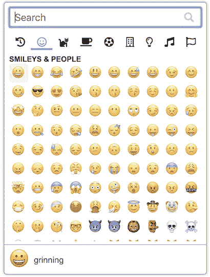

# 表情按钮，一个普通的 JavaScript 表情选择器

> 原文:[https://dev . to/joeatardi/e moji-button-a-vanilla-JavaScript-e moji-picker-1l F9](https://dev.to/joeattardi/emoji-button-a-vanilla-javascript-emoji-picker-1lf9)

[T2】](https://res.cloudinary.com/practicaldev/image/fetch/s--iIH6qetl--/c_limit%2Cf_auto%2Cfl_progressive%2Cq_auto%2Cw_880/https://thepracticaldev.s3.amazonaws.com/i/b7a51lk2eun5c6l7nsq4.png)

在玩了 React、Svelte 和 Angular 一年之后，我想尝试用普通的 JavaScript 构建一些东西。我之前为苗条的 T1 制作了一个表情选择器，所以我想我会把它应用到普通的 JavaScript 上。结果就是表情按钮。

表情按钮是一个普通的 JavaScript 表情选择器，可以在任何 JavaScript 应用程序中使用，不管是什么框架。

您调用`EmojiButton`函数，传递一个 HTML 按钮元素和一个回调。点击按钮将触发表情选择器，当选择一个表情时，将使用所选的表情执行回调。

它的一些功能包括:

*   肤色变化
*   表情符号搜索
*   保存最近使用的表情符号

在没有模板化、反应性和数据绑定工具的情况下，用普通的 JavaScript 来构建这个有点困难。总之，这是一个有趣的项目，希望有人会发现它有用！

*   这里演示:[https://joeattardi.github.io/emoji-button/](https://joeattardi.github.io/emoji-button/)
*   GitHub 项目:[https://github.com/joeattardi/emoji-button](https://github.com/joeattardi/emoji-button)
*   npm 包:[https://www.npmjs.com/package/@joeattardi/emoji-button](https://www.npmjs.com/package/@joeattardi/emoji-button)