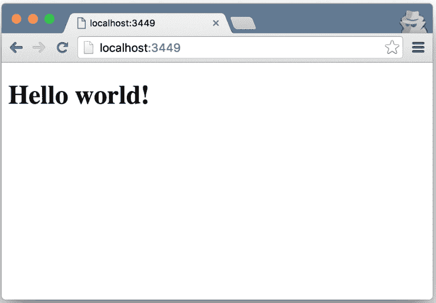

# 使用 Figwheel 接收快速反馈

> 原文：<https://dev.to/kendru/receiving-rapid-feedback-with-figwheel-13lo>

这篇文章是安德鲁的书[第六课](https://www.learn-clojurescript.com/section-1/lesson-6-receiving-rapid-feedback-with-figwheel/)，[T3】学 ClojureScriptT5】](https://gum.co/learn-cljs)

* * *

在上一章中，我们只执行了一个命令，但是我们已经有了一个可以编译的基本项目，我们马上就会看到，它会自动重新加载。Figwheel 是 ClojureScript 社区中用于在 web 浏览器中重新加载代码和执行 ClojureScript 代码的首选工具。对于 ClojureScript 开发人员来说，交互式开发是一个巨大的优先事项，Figwheel 等工具提供的即时反馈使开发成为真正的交互式体验。为了更好地理解 Figwheel 如何简化开发，让我们启动它，看看它是如何工作的。因为我们使用 Leiningen 的 Figwheel 模板生成了一个项目，所以它包含了`lein-figwheel`插件，让我们可以用一个命令启动 Figwheel。

*本章内容:*

*   了解交互式开发如何成为 ClojureScript 的基石
*   使用 Figwheel 编译并立即加载到浏览器中
*   了解如何编写可重载的代码

#### 与雷宁根一起跑摩天轮

```
$ cd cljs-weather             # <1>
$ lein figwheel               # <2>
Retrieving lein-figwheel/lein-figwheel/0.5.0-6/lein-figwheel-0.5.0-6.pom from clojars
# ... More output ...
Figwheel: Starting server at http://localhost:3449
Figwheel: Watching build - dev
Compiling "resources/public/js/compiled/cljs_weather.js" from ["src"]...
Successfully compiled "resources/public/js/compiled/cljs_weather.js" in 6.428 seconds.
Figwheel: Starting CSS Watcher for paths  ["resources/public/css"]
Launching ClojureScript REPL for build: dev
# ... More output ...
Exit: Control+C or :cljs/quit
Results: Stored in vars *1, *2, *3, *e holds last exception object
Prompt will show when Figwheel connects to your application 
```

<svg width="20px" height="20px" viewBox="0 0 24 24" class="highlight-action crayons-icon highlight-action--fullscreen-on"><title>Enter fullscreen mode</title></svg> <svg width="20px" height="20px" viewBox="0 0 24 24" class="highlight-action crayons-icon highlight-action--fullscreen-off"><title>Exit fullscreen mode</title></svg>

1.  输入项目目录
2.  启动转轮

Figwheel 需要几秒钟来启动和编译现有的代码，但是一旦输出表明 Figwheel 准备好连接到我们的应用程序，我们就可以打开浏览器并导航到`http://localhost:3449`并查看正在运行的应用程序。

[](https://res.cloudinary.com/practicaldev/image/fetch/s--b2bXJI9N--/c_limit%2Cf_auto%2Cfl_progressive%2Cq_auto%2Cw_880/https://kendru.github.io/img/learn-cljs/chapter6/figwheel_app.png)

*用 Figwheel 重新加载 ClojureScript】*

当我们启动 Figwheel 时，它开始观察我们的项目，看是否有对 ClojureScript 源文件的任何更改。当这些文件发生变化时，Figwheel 会将它们编译成 JavaScript，然后将 JavaScript 发送到浏览器并执行。将这种类型的开发与大多数 JavaScript 代码重载代码区别开来的是，它将

## 测试现场重装

现在我们有了一个运行 Figwheel 重载代码的应用程序，我们可以打开一个文本编辑器并修改一些代码。默认情况下，我们使用的 Leiningen 模板在`src/cljs_weather/core.cljs`生成了一个单独的源文件，我们将把本章的练习限制在这个单独的文件上。在我们进行任何更改之前，让我们从较高的层次浏览一下这个文件的内容。

#### [T1。src/cljs_weather/core.cljs](#srccljsweathercorecljs)

```
(ns  cljs-weather.core  <1>  (:require  [reagent.core  :as  reagent  :refer  [atom]]))  (enable-console-print!)  <2>  (println  "Edits to this text should show up in your developer console.")  ;; define your app data so that it doesn't get over-written on reload  (defonce  app-state  (atom  {:text  "Hello world!"}))  <3>  (defn  hello-world  []  <4>  [:h1  (:text  @app-state)])  (reagent/render-component  [hello-world]  (.  js/document  (getElementById  "app")))  (defn  on-js-reload  []  <5>  ;; optionally touch your app-state to force rerendering depending on  ;; your application  ;; (swap! app-state update-in [:__figwheel_counter] inc)  ) 
```

<svg width="20px" height="20px" viewBox="0 0 24 24" class="highlight-action crayons-icon highlight-action--fullscreen-on"><title>Enter fullscreen mode</title></svg> <svg width="20px" height="20px" viewBox="0 0 24 24" class="highlight-action crayons-icon highlight-action--fullscreen-off"><title>Exit fullscreen mode</title></svg>

1.  命名空间声明
2.  允许打印语句转到 JavaScript 控制台
3.  保存所有用户界面状态的数据结构
4.  声明和呈现试剂组件
5.  可选挂钩到 Figwheel 的重新加载过程

让我们开始对`hello-world`组件做一个小小的改变。我们将添加一些额外的文本，以确保我们的更改被接受:

```
(defn  hello-world  []  [:h1  "I say: "  (:text  @app-state)]) 
```

<svg width="20px" height="20px" viewBox="0 0 24 24" class="highlight-action crayons-icon highlight-action--fullscreen-on"><title>Enter fullscreen mode</title></svg> <svg width="20px" height="20px" viewBox="0 0 24 24" class="highlight-action crayons-icon highlight-action--fullscreen-off"><title>Exit fullscreen mode</title></svg>

一旦我们保存文件，我们应该很快看到浏览器更新，以反映我们添加的额外文本。接下来，让我们做一些稍微有趣的事情，将`app-state`中的文本改为“Hello World！”:

```
(defonce  app-state  (atom  {:text  "Live reloading rocks!"})) 
```

<svg width="20px" height="20px" viewBox="0 0 24 24" class="highlight-action crayons-icon highlight-action--fullscreen-on"><title>Enter fullscreen mode</title></svg> <svg width="20px" height="20px" viewBox="0 0 24 24" class="highlight-action crayons-icon highlight-action--fullscreen-off"><title>Exit fullscreen mode</title></svg>

如果我们再次保存文件，我们将看到浏览器中没有任何变化。没有任何变化的原因是我们正在使用`defonce`来创建`app-state`。使用`defonce`确保每当`cljs-weather.core`名称空间被重新加载时，`app-state`不会被触动。这种行为可以大大提高我们的生产力。考虑使用一些复杂的验证规则构建多页表单的场景。如果我们正在对表单的最后一页进行验证，我们通常会对代码进行更改，重新加载浏览器，然后填写表单，直到到达最后一页，测试我们的更改，并根据需要多次重复这个循环，直到我们满意为止。另一方面，使用 ClojureScript 和 Figwheel，我们可以填写表单的前几页，然后对代码进行小的修改，同时立即观察效果。因为当我们的代码被重新加载时，应用程序的状态不会被重置，所以我们永远也不需要重复填写早期页面的繁琐循环。

### 你试试

*   更改`hello-world`组件来呈现一个`<p>`标签
*   创建一个名为`greeter`的新组件来呈现“Hello”，并将对`reagent/render-component`的调用更新为使用`greeter`而不是`hello-world`。

> 我需要一个 IDE 吗？
> 
> 您可以在任何您喜欢的编辑器中编辑 ClojureScript。大多数现代文本编辑器都有 Clojure/ClojureScript 插件，可以提供语法高亮和括号平衡。ClojureScript 社区中一些比较流行的编辑器有 Emacs、LightTable(它本身主要是用 ClojureScript 编写的)、Atom 和 vim。如果你喜欢 IDE，草书是一个基于 IntelliJ IDEA 的全功能 Clojure/ClojureScript IDE。无论您决定使用 ide 还是简单的文本编辑器，您都可以找到优秀的 ClojureScript 支持。

除了重新加载 ClojureScript 代码，Figwheel 还负责重新加载我们可能会更改的任何样式表。我们在创建这个项目时使用的 Figwheel Leiningen 模板配置 Figwheel 来观察`resources/public/css`目录中的任何样式的变化。为了测试这一点，我们将打开默认(空)样式表并添加一些样式:

#### [T1。resources/public/css/style.css](#resourcespubliccssstylecss)

```
body {
  background-color: #02A4FF;
  color: #ffffff;
}

h1 {
  font-family: Helvetica, Arial, sans-serif;
  font-weight: 300;
} 
```

<svg width="20px" height="20px" viewBox="0 0 24 24" class="highlight-action crayons-icon highlight-action--fullscreen-on"><title>Enter fullscreen mode</title></svg> <svg width="20px" height="20px" viewBox="0 0 24 24" class="highlight-action crayons-icon highlight-action--fullscreen-off"><title>Exit fullscreen mode</title></svg>

保存样式表后，Figwheel 会将新样式表发送到浏览器并应用它，而不会加载整个页面。即时接收对任何 ClojureScript 或 CSS 更改的反馈的能力可以产生非常高效的工作流。

## 编写可重载代码

让 Figwheel 重新加载你的代码是一个很大的帮助，但这并不神奇——我们仍然负责编写可以重新加载的代码，而不会对我们的应用程序的行为产生负面影响。在本书的后面，我们将在 React.js 和一个名为 Reagent 的 ClojureScript 包装器上构建几个应用程序，它强烈鼓励一种有助于动态重载的编码风格，但是我们仍然应该熟悉是什么使得代码可以重载，这样无论我们是否使用这些框架，我们都可以充分利用动态重载。

编写可重载代码需要考虑很多因素，但它们本质上可以归结为三个关键概念，我们将把它们视为“可重载代码的支柱”:幂等函数、`defonce`和显示/业务逻辑分离。

[](https://res.cloudinary.com/practicaldev/image/fetch/s--vlF_2a0j--/c_limit%2Cf_auto%2Cfl_progressive%2Cq_auto%2Cw_880/https://kendru.github.io/img/learn-cljs/chapter6/reloadable-pillars.png)

*可重载代码的支柱*

当我们编写坚持这三个支柱的代码时，我们经常会发现，不仅我们最终得到了可重载的代码，而且我们的代码通常也变得更加健壮和可维护。至此，我们将深入研究这些支柱，以及如何将它们应用到我们的代码中。

### 幂等函数

幂等函数是一个无论被调用一次还是多次都具有相同效果的函数。例如，设置 DOM 元素的`innerHTML`属性的函数是幂等的，但是将子元素附加到其他元素的函数不是:

#### 幂等和非幂等函数

```
(defn  append-element  [parent  child]  <1>  (.appendChild  parent  child))  (defn  set-content  [elem  content]  <2>  (aset  elem  "innerHTML"  content)) 
```

<svg width="20px" height="20px" viewBox="0 0 24 24" class="highlight-action crayons-icon highlight-action--fullscreen-on"><title>Enter fullscreen mode</title></svg> <svg width="20px" height="20px" viewBox="0 0 24 24" class="highlight-action crayons-icon highlight-action--fullscreen-off"><title>Exit fullscreen mode</title></svg>

1.  非幂等函数
2.  幂等函数

`append-element`函数肯定不是幂等的，因为我们调用 100 次和调用一次的效果会不一样。另一方面,`set-content`函数是幂等的——无论我们调用它多少次，结果都是一样的。当使用实时重载时，我们应该确保重载时调用的任何函数都是等幂的，否则

#### 你试试

*   编写一个幂等的版本的`append-element`,只在子元素不存在的情况下追加子元素。下面给出了一个可能的解决方案:

```
(defn  append-element  [parent  child]  (when-not  (.contains  parent  child)  (.appendChild  parent  child))) 
```

<svg width="20px" height="20px" viewBox="0 0 24 24" class="highlight-action crayons-icon highlight-action--fullscreen-on"><title>Enter fullscreen mode</title></svg> <svg width="20px" height="20px" viewBox="0 0 24 24" class="highlight-action crayons-icon highlight-action--fullscreen-off"><title>Exit fullscreen mode</title></svg>

### `defonce`

当我们搭建了一个带有`--reagent`标志的 Figwheel 项目时，它生成的名称空间使用一个名为`defonce`的构造来定义应用程序状态:

```
(defonce  app-state  (atom  {:text  "Hello world!"})) 
```

<svg width="20px" height="20px" viewBox="0 0 24 24" class="highlight-action crayons-icon highlight-action--fullscreen-on"><title>Enter fullscreen mode</title></svg> <svg width="20px" height="20px" viewBox="0 0 24 24" class="highlight-action crayons-icon highlight-action--fullscreen-off"><title>Exit fullscreen mode</title></svg>

正如我们上面提到的，`defonce`与`def`非常相似，但是顾名思义，它只绑定 var 一次，有效地忽略了后续求值上的表达式。我们经常用`defonce`来定义我们的应用程序状态，这样它就不会在每次重新加载代码时被一个新值覆盖。这样，我们可以在重新加载应用程序的业务逻辑时，保留应用程序的状态以及任何瞬态数据。

使用 defonce 的另一个有用模式是防止初始化代码重复运行。一个`defonce`表达式的形式是:`(defonce name expr)`，其中`name`是一个命名要绑定的变量的符号，`expr`是任何 ClojureScript 表达式。`defonce`不仅防止 var 被重新定义，还防止当 var 被绑定时`expr`被重新评估。这意味着我们可以用一个`defonce`来包装初始化代码，以保证它只被评估一次，而不管代码多长时间重新加载一次:

#### 包装初始化代码

```
(defonce  is-initialized?  (do  <1>  (.setItem  js/localStorage  "init-at"  (.now  js/Date))  (js/alert  "Welcome!")  true))  <2> 
```

<svg width="20px" height="20px" viewBox="0 0 24 24" class="highlight-action crayons-icon highlight-action--fullscreen-on"><title>Enter fullscreen mode</title></svg> <svg width="20px" height="20px" viewBox="0 0 24 24" class="highlight-action crayons-icon highlight-action--fullscreen-off"><title>Exit fullscreen mode</title></svg>

1.  `do`计算多个表达式，并采用最后一个表达式的值
2.  设置完成后，将`is-initialized?`绑定到`true`

在这种情况下，我们定义了一个名为`is-initialized?`的变量，它只计算一次，一旦所有初始化完成，它就绑定到值`true`。这是我们第一次看到`do`的形式。`do`计算传递给它的每个表达式，并返回最终表达式的值。当我们希望在最终产生一些值之前执行副作用时(在本例中，在`localStorage`中设置一个值并显示一个警告),这是很有用的。组合`do`和`defonce`是一种常见的模式，用于确保某些代码只运行一次。

#### 快速回顾

*   当 Figwheel 运行时，在`core.cljs`中找到包含`(defonce app-state ...)`的行，修改文本，并保存文件。页面更新了吗？为什么或为什么不？
*   在`core.cljs`中找到包含`[:h1 (:text @app-state)]`的行，将`h1`改为`p`。页面更新了吗？为什么这种行为不同于改变`app-state`的定义？

### 显示/业务逻辑分离

显示代码和业务逻辑的分离通常是很好的实践，但是对于可重载的代码来说更为重要。回想一下我们几页前讨论幂等函数时写过的`append-element`函数。假设我们正在编写一个类似 Twitter 的应用程序，并使用这个函数向某个提要添加一条新消息。我们可以用几种方法来编写这段代码，但并不是所有的方法都有利于实时重载。考虑下面的代码，它没有将接收新消息的逻辑与显示它的逻辑分开:

#### 结合显示和业务逻辑

```
(defn  receive-message  [text  timestamp]  (let  [node  (.createElement  js/document  "div")]  (aset  node  "innerHTML"  (str  "["  timestamp  "]: "  text))  (.appendChild  messages-feed  node))) 
```

<svg width="20px" height="20px" viewBox="0 0 24 24" class="highlight-action crayons-icon highlight-action--fullscreen-on"><title>Enter fullscreen mode</title></svg> <svg width="20px" height="20px" viewBox="0 0 24 24" class="highlight-action crayons-icon highlight-action--fullscreen-off"><title>Exit fullscreen mode</title></svg>

在这个例子中，我们将处理传入消息的逻辑与显示消息的关注结合起来。现在，假设我们想通过从显示中删除时间戳来简化 UI。使用这段代码，我们必须修改`receive-message`函数来忽略时间戳，然后刷新浏览器，因为我们的新代码不会影响任何已经呈现的消息。一个更好的替代方案如下所示:

#### 分离显示和业务逻辑

```
(defonce  messages  (atom  []))  ;; <1>  (defn  receive-message  [text  timestamp]  ;; <2>  (swap!  messages  conj  {:text  text  :timestamp  timestamp}))  (defn  render-all-messages!  [messages]  ;; <3>  (aset  messages-feed  "innerHTML"  "")  (doseq  [message  @messages]  (let  [node  (.createElement  js/document  "div")]  (aset  node  "innerHTML"  (str  "["  timestamp  "]: "  text))  (.appendChild  messages-feed  node))))  (render-all-messages!)  ;; <4> 
```

<svg width="20px" height="20px" viewBox="0 0 24 24" class="highlight-action crayons-icon highlight-action--fullscreen-on"><title>Enter fullscreen mode</title></svg> <svg width="20px" height="20px" viewBox="0 0 24 24" class="highlight-action crayons-icon highlight-action--fullscreen-off"><title>Exit fullscreen mode</title></svg>

1.  所有收到的消息都存储在一个不会被覆盖的原子中
2.  处理新消息的功能是纯粹的业务逻辑
3.  呈现消息的功能是纯粹的显示逻辑
4.  执行渲染

在这种情况下，我们可以更新`render-all-messages!`函数，当 Figwheel 重新加载我们的代码时，消息列表将保持不变，但显示函数的行为会有所不同，当调用`render-all-messages!`时，所有消息的显示都会更新。

*注意:*上面代码的实现效率很低，因为每次我们调用`render-all-messages!`时，整个列表都要重新呈现。在后面的章节中，我们将使用试剂框架更有效地实现类似的结果。

#### 快速检查

*   可重载代码的支柱是什么？为什么这些都很重要？
*   `def`和`defonce`有什么区别？

### 你试试

*   在 Figwheel 运行时，尝试更改`app-state`中的文本并保存文件。会发生什么？如果我们用了`def`而不是`defonce`，会有什么不同吗？
*   在代码中引入一个语法错误，看看浏览器中会发生什么。

### 总结

在这一章中，我们考察了 ClojureScript 中交互开发的一个核心特性——实时重载。我们使用 Figwheel 在代码发生变化时重新加载代码，并研究了编写可重新加载代码背后的原则。有了这些知识，我们可以将我们的生产力提升到一个新的水平，并享受通常用 JavaScript 得到的更快的反馈。我们现在知道:

*   如何从命令行启动 Figwheel
*   Figwheel 如何在代码改变时重新加载代码
*   如何编写有利于重载的代码