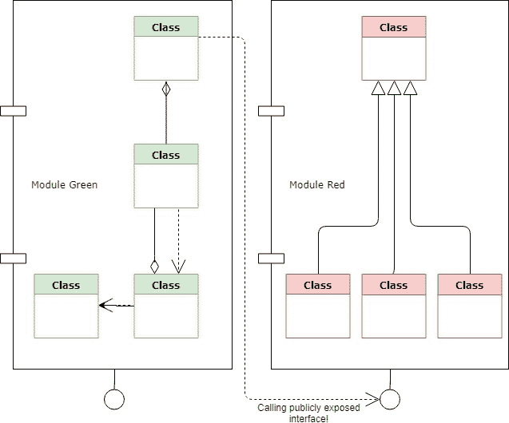
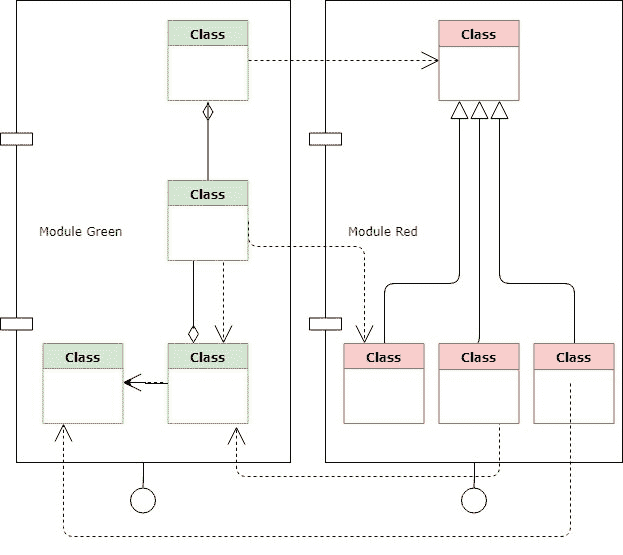

# 微服务和强制模块化

> 原文：<https://dev.to/tonyhicks20/microservices-and-enforced-modularity-b1h>

## 你的代码中什么是模块化？

听说过单一责任原则吗？基本上是一样的，但是我们不是把它应用到一个单独的类上，而是把它应用到一组相互关联的代码上——一个有界的上下文(借用领域驱动设计的一个术语)。

与类类似，作为一个模块，您希望您的代码是:

*   低耦合——小心你创建的依赖项的数量和类型
*   高度内聚——您希望模块中的代码紧密相关

默认情况下，许多编程语言都有一种将代码逻辑分组的机制。例如，在 C#中，我们有名称空间。在 Java 中，包。

您隔离这部分代码，并给它一个代表其用途的名称，要非常小心地确定它依赖于什么，因为任何外部依赖都可能将您的模块耦合到其他东西。

如果一个外部模块需要通信，那么你应该定义一个公共接口来满足这种需求！

## 为什么要这么做？

因为它在逻辑上将你的系统分成更小的、孤立的块，而不是一个大球意大利面！如果您的所有代码都允许在任何地方被引用，不管业务环境如何，那么遵循起来就会变得极其困难。

## 单一代码库中的难点

你可以(也应该！)在任何应用程序中创建模块化软件——但是如果你有一个单一的代码库，这可能是一个挑战，因为对于把你的代码放在哪里没有实际的物理限制。

有人可以很容易地**打破模块的设计原则**，因为你可以简单地引用代码的其他部分并把它们带进来。

### 喜欢这样:

另外，不要忘记数据库！在单个代码库中，通常也有单个数据库——这意味着即使您的代码可以完全分离，您的查询现在也可以跨模块创建依赖关系，因为您可以跨不同的上下文进行连接！

## 微服务是怎么进来的？

微服务通过创建物理限制来帮助实现这一场景，因为代码和数据库被分成更小的、隔离的部分。

可以带一个模块(或者几个！)，把这个变成一个微服务，现在从系统中其他不属于它的地方添加一段代码就不那么容易了。仍然有可能，但不像连接一个表或导入一个新的名称空间那么简单！

不仅如此，由于每个微服务都必须有自己的数据库，所以您也不能跨不同的域进行查询。

