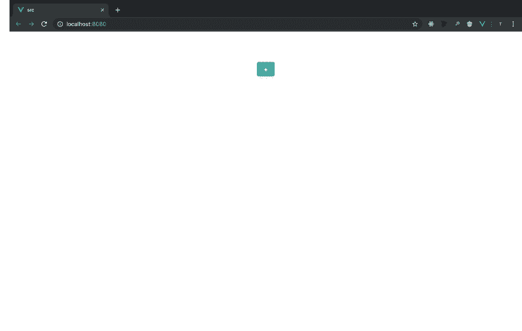

# 卢卡 02 和提尔

> 原文::t0【https://dev . to/tecert/luka-02-et-teal-4lm 3】

> 本文是使用 Rust/Wasm、Vue 和 TypeScript 开发逆向波兰符号计算器网络应用程序系列的一部分。你可以在 [GitHub Repo](https://github.com/t-eckert/luka) 上阅读更多信息并关注发展。

让我们添加一些按钮。对于这次迭代，我希望有一个 UI 可以显示我在 [Luka 01](https://dev.to/teckert/luka-01-mathing-around-in-rust-4pjb) 中创建的`state`，10 个数字按钮，以及每个算术函数的一个按钮。

它不需要一开始就太漂亮，这是我在公共汽车上听杀手时在 Figma 做的布局:

[T2】](https://res.cloudinary.com/practicaldev/image/fetch/s--wY8OMjxH--/c_limit%2Cf_auto%2Cfl_progressive%2Cq_auto%2Cw_880/https://thepracticaldev.s3.amazonaws.com/i/g4klcsqffszahkz9hw12.png)

我可以将按钮分为三种类型:数字按钮(0 到 9)附加到“显示”中显示的字符串的右侧，功能按钮每个都调用 Rust 侧的`operate`功能，按钮标签的字符串，以及将调用 Rust 侧的`push`功能的按钮。我最终想让每一个都有不同的颜色，这将有助于用户直观地解析他们可以做什么，但现在，他们都可以使用相同的 CSS，我将通过应用类来区分颜色。

我从默认的 Vue 模板中截取了很多代码——比这里值得注意的还要多。我还添加了对`main.css`文件的引用，我用它来设计整个应用程序的样式。

基底`App.vue`实现了一个`CalculatorBase.vue`组件，它将包含组成计算器的所有组件。我创建了一个名为`ButtonOperation.vue`的组件，并在上面放了一个按钮。

瞧啊。我们快完成了！

[T2】](https://res.cloudinary.com/practicaldev/image/fetch/s--YJgnqufM--/c_limit%2Cf_auto%2Cfl_progressive%2Cq_auto%2Cw_880/https://thepracticaldev.s3.amazonaws.com/i/lbjt5q8rbmd2k3qm6s4h.png)

我给了这个按钮如下的样式:

```
:root {
    --teal-dark: #319795;
    --teal-light: #38b2ac;
    --shadow: 0 4px 6px -1px rgba(0, 0, 0, .1), 0 2px 4px -1px rgba(0, 0, 0, .06);
}

html {
    font-size: 16px;
}

button {
    text-align: center;
    font-weight: 700;
    border-color: transparent;
    border-radius: 0.25rem;
    flex-shrink: 0;
    justify-content: center;
    cursor: pointer;
    color: #fff;
    background-color: var(--teal-light);
    padding: 0.5rem 1rem;
    margin: 1rem;
    box-shadow: var(--shadow);
    transition: background-color 80ms linear;
}

button:hover {
    background-color: var(--teal-dark);
}

button:active {
    background-color: var(--teal-light);
} 
```

<svg width="20px" height="20px" viewBox="0 0 24 24" class="highlight-action crayons-icon highlight-action--fullscreen-on"><title>Enter fullscreen mode</title></svg> <svg width="20px" height="20px" viewBox="0 0 24 24" class="highlight-action crayons-icon highlight-action--fullscreen-off"><title>Exit fullscreen mode</title></svg>

现在扣子是蓝绿色的。悬停时，它会在 80 毫秒内变成更深的蓝绿色。当点击时，它会立即再次跳转到浅青色。

[T2】](https://res.cloudinary.com/practicaldev/image/fetch/s--RsCAE_9c--/c_limit%2Cf_auto%2Cfl_progressive%2Cq_auto%2Cw_880/https://thepracticaldev.s3.amazonaws.com/i/d8106an85m0qgd9l4uws.png)

## [](#wrap-up)总结起来

我今天想做更多，但是现在我有一个蓝绿色的按钮。如果你想享受点击的乐趣，请前往[https://lukarpn.z14.web.core.windows.net](https://lukarpn.z14.web.core.windows.net)。

开始提交:[f 37109 bf4 b 7 b 3d 22 ef 0 b 54785 f 9104 f 453 d3c 8 c 4](https://github.com/t-eckert/luka/tree/f37109bf4b7b3d22ef0b54785f9104f453d3c8c4)

结束提交:[d712b 197986 e 3279 DC 76 c 22 baeb 31 fbeabad 0 b4c](https://github.com/t-eckert/luka/tree/d712b197986e3279dc76c22baeb31fbeabad0b4c)