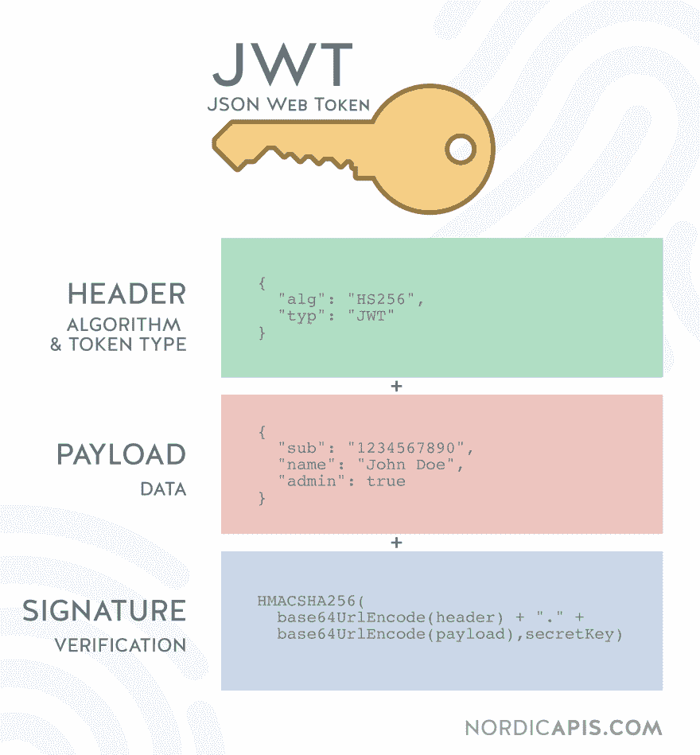

# Json Web 令牌？

> 原文：<https://dev.to/caffiendkitten/jwt-vs-cookies-1h1a>

赶上任何人...作为我在熨斗学校的最终项目的一部分，我制作了一个[密码管理器](https://flatiron-passwordmanager.netlify.app/)。在我寻找一种更好的方法在加密和解密用户数据之前处理用户数据的过程中，我发现需要在数据被发送到数据库之前和从数据库中取出时存储一个密钥或某种东西来加密数据。这意味着我要么需要在前端的程序中存储一个密钥，要么想办法保证它的安全...？？？

好的...因此，与其说是“问题”，不如说是“如何”。我知道我的第一步是当用户登录或创建新帐户时，使用 JWT 来保持对应用程序的授权登录。这是通过在后端对用户的初始登录凭据进行哈希处理和签名，在前端登录时进行验证，然后在浏览器会话中保存在会话存储中的 JWT 来实现的。

所以现在我想看看验证用户的具体方法...没有 2FA 的情况下，大公司在将数据存储在后端之前使用什么来加密数据？饼干？数字签名？认证？JWT？某种组合？

* * *

# 什么是 JWT

“JSON Web Token (JWT)是一个开放标准，它定义了一种紧凑的自包含方式，以 JSON 对象的形式在各方之间安全地传输信息。该信息可以被验证和信任，因为它是数字签名的。jwt 可以使用秘密(使用 HMAC 算法)或使用 RSA 或 ECDSA 的公钥/私钥对进行签名(1)

在我的项目中，一旦用户的真实性得到验证，我就创建一个 JWT，并将其存储在 sessionStorage 中。一旦用户注销、离开页面或刷新页面...令牌丢失，用户需要重新验证身份。

# JWT 看起来像什么？

它们通常由三部分组成...报头、有效负载和签名，通常类似于“xxxxx.yyyyy.zzzzz”。令牌的输出是 3 个 Base64-URL 字符串，用点分隔，可以在 HTML 和 HTTP 环境中传递。③

# 数字签名？

JWT 使用数字签名来验证数据是可信的，并且在传输过程中没有被更改。它通过消息的单向散列来实现这一点，该散列通过公钥和私钥对来发送和验证。该过程创建了只有服务器的公钥才能解密的‘签名’。然后，客户端使用服务器的公钥来验证发送者以及消息内容的完整性。”(7)

什么是 HMAC 算法？
基于哈希的消息认证码(HMAC)是一种单向 MAC 衍生的加密哈希函数，它“能够抵抗密码分析攻击，因为它使用了两次哈希概念。”(8)“算法的第一遍产生从消息和内部密钥导出的内部散列。第二遍产生从内部散列结果和外部密钥导出的最终 HMAC 码(9)

**什么是 RSA 和 ECDSA？**
**RSA(Rivest–sha mir–ad leman)**是最早的公钥密码系统之一，广泛用于安全数据传输。这个密码系统有趣的地方在于，加密密钥是公开的，不同于解密密钥，解密密钥是秘密的。
**ECDSA** (椭圆曲线数字签名算法)是一种加密算法，比特币使用它来确保资金只能由合法的所有者使用。ECDSA 所需的公共密钥的比特长度被认为是以比特为单位的安全级别长度的两倍。例如，在 80 位的安全级别(意味着攻击者最多需要大约{\displaystyle 2^{80}} 2^{80}运算来找到私钥)下，ECDSA 公钥的大小将是 160 位。(2)

**令牌的类型不止一种？**
没错！有经过签名和加密的令牌。签名令牌可以验证其中包含的声明的完整性，而加密令牌则对其他方隐藏这些声明(1)

JWT 允许两种类型的签名算法，RS256 和 HS256。

*   RS256(带 SHA-256 的 RSA 签名)是一种非对称算法，它使用公钥/私钥对，其中身份提供者拥有用于生成签名的私钥，而 JWT 的使用者获得公钥来验证签名。
*   HS256 (HMAC 和 SHA-256)是一种对称算法，只有一个双方共享的私钥。由于生成签名和验证签名使用的是同一个密钥，因此必须小心确保密钥不被泄露。

与私钥不同，公钥不需要保持安全，因此大多数身份提供者都让消费者可以轻松获取和使用公钥(通常通过元数据 URL)。如果您将开发使用 jwt 的应用程序，您可以安全地使用 HS256，因为您可以控制谁使用密钥。另一方面，如果您无法控制客户端，或者您没有办法保护密钥，RS256 将是更好的选择，因为消费者只需要知道公共(共享)密钥。(6)

## 那饼干呢？？

不要被 JWT 的构造和使用所迷惑。饼干和令牌不是一回事，JWT 也不是饼干，但它可以存储在饼干。

#### 参考文献

1.  [https://jwt.io/introduction/](https://jwt.io/introduction/)
2.  [https://en . Wikipedia . org/wiki/Elliptic _ Curve _ Digital _ Signature _ Algorithm](https://en.wikipedia.org/wiki/Elliptic_Curve_Digital_Signature_Algorithm)
3.  [https://search security . techtarget . com/definition/X509-certificate](https://searchsecurity.techtarget.com/definition/X509-certificate)
4.  [https://blog . coding horror . com/protecting-your-cookies-http only/](https://blog.codinghorror.com/protecting-your-cookies-httponly/)
5.  [https://web.dev/samesite-cookies-explained](https://web.dev/samesite-cookies-explained)
6.  [https://community . auth 0 . com/t/jwt-signing-algorithms-RS 256-vs-hs 256/7720](https://community.auth0.com/t/jwt-signing-algorithms-rs256-vs-hs256/7720)
7.  [https://www.instantssl.com/digital-signature](https://www.instantssl.com/digital-signature)
8.  [https://www . geeks forgeeks . org/hmac-algorithm-in-computer-network/](https://www.geeksforgeeks.org/hmac-algorithm-in-computer-network/)
9.  [https://en.wikipedia.org/wiki/HMAC](https://en.wikipedia.org/wiki/HMAC)

###### 请注意，我是学生，还在学习。如果我说的不正确，请告诉我。我很想了解更多我可能不完全了解的东西。