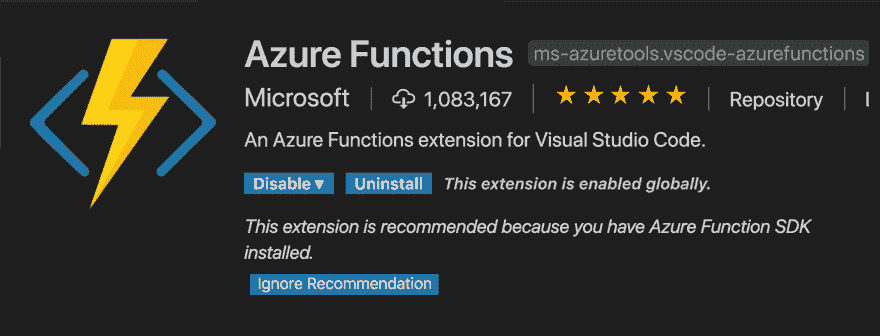
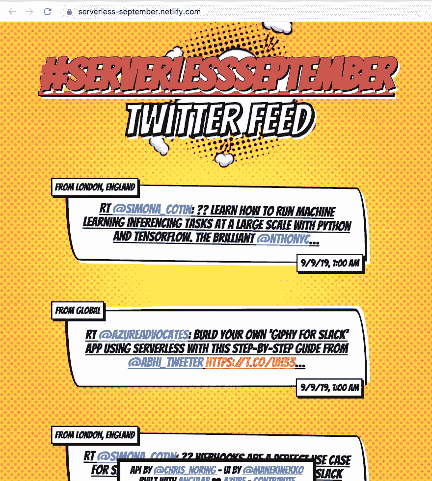

# 如何构建您的第一个无服务器逻辑应用程序，第二部分

> 原文：<https://dev.to/azure/how-you-can-build-your-first-logic-app-2o85>

在 [Twitter](https://twitter.com/chris_noring) 上关注我，很乐意接受您对主题或改进的建议/Chris

> 本文是 [#ServerlessSeptember](https://dev.to/azure/serverless-september-content-collection-2fhb) 的一部分。在这个无服务器的内容集合中，您可以找到其他有用的文章、详细的教程和视频。9 月份，每天都有来自社区成员和云倡导者的新文章发布，没错，每天都有。
> 
> 在[https://docs.microsoft.com/azure/azure-functions](https://docs.microsoft.com/azure/azure-functions/?WT.mc_id=servsept_devto-blog-cxa)了解更多关于微软 Azure 如何实现你的无服务器功能。

TLDR；这包括如何从 Node.js 连接到 SQL Server 数据库。

这是关于如何使用附带的无服务器 API 构建逻辑应用程序的系列文章的第二部分

*   [第一部分](https://dev.to/azure/how-you-can-build-your-first-logic-app-18he)搭建数据库并构建逻辑应用程序
*   第二部分，**我们在这里**，我们将构建一个无服务器函数，它连接到我们在第一部分中设置的 SQL Server 数据库

## 资源

*   注册一个免费的 Azure 账户如果你想开发逻辑应用和 Azure 功能，你需要一个 Azure 账户，这是免费的。
*   [逻辑应用概述](https://docs.microsoft.com/en-us/azure/logic-apps/?wt.mc_id=servsept_devto-blog-chnoring)提供逻辑应用概述和一些教程链接的优秀文档页面
*   [逻辑应用程序学习](https://docs.microsoft.com/en-us/learn/modules/intro-to-logic-apps/?wt.mc_id=servsept_devto-blog-chnoring)包含许多概念的优秀介绍模块。
*   [Logic apps LEARN II](https://docs.microsoft.com/en-us/learn/modules/route-and-process-data-logic-apps/?wt.mc_id=servsept_devto-blog-chnoring) 本模块将带您了解 Twitter、认知服务和 SQl Server 的真实示例。
*   [逻辑应用程序上的 aka.ms/learn 共有 5 个模块](https://docs.microsoft.com/en-us/learn/browse/?products=azure&resource_type=module&term=logic%20app&wt.mc_id=servsept_devto-blog-chnoring)逻辑应用程序上的 5 个模块，涵盖“Hello World”到更高级的自定义场景。
*   [逻辑应用中的连接器](https://docs.microsoft.com/en-us/azure/connectors/apis-list?wt.mc_id=servsept_devto-blog-chnoring)这将深入讨论连接器，它们是什么，存在哪些连接器
*   [创建自定义连接器](https://docs.microsoft.com/en-us/connectors/custom-connectors/create-logic-apps-connector?wt.mc_id=servsept_devto-blog-chnoring)关于如何创建自定义连接器的优秀文档
*   [VS 代码中的 Azure 函数](https://docs.microsoft.com/en-us/azure/azure-functions/functions-create-first-function-vs-code?wt.mc_id=servsept_devto-blog-chnoring)

## 重述

我们了解了什么是逻辑应用，一个包含许多伟大集成的框架。你在 Logic 应用程序中编码的方式是将组件连接在一起，并决定何时触发、应该执行什么操作以及为什么执行。

不是让我们继续。我们有一个 SQL 数据库，逻辑应用程序的所有结果都将存储在其中。

### 构建无服务器 API

好吧，那么，我们有一个逻辑应用程序，真棒:)！

现在我们需要构建一个无服务器 API，它像一个漂亮的 JSON 一样从数据库中读取数据并输出数据。

我们需要做到以下几点:

1.  安装先决条件，这意味着我们需要核心工具和 VS 代码扩展
2.  **支架**一个功能 app 和一个功能
3.  **添加一些代码**,它从数据库中读取数据并像 JSON 一样返回响应

**安装先决条件**

我们首先需要 Azure 功能核心工具。点击此链接，看看标题`Installing`

[Azure 功能核心工具安装](https://github.com/Azure/azure-functions-core-tools)

这应该能为你提供 Linux、Windows 和 Mac 的操作说明。

接下来我们需要 Azure Functions 扩展，看起来应该是这样的:

[](https://res.cloudinary.com/practicaldev/image/fetch/s--H4yzz4G6--/c_limit%2Cf_auto%2Cfl_progressive%2Cq_auto%2Cw_880/https://thepracticaldev.s3.amazonaws.com/i/vbdapynrua1umms5ruen.png)

**脚手架 app 和功能**

对于该步骤，选择`View/Command Palette`。

[](https://res.cloudinary.com/practicaldev/image/fetch/s--wG49wsN---/c_limit%2Cf_auto%2Cfl_progressive%2Cq_auto%2Cw_880/https://thepracticaldev.s3.amazonaws.com/i/0om7193bxcq2nvkkli3f.png)

选择你当前的目录，`JavaScript`，`HttpTrigger`，给你的函数起一个合适的名字，比如`Mentions`，选择`Anonymous`。在`Mentions`目录下，你现在有一个`index.js`文件，我们将对其进行更改。

**添加代码**

您需要向我们的`Mentions`目录添加一些额外的文件:

*   **util.js** ，这个文件将帮助我们将 SQL server 响应转换为 JSON
*   这个文件将帮助我们连接到我们的 SQL server 数据库
*   在这里我们定义一个配置对象，我们将使用它来连接到我们的数据库

首先，我们有`query.js`

```
// query.js

const {formatResponse} = require('./util');
var Request = require('tedious').Request;

function execute(query, connection) {
  return new Promise(resolve => {
    executeQuery(query,connection, (data) => {
      resolve(data);
    })
  }); 
}

var executeQuery = (query, connection, cb) => {
  request = new Request(query, (err, rowCount, rows) => {
    if (err) {
      console.log('error', err);
    } else {
      const formatted = formatResponse(rows);
      connection.close();
      cb(formatted);
    }
  });
  connection.execSql(request);
}

module.exports = execute; 
```

Enter fullscreen mode Exit fullscreen mode

接下来，我们使用`config.js`来设置所有的数据库连接位。

```
// config.js

// Create connection to database
const config = {
  authentication: {
    options: {
      userName: process.env.USER_NAME,
      password: process.env.PASSWORD 
    },
    type: 'default'
  },
  server: process.env.SERVER, 
  options: {
    database: process.env.DATABASE, 
    encrypt: true,
    rowCollectionOnRequestCompletion: true
  }
}

module.exports = config; 
```

Enter fullscreen mode Exit fullscreen mode

不高于我们如何从`process.env`读取配置数据。让我们来解释一下:

*   用户名，这是您的数据库的用户名
*   密码，那是密码
*   SERVER，这是服务器名称，您可以在数据库概述页面上找到它
*   数据库，这是您的数据库的名称

您可以将这些数据放在您的函数应用程序的应用程序设置中，也可以选择将它们放在您的项目中名为`local.settings.json`的文件中，该文件位于属性`Values`下。然后当你部署的时候你可以选择上传这个文件到 AppSettings

```
{  "IsEncrypted":  false,  "Values":  {  "AzureWebJobsStorage":  "",  "FUNCTIONS_WORKER_RUNTIME":  "node"  }  } 
```

Enter fullscreen mode Exit fullscreen mode

第三，我们有`util.js`将我们的 SQL Server 响应转换成类似 JSON 的东西:

```
[{  "column":  "value"  }] 
```

Enter fullscreen mode Exit fullscreen mode

最后，我们有一个看起来像这样的`index.js`文件:

```
// index.js

var Connection = require('tedious').Connection;
const execute = require('./query');
const config = require('./config');

async function get() {
  return new Promise(resolve => {
    var connection = new Connection(config);
    connection.on('connect', async function (err) {
        if (err) {
            console.log(err);
        } else {
            const res = await execute("SELECT * FROM Mentions ORDER BY TweetDate desc;", connection);
            resolve(res);
        }
    });
  });  
}

module.exports = async function (context, req) {
    context.log('JavaScript HTTP trigger function processed a request.');
    const res = await get();
    context.res = {
        contentType: 'application/json',
        body: res
    }
}; 
```

Enter fullscreen mode Exit fullscreen mode

如果您想在本地测试，您需要打开 SQL Server 的防火墙。

> 完成测试后，请确保删除防火墙规则:)

不要忘记安装我们需要连接到 SQL server 的 NPM 库`tedious`:

```
npm install tedious 
```

Enter fullscreen mode Exit fullscreen mode

**展开**

部署非常简单，只需点击左侧工具栏中的 Azure 图标。然后滚动到功能区域。

[](https://res.cloudinary.com/practicaldev/image/fetch/s--EEhG6aSG--/c_limit%2Cf_auto%2Cfl_progressive%2Cq_auto%2Cw_880/https://thepracticaldev.s3.amazonaws.com/i/cxn2lmkbo1o8a3ms4vwc.png)

此后，点击向上的蓝色箭头，选择您的订阅和它提示的所有其他内容，您的功能应该在几分钟内就会出现在云中。

### 实现一个 UI

这是我们消费 API 的最后一步。我们将指出 GitHub repo 就是这样做的。最终结果如下所示:

[](https://res.cloudinary.com/practicaldev/image/fetch/s--KVvtz_Xo--/c_limit%2Cf_auto%2Cfl_progressive%2Cq_auto%2Cw_880/https://thepracticaldev.s3.amazonaws.com/i/acwkx6sh6cfzqk0rzau3.png)

你可以在这里找到前端的代码

[回购](https://github.com/manekinekko/serverless-september-ui)

## 总结

我们经历了很多事情。我们的焦点是逻辑应用。正如您所看到的，一旦建立了数据库，就有大量的连接器可供使用。在某些情况下，您甚至不需要数据库，这实际上取决于您试图建模的场景。我们几乎没有触及逻辑应用程序能做什么的表面，但希望你能说*我知道它们是什么，它们的基本概念以及用它们做什么*。我已经为你留下了足够的资源链接来增加更多的知识和获得更多的实践。这么开心的编码:)