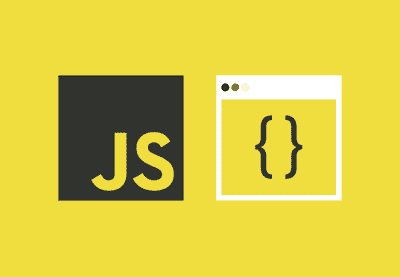

# Javascript 基础[currying，ReFlow，Repaint (ReDraw)]

> 原文：<https://dev.to/nimahkh/javascript-fundamental-currying-reflow-repaint-redraw-33>

[](https://res.cloudinary.com/practicaldev/image/fetch/s--9igwsVK---/c_limit%2Cf_auto%2Cfl_progressive%2Cq_auto%2Cw_880/https://thepracticaldev.s3.amazonaws.com/i/i7bih5xvug54leme8hrr.png)

这篇文章讲述了我在上次采访一位技术 CTO 时获得的经验。在那次采访中，他教会了我太多，我感谢他赐予我的知识。

这次采访，让我比以前更加了解 javascript 的基础知识。

### Re*(流& &绘制)

为了理解回流和重绘，这个链接帮助了我:

[了解 javascript 重画和重画](https://medium.com/darrja-%E0%A4%A6%E0%A4%B0%E0%A5%8D%E0%A4%9C%E0%A4%BE/what-the-heck-is-repaint-and-reflow-in-the-browser-b2d0fb980c08)

##### 如果我想说得很清楚:‌

重排是重新计算文档中元素的位置。回流是一个用户阻塞操作，但它有一些成本。

重画影响元素，不影响布局。

当你隐藏一个元素，添加或删除一些类时，你不改变布局，你改变了元素的可见性，并把它重绘成一个新的。

### 逢迎

Currying 是一种像递归函数一样调用带有多个参数的函数的技术。但是它有一些不同之处:

1-语法

2-它有运行序列

示例:

```
var sum =   function (a){
                 return function(b){
                       return function(c){
                              return a+b+c;
                              }        
                        }
                  }
console.log(sum(5)(2)(5))  //12 
```

currying 是闭包的集合，根据主题的顺序递归地返回一些值。非常好，不是吗？我喜欢它

我知道这篇文章没有太多的细节，但我决定与你分享我的经验，并收集一些主题，在一个档案位置。

以后我会分享更多