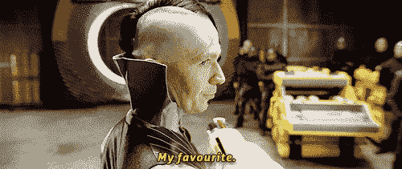
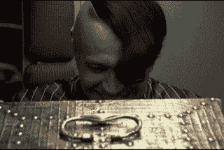

# Ruby Puts vs Print vs P vs PP vs...牛逼？

> 原文：<https://dev.to/lofiandcode/ruby-puts-vs-print-vs-p-vs-pp-vs-awesome-5akl>

当需要在 Ruby 的命令行中打印内容时，开发人员有多种选择。虽然这很有用，但也有点令人困惑。让我们看看我们的选择，看看我们是否能消除一些困惑。

我们将要讨论的 Ruby 中的五种打印方法是:

*   放
*   打印
*   p
*   过去分词
*   美国联合通讯社（Associated Press 的缩写）

对于这些方法中的每一个，我们将回顾它们如何输出到命令行，最重要的是它们返回什么。了解这一点很重要，因为不了解方法返回的内容会导致代码中出现很多 bug，最终导致很多挫折。

## **放言**

看跌期权是你最常使用的方法，所以让我们从这里开始。

```
// ♥ irb
2.6.1 :001 > puts "Hello World!"
Hello World!
 => nil 
```

<svg width="20px" height="20px" viewBox="0 0 24 24" class="highlight-action crayons-icon highlight-action--fullscreen-on"><title>Enter fullscreen mode</title></svg> <svg width="20px" height="20px" viewBox="0 0 24 24" class="highlight-action crayons-icon highlight-action--fullscreen-off"><title>Exit fullscreen mode</title></svg>

正如我们在上面的交互式 Ruby Shell 中看到的，puts 方法打印您传递给命令行的任何内容，后跟一个换行符。

Puts 还会打印数组的单个元素，每个元素后面都有一个换行符。

```
2.6.1 :001 > puts [1, 2, 3]
1
2
3
 => nil 
```

<svg width="20px" height="20px" viewBox="0 0 24 24" class="highlight-action crayons-icon highlight-action--fullscreen-on"><title>Enter fullscreen mode</title></svg> <svg width="20px" height="20px" viewBox="0 0 24 24" class="highlight-action crayons-icon highlight-action--fullscreen-off"><title>Exit fullscreen mode</title></svg>

Puts 还使用。to_s 方法。这会导致数组中的任何 nil 元素被打印为空字符串。

```
2.6.1 :002 > puts [1, nil, nil, 4, 5]
1

4
5
 => nil 
```

<svg width="20px" height="20px" viewBox="0 0 24 24" class="highlight-action crayons-icon highlight-action--fullscreen-on"><title>Enter fullscreen mode</title></svg> <svg width="20px" height="20px" viewBox="0 0 24 24" class="highlight-action crayons-icon highlight-action--fullscreen-off"><title>Exit fullscreen mode</title></svg>

我们也看到收益为零。这很重要，因为 Ruby 使用隐式返回，所以如果你在一个方法的末尾使用 puts，你希望它打印参数并返回它，你会失望的。

让我们来看一个例子。

```
2.6.1 :002 > def test_of_puts (string)
2.6.1 :003?>   puts string
2.6.1 :004?>   end
 => :test_of_puts 
2.6.1 :005 > return_value = test_of_puts ("Did I get returned?")
Did I get returned?
 => nil 
2.6.1 :006 > return_value
 => nil 
```

<svg width="20px" height="20px" viewBox="0 0 24 24" class="highlight-action crayons-icon highlight-action--fullscreen-on"><title>Enter fullscreen mode</title></svg> <svg width="20px" height="20px" viewBox="0 0 24 24" class="highlight-action crayons-icon highlight-action--fullscreen-off"><title>Exit fullscreen mode</title></svg>

[](https://i.giphy.com/media/bThzyz6mPU52MK9qgQ/giphy.gif)

## **打印**

接下来，我们来看看打印。Print 与 puts 非常相似，但也有一些不同之处。首先，print 还使用。to_s 并将其打印到命令行。但是它不添加换行符。

```
2.6.1 :006 > def print_example
2.6.1 :007?>   print 123
2.6.1 :008?>   print 456
2.6.1 :009?>   end
 => :print_example 
2.6.1 :010 > print_example
123456 => nil 
```

<svg width="20px" height="20px" viewBox="0 0 24 24" class="highlight-action crayons-icon highlight-action--fullscreen-on"><title>Enter fullscreen mode</title></svg> <svg width="20px" height="20px" viewBox="0 0 24 24" class="highlight-action crayons-icon highlight-action--fullscreen-off"><title>Exit fullscreen mode</title></svg>

print 与 puts 的另一个不同之处是，如果您传递 print 数组，它将简单地打印出包含括号的数组。

```
2.6.1 :011 > print [1, 2, 3]
[1, 2, 3] => nil 
```

<svg width="20px" height="20px" viewBox="0 0 24 24" class="highlight-action crayons-icon highlight-action--fullscreen-on"><title>Enter fullscreen mode</title></svg> <svg width="20px" height="20px" viewBox="0 0 24 24" class="highlight-action crayons-icon highlight-action--fullscreen-off"><title>Exit fullscreen mode</title></svg>

正如我们在这个例子中看到的，print 也返回 nil。抱歉加里·奥德曼。

[](https://i.giphy.com/media/lr5FCH1QDHrhu/giphy.gif)

干得好，加里！让我们继续讨论不返回 nil 的方法！

## **P**

当我们将 p 方法与看跌期权和期权进行比较时，我们发现了一些主要的区别。首先，p 打印你传递给它的原始对象。这是因为它使用。检查以将对象转换为字符串，而不是。

```
2.6.1 :001 > puts "Hello World!"
Hello World!
 => nil 
2.6.1 :002 > print "Hello World!"
Hello World! => nil 
2.6.1 :003 > p "Hello World!"
"Hello World!"
 => "Hello World!" 
2.6.1 :004 > p [1, 2, 3]
[1, 2, 3]
 => [1, 2, 3] 
2.6.1 :005 > p hash = {key1: "val1", key2: "val2", key3: "val3"}
{:key1=>"val1", :key2=>"val2", :key3=>"val3"}
 => {:key1=>"val1", :key2=>"val2", :key3=>"val3"} 
```

<svg width="20px" height="20px" viewBox="0 0 24 24" class="highlight-action crayons-icon highlight-action--fullscreen-on"><title>Enter fullscreen mode</title></svg> <svg width="20px" height="20px" viewBox="0 0 24 24" class="highlight-action crayons-icon highlight-action--fullscreen-off"><title>Exit fullscreen mode</title></svg>

从这个例子中，我们可以看到，与 puts 一样，p 在它打印的对象的末尾添加了一个换行符。但是 p 不返回零。它返回作为参数传递给它的同一个对象。结合 p 将原始对象打印到命令行的事实，这使得 p 在调试时非常有用。

## **PP**

PrettyPrint，或 pp，是 p 的一个特殊版本，除了它试图以一种更可读的格式将大的散列和数组打印到命令行之外，基本上完全相同。

```
2.6.1 :019 > pp ({ key1: 5, key2: { key21: 'val21', key22: 'val22', key23: 'val23' }, key3: { key31: 'val31', key32: 'val32', key33: 'val33' }, key4: [1, 2, 3, 4, 5] })
{:key1=>5,
 :key2=>{:key21=>"val21", :key22=>"val22", :key23=>"val23"},
 :key3=>{:key31=>"val31", :key32=>"val32", :key33=>"val33"},
 :key4=>[1, 2, 3, 4, 5]}
 => {:key1=>5, :key2=>{:key21=>"val21", :key22=>"val22", :key23=>"val23"}, :key3=>{:key31=>"val31", :key32=>"val32", :key33=>"val33"}, :key4=>[1, 2, 3, 4, 5]} 
```

<svg width="20px" height="20px" viewBox="0 0 24 24" class="highlight-action crayons-icon highlight-action--fullscreen-on"><title>Enter fullscreen mode</title></svg> <svg width="20px" height="20px" viewBox="0 0 24 24" class="highlight-action crayons-icon highlight-action--fullscreen-off"><title>Exit fullscreen mode</title></svg>

[](https://i.giphy.com/media/cHd3jtBy4SVNK/giphy.gif)

如果你喜欢 pp，加里，你会喜欢 ap 的。

## **美联社**

Awesome_print，或 ap，是由 Michael Dvorkin 创建的，虽然它没有包含在最新版本的 Ruby 中，但是可以通过在终端中输入以下命令来安装 gem:

```
$ gem install awesome_print 
```

<svg width="20px" height="20px" viewBox="0 0 24 24" class="highlight-action crayons-icon highlight-action--fullscreen-on"><title>Enter fullscreen mode</title></svg> <svg width="20px" height="20px" viewBox="0 0 24 24" class="highlight-action crayons-icon highlight-action--fullscreen-off"><title>Exit fullscreen mode</title></svg>

厉害 _ 大规模打印一个 ups pp。它不仅以更易读的格式显示嵌套散列，而且还在数组的每个元素旁边打印索引值。

```
2.6.1 :021 > ap ({ key1: 5, key2: { key21: 'val21', key22: 'val22', key23: 'val23' }, key3: { key31: 'val31', key32: 'val32', key33: 'val33' }, key4: [1, 2, 3, 4, 5] })
{
    :key1 => 5,
    :key2 => {
        :key21 => "val21",
        :key22 => "val22",
        :key23 => "val23"
    },
    :key3 => {
        :key31 => "val31",
        :key32 => "val32",
        :key33 => "val33"
    },
    :key4 => [
        [0] 1,
        [1] 2,
        [2] 3,
        [3] 4,
        [4] 5
    ]
}
 => nil 
```

<svg width="20px" height="20px" viewBox="0 0 24 24" class="highlight-action crayons-icon highlight-action--fullscreen-on"><title>Enter fullscreen mode</title></svg> <svg width="20px" height="20px" viewBox="0 0 24 24" class="highlight-action crayons-icon highlight-action--fullscreen-off"><title>Exit fullscreen mode</title></svg>

[](https://i.giphy.com/media/t9X2fFy8QOT1S/giphy.gif) 
我知道，对吧？！？！太棒了 _ 打印也让我热泪盈眶，加里！

只有一个问题...ap 返回零。

[](https://i.giphy.com/media/L48kNVDnZaH60/giphy.gif) 
我认识加里。我知道。生活有时就是这样。我们并不总是得到我们想要的一切。但是现在我们对这五种 Ruby 打印方法的工作原理有了更好的理解，我们将能够更好地使用正确的工具来完成正确的工作。

### **参考文献**

#### 红宝石内核版本:2.6.1

[https://ruby-doc.org/core-2.6.1/Kernel.html#method-i-puts](https://ruby-doc.org/core-2.6.1/Kernel.html#method-i-puts)

#### 牛逼 _ 打印

作者:迈克尔·德沃金
[https://github.com/awesome-print/awesome_print/](https://github.com/awesome-print/awesome_print/)
[http://www.dvorkin.net](http://www.dvorkin.net)

#### 吉菲

每个 gif 按照它们出现的顺序排列。
[https://giphy.com/gifs/reaction-bThzyz6mPU52MK9qgQ](https://giphy.com/gifs/reaction-bThzyz6mPU52MK9qgQ)
[https://giphy . com/gifs/reaction-done-Gary-old man-lr 5 fc h1 qdhrhu](https://giphy.com/gifs/reaction-done-gary-oldman-lr5FCH1QDHrhu)
[https://giphy . com/gifs/reaction-wink-Gary-old man-CHD 3 jtby 4 svnk](https://giphy.com/gifs/reaction-wink-gary-oldman-cHd3jtBy4SVNK)
[https://giphy . com/gifs/reaction-Gary-old man-fifth-element-t 9 x2 ff y8 qot 1s](https://giphy.com/gifs/reaction-gary-oldman-fifth-element-t9X2fFy8QOT1S)