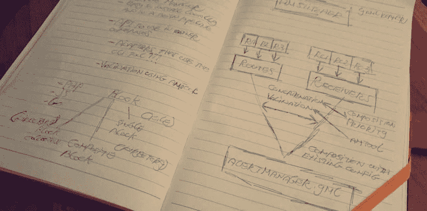

# 使用 PyYAML 配置 Alertmanager

> 原文：<https://dev.to/serializator/alertmanager-configuration-with-pyyaml-and-include-1504>

**我的噩梦就像是试图用 Alertmanager 使用多个配置文件**💀👀

我最近开始监控我们在[提供的](https://www.weprovide.com)的一些内部工具和服务。作为第一次尝试，我决定修补一下“普罗米修斯、格拉夫纳和 Alertmanager”堆栈。

显然，我们有些小问题...💩

[](https://res.cloudinary.com/practicaldev/image/fetch/s--xSrHYsiC--/c_limit%2Cf_auto%2Cfl_progressive%2Cq_auto%2Cw_880/https://thepracticaldev.s3.amazonaws.com/i/lo8hgm03jfsac1yrgsy8.jpg)

最初我开始考虑一个我可以编写的工具，类似于`am-stitcher` ( *ssooo 原创，完全不像`amtool`...*)，但是...我意识到我过度设计了一些东西，基本上就是将多个 YAML 文件合并成一个。

谷歌，我来了，请给我一些有用或可复制粘贴的东西！❤️
就字面上的合并而言，我真的没有找到任何足以满足这个用例的东西。

我遇到的一些工具做了我想让它们做的事情，但是不能让我控制以什么顺序合并它们。有些是这样，但是它们要求我单独指定每个文件，而不是能够递归地搜索一个目录。

**PyYAML 与 pyyaml-include** 💌 💕我在 YAML 找到了一篇关于的文章，尽管我很天真，但我认为这在 YAML 可能行得通...但是，当然，它没有！

对`!include`的支持是由`pyyaml-include`扩展添加的，它将这个“指令”添加到 PyYAML 中。

因此...我尝试使用 PIP 安装 PyYAML 和`pyyaml-include`扩展，希望使用 PyYAML 的解析只与 CLI 一起工作，并且它会自动使用`pyyaml-include`扩展。但是我找不到只在 CLI 中使用 PyYAML 的方法...

我真的不应该这么天真...你不也这样认为吗？😬😅

我最终编写的是一个小 Python 脚本，它导入 PyYAML 并使用`pyyaml-include`解析`!include`“指令”。

不要被愚弄了，这是大量的复制粘贴和反复试验的结合！🔥

```
import sys
import os
import yaml
from yamlinclude import YamlIncludeConstructor

YamlIncludeConstructor.add_to_loader_class(loader_class=yaml.FullLoader, base_dir=os.getcwd())

data = ''

for line in sys.stdin:
    data += line

data = yaml.load(data, Loader=yaml.FullLoader)
yaml.dump(data, sys.stdout, default_flow_style=False) 
```

Enter fullscreen mode Exit fullscreen mode

我决定使用标准的输入(`sys.stdin`)和输出(`sys.stdout`)流进行读写。当我甚至不知道 Python 语法的时候，我不想为使用参数而烦恼😅

```
python parse-yaml.py < alertmanager.yml > merged.yml 
```

Enter fullscreen mode Exit fullscreen mode

我们要不要增加一点自动化？！🙌

在我们提供的产品中，我们主要使用 Bitbucket，对于开源产品，我们使用 GitHub(显然...)，但对于大多数东西，我们使用 Bitbucket。

它由三个步骤组成，“解析和合并”、“验证”和“部署”。我觉得这些都是不言自明的，你不觉得吗？😊

```
pipelines:
  default:
    - step:
        name: Parse & Merge
        image: python:3.5.1
        script:
          - pip install pyyaml pyyaml-include
          - python parse-yaml.py < alertmanager.yml > merged.yml
        artifacts:
          - merged.yml
    - step:
        name: Validate
        image: serializator/amtool
        script:
          - amtool check-config merged.yml
    - step:
        name: Deploy
        image: eeacms/rsync
        script:
          - rsync merged.yml $USER@$HOST:$ALERTMANAGER_YAML
          - curl -L -X POST $HOST$RELOAD_PATH 
```

Enter fullscreen mode Exit fullscreen mode

你可以看到，其中一个图像是`serializator/amtool`。最初我尝试使用思科元云(Anthony Rogliano) 的 [`amtool-docker`图像。但是它建立在`golang:1.9-alpine3.6`之上的事实导致了在 Bitbucket 管道中使用`/bin/bash`而不是`/bin/sh`的问题。](https://hub.docker.com/r/metacloud/amtool-docker)

*^如果你知道这个问题的解决方案，或者如果我在 Bitbucket 管道中忽略了一些我可以配置的东西，请告诉我！* ❤️

我最终做的是分叉存储库并在`golang:1.13-stretch`而不是`golang:1.9-alpine3.6`上构建映像。

*^我想过不使用 alpine 标签会增加尺寸，但从用例来看，我认为这是可以忽略的。*

**我爱上了“/-/reload”端点**🙈🙊
我以为我必须使用 SSH 和 Docker Compose 来重启 Alertmanager 服务，但幸运的是，它没有那么难看。

在 2016 年的某个地方，[甄阳昭](https://github.com/ZhenyangZhao)介绍了`/-/reload`端点，我很高兴他提出了那个拉请求！知道我的一个部署中没有 cURL，我不知道我将如何面对自己...

因此，我毫不犹豫地快速编写了一行代码向`/-/reload`端点发送 POST 请求，使用环境变量配置了一些东西，并将其推送给 master！

我不知道这种快乐的存在！😊🔥我终于躺在床上，闭上眼睛，脸上带着幸福的微笑，开始梦见我将要写的许多文件、文件夹和东西！😆

我希望你从中得到一些有用的东西，如果没有，我希望你至少喜欢阅读它！

我感谢你，[@ yamadashi](https://dev.to/yamadashy)感谢[这个表情符号小抄❤️](https://dev.to/yamadashy/emoji-cheatsheet-of-githubslackdiscordqiita-4d2f)