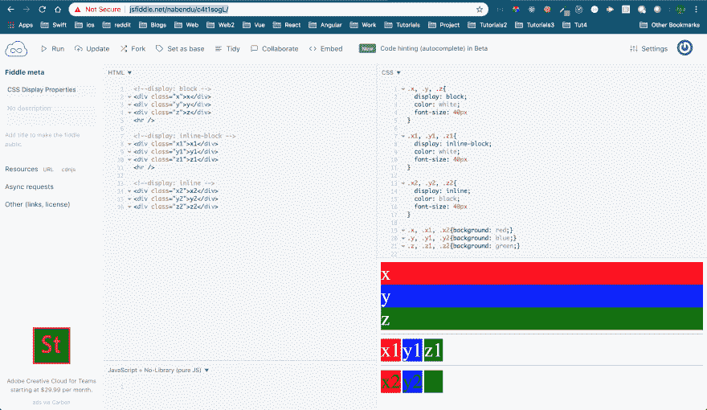
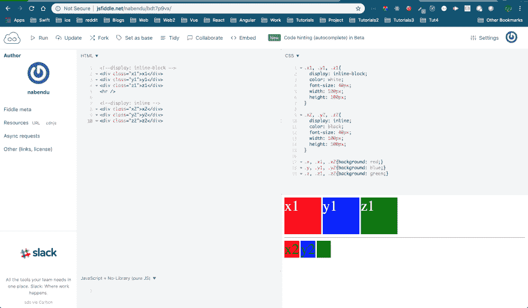
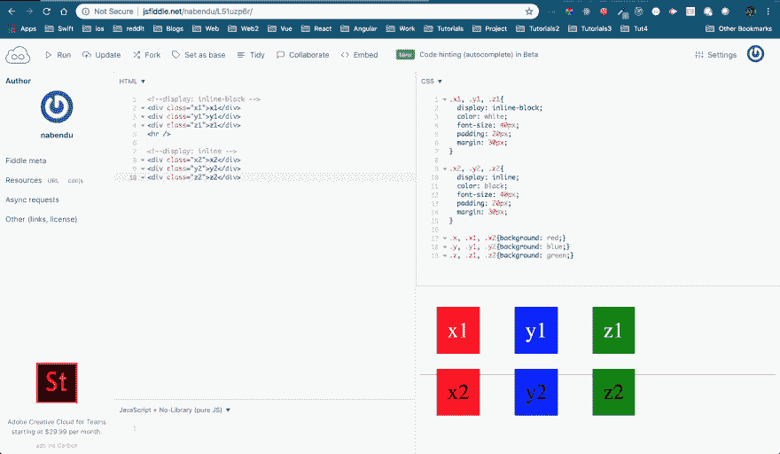
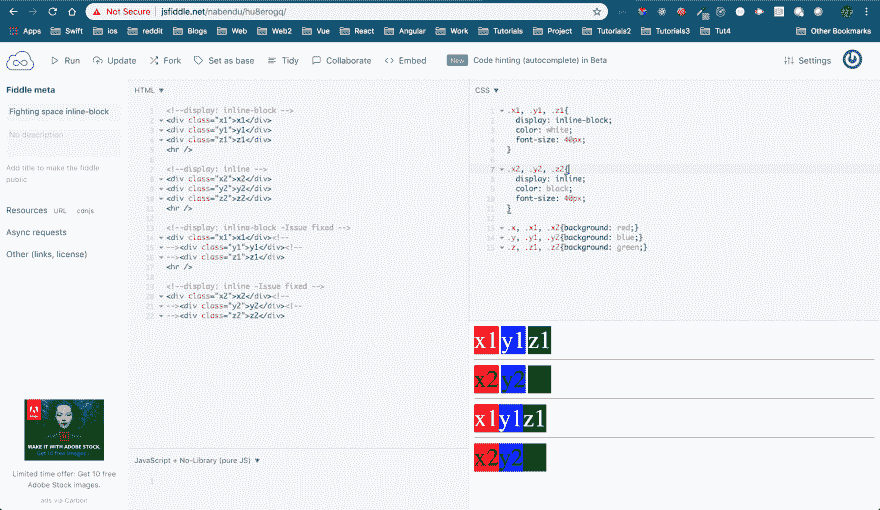
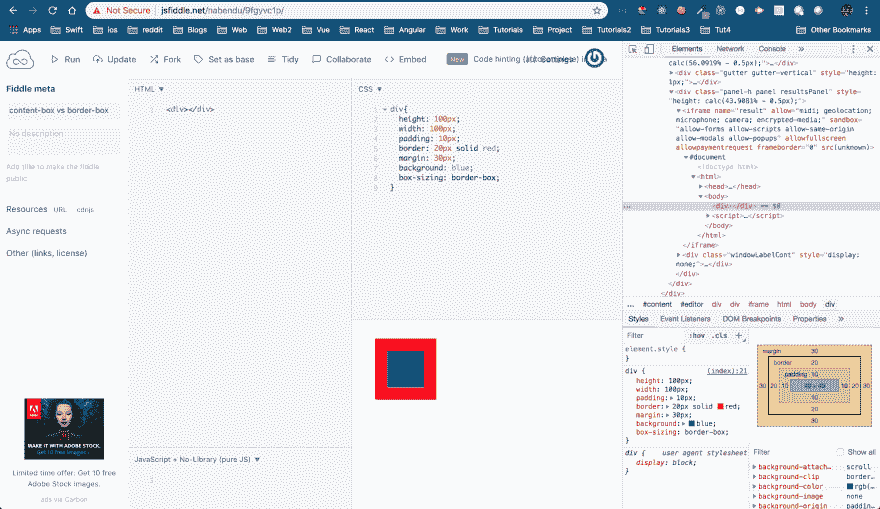
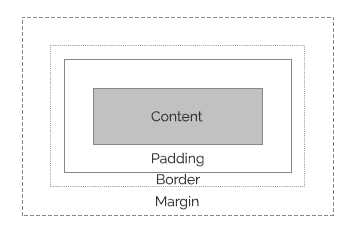

# 面试准备 CSS 问题-1

> 原文:[https://dev . to/nabe NDU 82/interview-preparation-CSS-questions-1-31d 4](https://dev.to/nabendu82/interview-preparation-css-questions-1-31d4)

欢迎来到本系列的第 13 部分和 CSS 问题的第一部分。

**问题 79-** *显示:block、inline-block、inline* 有什么区别？
**答-** 这些是网页中每个 HTML 元素的不同属性。默认情况下，所有内容都显示在页面上。

**display:block**
当我们赋予一系列元素这种属性时，它们会一个接一个的出现，如同堆积。每个块元素也将覆盖页面的整个宽度。默认情况下，块级元素是`
, 
, 
, <ul>, <ol>, <li> and more`。下面的 jsfiddle 显示显示:block。

 ** *显示:块***

显示:内嵌块
这将把元素放在一行中，而不是堆积起来。默认情况下，高度和宽度是内容的大小。两个元素之间还有一个空格，是浏览器放的。我们将更新我们的 jsfiddle 来显示“内联块”元素。

 ** *显示:内嵌块***

**display:inline**
这也将元素设置在一行中。两个元素之间还有一个空格，是浏览器放的。默认情况下，行内元素是`<a>, , <input>,  , <select> and more`。我们将更新 jsfiddle 来显示“内联”元素。

 ** *显示:内嵌***

以上的 jsfiddle 可以在[这里](http://jsfiddle.net/nabendu/c4t1sogL/)找到。

**问题 80-** *有没有可能在 display:inline-block 和 display:inline* 中有宽度和高度？
**答案-** “显示:内联-阻止”是“显示:阻止”和“显示:内联”的组合。因此，它也具有块级元素的一些性质。

> *在“显示:内嵌块”中可以有宽度和高度，但在“显示:内嵌”中没有*

同样显示在下面的 jsfiddle 中。你可以在这里找到 js fiddle。

 *显示:直列-闭塞 vs 显示:直列*

**问题 81-** *在 display:inline-block 和 display:inline* 中可以有填充和边距吗？
**答-** 在“显示:内联-块”和“显示:内联”中都可以有填充和边距。

同样显示在下面的 jsfiddle 中。你可以在这里找到 js fiddle。

 *显示:内联-闭塞和显示:内联*

**问题 82-** *如何消除“display:inline-block”和“display:inline”*中的缺省间隙？
**答案-** 在前面我们看到的“显示:内联-块”和“显示:内联”中，元素之间都有空格。得到空格的原因是，元素之间有空格(为了清楚起见，一个换行符和几个制表符也算一个空格)。

有一些去除空格的技巧。其中之一是在元素之间添加 HTML 注释。你可以在这篇惊人的 CSS 技巧文章[这里](https://css-tricks.com/fighting-the-space-between-inline-block-elements/)找到更多的技巧。

T3】消除违约差距

以上的 jsfiddle 可以在[这里](http://jsfiddle.net/nabendu/hu8erogq/)找到。

**问题 83-** *什么是 CSS 盒子模型*？
**答案-** CSS 盒子模型是一个包裹 HTML 中每一个元素的盒子，包括内容、填充、边框和边距。

我们可以有一个空的

and set Content(height & width), Padding, Border and Margin. Also, open the developer tools which will show our box model.
You can find the JSfiddle [here](http://jsfiddle.net/nabendu/sbdj0fma/).

 *箱子模型*

**问题 84-** *框尺寸:内容框和框尺寸:边框框有什么区别*？
**答-** 默认情况下每个框(HTML 元素)都是“box-sizing: content-box”。这意味着内容与边框和填充是分开的。它显示在下面，其中内容(100 像素)与填充(100 像素，两边)和边框(20 像素，两边)分开。

 *【框定尺寸:内容框】*

现在，我们将把上面的改为“框尺寸:边框-框”,看看有什么不同。正如你在下面看到的，盒子缩小了。是因为填充(两边 10px)和边框(两边 20px)变成了内容(100px)的一部分。你可以在这里找到这把小提琴[。](http://jsfiddle.net/nabendu/9fgyvc1p/)

 *“框定尺寸:边框-框”*

**问题 85-***CSS 中可以有负填充和负边距吗*？
**答案-** 我们先来了解一下什么是与 box-model 相关的填充和边距。盒子模型显示如下。

 *箱子模型*

*   填充会推开内容的边框，因此它会在内容周围留出空间。当设置为零时，填充边缘与内容边缘相同。

*   边距会将内容从任何其他现有框中推开。它用于在元素之间形成水平和垂直间距。当 margin 设置为零时，意味着边距边缘与边框边缘相同。

通过将 margin 设为负值，我们可以得到许多有趣的 CSS 显示案例。但是负填充没有任何意义，也是不允许的。

因此，我们可以有负边距，但没有负填充。

本系列的第 13 部分和 CSS 问题的第一部分到此结束。