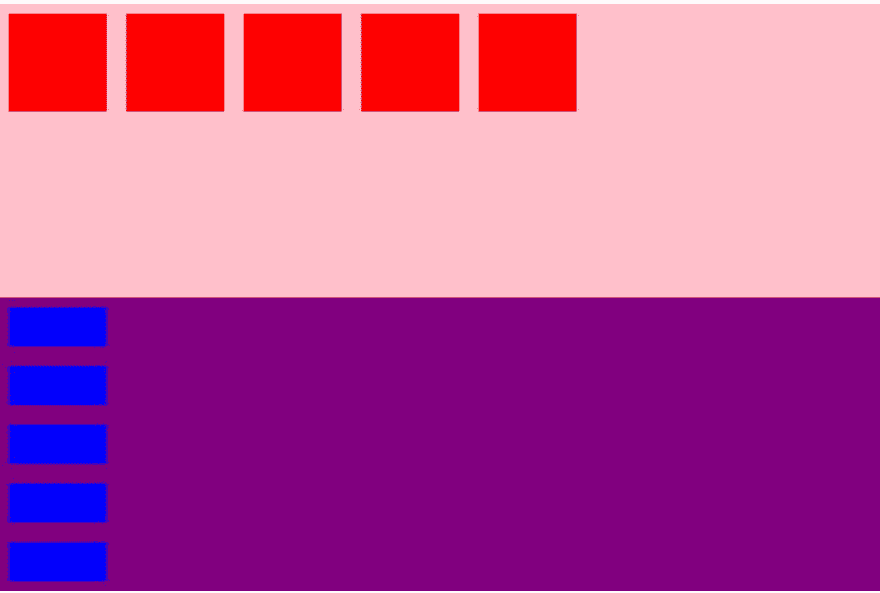
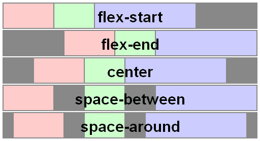
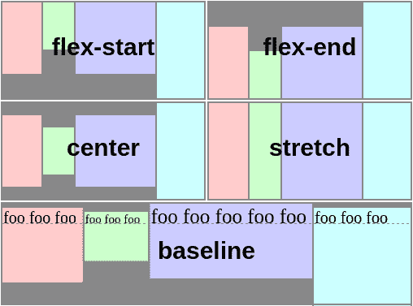
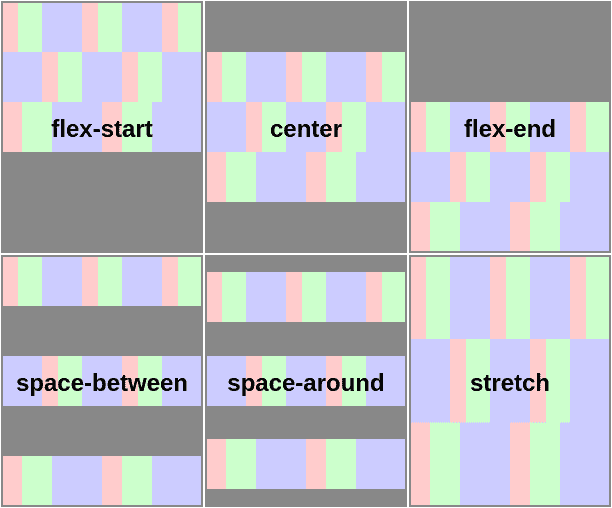

# 用 CSS 制作布局(下)——前端开发系列之五

> 原文:[https://dev . to/dillion megida/making-layouts-with-CSS-pt-b-part-5-of-frontend-development-series-1 ICL](https://dev.to/dillionmegida/making-layouts-with-css-pt-b-part-5-of-frontend-development-series-1icl)

这篇文章最初发表在我的博客- [Dillion Megida 的博客](https://www.dillionmegida.com/p/css-flex-property/)。我在我的博客上写了不同的前端术语。

本文是我上一篇文章[用 CSS (Pt a)制作布局——前端开发系列](https://dev.to/dillionmegida/making-layouts-with-css-pt-a-part-5-of-frontend-development-series-3opd)的第 5 部分——关于前端开发系列的延续。

### [](#table-of-contents)目录

*   CSS Flex
*   结论

> 如果我要包括 CSS Flex 和 Grid，这篇文章会太长，因此，我会在下一篇文章中写关于 Grid 的内容。

# [](#css-flex)CSS 伸缩

显示属性(`display: flex`)的这个值定义了一个块级 flex 容器。flex 容器使得在更大和更小的屏幕上控制你的元素变得容易。因此，它提供了响应上的便利。

顾名思义,“flex”可以让你的元素变得灵活。也就是说，它们可以自我调整(不考虑设定的宽度或高度)以适应容器。

让我们举一个例子

```
<!-- index.html -->
<link rel='stylesheet' href='style.css' type='text/css' />
<div class='flexContainer1'>
    <div></div>
    <div></div>
    <div></div>
    <div></div>
    <div></div>
</div>

<div class='flexContainer2'>
    <div></div>
    <div></div>
    <div></div>
    <div></div>
    <div></div>
</div> 
```

<svg width="20px" height="20px" viewBox="0 0 24 24" class="highlight-action crayons-icon highlight-action--fullscreen-on"><title>Enter fullscreen mode</title></svg> <svg width="20px" height="20px" viewBox="0 0 24 24" class="highlight-action crayons-icon highlight-action--fullscreen-off"><title>Exit fullscreen mode</title></svg>

```
/* style.css */
.flexContainer1, .flexContainer2 {
    display: flex;
    height: 300px;
    width: 900px;
}
.flexContainer1 {
    background-color: pink;
}
.flexContainer2 {
    background-color: purple;
}
.flexContainer1 div, .flexContainer2 div {
    height: 100px;
    width: 100px;
    margin: 10px;
} 
```

<svg width="20px" height="20px" viewBox="0 0 24 24" class="highlight-action crayons-icon highlight-action--fullscreen-on"><title>Enter fullscreen mode</title></svg> <svg width="20px" height="20px" viewBox="0 0 24 24" class="highlight-action crayons-icon highlight-action--fullscreen-off"><title>Exit fullscreen mode</title></svg>

上面的 css 文件通过`display: flex`将我们的 divs - `flexContainer1`和`flexContainer2` div 呈现为一个 flex 容器

我们对上述程序的结果是，

[T2】](https://res.cloudinary.com/practicaldev/image/fetch/s--aYslnRD_--/c_limit%2Cf_auto%2Cfl_progressive%2Cq_auto%2Cw_880/https://res.cloudinary.com/dillionmegida/image/upload/v15680368img/code_samples/website1_rf0g7n.jpg)

在继续我们的节目之前，我想陈述一下 flex 容器的属性

*   弯曲方向
*   调整内容
*   对齐-项目
*   对齐内容
*   柔性包装
*   柔性流

> 这些属性仅在 flex 容器中使用，即`display: flex`是必需的。

## [](#-raw-flexdirection-endraw-)`flex-direction`

这指定了元素可以灵活移动的路径。该属性可用的值为`row, column, row-reverse, column-reverse`，默认值为`row`。

从上面添加到我们的 CSS 样式表，如果我们有

```
.flexContainer1 {
    display: flex;
    flex-direction: row;
}
.flexContainer2 {
    display: flex;
    flex-direction: column; 
```

<svg width="20px" height="20px" viewBox="0 0 24 24" class="highlight-action crayons-icon highlight-action--fullscreen-on"><title>Enter fullscreen mode</title></svg> <svg width="20px" height="20px" viewBox="0 0 24 24" class="highlight-action crayons-icon highlight-action--fullscreen-off"><title>Exit fullscreen mode</title></svg>

我们的结果，

[T2】](https://res.cloudinary.com/practicaldev/image/fetch/s--xnJxAttY--/c_limit%2Cf_auto%2Cfl_progressive%2Cq_auto%2Cw_880/https://res.cloudinary.com/dillionmegida/image/upload/v15680368img/code_samples/website2_xlsmql.jpg)

> 注意到 flexContainer2 的 div 的高度降低了一点吗？我们将在`flex-wrap`讨论这个问题

我想这个结果是不言自明的，因为`flex-direction determines the path along which the elements should be flexible.`

剩余的两个值- `row-reverse and column-reverse`用这些值做同样的事情，但是有区别。对于行反转，容器从右到左堆叠元素。对于列反转，容器从下到上堆叠元素。

我们以`row-reverse`为例。当我们改变. flexContainer2 的伸缩方向时，这样

```
.flexContainer2 {
    display: flex;
    flex-direction: row-reverse;
} 
```

<svg width="20px" height="20px" viewBox="0 0 24 24" class="highlight-action crayons-icon highlight-action--fullscreen-on"><title>Enter fullscreen mode</title></svg> <svg width="20px" height="20px" viewBox="0 0 24 24" class="highlight-action crayons-icon highlight-action--fullscreen-off"><title>Exit fullscreen mode</title></svg>

我们有，

[T2】](https://res.cloudinary.com/practicaldev/image/fetch/s--v-OUAXVv--/c_limit%2Cf_auto%2Cfl_progressive%2Cq_auto%2Cw_880/https://res.cloudinary.com/dillionmegida/image/upload/v15680368img/code_samples/website3_mxzcom.jpg)

## [](#-raw-flexwrap-endraw-)`flex-wrap`

如上图所示，元素对齐良好，同时仍保留其指定的属性(特别是宽度和高度)。让我们尝试增加宽度的值。

```
.flexContainer1 div, .flexContainer2 div {
    width: 600px;
    height: 100px;
} 
```

<svg width="20px" height="20px" viewBox="0 0 24 24" class="highlight-action crayons-icon highlight-action--fullscreen-on"><title>Enter fullscreen mode</title></svg> <svg width="20px" height="20px" viewBox="0 0 24 24" class="highlight-action crayons-icon highlight-action--fullscreen-off"><title>Exit fullscreen mode</title></svg>

结果，

[T2】](https://res.cloudinary.com/practicaldev/image/fetch/s--NjFtpwfE--/c_limit%2Cf_auto%2Cfl_progressive%2Cq_auto%2Cw_880/https://res.cloudinary.com/dillionmegida/image/upload/v15680368img/code_samples/website4_xh6kp9.jpg)

你注意到了什么？

我用了 600 像素，所以我的观点很好地解释了。很明显，这些盒子没有 600 像素宽。

元素丢失了指定的宽度值。还记得我说的`flexible`？

这与上面的`flex-direction: column`图中发生的事情是一样的。

flex 容器试图将元素挤进去，以确保它们仍然在容器中。
T3 这就是`flex-wrap`的用武之地。该属性的可用值为`wrap, nowrap and wrap-reverse`

`wrap`简单地通知容器在需要时包装元素。容器不再试图挤进元素。一旦元素占据了宽度空间(或`column`方向的高度空间)，元素就换行到下一行(或列)。让我们应用这些值，

```
.flexContainer1, .flexContainer2 {
    display: flex;
    width: 900px;
    height: 300px;
    flex-wrap: wrap;
}
.flexContainer2 {
    flex-direction: column;
}
.flexContainer1 div, .flexContainer2 div {
    width: 200px;
    height: 200px;
} 
```

<svg width="20px" height="20px" viewBox="0 0 24 24" class="highlight-action crayons-icon highlight-action--fullscreen-on"><title>Enter fullscreen mode</title></svg> <svg width="20px" height="20px" viewBox="0 0 24 24" class="highlight-action crayons-icon highlight-action--fullscreen-off"><title>Exit fullscreen mode</title></svg>

> 请注意，其他值仍然存在于我们的第一个程序中，我只是添加了这一行。

[T2】](https://res.cloudinary.com/practicaldev/image/fetch/s--G5ahlelB--/c_limit%2Cf_auto%2Cfl_progressive%2Cq_auto%2Cw_880/https://res.cloudinary.com/dillionmegida/image/upload/v15680368img/code_samples/website5_wr7xnr.jpg)

这是我们的结果。

`nowrap`只是告诉容器不要包装元素。这是`flex-wrap`属性的默认值。

`wrap-reverse`在需要的地方以相反的顺序包装元素。

# [](#-raw-flexflow-endraw-)`flex-flow`

这只是`flex-direction`和`flex-wrap`的简写属性。

一个例子是

```
.flexContainer1 {
    display: flex;
    flex-flow: column wrap;
} 
```

<svg width="20px" height="20px" viewBox="0 0 24 24" class="highlight-action crayons-icon highlight-action--fullscreen-on"><title>Enter fullscreen mode</title></svg> <svg width="20px" height="20px" viewBox="0 0 24 24" class="highlight-action crayons-icon highlight-action--fullscreen-off"><title>Exit fullscreen mode</title></svg>

# [](#-raw-justifycontent-endraw-)`justify-content`

该属性用于沿水平方向对齐容器中的元素。

> 这里的水平方向是指`flex-direction: row`。当方向变为列时，`justify-content`沿垂直方向对齐元素。

[T2】](https://res.cloudinary.com/practicaldev/image/fetch/s--Hj6EvRCZ--/c_limit%2Cf_auto%2Cfl_progressive%2Cq_auto%2Cw_880/https://res.cloudinary.com/dillionmegida/image/upload/v15680368img/code_samples/website6_sfmk5g.png)

可用的值有`flex-start, flex-end, center, space-between, space-evenly, space-around`。

`flex-start` -这是默认设置，将元素与容器的开头对齐。

`flex-end` -在容器的末端对齐元素

`center` -将元素对齐容器的中心

`space-evenly` -对齐元素，使它们和容器之间的间距相等

`space-around` -与`space-evenly`相似，但空间不完全均匀

`space-between` -有点类似于`space-around`，但是空格只在元素之间。容器中没有空格

# [](#-raw-alignitems-endraw-)`align-items`

该属性在某些方面类似于 justify-content。它用于沿内容对齐的相反方向对齐元素，即默认情况下(`flex-direction: row`)，`align-items`沿垂直方向对齐元素。当伸缩方向变为列时，`align-items`使用水平方向进行对齐。

[T2】](https://res.cloudinary.com/practicaldev/image/fetch/s--UiYy6fTg--/c_limit%2Cf_auto%2Cfl_progressive%2Cq_auto%2Cw_880/https://res.cloudinary.com/dillionmegida/image/upload/v15680368img/code_samples/website7_uqs9ye.svg)

但是，

`align-items`属性有自己的值，这些值是`flex-start, flex-end, center, stretch and baseline`

与 justify-content 一样，它从容器的开头开始对齐。

你可能已经猜到了，从容器的末端开始对齐。

`center` -将元素居中对齐

默认情况下，拉伸元素的高度(或宽度)以占据容器中的可用空间。

`baseline` -对齐元素，使其基线对齐。

> `justify-content`和`align-items`有时会带来困惑。对于许多开发人员来说，第一次尝试时很难有效地使用它们。我在这里写了一篇文章-[JUSTIFY-CONTENT&ALIGN-ITEMS at your first try😊这就清楚地解释了不同之处。](https://dev.to/dillionmegida/justify-content-align-items-at-your-first-try-3ged)

# [](#-raw-aligncontent-endraw-)`align-content`

这个属性更像`align-items`，但是它不是对齐元素，而是对齐元素周围的弯曲线。

[T2】](https://res.cloudinary.com/practicaldev/image/fetch/s--j3P_0xyW--/c_limit%2Cf_auto%2Cfl_progressive%2Cq_auto%2Cw_880/https://res.cloudinary.com/dillionmegida/image/upload/v15680368img/code_samples/website8_d8izuq.svg)

此处应用了`align-items`的所有属性，但更多关注的是上图中的挠曲线。

# [](#conclusion)结论

使用 CSS Flex，您可以使任何网站具有响应性——使元素在必要的地方换行或者在较小的屏幕上缩小它们的大小。

注意我写的关于`CSS Grid`的 CSS 布局的 c 部分。

感谢阅读。

你可以在推特上联系我。

请在下面的评论区提问或投稿。