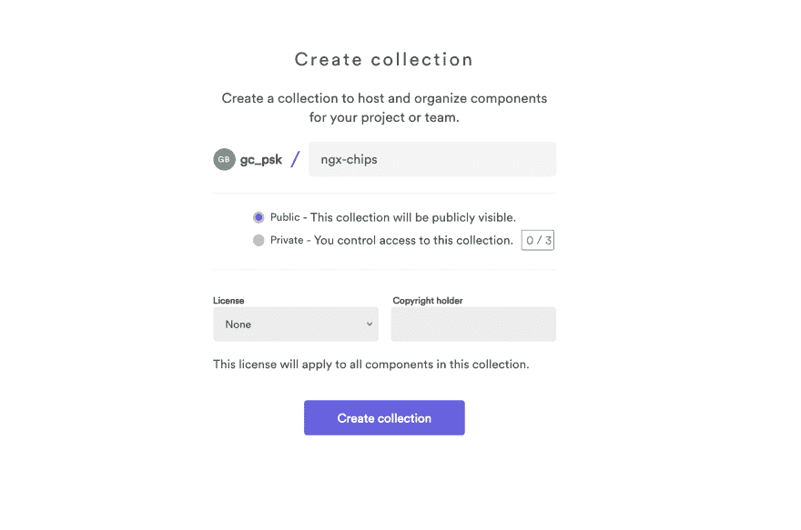
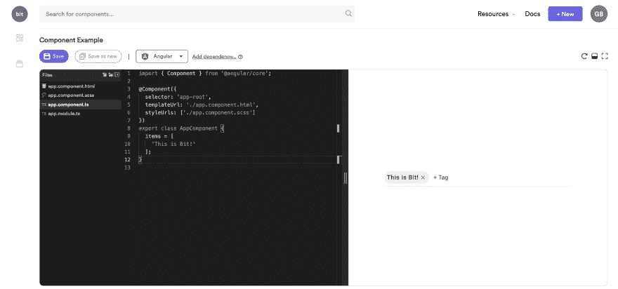

# 与角度和位共享组件

> 原文：<https://dev.to/giteden/sharing-components-with-angular-and-bit-1no5>

### Bit 简介:如何轻松共享和协作单个角度组件。

*本文最初由 Giancarlo Buomprisco* 在发表

[ on [Unsplash](https://unsplash.com?utm_source=medium&utm_medium=referral)](img/4ac6d17b8dbfcba49ae922aaa0f6a998.png) ](https://res.cloudinary.com/practicaldev/image/fetch/s--vsGgTegI--/c_limit%2Cf_auto%2Cfl_progressive%2Cq_auto%2Cw_880/https://cdn-images-1.medium.com/max/10368/0%2AYF3g1G9fdPQHsiSv) *照片由[阿尔瓦罗·雷耶斯](https://unsplash.com/@alvaroreyes?utm_source=medium&utm_medium=referral)在 [Unsplash](https://unsplash.com?utm_source=medium&utm_medium=referral)* 

### 为什么[位](https://bit.dev)？

[Bit](https://bit.dev) 是一个工具，它位于我们日常使用的工具之上，如 *Git* 和 *NPM* ，它帮助团队构建组件，测试并隔离呈现它们，在一个整洁的 UI 中搜索并可视化它们，并轻松地与其他团队共享它们。

Bit 适用于小型团队，但更适合跨团队协作，即处理位于不同存储库中的多个项目。

事实上，它有助于扩展由不同团队构建的项目，甚至超越 monorepo 架构；它允许我们在多个存储库之间构建和同步组件，促进跨团队和代码库的协作和敏捷性。

*模块化*是 *Bit* 背后的核心概念之一:这个想法是你可以发布许多独立构建的小代码片段，而不是整个库，并专注于每个组件的单一责任，而不是它们所属的全球框架。

[ ](https://res.cloudinary.com/practicaldev/image/fetch/s--Y5K1KSYa--/c_limit%2Cf_auto%2Cfl_progressive%2Cq_66%2Cw_880/https://cdn-images-1.medium.com/max/2000/1%2Aeby7DKoLT-OCpOswu2HEbw.gif) *轻松打包、发布和协作单个组件*

### 位为开发者

大公司有大量的团队和开发人员，他们最终工作(和重写)相似的组件或实用程序是很常见的；像 GitHub 和 NPM 这样的产品是推送和发布代码的显而易见的选择——但是当涉及到可视化、可发现性和部署时，它们仍然缺乏可以帮助团队轻松共享组件和实用程序的工具。

无论您是在大型企业工作，还是构建开源代码的独立开发人员，您都面临着一些常见的挑战，例如:

*   提供了一种简单的安装方法

*   通过使其易于搜索和发现来进行营销

*   添加帮助消费者理解用例的可视化示例

*   添加 API 片段，帮助消费者轻松实现该库

*   自动化 CI 和 CD

这就是 *Bit* 的用武之地:事实上，它可以帮助解决上述所有问题。

### ……和非开发者

Bit 不仅帮助开发人员构建和共享组件，还帮助设计人员、产品所有者和利益相关者，为他们提供一个用户友好的界面来搜索、探索和可视化存储在集合中的组件。

可以为每个组件添加的操场和现场示例非常有用，原因有很多:它们可以由设计人员即时编辑，在演示中展示，在会议中精选，等等。

组件以可视化和语义化的方式呈现，而不是以文件夹和文件列表的方式呈现，这极大地帮助了非技术团队成员搜索和发现它们。

## 创建有角度的 UI 组件集合

[Bit](https://bit.dev) 最近增加了对 Angular 编译器的支持。让我们看看如何将 *Bit* 与任何 Angular 项目集成。

### 创建工作区

首先要做的是创建一个*集合*，在这里您可以发布和组织您的组件和实用程序集合。

[ ](https://res.cloudinary.com/practicaldev/image/fetch/s--oAuJf_7N--/c_limit%2Cf_auto%2Cfl_progressive%2Cq_auto%2Cw_880/https://cdn-images-1.medium.com/max/4204/1%2Ax6GXZt-pXp3PnJ9CMHLxiA.png) *用位创建集合*

创建工作区后，您将被重定向到收藏页面。确保您添加了许可证和版权信息，以便库的用户了解他们在使用和定制您的代码时所受到的限制。

为了演示这个过程，我将在 *Bit* 中添加一个我很久以前在学习 Angular、 [ngx-chips](https://github.com/Gbuomprisco/ngx-chips) 时开始的副业项目。

### 安装钻头

首先要做的是安装 Bit 的 CLI。为了全局安装*位*，我们使用下面的 *NPM* 命令:

```
$ npm i bit-bin — global 
```

Enter fullscreen mode Exit fullscreen mode

### 初始化项目中的 Bit

在终端中导航到您的项目，并运行以下命令:

```
$ bit init
-- reply command line prompts

$ bit login 
```

Enter fullscreen mode Exit fullscreen mode

### 添加角度编译器

为了构建组件，我们需要通过运行以下命令来编译程序:

```
$ bit import bit.envs/compilers/angular --compiler 
```

Enter fullscreen mode Exit fullscreen mode

在幕后，就像 CLI 一样，Bit 正在使用库[ng-packar](https://github.com/ng-packagr/ng-packagr)。

### 跟踪组件

为了告诉 Bit 导入什么组件，我们需要显式地添加 Bit 将开始跟踪的某些路径。

给定组件的结构，我使用了以下命令:

```
$ bit add modules/* --main modules/tag-input.module.ts --id tag-input 
```

Enter fullscreen mode Exit fullscreen mode

这意味着，我们跟踪文件夹模块和入口点中的每个文件，对于 Angular 组件来说，入口点通常是 Angular 模块(至少在 *Ivy* 到来之前是这样)?).

此外，我们还提供了一个我命名为 tag-input 的 id。

如果您有一个使用 CLI 的更标准的项目结构，您可能希望运行如下内容:

```
$ bit add projects/<lib-name>/* --main projects/<lib-name>/src/lib/<lib-name>.module.ts --id <lib-name> 
```

Enter fullscreen mode Exit fullscreen mode

### 创建组件并与 Bit 同步

一旦您对要导出的组件感到满意，就该用[位](https://bit.dev)同步它了。首先要做的是创建一个新版本，我们需要将它提供给命令。因此，Bit 将使用提供的版本号标记集合中的每个组件:

```
$ bit tag --all 0.0.1 
```

Enter fullscreen mode Exit fullscreen mode

之后，您可以将您的本地工作与 Bit 同步，这也会将组件发布到 Bit 的注册表中，在那里可以通过 Bit 导入或使用 NPM 安装组件。

```
$ bit export gc_psk.ngx-chips 
```

Enter fullscreen mode Exit fullscreen mode

该组件现在已导出，可以使用了。在发布之前，Bit 还运行了一个构建组件的远程 CI，并运行测试以确保一切正常。

### 在项目中安装导出的组件

一旦组件被导出，我们就可以通过从 Bit 的注册表安装它来开始在其他项目中使用它。

对于不希望注册 Bit 并登录的用户(如上所示),需要将 Bit 配置为作用域注册表:

```
$ npm config set '@bit:registry' https://node.bit.dev 
```

Enter fullscreen mode Exit fullscreen mode

Bit 的界面将显示我们可以使用的选项，以便安装软件包。事实上，我们可以安装它通过 NPM，纱或位的命令。

例如，下面是我可以用来安装我刚刚导出的组件的命令(当然，您只需要运行其中一个命令):

```
// NPM
$ npm i @bit/gc_psk.ngx-chips.tag-input

// or Yarn
$ yarn add @bit/gc_psk.ngx-chips.tag-input

// or Bit
$ bit import gc_psk.ngx-chips/tag-input 
```

Enter fullscreen mode Exit fullscreen mode

现在，我们可以导航到 Bit hub 并使用集成的 IDE 来提供有意义的示例，展示组件如何工作以及如何集成到项目中。

## 探索 Bit 的平台

一旦我们登陆了 Bit hub，我们就可以开始使用 IDE，并为我们的组件提供有意义的表示和变化。

### 用户界面

UI 真的很干净，很好用。

有一个小的软件包概述，安装说明，描述和标签，有助于发现和理解组件是做什么的。

主选项卡允许我们:

*   想象操场上的第一个例子

*   完整浏览与组件相关的代码

*   查看组件所依赖的其他库

*   构建组件时配置项将生成的输出

### 游乐场

playground 非常强大，允许安装外部依赖项、创建多个文件、复制一个示例的快照等等。

[](https://res.cloudinary.com/practicaldev/image/fetch/s--qCFIuGrF--/c_limit%2Cf_auto%2Cfl_progressive%2Cq_auto%2Cw_880/https://cdn-images-1.medium.com/max/6720/1%2Agu6wFqv-GQ1WByEvizBaYg.png)

正如您在上面的图片中看到的，IDE 显示了一个错误，这没什么:我们会修复它。

通常，当使用 Angular 时，为了使用一个组件，我们导入定义它的模块。

在本例中，模块名为 TagInputModule，所以我用正确的模块名更新了代码，并将组件添加到 AppComponent 的模板中。

```
import { BrowserAnimationsModule } from '@angular/platform-browser/animations';
import { NgModule } from '@angular/core';
import { CommonModule } from '@angular/common';
import { FormsModule, ReactiveFormsModule } from '@angular/forms';
import { AppComponent } from './app.component';
import { TagInputModule } from '@bit/gc_psk.ngx-chips.tag-input';

@NgModule({
  declarations: [ AppComponent ],
  imports: [
    BrowserAnimationsModule,
    CommonModule,
    TagInputModule,
    FormsModule,
    ReactiveFormsModule
  ],
  bootstrap: [AppComponent]
})
export class AppModule {} 
```

Enter fullscreen mode Exit fullscreen mode

类似于像 *Storybook* 这样的工具，你可以创建组件的多个版本，这样用户和消费者都可以看到组件是如何工作的。

[](https://res.cloudinary.com/practicaldev/image/fetch/s--cGGJnhLh--/c_limit%2Cf_auto%2Cfl_progressive%2Cq_auto%2Cw_880/https://cdn-images-1.medium.com/max/6598/1%2A6SVLXh6WwOVsP1JTf3vBrA.png)

## 最后的话

Bit 是一个非常有用的工具，它为大型团队，甚至是单人项目提供了一种新的方式来构建和共享组件。

我希望这篇文章阐明了 Bit 能为您做些什么，以及它能帮助解决哪些难题。[位平台](https://bit.dev)使用了[开源](https://github.com/teambit/bit)，并且有一个你可以使用的免费层，这对小型创业公司和独立开源创作者来说是理想的入门工具。

我将把更多的开源库转移到 Bit 上，这将使我有可能写更多关于我使用它的经历。敬请期待！

### 资源

*   [角度指引](https://docs.bit.dev/docs/angular-guidelines.html)

*   [安装钻头](https://docs.bit.dev/docs/installation.html)

*   [钻头最佳实践](https://docs.bit.dev/docs/best-practices.html)

如果您需要任何澄清，或者如果您认为有些事情不清楚或错误，请留下评论！随时欢迎反馈。

我希望你喜欢这篇文章！如果你有，请在 [Medium](https://medium.com/@.gc?source=post_page---------------------------) 、 [Twitter](https://twitter.com/home?source=post_page---------------------------) 或我的[网站](https://frontend.consulting/)上关注我，获取更多关于软件开发、前端、RxJS、Typescript 等的文章！