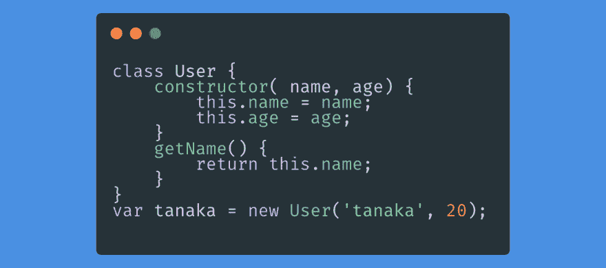

# 用前端工程师的可读取代码#1 变量名传达信息

> 原文:[https://dev.to/shibandd/-3a40](https://dev.to/shibandd/-3a40)

这篇文章是以前台工程师的视角写的。 总结了可能对前端工程师、编码器有参考价值的可读写码技巧。 参考代码用 JavaScript 编写。

#### 所谓可读取码，

是指别人看到自己的代码时，容易理解、容易阅读的代码。 优秀的代码，每个人的概念都很难抓住，但是优秀的没有**的**代码的概念很容易抓住。

在这篇文章中，我将介绍如何避免编写不优秀的代码。 不说明不优秀的代码的想法和详细的概要。 感兴趣的读者请阅读本次参考的书籍《[可读写码——编写更好代码的简单实践技巧《T1》。](https://www.oreilly.co.jp/books/9784873115658/)

#### #1 用变量名传递信息

jQuery 将" $ " (美元标记)视为函数。 只使用" $ "调用的函数将变量的首字母加上" $ "。

[T2】](https://res.cloudinary.com/practicaldev/image/fetch/s--jMfZj0rH--/c_limit%2Cf_auto%2Cfl_progressive%2Cq_auto%2Cw_880/https://thepracticaldev.s3.amazonaws.com/i/j61jcrcrp0go8xam5gfb.png)

这样，可以明确地知道变量是 jQuery 的对象。 JavaScript 包括返回 HTMLCollection 的 getElementbyId 和返回 NodeList 的 querySelector。 通过在变量名上下功夫，可以在短时间内识别变量中包含了什么样的信息(节点、要素)。

JavaScript 包括 DOM 更改字符大小，以及用于测量网页加载时间(站点性能)的 Navigation Timing API。 对于像素和毫秒等值中涉及单位的变量，在变量名的末尾追加 _px、_ms 等单位会更容易理解吧。

在 HTML、CSS 中，可以在属性名称上下功夫。 id 名称的分隔符最好是下划线，class 名称的分隔符最好是连字符。 如果让下划线、连字符带有某种意义的话，就会变成容易理解的代码。

[T2】](https://res.cloudinary.com/practicaldev/image/fetch/s--uX_5GFD3--/c_limit%2Cf_auto%2Cfl_progressive%2Cq_auto%2Cw_880/https://thepracticaldev.s3.amazonaws.com/i/8712vyl9qd4u97wqva0x.png)

大写字母也可以有意义。 在 JavaScript 中，从 ES2015(ES6 )中添加了 class 语法。 class 语法通过将函数名称大写而有意义。 由于没有 class 语法，JavaScript(ES6 或更早版本)模仿创建构造函数(假定与 new 运算符一起使用)。 从 ES6 之前开始，许多作者就提倡构造函数名称的首字母大写。 因此，最好不要使用除构造函数名称以外的开头大写字母。

[T2】](https://res.cloudinary.com/practicaldev/image/fetch/s--LfLQu0G9--/c_limit%2Cf_auto%2Cfl_progressive%2Cq_auto%2Cw_880/https://thepracticaldev.s3.amazonaws.com/i/6xopxrzhyuwwixy2elfp.png)

所有大写变量都用于常量、具有较强含义的变量等。 偶尔也会看到存储 HTML(DOM )的变量。 JavaScript 在 ES6 中出现了 const。 不可重新赋值的常数。 但是，在 IE10 以前，ES6 是不对应的。 通过设置为全大写变量，可以向其他开发者传达不应该改写(重新代入)的意图吧。

[T2】](https://res.cloudinary.com/practicaldev/image/fetch/s--0r9-AqWd--/c_limit%2Cf_auto%2Cfl_progressive%2Cq_auto%2Cw_880/https://thepracticaldev.s3.amazonaws.com/i/j8jm70g5vtxwk2719ngw.png)

有时会在变量名中使用缩写。 JavaScript 使用 document 对象访问 HTML 元素。 为了减少访问全局函数的次数，书籍《[高性能 JavaScript](https://www.oreilly.co.jp/books/9784873114903/) 》也建议将文档存储在局部函数中。

[T2】](https://res.cloudinary.com/practicaldev/image/fetch/s--rYPUeNxN--/c_limit%2Cf_auto%2Cfl_progressive%2Cq_auto%2Cw_880/https://thepracticaldev.s3.amazonaws.com/i/5j02059af139ji913a4f.png)

这种程度的函数看不到性能效果，但可以将对全局函数的访问从 3 次减少到 1 次。 使用(主题的)缩写时需要注意。 那个缩写是**队友能理解意思吗？** doc、string 的缩写 str 等经常(在工程师内部)使用，所以可以理解，但 BackEndManger 的缩写 BEManager 无法理解。 使用缩写时，请确保别人看到也能理解。

只不过是规章。 我觉得是否使用由自己和项目成员决定就可以了。 不管是什么样的规章，在项目中保持***一贯性***都是很重要的。