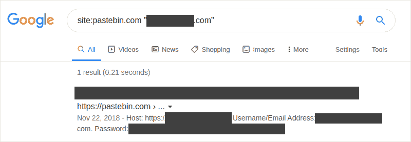
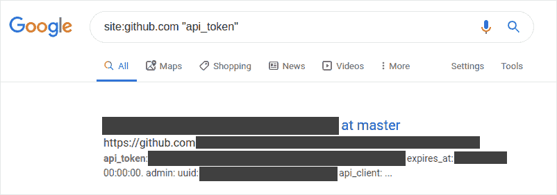
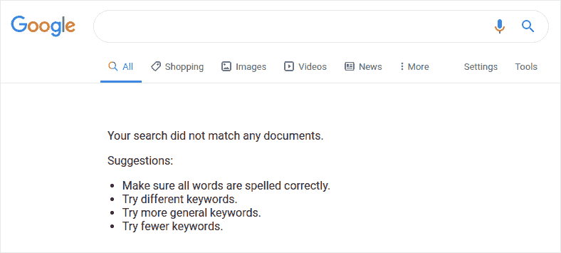

# 黑客在谷歌搜索你的纯文本密码:防止敏感数据暴露

> 原文:[https://dev . to/Victoria/hackers-is-Google-your-plain-text-password-preventing-sensitive-data-exposure-45n 6](https://dev.to/victoria/hackers-are-googling-your-plain-text-passwords-preventing-sensitive-data-exposure-45n6)

上周，我写了关于在我们的网站和应用程序中正确处理用户输入的重要性。我提到了一个重要的安全教训，我希望今天能讲清楚:我们的软件、应用程序和客户数据的安全性是从头开始构建的，远在产品上线之前。

[T2】](https://res.cloudinary.com/practicaldev/image/fetch/s--x38NgVhV--/c_limit%2Cf_auto%2Cfl_progressive%2Cq_auto%2Cw_880/https://victoria.dev/verbose/hackers-are-googling-your-plain-text-passwords-preventing-sensitive-data-exposure/cover_hu3d85b89eb9d0f9ebca0ddd94c26060d4_587474_640x0_resize_box_2.png)

OWASP 十大安全风险综合指南。技术专业人员、企业以及对网络安全或信息安全感兴趣的人都依赖它。最新的出版物将敏感数据暴露列为第三大 web 应用程序安全风险。风险描述如下:

> 许多 web 应用程序和 API 不能很好地保护敏感数据，如金融、医疗保健和 PII。攻击者可能窃取或修改这种保护薄弱的数据，以进行信用卡欺诈、身份盗窃或其他犯罪。敏感数据可能会在没有额外保护(如静态加密或传输加密)的情况下遭到破坏，并且在与浏览器交换时需要采取特殊的预防措施。

“敏感数据暴露”是一个包罗万象的类别，包括从弱加密算法到非强制加密等多种来源的泄露数据。然而，这种安全风险的最简单的来源用更少的音节来描述:人。

“一盎司的预防抵得上一磅的治疗”这句话既适用于医学，也适用于安全软件开发。在后者的世界中，这被称为“向左推”，这是一个相当不直观的术语，用于在软件开发生命周期(SDLC)中尽早建立安全最佳实践。在 SDLC 的“左边”建立过程有助于确保参与创建软件产品的人员从第一天起就正确处理敏感数据。

不幸的是，大量的安全性测试似乎经常发生在 SDLC 右侧更远的地方；对于一些安全问题，如敏感数据泄露，已经来不及阻止了。

我是即将发布的 [OWASP 测试指南](https://github.com/OWASP/OWASP-Testing-Guide-v5)的作者之一，最近扩展了一个关于搜索引擎发现侦察的部分，或者现在孩子们所说的“Google dorking”这是一种方法，也可以说是最容易使用的方法，通过这种方法，安全测试人员(或黑帽黑客)可以在互联网上找到暴露的敏感数据。以下是该部分的摘录(目前正在 GitHub 上进行中，将在 v5 中发布):

> ### 搜索运算符
> 
> 搜索运算符是一个特殊的关键字，它扩展了常规搜索查询的功能，可以帮助获得更具体的结果。它们一般采取`operator:query`的形式。以下是一些普遍支持的搜索运算符:
> 
> *   `site:`会将搜索限制在提供的 URL。
> *   `inurl:`将只返回在 URL 中包含关键字的结果。
> *   `intitle:`将只返回页面标题中包含该关键字的结果。
> *   `intext:`或`inbody:`只会在页面正文中搜索关键字。
> *   `filetype:`将只匹配特定的文件类型，如 png 或 php。
> 
> 例如，要查找由典型搜索引擎索引的 owasp.org 的 web 内容，需要的语法是:
> 
> `site:owasp.org`
> 
> …
> 
> ### Google Hacking，或 Dorking
> 
> 当与测试人员的创造性相结合时，使用操作员进行搜索可能是一种非常有效的发现侦察技术。可以将操作员联系起来，以便有效地发现特定种类的敏感文件和信息。这种技术被称为 [Google hacking](https://en.wikipedia.org/wiki/Google_hacking) 或 Google dorking，也可以使用其他搜索引擎，只要搜索运营商得到支持。
> 
> 一个呆子的数据库，比如[谷歌黑客数据库](https://www.exploit-db.com/google-hacking-database)，是一个有用的资源，可以帮助发现特定的信息。

对安全测试人员来说，定期检查搜索引擎结果可能是一项富有成效的任务。然而，当搜索`site:myapp.com passwords`没有结果时，停下来吃午饭可能还是有点早。这里是安全测试人员可能想要寻找暴露在外的敏感数据的几个其他地方。

## Pastebin

自封的“#1 粘贴工具自 2002 年以来，” [Pastebin](https://pastebin.com) 允许用户临时存储任何类型的文本。它主要用于与他人共享信息，或者在另一台机器上(可能在另一个位置)检索您自己的“粘贴”。Pastebin 使得共享大量复杂的文本变得容易，比如错误日志、源代码、配置文件、令牌、api 密匙……那是什么？哦，是的，默认是公开的。

这里有一些我为一个公开的 bug 赏金项目做的小傻事的截图。

[T2】](https://res.cloudinary.com/practicaldev/image/fetch/s--xjAYkvtX--/c_limit%2Cf_auto%2Cfl_progressive%2Cq_auto%2Cw_880/https://thepracticaldev.s3.amazonaws.com/i/b33jzxxllwtke8shg7zu.png)

*简单视图中的 API 键。*

[T2】](https://res.cloudinary.com/practicaldev/image/fetch/s--kuhnLaqO--/c_limit%2Cf_auto%2Cfl_progressive%2Cq_auto%2Cw_880/https://thepracticaldev.s3.amazonaws.com/i/1dfp9mb8b1i38bsalib0.png)

*公开登录详情。*

部分由于使用 Pastebin 和类似网站的便利性，一些人在公开敏感数据之前似乎没有三思。

### 但是为什么呢？

当然，有权访问应用程序的非技术员工可能不知道哪些项目应该或不应该自由共享。不熟悉加密数据是什么或它看起来像什么的人可能不会意识到加密字符串和由许多随机字母和数字组成的未加密令牌之间的区别。即使是技术人员也会在辛苦工作一天后错过事情、犯错误或粗心大意。这可能很容易被称为训练问题，然后继续前进；然而，这些合理化都没有解决问题的根本原因。

当人们在面对问题时求助于外部解决方案，通常是因为他们没有得到同样吸引人的内部解决方案，或者不知道有这样的解决方案存在。员工使用粘贴来共享或移动敏感数据是因为他们没有更简单、更方便、更安全的内部解决方案。

### 缓解

应该向参与创建和维护 web 应用程序的每个人简要介绍一些关于敏感数据保护的基本知识:

1.  什么构成了敏感数据，
2.  纯文本和加密数据之间的区别，以及
3.  如何正确传输和存储敏感数据？

当涉及第三方服务时，确保人们意识到一些传输可能没有加密，或者可能会被公开搜索。如果目前还没有在内部安全共享和存储敏感数据的系统，这是一个很好的起点。应用程序数据的安全性掌握在团队中每个人的手中，从管理人员到 C 级主管。确保人们拥有安全工作所需的工具。

## 公共知识库

开发人员因将敏感信息挂在不属于它的地方而臭名昭著(是的，我也这么做过！).如果没有一个强大的左推方法来处理令牌、秘密和密钥，这些小宝贝最终可能会出现在 GitHub、GitLab 和 Bitbucket(仅举几例)等网站上。[2019 年的一项研究](https://www.ndss-symposium.org/wp-content/uploads/2019/02/ndss2019_04B-3_Meli_paper.pdf)发现，仅在 GitHub 上，每天就有数千个新的、独特的秘密被泄露。

[T2】](https://res.cloudinary.com/practicaldev/image/fetch/s--VvUDjF9Y--/c_limit%2Cf_auto%2Cfl_progressive%2Cq_auto%2Cw_880/https://thepracticaldev.s3.amazonaws.com/i/zur69lifho4v1g3vbigx.png)

GitHub 已经实现了[令牌扫描](https://github.blog/2018-10-17-behind-the-scenes-of-github-token-scanning/)等措施，GitLab 11.9 [引入了秘密检测](https://about.gitlab.com/2019/03/22/gitlab-11-9-released/)。虽然这些工具旨在减少秘密可能被意外泄露的机会，但坦率地说，这真的不是他们的工作。秘密扫描不会从一开始就阻止开发者提交数据。

### 但是为什么呢？

如果没有一个明显的过程来管理秘密，开发人员可能会太倾向于他们天生的“只做一件事”的感觉。有时，这导致了将密钥作为未加密变量存储在程序中的权宜但不负责任的做法，也许这只是暂时的。尽管如此，这些变量不可避免地会从脑海中消失，并最终导致提交。

### 缓解

拥有强大的左推文化意味着确保敏感数据得到正确存储，并且在任何人准备提交之前就可以安全地检索。这样做的工具和策略对于那些寻求它们的人来说是现成的。以下是一些支持左推方法的工具示例:

*   使用管理工具来存储和控制对密钥和秘密的访问，如[亚马逊密钥管理服务](https://aws.amazon.com/kms/)或微软的 [Azure 密钥库](https://azure.microsoft.com/en-us/services/key-vault/)。
*   在 CI 工具中使用加密的环境变量，如 [Netlify 的环境变量](https://www.netlify.com/docs/continuous-deployment/#environment-variables)或[GitHub Actions](https://help.github.com/en/articles/virtual-environments-for-github-actions#creating-and-using-secrets-encrypted-variables)中的虚拟环境。
*   制作一个强大的`.gitignore`文件，团队中的每个人都可以贡献和使用。

我们也不需要完全依赖公共存储库来捕捉那些仍然可能漏掉的错误。可以设置 Git 预提交挂钩，使用[正则表达式](https://en.wikipedia.org/wiki/Regular_expression)扫描提交的秘密。有一些开源程序可以做到这一点，比如 ThoughtWorks 的[Talisman](https://github.com/thoughtworks/talisman)和 AWS 实验室的[git-secrets](https://github.com/awslabs/git-secrets)。

## 向左推，防止敏感数据泄露

从一个小小的角度来说明为什么在任何敏感数据存在之前就开始管理敏感数据非常重要。通过在 SDLC 的左边建立安全最佳实践，我们给我们的员工最好的机会来增加我们软件产品的任何未来欺骗看起来更像这样的可能性。

[T2】](https://res.cloudinary.com/practicaldev/image/fetch/s--xGjBmreT--/c_limit%2Cf_auto%2Cfl_progressive%2Cq_auto%2Cw_880/https://thepracticaldev.s3.amazonaws.com/i/p8aehoij260aajz0qk43.png)

检查我们数据安全性的另一个很好的资源是 Troy Hunt 的[when I be Pwned](https://haveibeenpwned.com/)，这是一个将你的数据(如你的电子邮件)与以前数据泄露中泄露的数据进行比较的服务。

要了解更多主动保护应用安全的方法，OWASP 主动控制出版物是一个很好的资源。在即将发布的 [OWASP 测试指南](https://github.com/OWASP/OWASP-Testing-Guide-v5)中，也有更多关于创建向左推的安全方法的内容。如果你对这些话题感兴趣，我鼓励你去阅读、学习和投稿，这样更多的人会让敏感数据更难被发现。