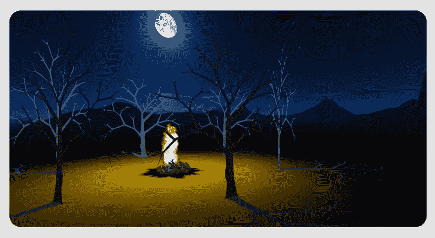
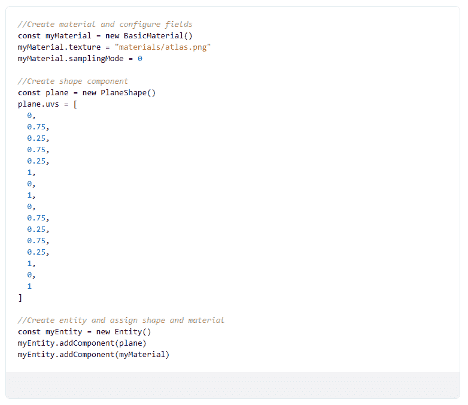
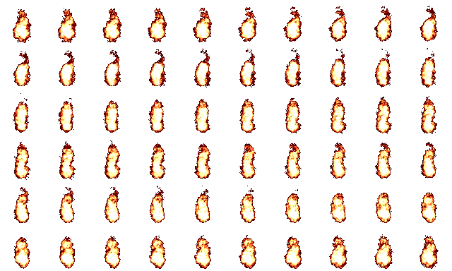

# 创造一个精灵之火——使用游戏中最新浪潮的经典技术

> 原文：<https://dev.to/decentraland/creating-a-sprite-fire-using-a-classic-technique-for-the-newest-wave-in-gaming-2699>

[](https://res.cloudinary.com/practicaldev/image/fetch/s--3Um9el8E--/c_limit%2Cf_auto%2Cfl_progressive%2Cq_auto%2Cw_880/https://cdn.steemitimages.com/DQmYuocEm3vTZgsFQRFB9qxpdVVv6e4FFE5kkqJ4LsWc8wG/image5.png)

在 9 月 16 日开始的下一次 Game Jam 之前，6 月黑客马拉松的参与者将接管分散博客，并透露他们的设计和建造秘密。本周的客座博主是来自集体设计季的布伦特·格雷林...

* * *

大家好。我是一名连续的 3D 实验专家、合格的产品设计师、全栈网络开发人员——专注于 3D、VR 和 WebXR 应用——平面设计师、360 虚拟和立体摄影师以及 3D 建模师。

因此，你可以想象，保持对权力下放的全职承诺有其挑战性。但是，我的梦想工作仍然是有一天在虚拟世界中驾驶我们小组的网络垃圾概念。

我所说的这个小组名为 Design Quarter，我们成立于 2017 年，旨在激发和展示一个 vibey hub/hive/lab/gallery，以促进 3D、设计、艺术和其他相关学科的合作。我们正在发展成为提供原创设计的一站式商店。

从最初的概念到最终的产品，无论项目是大是小，我们的目标是在分散的土地上为他人和我们自己创造、建设和经济增长。

### 设计季来袭黑客马拉松

在 6 月的分散式黑客马拉松中，设计季度参赛作品的一部分是一个以 2D 雪碧为基础的火灾场景。

[](https://res.cloudinary.com/practicaldev/image/fetch/s--FZIazD8l--/c_limit%2Cf_auto%2Cfl_progressive%2Cq_auto%2Cw_880/https://cdn.steemitimages.com/DQmduep4S6qHsVPkhb3RSvMR5Bgk4rEnMQoEPy6GrbEtj8j/image4.png)

由于分散的 SDK 本身不支持纹理的 gif 动画，我们决定使用精灵动画。我很高兴与你分享我对这种技术的基本理解——这是自 20 世纪 70 年代末以来视频游戏的一个特征。

这里反映的代码当然还可以改进，但是我选择完全按照当时使用的方式来反映它。

该场景与输入的一模一样，可以在[https://Brent-ooaissvdra . now . sh](https://brent-ooaissvdra.now.sh)查看

我们的原始源文件也可以从[https://drive . Google . com/file/d/10 r 6 vnytlcgc _ r7Vb-9p 2 ewdfx 3 w9 VL 36/view](https://drive.google.com/file/d/10r6vnytLCgc_r7Vb-9p2eWDFx3W9VL36/view)下载

### 精灵动画

Spritesheet 在平面上依次循环显示各种静态图像的同时，为平面添加纹理。动画运动的幻觉或三维的外观随后被感知，就像我们的火焰不断增长并升向天空。

[](https://res.cloudinary.com/practicaldev/image/fetch/s--vwFTsmoQ--/c_limit%2Cf_auto%2Cfl_progressive%2Cq_auto%2Cw_880/https://cdn.steemitimages.com/DQmSvWC5t2KDWj72bPqQvg3ny2Z62awc1K8zZRJAKAaVZSx/image1.png)

为了节省资源，spritesheet 是一个单独的图像文件，它将多个略有不同的图像(称为帧)按有序的行和列顺序组合在一起。多个图像避免了为每一帧动画加载一个全新的纹理文件；相反，对于每个新的渲染，spritesheet 会在表面上重新定位。

复杂的 spritesheets 可能包含来自不同视图的一系列角色动作，每个动作从特定帧开始，并在特定数量的帧上播放。

胶片卷轴可以看作是 spritesheet 概念的一个很好的例子，它有一列多行。当电影通过放映机“滚动”这些行时，在一个平面大屏幕上产生了平滑运动的幻觉。

如果. png 图像用于精灵，它可能包含透明度级别，以更好地显示和融入背景。

好了，现在我们知道什么是雪碧了。我们如何将这个 spritesheet 映射到一个表面上呢？

### UV 贴图

将 UV 贴图应用于曲面时，使用特定于该曲面的新 3D 空间将纹理图像指定给对象的 XYZ 坐标。这是由三个顶点组成的表面三角形，我们也称之为多边形。

这个 UV 空间的相对坐标值被命名为 UVW，以区别于对象世界 XYZ。由于纹理只需要平面上的两个维度，我们使用 UV 坐标轴，忽略 w。

> ***提示:*** *通过简单地颠倒一个多边形的相同 UV 点集的顺序，我们可以颠倒表面的方向。这被称为多边形“缠绕”,表面朝向法线是顺时针或逆时针缠绕的直接结果。*

正方形或矩形表面，即平面形状，实际上包括两个三角形，这两个三角形位于同一平面上并共享一个公共边，因此也共享每个三角形的两个顶点。在描述一个平面时，我们可以陈述四个不同的点，作为一种速记，而不是陈述一个三角形的三个 uv 和另一个三角形的另外三个 uv(这将包含两个副本)。

##### 侦探工作

在全面且不断增加的分散土地开发文档中，有一个关于[材料](https://docs.decentraland.org/development-guide/materials/#using-textures)的章节，其中包含以下 UV 映射示例:

[](https://res.cloudinary.com/practicaldev/image/fetch/s--6a8-jcw_--/c_limit%2Cf_auto%2Cfl_progressive%2Cq_auto%2Cw_880/https://cdn.steemitimages.com/DQmdXKLmhYvN3Vftdie3BFz4N7EC5PZnSHDcdPmSyHwxjPA/image3.png)

尽管上面给出的例子对于最初使用的 spritemap 是正确的，但我很快就搞不清楚它实际上是如何工作的。毕竟，我的火焰精灵有不同的尺寸，不同的行数和列数，它所投射的表面也有不同的比例。

简单地用另一个图像替换 atlas.png 图像是行不通的。

所以我开始改变数字，观察当它们改变时，它们会如何处理我的纹理图像。在倾斜、缩放、重复甚至完全丢失，然后不得不重新找到纹理之后，一种模式开始出现。

一致的模式，连同上面的概念，开始变得有用。我的粗略发现在下面做了注释，让你对我的发现有一个基本的概念。

```
plane.uvs = [
    // ONE FACE
    0.33,  // (B) Horizontal width right end position
    0,  // (C) Vertical height bottom start position
    0,  // (A) Horizontal width left start position
    0,  // (C) Vertical height bottom start position

    0,  // (A) Horizontal width left start position
    0.33,  // (D) Vertical top height end position
    0.33,  // (B) Horizontal width right end position
    0.33,  // (D) Vertical top height end position

    // OTHER FACE
    0.66,  // (B) Horizontal width right end position
    0.0,  // (C) Vertical height bottom start position
    0.33,  // (A) Horizontal width left start position
    0.0,  // (C) Vertical height bottom start position

    0.33,  // (A) Horizontal width left start position
    0.33,  // (D) Vertical top height end position
    0.66,  // (B) Horizontal width right end position
    0.33  // (D) Vertical top height end position
] 
```

我注意到，为了不使图像错位或倾斜，我必须在某些地方使用相同对的值。请注意，A、B、C 和 D 只是我的注释标记，仅用于指示匹配对。每个值本身，介于 0 和 1 之间，表示与我的纹理相关的介于 0 和 100%之间的维度，可以是左边、宽度、顶部、高度、起点或终点。

在更多的摆弄之后，我准确地发现了这些需要做什么来使上面的实用化。

浏览注释代码会让你对结果有一个清晰而有用的概念。

请注意我是如何保持 spriteRow 和 spriteCol 变量的灵活性的，因为它们对于所使用的图像是唯一的。

此外，不要被 spritePlane.uvs 的动态计算所迷惑。它们是这样的，所以任何用户定义的变量都会自动应用，而你不必担心。

##### 注释代码如下:

```
// User defined variables
let spriteCols = 10   // number of columns
let spriteRows = 6   // number of rows
let timer = 0.1   // timer speed
let currSpriteCel = 1   // starting position

// Calculated variables
let spriteCels = spriteCols * spriteRows
let colFactor = 1/spriteCols
let rowFactor = 1/spriteRows

// Create material
const spriteMaterial = new BasicMaterial()
spriteMaterial.texture = new Texture("materials/fire.png")

// Create shape component
const spritePlane = new PlaneShape()

// Set the starting UV's
let currRowStart = spriteRows - Math.floor((currSpriteCel-1)/spriteCols)
let currColStart = ((currSpriteCel-1)%spriteCols)

spritePlane.uvs = [

        (currColStart+1)*colFactor, (currRowStart-1)*rowFactor, 
        currColStart*colFactor, (currRowStart-1)*rowFactor,

        currColStart*colFactor, currRowStart*rowFactor, 
        (currColStart+1)*colFactor, currRowStart*rowFactor,

        (currColStart+1)*colFactor, (currRowStart-1)*rowFactor, 
        currColStart*colFactor, (currRowStart-1)*rowFactor,

        currColStart*colFactor, currRowStart*rowFactor, 
        (currColStart+1)*colFactor, currRowStart*rowFactor
]

// Create sprite entity and assign shape and initially mapped sprite material
const spriteFire = new Entity()
spriteFire.addComponent(spritePlane)
spriteFire.addComponent(new Transform({
    position: new Vector3(16, 7.3, 16),
    rotation: Quaternion.Euler(0, 0, 0),
    scale: new Vector3(2,2,2)
}))
spriteFire.addComponent(spriteMaterial)
engine.addEntity(spriteFire)

// Define system to update sprite on every frame
export class spriteAnimate {
    update(dt: number) {
        if (timer > 0) {
            timer -= dt
        } else {
            timer = 0.1
            currSpriteCel += 1

            if (currSpriteCel == spriteCels) { currSpriteCel = 1 }
            else { currSpriteCel = currSpriteCel + 1 }
            let currRowStart = spriteRows - Math.floor((currSpriteCel-1)/spriteCols)
            let currColStart = ((currSpriteCel-1)%spriteCols)
            spritePlane.uvs = [
                (currColStart+1)*colFactor, (currRowStart-1)*rowFactor, 
                currColStart*colFactor, (currRowStart-1)*rowFactor,
                currColStart*colFactor, currRowStart*rowFactor, 
                (currColStart+1)*colFactor, currRowStart*rowFactor,
                (currColStart+1)*colFactor, (currRowStart-1)*rowFactor,
                currColStart*colFactor, (currRowStart-1)*rowFactor,
                currColStart*colFactor, currRowStart*rowFactor, 
                (currColStart+1)*colFactor, currRowStart*rowFactor
            ]
        }
    }
}

// Add instance of the system to the scene
let animationSystem = engine.addSystem(new spriteAnimate()) 
```

### 添加广告牌功能

我们下一步要做的是让飞机始终面向你。

值得庆幸的是，通过为你提供一个自动处理的`Billboard`组件，分散的土地使这部分变得简单了。我们只需要将这个组件添加到保存 sprite 的实体中。

```
spriteFire.addComponent(new Billboard(false, true, false)) 
```

你会注意到我们在这里传递了三个参数，每个参数在 x、y 和 z 旋转轴上启用或禁用公告牌模式。在这里，我们的广告牌只在 Y 轴上旋转，这意味着它将跟随玩家在地平面上的移动，但将保持其向上的方向不变。

你可以在[文档网站](https://docs.decentraland.org/development-guide/entity-positioning/#face-the-player)上阅读更多关于分散地广告牌的信息。此外，尽管超出了本文的范围，要更好地理解广告牌背后的数学，欢迎您联系我。

### 总结

我们现在已经涵盖了一些基础知识，并有望在平面上制作纹理动画。我们使用了一种通用的方法，这种方法可以根据纹理图像包含的行数和列数来正确处理不同的纹理图像。

总的来说，你可以随意接触，你会发现我在设计区或不和谐区闲逛。

玩得开心，一定要报名参加即将于 9 月 16 日推出的游戏 Jam！设计季度计划在那里。与此同时，随着我继续学习和理解，我将分享更多的发现。

[附上 fire.png 的原文]这个和更多关于火的例子可以在:[https://opengameart.org/content/animated-fire](https://opengameart.org/content/animated-fire)找到

[](https://res.cloudinary.com/practicaldev/image/fetch/s--EGXPs430--/c_limit%2Cf_auto%2Cfl_progressive%2Cq_auto%2Cw_880/https://cdn.steemitimages.com/DQmdygCmTqaGho5Jye6Rp4ReQFiMJdLumc8NmT9wWxX5u8m/image2.png)