# Linux 桌面指南:使用 Veeam 代理备份数据(第 1 部分)

> 原文:[https://dev . to/thementor/Linux-desktop-guide-backing-your-data-with-veeam-agent-part-1-3 no](https://dev.to/thementor/linux-desktop-guide-backing-up-your-data-with-veeam-agent-part-1-3ono)

欢迎，Linux 极客们，

这是关于 Veeam Agent for Linux 的两篇文章的第 1 部分。在这一部分中，我将介绍我选择此解决方案的原因以及如何执行备份。在第 2 部分中，我将介绍不同的恢复过程。

Veeam Agent for Linux 是一个很好的裸机(当操作系统无法启动时)备份解决方案。

您应该对裸机备份解决方案感兴趣的原因是，如果出现硬盘故障，您不需要花几个小时像以前一样设置您的计算机。

有了裸机解决方案，计算机将处于上次备份时的同一时间点，从而节省了大量时间并减少了麻烦。

我试了几个，但都不适合我。要么是他们不提供裸机恢复，要么是他们无法轻松恢复单个文件或目录。

我希望我的备份功能多样，能够适应我的需求。经过大量的研究，我选定了用于 Linux 的 Veeam 代理。不幸的是，这不是一个开源的解决方案，所以如果你对此感到困扰，我可以理解。我有一个更务实的方法，所以我正在使用它。

许多人建议使用 CloneZilla，尽管它是一个非常棒的工具，但对我来说它有一些不足之处。

1.  在操作系统运行时，It 不能运行备份/克隆。
2.  它不能轻松地恢复单个文件或目录。

Deja-Dup/Duplicaci/Borg 不支持裸机恢复。

所以，最后，我选择了 Veeam Agent for Linux，特别是免费版作为我笔记本电脑的备份工具。

## [](#setup-guide)设置指南

我将向您展示如何在我的 Ubuntu Mate 19.04 系统上设置 Veeam Agent for Linux，但对于其他操作系统，设置应该非常相似。

有关支持的操作系统和文件系统的完整列表，请查看 [Veeam Agent for Linux 3.0.2 发行说明](https://www.veeam.com/veeam_agent_linux_3_0_2_release_notes_rn.pdf)

### [](#a-few-of-the-supported-operating-systems)几种受支持的操作系统

*   debian 6–9.7
*   Ubuntu 10.04–19.04
*   软呢帽 23–30
*   RHEL 6.0–8.04
*   厘斯 6.0–7.6
*   更多的

### [](#a-few-of-the-supported-filesystems)一些受支持的文件系统

*   分机 2/3/4
*   Btrfs(适用于运行 Linux 内核 3.16 或更高版本的操作系统)
*   XFS
*   F2FS
*   更多的

### [](#supported-backup-targetsdestinations)支持的备份目标/目的地

可以备份到以下基于磁盘的存储目标:

*   受保护计算机的本地(内部)存储(不推荐)
*   直连存储(DAS)，如 USB、eSATA 或 Firewire 外部驱动器。
*   网络连接存储(NAS)能够代表 SMB (CIFS)或 NFS 共享。
*   veeam Backup & Replication 9.5 Update 4 或更高版本的备份存储库(DataDomain DDboost、HP StoreOnce 除外)。
*   Veeam Cloud Connect 9.5 Update 4 或更高版本存储库。

**在本例中，我将备份到 USB 外部驱动器**

### [](#installation)安装:

1.  前往 Veeam Agent for Linux 免费[下载链接](https://www.veeam.com/linux-backup-free-download.html?ad=in-text-link)并点击下载，您将需要创建一个免费帐户来登录或使用支持的帐户(谷歌/脸书/LinkedIn/微软)登录。

    登录后，您会看到一个选项，让您选择操作系统和架构。

    正如你在下面的截图中看到的，我选择了“Debian/Ubuntu”作为操作系统，选择了“x64”作为架构，然后点击了“获取链接”

    [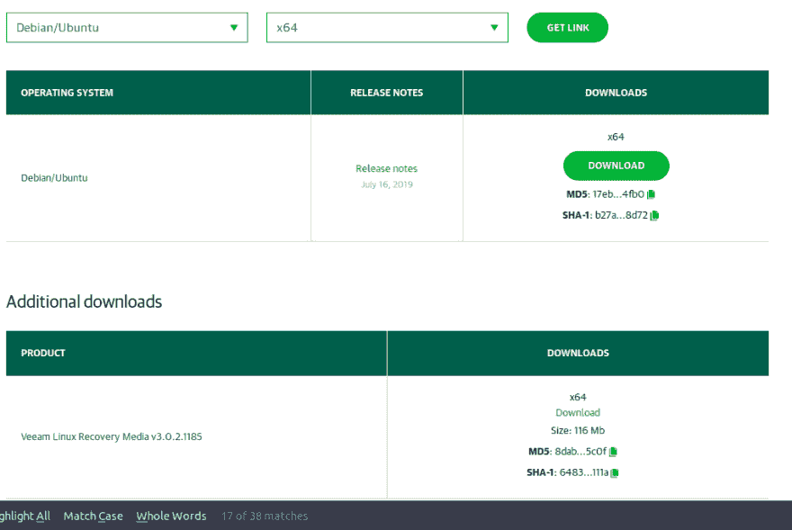T2】](https://res.cloudinary.com/practicaldev/image/fetch/s--KJibDNNX--/c_limit%2Cf_auto%2Cfl_progressive%2Cq_auto%2Cw_880/https://thepracticaldev.s3.amazonaws.com/i/18ylzj1w9s7ncetzst6w.png)

    您将看到两个下载链接

    *   用于 Linux 应用程序的 Veeam 代理
    *   Veeam Linux 恢复介质(裸机恢复需要使用恢复介质启动计算机)。
2.  点击第一个下载链接并接受条款和条件**(当然是在您阅读完之后)**

3.  选择保存文件的位置，因为我选择了 Ubuntu，它将是一个. DEB 文件。如果你选择了 fedora，你会得到一个. RPM 文件

4.  下载完成后，打开您的文件管理器并导航到您下载文件的文件夹。

5.  您可以双击 DEB 文件，然后单击 install，但是如果您喜欢从终端安装它，您可以使用下面的命令:

    ```
    # on Ubuntu/Debian run the following commands
    sudo dpkg -i veeam-release-deb_1.0.7_amd64.deb 
    ```

6.  安装 deb 文件后，我们需要使用以下命令安装实际的 Veeam Agent for Linux 程序:

    ```
    sudo apt update
    sudo apt install veeam 
    ```

让包管理器施展它的魔法吧，在某些情况下，它需要编译一些 DKMS 内核模块来支持文件系统快照。

### [](#how-to-launch-and-use-veeam)如何启动和使用 Veeam

1.  Veeam Agent for Linux 是一个基于终端的 GUI。要启动它，运行以下命令:

    ```
    sudo veeam 
    ```

    [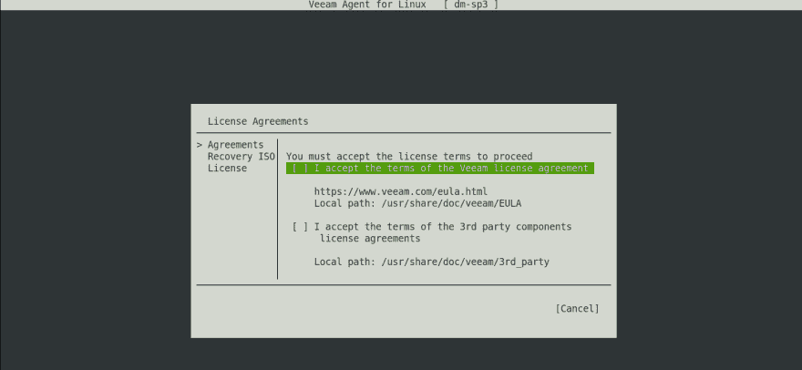T2】](https://res.cloudinary.com/practicaldev/image/fetch/s--twjpN4EL--/c_limit%2Cf_auto%2Cfl_progressive%2Cq_auto%2Cw_880/https://thepracticaldev.s3.amazonaws.com/i/c20yfm7cd0t7jktvj9bi.png)

2.  在继续之前接受以下条款:**(当然是在你阅读完之后)**

    *   “我接受 Veeam 许可协议的条款”
    *   “我接受第三方组件许可协议的条款”

    使用键盘选择下一步，然后按回车键

    [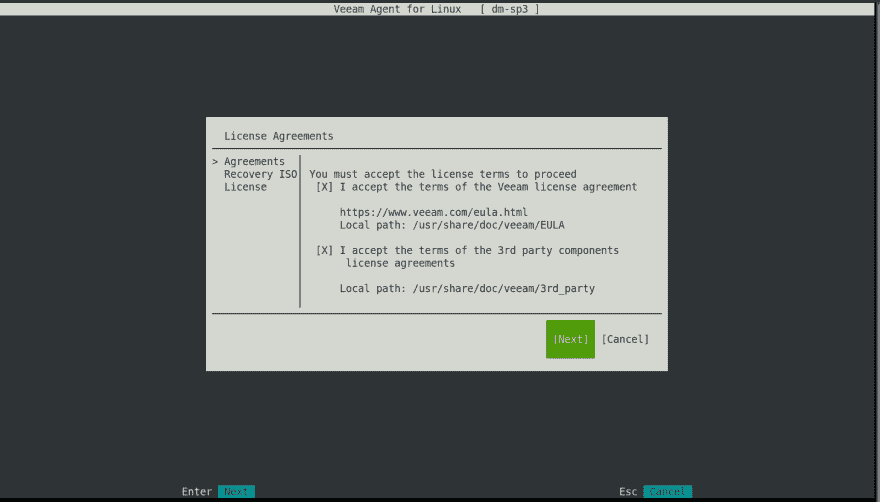T2】](https://res.cloudinary.com/practicaldev/image/fetch/s--xyi2WBoE--/c_limit%2Cf_auto%2Cfl_progressive%2Cq_auto%2Cw_880/https://thepracticaldev.s3.amazonaws.com/i/1uzfmxr6qgiu2ctuyk01.png)

3.  (可选)如果您已经在计算机上安装了任何特殊的驱动程序，Veeam 将为您提供一个选项来创建一个内置驱动程序的自定义恢复 ISO。

    通常，如果您已经安装了与存储/硬盘相关的驱动程序(如 RAID 卡),以便 Veeam 恢复介质在启动时可以访问这些驱动器，这一点就很重要。

    在我的例子中，一切都内置到内核中，所以我打算跳过这一步

    [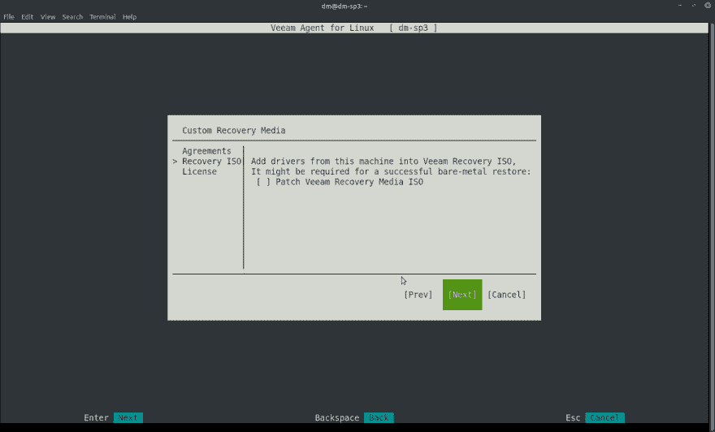T2】](https://res.cloudinary.com/practicaldev/image/fetch/s--kQgg19ed--/c_limit%2Cf_auto%2Cfl_progressive%2Cq_auto%2Cw_880/https://thepracticaldev.s3.amazonaws.com/i/0ghjlmy4156ygyr4duda.png)

4.  选择许可证-我们将使用免费版的 Veeam Agent for Linux，因此我们可以保持一切不变，然后选择 FINISH

    [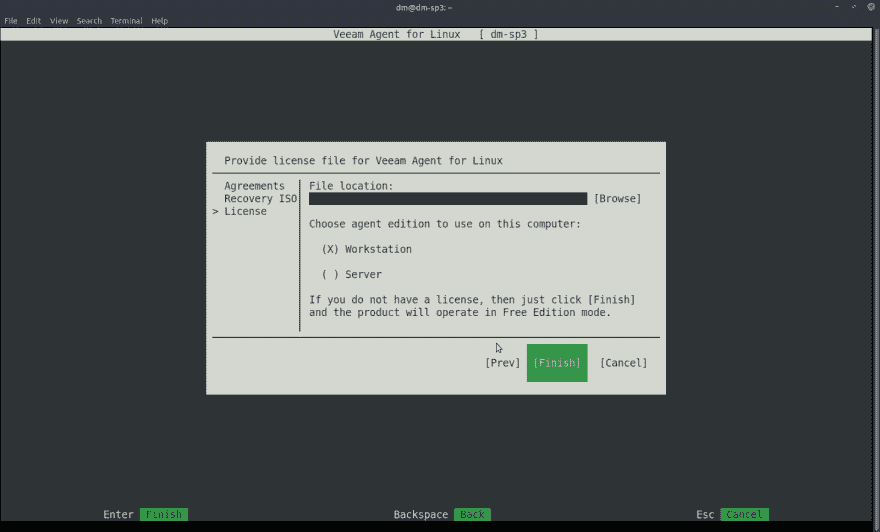T2】](https://res.cloudinary.com/practicaldev/image/fetch/s--1xzAPO_o--/c_limit%2Cf_auto%2Cfl_progressive%2Cq_auto%2Cw_880/https://thepracticaldev.s3.amazonaws.com/i/b0x6dkiiyjvgjcxhsd8a.png)

5.  您将看到欢迎屏幕，要开始配置备份作业，请按键盘上的 C 键

    [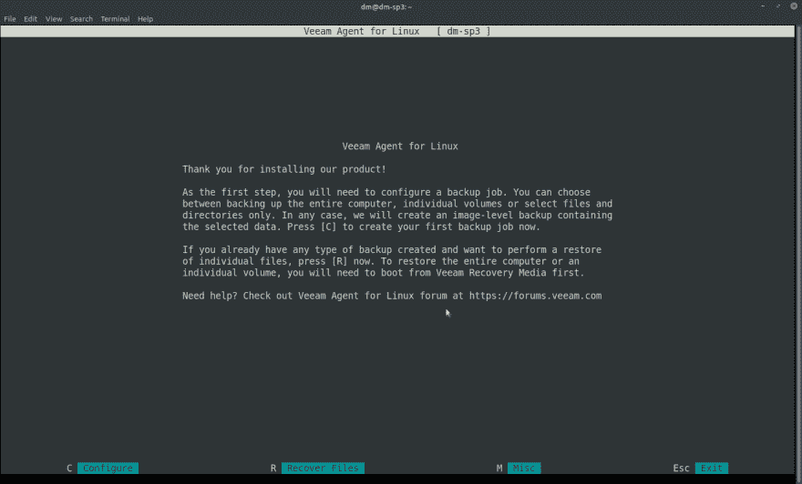T2】](https://res.cloudinary.com/practicaldev/image/fetch/s--Qme1Tajg--/c_limit%2Cf_auto%2Cfl_progressive%2Cq_auto%2Cw_880/https://thepracticaldev.s3.amazonaws.com/i/qxn2sev1olp5cgco33f0.png)

### [](#how-to-setup-your-first-backup-job)如何设置您的第一个备份作业

这里假设您已经完成了指南的最后一部分，并且在新的备份作业设置屏幕
中。如果您不在新的备份屏幕中，要从终端快速进入该屏幕，请运行以下命令

```
sudo veeam 
```

并按下键盘上的 C 键

1.  您将在前面看到此屏幕，输入备份作业的名称，然后选择“NEXT”

    [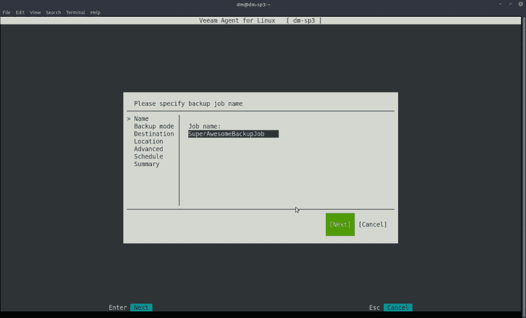T2】](https://res.cloudinary.com/practicaldev/image/fetch/s--ZR3BlTeY--/c_limit%2Cf_auto%2Cfl_progressive%2Cq_auto%2Cw_880/https://thepracticaldev.s3.amazonaws.com/i/983av8rwd013hobxsrpl.png)

2.  我想备份我的整个机器，所以在备份模式屏幕中，我选择了“整个机器”。
    *如果你只想备份特定的卷或文件/文件夹，你可以在这个屏幕上进行设置*
    按下一步

    [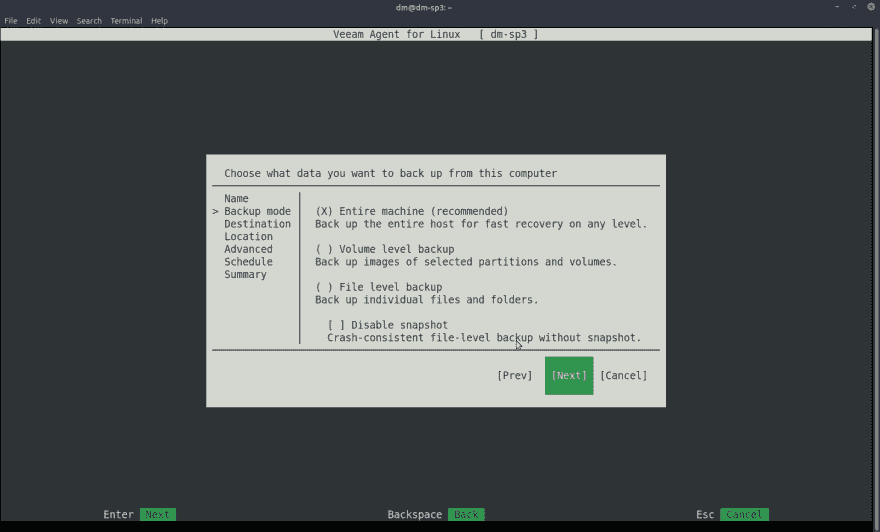T2】](https://res.cloudinary.com/practicaldev/image/fetch/s--UzUDX75U--/c_limit%2Cf_auto%2Cfl_progressive%2Cq_auto%2Cw_880/https://thepracticaldev.s3.amazonaws.com/i/ra2t0rak65zpw7rwn58p.png)

3.  选择希望 Veeam 存储备份的目标。

    我选择了“本地”,因为我有一个 USB 驱动器连接到机器上。
    按下一步

    [T2】](https://res.cloudinary.com/practicaldev/image/fetch/s--0_qheUEL--/c_limit%2Cf_auto%2Cfl_progressive%2Cq_auto%2Cw_880/https://thepracticaldev.s3.amazonaws.com/i/yw61cel50lsv85793uce.png)

4.  为了选择您希望 Veeam 存储备份的位置，您可以使用[browse]按钮或自己键入路径，这两种方式都可以。选择路径后，您需要选择您想要保留的还原点数量(您想要保留的备份数量),我保留了默认值 14。
    按下一步

    [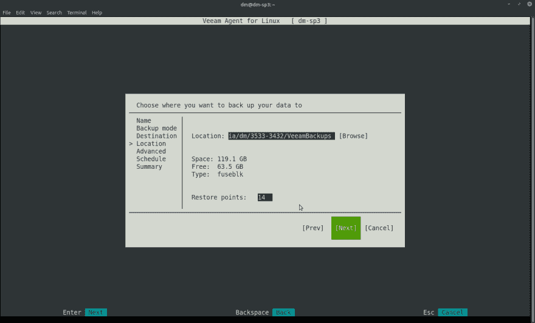T2】](https://res.cloudinary.com/practicaldev/image/fetch/s--vW_p-frZ--/c_limit%2Cf_auto%2Cfl_progressive%2Cq_auto%2Cw_880/https://thepracticaldev.s3.amazonaws.com/i/dymyjpexrp7vxp4z1beb.png)

5.  在高级功能中，我们无法选择任何内容，因为这些功能仅适用于付费版本的 Veeam Agent for Linux

    注意:如果您想要使用加密，您可以始终加密存储备份的驱动器，而不是备份本身。
    按下一步

    [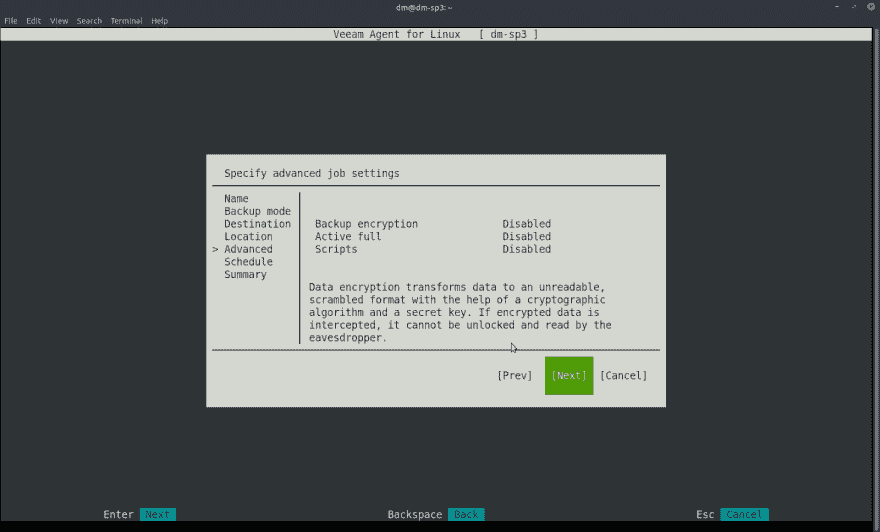T2】](https://res.cloudinary.com/practicaldev/image/fetch/s--Rrq5KBwH--/c_limit%2Cf_auto%2Cfl_progressive%2Cq_auto%2Cw_880/https://thepracticaldev.s3.amazonaws.com/i/8tpkoh3fh8kjy80n1cle.png)

6.  您可以通过选择相关时间来排定备份作业。我把我的设置成每天凌晨 2:00 运行。
    按下一步

    [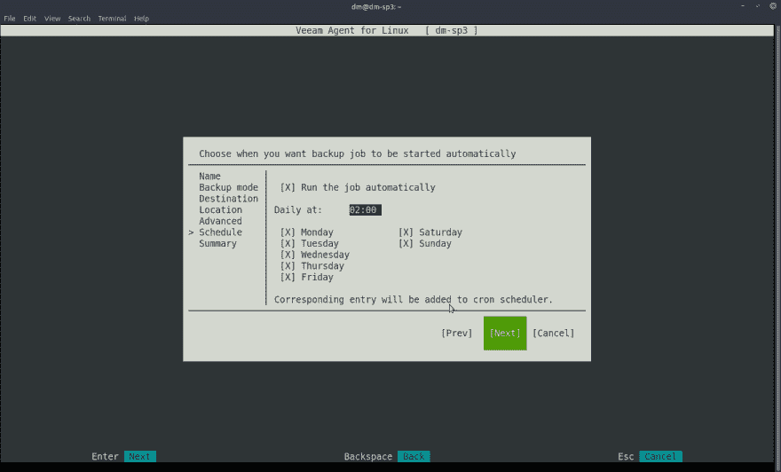T2】](https://res.cloudinary.com/practicaldev/image/fetch/s--wOjka8uo--/c_limit%2Cf_auto%2Cfl_progressive%2Cq_auto%2Cw_880/https://thepracticaldev.s3.amazonaws.com/i/ckhrcsrocxqil5n1kf54.png)

7.  这是一个摘要屏幕，您可以在其中选择是否要立即运行作业，然后按“完成”

    [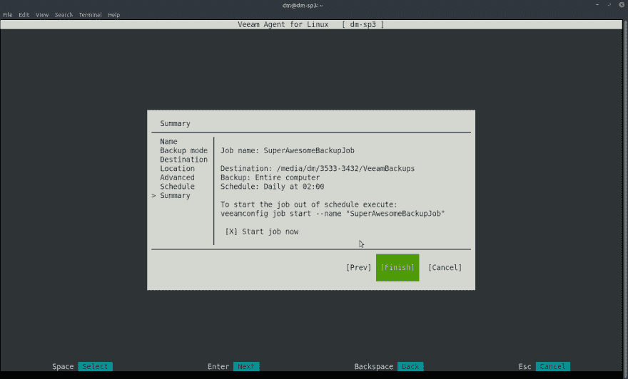T2】](https://res.cloudinary.com/practicaldev/image/fetch/s--_It8mS-X--/c_limit%2Cf_auto%2Cfl_progressive%2Cq_auto%2Cw_880/https://thepracticaldev.s3.amazonaws.com/i/falbn8j735hl9cml5lrt.png)

今天就到这里，在第 2 部分中，我将回顾恢复过程。

如果你想在我发布第 2 部分时得到通知，别忘了关注我的 Twitter 账户
[、](https://twitter.com/the_mentor/)或 [PowerShellOnLinux](https://twitter.com/posh4linux) 。

非常感谢来自 [Linux4Everyone 播客](https://linuxforeveryone.fireside.fm/)的 Jason Evangelho 提供的出版技巧，你可以在 [Linux4Everyone](https://twitter.com/Linux4Everyone) twitter 账户上找到他的更多信息。

-马克