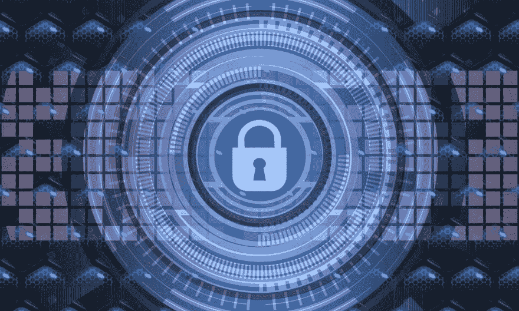

# 主要数据安全威胁以及如何缓解这些威胁

> 原文:[https://dev . to/ilaibavati/top-data-security-threats-and-how-to-mitting-these-3eie](https://dev.to/ilaibavati/top-data-security-threats-and-how-to-mitigate-them-3eie)

 

<figure>

<figcaption>图像由数字艺术家从

<figure>[Pixabay](https://pixabay.com/illustrations/network-security-data-technology-3472956/)

<figcaption></figcaption>

</figure>

</figcaption>

</figure>

无论你是大企业还是个人，你都有可能在网上获得一些敏感信息。但是，如果您是一个处理支付的组织，或者您存储了客户的个人身份信息，那么您就有额外的责任来确保这些数据的安全。

虽然商业和个人数据对攻击者一直很有吸引力，但近年来风险越来越高。私营公司、当局和安全软件公司与网络罪犯展开了一场无情的竞赛，以提高他们的保护能力。然而，虽然技术通常能够跟上日益复杂的威胁，但许多组织[无法](https://www.techradar.com/news/a-third-of-businesses-cant-protect-themselves-from-data-breaches)保护自己免受此类威胁。

请继续阅读，了解数据安全面临的一些主要威胁，以及如何减轻这些威胁。

## 什么是数据安全？

数据安全是指组织为确保数据的机密性、完整性和可用性而采用的做法和政策。对于某些行业来说，可能会适用诸如 [GDPR](https://eugdpr.org/) 、 [HIPAA](https://www.hhs.gov/hipaa/index.html) 和 [PCI DSS](https://www.pcisecuritystandards.org/) 等标准，不遵守这些标准可能会导致严重的财务后果。

数据安全措施通常在组织策略中规定，并由安全运营中心(SOC)实施。在许多情况下，例如对于在欧盟运营的公司，[数据保护官(DPO)](https://digitalguardian.com/blog/what-data-protection-officer-dpo-learn-about-new-role-required-gdpr-compliance) 负责监督安全政策的实施。

## 顶级数据安全威胁

为了简化起见，我将数据安全威胁分为两种类型，数据丢失和数据失窃。

**数据丢失**
如果数据变得不可用、被损坏或被删除，这可能会使您的运营陷入停顿。在许多情况下，这也是一项法律要求，以保证个人数据始终可供数据所有者使用。

数据丢失可能由以下原因造成:

*   **物理事件**—如自然灾害、停电、服务器损坏或战争。
*   **人为错误**—这可能是数据丢失的最常见原因，用户会意外删除数据或遭受网络钓鱼等社交工程攻击。
*   **网络攻击**—通常，组织主要担心的是网络罪犯或恶意内部人员会攻击系统并破坏数据。如果网络上出现导致服务器崩溃的攻击，例如拒绝服务(DoS)攻击，数据可能会暂时或永久不可用。

**数据盗窃**
如果涉及身份盗窃，这种情况尤其严重，因为身份盗窃允许攻击者访问受限资源或窃取金钱。攻击者通常会窃取数据用于商业间谍目的，或者破坏公司。

数据失窃的常见原因包括:

*   **内部威胁**—心怀不满的员工可能会窃取数据并将其传递给竞争对手公司，目的可能是为了经济利益或
*   **社会工程**—这是指操纵内部人员访问敏感数据或网络受限部分的攻击。受害者可能会错误地与攻击者共享特权信息，从而允许他们获得访问权限。最常见的社会工程攻击形式是网络钓鱼，即垃圾邮件和网站，旨在让人们点击链接并在不知不觉中下载恶意软件。
*   **高级持续威胁(APTs)**—这是一种阴险的网络攻击形式，攻击者获得对系统的访问权，并在网络中隐藏很长一段时间，悄悄收集数据。
*   **中间人(MitM)攻击**—这些攻击拦截网络流量，捕获传输中的数据。

## 你能做什么

以下实践应该有助于您保护

**数据丢失防护(DLP)**
为了防止数据丢失，组织可以采用许多保护措施，例如将数据备份到第二个位置。物理冗余用于在发生自然灾害、断电或战争时保护数据，或者防止针对本地服务器的攻击。这包括将数据存储在异地数据中心或云环境中。

有许多数据丢失预防实践和策略可以帮助保护您的数据。考虑软件工具，如 [DLP 解决方案](https://www.exabeam.com/dlp/data-loss-prevention-policies-best-practices-and-evaluating-dlp-software/)，来帮助您实施数据保护策略也是值得的。

**数据加密**这是通过使没有解密密钥的任何人都无法读取数据来实现的。

**认证和授权**
您可以使用 [OAuth](https://searchapparchitecture.techtarget.com/definition/OAuth) 等认证协议来保护您的网络。为了增加安全性，请使用双因素或多因素身份验证，将密码与确认码等附加措施结合起来。认证的目的是验证你确实是你所说的那个人。

下一步是授权，建立用户的访问权限。限制访问权限是降低暴露数据风险的重要方法。授权可确保您应用的访问规则得以实施。

安装更新
这似乎是非常基本的，但是许多组织忽略了这个重要的步骤。您应该定期更新操作系统和任何应用程序或依赖项，以确保修复已知的安全漏洞。您应该尽可能启用自动更新。

进行安全审计
你应该至少每隔几个月进行一次安全审计。这是为了确保您的整体安全配置文件符合要求。您可以使用第三方专业人员进行审核，但在大多数情况下这是不必要的，您应该能够自己完成。

**信用冻结**
作为发生实际数据泄露时的最后一道防线，您可以冻结您的信用报告。这包括在信用局级别锁定您的数据，信用局有能力出售您的个人金融身份数据。这是阻止身份盗窃的最有效方法，因为它使威胁行为者无法使用例如信用卡信息。

使用反恶意软件和反病毒软件
由于恶意软件是网络攻击最常见的载体，确保你安装了正确的防护是很重要的。

**保护您的终端**
终端设备是用户远程访问关键数据的重要方式，但它们也为攻击者提供了可乘之机。您应该实施良好的终端安全实践，例如尽可能减少对终端设备的访问。

在某些情况下，限制访问并不是一个实用的解决方案，因此最好依靠软件解决方案，如具有端点检测和响应(EDR)功能的端点保护平台(EPP)。这将有助于减轻终端上的威胁，包括内部威胁。

## 底线

数据泄露无处不在，对数据安全性和完整性的威胁只会越来越多。但是，您可以应用许多措施来帮助保护您的数据免遭丢失、损坏或盗窃。上面提到的实践是一个良好的开端，但是您应该建立一个清晰的数据安全策略，允许您和您的员工根据需要实施这些措施。

更新您的安全策略以跟上不断发展的威胁也很重要。使用可用的工具，并在需要时不要害怕寻求帮助-第三方安全平台或顾问可能最了解您需要做什么来保护您的数据。维护数据安全对于企业的生存以及合规性至关重要，具体取决于您所在的行业。