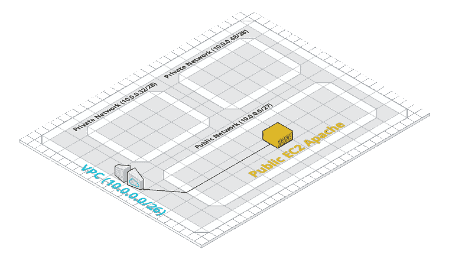
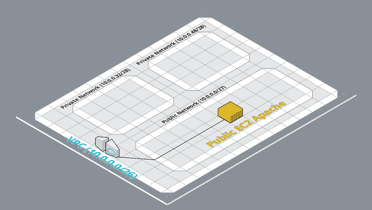

# AWS 网络基础:软件工程师简单指南。

> 原文:[https://dev . to/loujaybee/AWS-networking-fundamentals-a-simple-guide-for-software-engineers-4d of](https://dev.to/loujaybee/aws-networking-fundamentals-a-simple-guide-for-software-engineers-4dof)

你是否曾经进入 AWS 控制台，对所有的概念和术语感到完全困惑？你有:安全组，入站规则，VPC，子网，互联网网关，NAT，ENI，所有这些都与网络有关。简而言之:AWS 网络有很多东西。所以，如果你要打破它，你需要知道关注什么:基本面。

[T2】](https://res.cloudinary.com/practicaldev/image/fetch/s--ebNJ2zSM--/c_limit%2Cf_auto%2Cfl_progressive%2Cq_auto%2Cw_880/https://i2.wp.com/www.thedevcoach.co.uk/wp-content/uploads/2019/09/AWS-Networking-Example.png%3Ffit%3D760%252C428%26ssl%3D1)

今天，我们将介绍 AWS 中您应该熟悉的主要网络组件。我们将向您介绍为什么您需要该组件，它是什么以及您将如何使用它。在整篇文章中，我们将构建一个在公共子网中运行 web 服务器的示例，作为我们自己的 VPC 的一部分。

完成本文后，您将了解主要的网络概念:私有 IP、虚拟私有云(VPC)、无类域间路由(CIDR)、子网、互联网网关和安全组，并使用这些概念来实现基本的网络设计。

## 学习 AWS 网络基础知识的 3 个重要原因

也许现在你在想:

但是，我是软件工程师？我真的需要了解网络吗？那不就是运营之类的工作吗？我已经有很多事要做了，为什么还要多做一件事呢？

但是你问这个问题是对的！

如果那是你，而你还不相信为什么你应该学习 AWS 网络基础知识，那么让我给你两个大的理由…

#### **1。在不了解 AWS 联网基础知识的情况下，AWS 云要难得多**。

无论你是启动一个简单的 EC2 还是 Lambda，这些网络话题:VPC，安全组等等都会出现。他们会不断分散你的注意力，让你说“哦，我现在就忽略它”。你忽略它，你忽略它。

但是随着时间的推移，不理解这些基本原理将会开始浪费你的时间，因为你会纠结于你并不真正理解的特性。即使您是一名普通的应用程序开发人员，您也会接触到我们今天讨论的 AWS 网络基础知识，这会让您的生活变得更加轻松。

#### **2。了解 AWS 网络基础知识可以让您从根本上实施更好的解决方案**。

如果你有一把锤子，一切都是钉子。

如果你没有意识到在网络层面有什么可能，你将永远在应用层面实现次优的解决方案。我对过去这样做感到内疚，在应用程序内部实现 IP 白名单之类的东西，而理想情况下它们应该在网络层。

当你知道在网络层次上什么是可能的(即使你不一定能实现它)，它将允许你挑战你自己的架构和设计，以提出从根本上更好的软件。

#### **3。云原生正在兴起，工程师需要 AWS 联网技能。**

在[云本地环境](https://dev.to/loujaybee/what-is-a-cloud-native-software-engineer-j09-temp-slug-3532458)中工作变得越来越普遍。现在，工程师比以往任何时候都需要走出纯粹的应用程序开发领域，真正了解基础设施问题，如网络。对你的要求越来越高。

## 我们将如何使用 Terraform 来解释 AWS 网络基础知识。

好了，这就总结了我们为什么要学习这些网络概念——让我们来谈谈我们实际上要怎么做。

我更喜欢通过[基础设施即代码](https://dev.to/loujaybee/infrastructure-as-code-a-quick-and-simple-explanation-56ln)在云中学习。

为什么？因为它允许我在自己的时间内将基础设施编写为代码，准备好更改并在准备好的时候执行它们。

“基础设施即代码”不仅可以实现一个良好的工作流，而且在版本控制中撤销错误和保留历史记录可以让生活变得不那么紧张。

因此，在我们今天讨论网络概念时，我还会给大家一些 terraform 基础设施代码片段。如果你对 Terraform 不熟悉也不用担心，因为片段很小，你不需要任何先验知识。代码片段主要向您展示在创建这些资源时需要传递什么类型的参数(或属性)。

当然，实践学习是最好的。因此，当我们读完这篇文章后，您可以[从这个报告中找到、克隆并运行完整的代码示例](https://github.com/loujaybee/terraform-aws-core-networking-exercise),并随心所欲地试验基础架构。

## 了解 IP 和私有地址的需求。

好了，介绍到此为止，让我们开始吧！

首先，我们需要了解一些关于 IP 和 IP 地址的理论，但请继续关注我，这是值得的。记住，这篇文章是关于基本面的，所以不要急于跳过。

IP 地址是分配给计算机的一系列唯一的数字，使其在给定的网络中可以访问。IP 地址看起来像:`123.122.11.56`。通常，当我们谈论 IP 地址时，我们是在公共互联网的环境中谈论的。公共互联网是一个开放的网络，全世界都可以使用。

但是，在互联网上，我们并不经常接触到这些原始知识产权。这是因为 DNS(域名系统)将这些机器相关的 IP 映射到我们更常用的更友好的名称。

如果你感兴趣，试着把`34.242.183.30`放入你的搜索栏。那是这个网站目前的弹性 IP 地址。或者更准确地说，它是亚马逊拥有的一个 IP，目前正被路由到运行 wordpress 的 EC2 机器。

我的网站是互联网上公开的东西的一个例子，我希望它是！然而，并不是每台机器都需要联网。比如像会计这样的后台业务功能。这些机器需要有人访问，但不是互联网上的任何人。

为了做到这一点，我们使用私有地址空间。

当互联网逐渐成熟时，[决定保留以下地址空间供私人使用](https://tools.ietf.org/html/rfc1918):

*   `10.0.0.0/8`
*   `172.16.0.0/12`
*   `192.168.0.0/16`

你会认出 IP 地址的格式，但是你会注意到数字后面有一个数字:`/12`。这个数字被称为网络掩码，它定义了 IP 地址的范围。但是，我们稍后会更详细地介绍这一点。你现在需要知道的是有一个(大！)保留给私人使用(即不在公共互联网上)的 IP 地址数量。我们可以充分利用这些私有地址空间。

这就为我们带来了我们今天要建造的东西！它是一个 VPC 网络，包含一个私有网络(使用上述地址空间),并被划分为三个更小的子网。一个子网将被授权访问互联网，我们将在其中部署一个 web 服务器。另外两个子网将是私有的，可以用于内部业务功能，如我们之前所说的。

[T2】](https://res.cloudinary.com/practicaldev/image/fetch/s--EPDp9kpJ--/c_limit%2Cf_auto%2Cfl_progressive%2Cq_auto%2Cw_880/https://i2.wp.com/www.thedevcoach.co.uk/wp-content/uploads/2019/09/AWS-Networking-Example.png%3Fresize%3D760%252C428%26ssl%3D1)

今天的参考架构。

我们将逐个组件地检查构建这种类型的架构所需的组件。

因此，让我们从最重要的话题开始:虚拟私有云。

## 什么是虚拟私有云(VPC)？

当您在 AWS 中工作时，VPC 或虚拟私有云是一种逻辑分离资源的方式。AWS 拥有很多机器，所以 VPC 基本上是一种声称属于你的机器的方法，这样其他人就不能访问它们。当我们有一个 VPC 时，其中包含的资源只能与其他 VPC 资源通信。嗯，除非我们做一些特殊的技巧来连接 VPC 的，但我们今天不会涵盖这一点。

因此，VPC 只是一种隔离企业，甚至是企业子部门的方式。我们甚至可以使用 VPC 的来实现不同的环境，如演示、测试、试运行和生产环境。因为生产环境不需要访问我们的测试环境，反之亦然。VPC 有许多不同的使用案例。

作为网络的 VPC 具有分配的地址空间。当我们在 VPC 中创建资源时，它们必须位于我们 VPC 的专用地址空间中。还记得我们之前讨论过的私有地址范围吗？

AWS 中的 VPC 可以大到`64,000`独特的 IP，小到`16`。

但是是什么决定了大小呢？嗯，很多因素包括我们对未来增长的预测，但我们现在不要太担心这个。

关于 VPC 或任何私有网络，最后要考虑的是:名称空间冲突。

我什么意思？

如果我们想将两个 VPC 连接在一起，并且它们使用相同的私有地址空间，这将会引起问题。这意味着，如果可能的话，我们很可能希望用不同的 IP 地址范围创建我们所有的专用网络。

让我们来看看在 Terraform 中创建 VPC 是什么样子的…