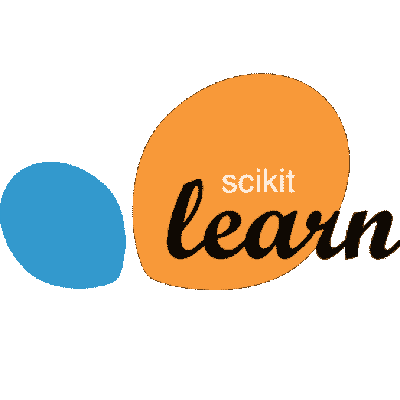
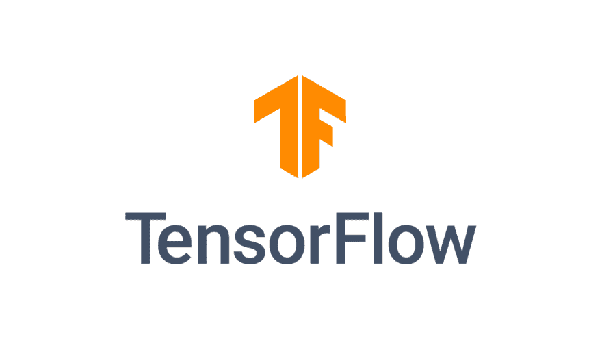
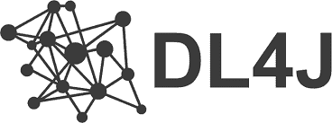
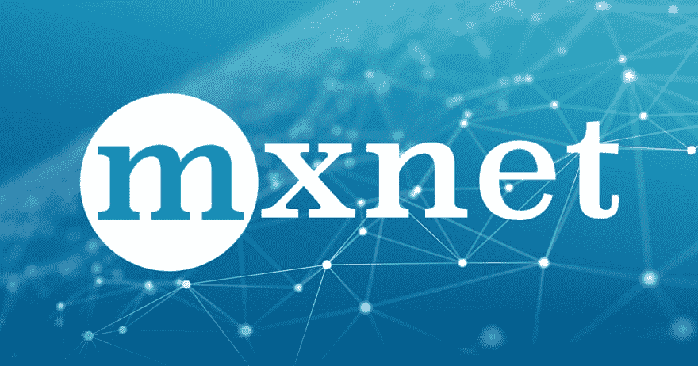
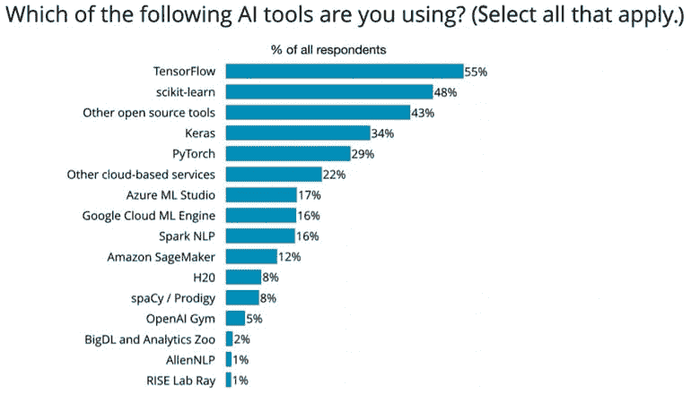

# 你需要知道的机器学习框架

> 原文:[https://dev . to/vijaykhatri 96/machine-learning-frameworks-you-need-to-know 2 HPI](https://dev.to/vijaykhatri96/machine-learning-frameworks-you-need-to-know-2hpi)

机器学习是软件开发中发展最快的领域。作为初学者，您可能听说过很多术语，如 Tensorflow、Keras、Pytorch、Scikit-learn 等等。如果你是机器学习或深度学习的新手，那么你可能会对选择哪一个感到困惑。选择最佳的框架将为您节省大量的时间和金钱。这就是为什么我们编制了一个可用的顶级框架列表。使用这个列表作为您的项目进入最适合您的机器学习库的指南。

**看完这篇文章，你可以回答以下问题:**

1.  什么是机器学习框架，它有什么用？
2.  有哪些不同类型的可用框架？
3.  哪个框架最适合我？

**什么是框架？**

框架是一个模块或一堆库，其中所有的概念都已经实现供我们使用。这允许开发者以更高的速度创建机器学习项目，而不用担心算法的本质细节

为了更好的理解，我会鼓励你从头开始写一个算法！

**使用框架的优势:**

1.  所有框架都针对性能进行了优化
2.  它提供了一种清晰简洁的定义机器学习管道的方法。
3.  它对用户友好，代码易于理解
4.  它有助于简化获取数据和对数据进行预测的过程。
5.  模型的快速部署。
6.  良好的社区支持。

总的来说，ML 框架将帮助你降低机器学习的复杂性，并为你启动你的机器学习项目提供一个超级力量。

# **我们来详细讨论一下顶级的机器学习框架:**

在选择最佳的机器学习框架时，需要考虑的因素很少。从问正确的问题开始，这将帮助你选择最好的一个。

*   框架会用于深度学习还是机器学习？
*   开发 AI 模型的首选编程语言？
*   需要什么样的硬件或者它将被部署在云上？

说到编程语言，Python 和 R 是机器学习中的赢家和最受欢迎的使用语言。现在大部分的机器学习算法都是用 Python，因为简单易用。

**根据以上问题**，我们将框架分为三个部分

1.  通用机器学习框架
2.  深度学习或神经网络的框架
3.  大数据框架

**让我们一个一个地深入每个类别**

## 通用机器学习框架

### **Scikit-Learn**

[T2】](https://res.cloudinary.com/practicaldev/image/fetch/s--jq3qIzQd--/c_limit%2Cf_auto%2Cfl_progressive%2Cq_auto%2Cw_880/https://thepracticaldev.s3.amazonaws.com/i/9g1own4ce6nb5gagjg3n.png)

Scikit-Learn 是用于机器学习的强大且最常用的 Python 库之一。这是建立在几个流行的 Python 包之上的，即 NumPy、SciPy 和 Matplotlib。它为您提供了开始机器学习的一切，包括分类、回归和聚类算法。是用 **python** 写的，开源。

**Sci-Kit Learn 的优势:**

1.  它是用户友好的
2.  它是数据挖掘和数据分析的有效工具
3.  每个人都可以访问它，并且可以在各种上下文中重用它

### **H2O**

正如他们的口号所说，“每个公司都可以是 AI 公司”。这更多的是商业导向。H2O 提供了一个机器学习和人工智能平台。它支持最流行的统计和机器学习算法。它还使用 AutoML 特性提供了机器学习的自动化。

**使用 H2O 的优势**

1.  您可以在不知道任何代码的情况下构建您的模型
2.  它还提供了一个图形用户界面，这对于非技术人员来说是很好的。
3.  开发人员也可以用 Python 和 r 编写他们的代码。

## **深度学习框架或神经网络**

### **张量流**

[T2】](https://res.cloudinary.com/practicaldev/image/fetch/s--SZG2o8V2--/c_limit%2Cf_auto%2Cfl_progressive%2Cq_auto%2Cw_880/https://thepracticaldev.s3.amazonaws.com/i/sahy24domjzw9o0tptxd.png)

Tensorflow 是当今最流行的框架之一。这是一个端到端的开源平台，将帮助您轻松灵活地开发和训练机器学习模型。它是由谷歌创建的，用 Python 写的，但是现在几乎所有的编程语言都可以使用。许多谷歌服务在后台使用 Tensorflow，如 Gmail、语音识别、谷歌照片。

**使用 Tensorflow 的优势**

1.  使用像 Keras 这样的高级 API 可以很容易地构建和训练模型。
2.  在云上部署既快速又简单
3.  一个简单灵活的架构，把新的想法从概念变成最先进的模型代码。
4.  它有一个名为* * Tensorboard * *的杀手级功能，允许我们可视化和查看计算管道
5.  TensorFlow 灵活的架构使我们能够在一个或多个 CPU(以及 GPU)上部署我们的深度学习模型。

### **Keras**

[T2】](https://res.cloudinary.com/practicaldev/image/fetch/s--NvndY4CG--/c_limit%2Cf_auto%2Cfl_progressive%2Cq_auto%2Cw_880/https://thepracticaldev.s3.amazonaws.com/i/csq3hm3klrvkhfdayvsy.png)

Keras 是一个高级 API，用 Python 编写，可以用 Tensorflow、CNTK 或 Theano 包装。它是为快速实验而开发的，能够毫无延迟地快速产生好的研究成果。如果你刚刚开始深度学习，Keras 是理想的框架。

**Keras 的优势:**

1.  它是用户友好的，并且通过模块化和可扩展性是快速原型化的理想选择。
2.  支持卷积网络和递归网络
3.  既可以在 CPU 上运行，也可以在 GPU 上运行。

#### **Theano**

[T2】](https://res.cloudinary.com/practicaldev/image/fetch/s--nDhofpsW--/c_limit%2Cf_auto%2Cfl_progressive%2Cq_auto%2Cw_880/https://thepracticaldev.s3.amazonaws.com/i/gz1zx4bo7h21rz5fu3uw.png)

Theano 是一个用于深度学习的 **Python** 库，它允许你定义、优化和检查涉及多维数组的数学表达式。

**使用 no 的优势**

1.  它可以很容易地与 Numpy 集成
2.  你可以使用 CPU，也可以使用 GPU
3.  它可以与 Keras 等其他库协作，提供高级抽象。
4.  它可以为你提供一个有效的符号分化。
5.  它支持 Linux、Mac OS X 和 Windows 等平台。

### **咖啡馆**

[T2】](https://res.cloudinary.com/practicaldev/image/fetch/s--9ejlFp1n--/c_limit%2Cf_auto%2Cfl_progressive%2Cq_auto%2Cw_880/https://thepracticaldev.s3.amazonaws.com/i/01brtkaucobqmo729xvq.png)

Caffe 是一个轻量级深度学习框架，它提供了很高的速度和模块化。它可以很好地处理图像数据。

**使用 Caffe 的优势:**

1.  它是轻量级的，也可以很容易地部署到移动设备上
2.  它提供了一个高级 API，可以帮助初学者编写深度学习，而不必跳入复杂的编码。3.** Caffe model Zoo**:这个框架提供了大量预先训练好的网络、模型和权重，让你可以直接应用于你的深度学习问题。

### **Pytorch**

[T2】](https://res.cloudinary.com/practicaldev/image/fetch/s--GaNa3Mz0--/c_limit%2Cf_auto%2Cfl_progressive%2Cq_auto%2Cw_880/https://thepracticaldev.s3.amazonaws.com/i/0bo0qcvx4vrd0ac9lo4a.png)

Pytorch 是由脸书创建的开源机器学习框架，主要用 **Python** 编写。这个框架易于使用 API，并提供了编写代码的 pythonic 方式。与 Tensorflow 相比，更直观的是，如果你已经知道 python，你不需要有扎实的机器学习背景来理解代码。

**torch 框架的优势:**

1.  它使用起来很灵活
2.  Cuda 支持也是可用的
3.  PyTorch 与 Python 深度集成，并遵循面向对象的范式
4.  许多预先训练好的模型可供我们使用
5.  动态计算图形允许我们在编码过程中动态地创建图形

#### **Deeplearning4J**

[T2】](https://res.cloudinary.com/practicaldev/image/fetch/s--MiqhuARQ--/c_limit%2Cf_auto%2Cfl_progressive%2Cq_auto%2Cw_880/https://thepracticaldev.s3.amazonaws.com/i/73xnc3v6fgnhk2h79xlw.png)

Deeplearning4jj 是**基于 Java 的**深度学习框架，兼容 Scala、Clojure、Kotlin 等 Java 虚拟机。它利用包括 Apache Spark 和 Hadoop 在内的最新分布式框架来加速 fast 训练。在速度和性能上与 Caffe 相当。

**使用 Deeplearin4j 的优势**

1.  它可以支持名为 ND4J 的张量
2.  它可以在 CPU 和 GPU 上工作
3.  它可以支持所有的模型，像 ANN，CNN，甚至 RNN 和 LSTMs。
4.  由于分布式框架的支持，它可以处理大量的数据。

### **MXNET**

[T2】](https://res.cloudinary.com/practicaldev/image/fetch/s--UH9Kv6Vw--/c_limit%2Cf_auto%2Cfl_progressive%2Cq_auto%2Cw_880/https://thepracticaldev.s3.amazonaws.com/i/im0jd2oay3ozft7flg9m.png)

MXNet 是一个深度学习框架，专门用于以可扩展和灵活的方式训练和部署神经网络。它支持很多编程语言，比如 C++、Python、JavaScript、R 和 Scala。

**使用 MXNet 的优势**

1.  它也受到像 AWS 和 Azure 这样的云提供商的支持。
2.  它支持长期短期记忆(LTSM)网络以及 RNN 和 CNN。
3.  MXNet 库是可移植的，可以扩展到多个 GPU。

### **Fast.ai**

[T2】](https://res.cloudinary.com/practicaldev/image/fetch/s--IvZegN5W--/c_limit%2Cf_auto%2Cfl_progressive%2Cq_auto%2Cw_880/https://thepracticaldev.s3.amazonaws.com/i/x90p3i1y24bhzcvn9zor.png)

fasta.ai 一个新的深度学习免费开源库，名为 fastai。该库位于 **PyTorch** 之上，为最重要的深度学习应用和数据类型提供单一一致的 API。

**使用 Fastai 的优势**

1.  它需要更少的代码来产生最先进的结果。
2.  它为所有最常用的深度学习应用程序(如视觉、文本、时间序列和协同过滤)提供了一个接口。
3.  它完全是用 Python 编写的，给你一种 Python 的感觉。

## **大数据框架**

### **火花 MLLIB**

[T2】](https://res.cloudinary.com/practicaldev/image/fetch/s--M36vaddS--/c_limit%2Cf_auto%2Cfl_progressive%2Cq_auto%2Cw_880/https://thepracticaldev.s3.amazonaws.com/i/2pl66w1glue695z8id4s.png)

MLlib 是 Apache Spark 的可扩展机器学习库。这个框架的目标是使机器学习项目更具可扩展性和分布性。

**Spark ml lib 的优势**

1.  它很容易使用
2.  你可以用 Scala、Java、Python 和 R 编写你的代码
3.  MLlib 可以很容易地与 NumPy 和 R 库一起使用
4.  性能卓越，比传统系统快 100 倍。
5.  它包含了所有流行的算法，如分类、回归、聚类和协作算法。

既然您已经阅读了本文的末尾，那么您应该对选择哪个框架有了相当的了解。这取决于您的项目、用例、框架的成熟度、社区支持、您偏好的编程语言以及您正在寻找的具体特性。明智地选择您的框架可以节省大量的精力和时间。

以下是我们的一些建议:

1.  如果你的用例是经典的机器学习，那么 Scikit-learn 就是赢家，如果你是 R 用户，那么就选择 CRAN
2.  如果你是深度学习的新手，那就去找专为人类设计的 Keras。
3.  如果你在学术界，那就去找 Pytorch 吧，它更容易学习和使用。
4.  如果你在这个行业，那么 Tensorflow 是赢家，这就是原因，TensorFlow 在 GitHub 上有最大数量的星星。它也有最多的开发人员使用它，并且在工作门户网站上列出了更多的工作。
5.  Tensorflow 和 Pytorch 都在快速增长，但现在我们有了像 Keras 和 fastai 这样的高级 API，这降低了深度学习的入门门槛。
6.  如果您正在寻找一种更 pythonic 化和面向对象的方法，那么请选择 Pytorch 或 Fastai。
7.  如果你是 Java 用户，那么 got for Deeplearning4j 是一个显而易见的选择。

**这里也是来自 Orielly 的图表，我们可以看到 Tensorflow 和 Scikit-learn 是真正的赢家:**

奥里埃利

你认为现有的最佳框架是什么？你同意 Tensorflow 和 Scikit-learn 是赢家吗？在下面的评论中分享你的想法吧！