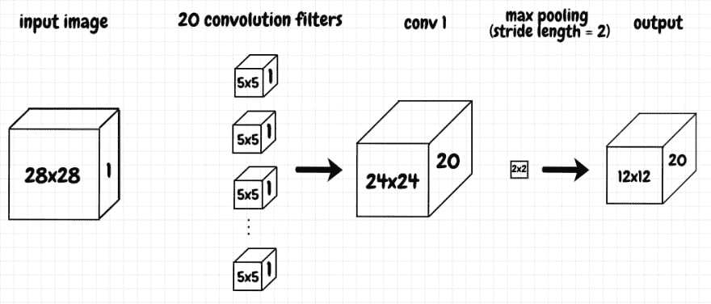
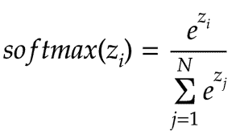
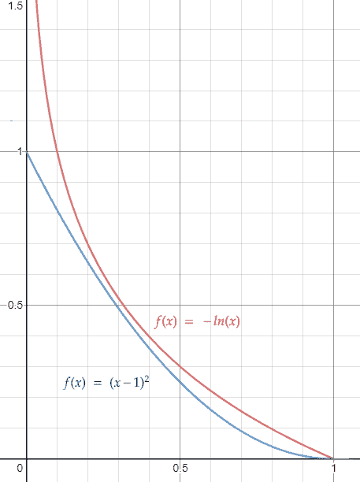
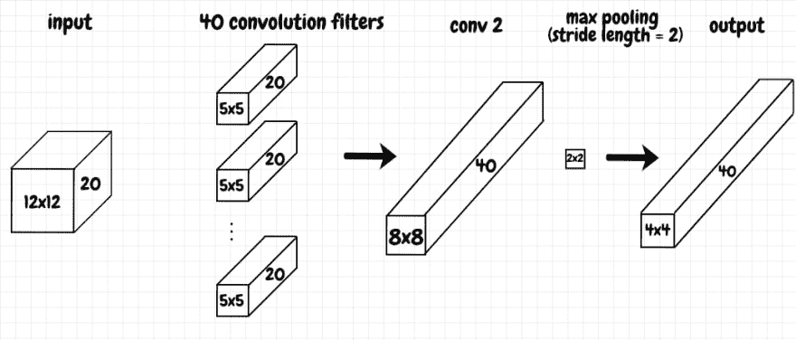

# 基于卷积网络的 PyTorch 图像识别

> 原文:[https://dev . to/nested software/py torch-image-recognition-with-convolutionary-networks-4k 17](https://dev.to/nestedsoftware/pytorch-image-recognition-with-convolutional-networks-4k17)

在上一篇文章中，我们用 PyTorch 实现了一个简单的密集网络来识别 MNIST 图像。在本文中，我们将继续 MNIST 识别任务，但这一次我们将使用卷积网络，如迈克尔·尼尔森的书[第 6 章](http://neuralnetworksanddeeplearning.com)中的[所述，神经网络和深度学习](http://neuralnetworksanddeeplearning.com/chap6.html)。对于一些关于卷积网络的额外背景，你也可以看看我的文章[卷积神经网络:一个直观的入门](https://dev.to/nestedsoftware/convolutional-neural-networks-an-intuitive-primer-k1k)。

我们将使用用(现已不存在的) [Theano](https://github.com/Theano/Theano) 库编写的[代码](https://github.com/mnielsen/neural-networks-and-deep-learning/blob/master/src/conv.py)来比较我们的 PyTorch 实现和 Michael 的结果。你也可以看看他在 Theano 之上开发的底层[框架代码](https://github.com/mnielsen/neural-networks-and-deep-learning/blob/master/src/network3.py)。与 ano 相比，PyTorch 似乎更像是一个“包含电池”的解决方案，因此它使得实现这些网络更加简单。上一篇文章中的密集网络具有接近于 98%的精确度。我们卷积网络的最终目标是达到 Michael 达到的 99.6%的精确度。

本项目的[代码](https://github.com/nestedsoftware/pytorch)在 github 上有，主要在 [pytorch_mnist_convnet.py](https://github.com/nestedsoftware/pytorch/blob/master/pytorch_mnist_convnet.py) 中。

## [](#simple-convolutional-network)简单卷积网络

迈克尔展示的第一个卷积网络设计是 [`basic_conv`](https://github.com/mnielsen/neural-networks-and-deep-learning/blob/master/src/conv.py) 。我们的 PyTorch 实现如下所示([py torch _ mnist _ conv net . py](https://github.com/nestedsoftware/pytorch/blob/master/pytorch_mnist_convnet.py)):

```
class ConvNetSimple(nn.Module):
    def __init__(self):
        super().__init__()
        self.conv1 = nn.Conv2d(in_channels=1, out_channels=20, kernel_size=5)
        self.fc1 = nn.Linear(12*12*20, 100)
        self.out = nn.Linear(100, OUTPUT_SIZE)

    def forward(self, x):
        x = self.conv1(x)
        x = torch.sigmoid(x)
        x = torch.max_pool2d(x, kernel_size=2, stride=2)

        x = x.view(-1, 12*12*20)
        x = self.fc1(x)
        x = torch.sigmoid(x)

        x = self.out(x)
        return x 
```

在这个网络中，我们有 3 层(不包括输入层)。图像数据被发送到具有 *5 × 5* 内核、 *1* 输入通道和 *20* 输出通道的卷积层。这个卷积层的输出被输入到一个由 *100* 个神经元组成的密集(即全连接)层。这个密集层反过来又馈入输出层，输出层是由 *10* 个神经元组成的另一个密集层，每个神经元对应于我们从 *0* 到 *9* 的一个可能的数字。

当我们通过网络运行输入时，就会调用`forward`方法。除了输出层之外，我们对每个层都使用 sigmoid 激活函数(我们将在接下来的几节中更详细地讨论这一点)。我们还通过对卷积层应用 *2 × 2* 最大池，将卷积层的输出压缩一半，步长为 *2* 。下图显示了该网络的结构:

[T2】](https://res.cloudinary.com/practicaldev/image/fetch/s--5_CircOt--/c_limit%2Cf_auto%2Cfl_progressive%2Cq_auto%2Cw_880/https://thepracticaldev.s3.amazonaws.com/i/p4q7xbnn5o13noe9hqnk.png)

在上一篇文章中，我们看到加载器返回的数据有维度`torch.Size([10, 1, 28, 28])`。这意味着每批有 *10 张*图像，每张图像表示为一个 *1 × 28 × 28* 网格。 *1* 表示只有一个输入通道(数据以灰度表示)。下图更详细地显示了如何通过卷积层处理输入:

[T2】](https://res.cloudinary.com/practicaldev/image/fetch/s--0Tk9vS3f--/c_limit%2Cf_auto%2Cfl_progressive%2Cq_auto%2Cw_880/https://thepracticaldev.s3.amazonaws.com/i/ctzw0mndjoonee3ybzmh.png)

在 SciPy 中， [`convolve2d`](https://docs.scipy.org/doc/scipy/reference/generated/scipy.signal.convolve2d.html) 做的就是所说的:它将两个二维矩阵卷积在一起。`torch.nn.Conv2d`的行为更加复杂。创建卷积层的代码行`self.conv1 = nn.Conv2d(in_channels=1, out_channels=20, kernel_size=5)`，由几部分组成:

*   `kernel_size`告诉我们应用于输入的过滤器的二维结构。如果我们希望它是一个矩形，我们可以把它作为元组来提供，但是如果我们把它指定为一个标量，就像我们在这里做的那样，那么这个值同时用于高度和宽度，在这个例子中是一个 *5 × 5* 正方形。
*   `in_channels`将内核深度扩展到第三维。这三个参数，即内核的高度和宽度，以及由输入通道的数量指定的深度，定义了一个 3-d 矩阵。我们可以用这个三维滤波器来卷积三维输入。结果是一个 *24 × 24* 的二维矩阵。这个二维矩阵是一个特征图。这个特征图中的每个神经元在输入的感受野的某个地方识别相同的 *5 × 5* 特征。
*   告诉我们要使用多少滤波器，换句话说，我们需要多少卷积层的特征图。来自输入与每个滤波器的卷积的 2-d 输出相互堆叠。

尽管我认为这是一个三维操作(尤其是当有多个输入通道时)，但我猜它在 PyTorch 中被称为`Conv2d`是为了表示每个通道都有一个二维形状(当每个通道都有 *3* 个维度时，使用`Conv3d`)。在[卷积神经网络:直观入门](https://dev.to/nestedsoftware/convolutional-neural-networks-an-intuitive-primer-k1k)中，我将更详细地介绍通过卷积层的前向和反向传播。

从概念上讲，每个过滤器产生一个特征图，它代表我们在输入数据的感受域中寻找的特征。在这种情况下，这意味着网络学习了 *20* 不同的 *5 × 5* 特征。在正向传播期间，`max_pool2d`压缩每个特征。它应用于每个通道，将每个 *24 × 24* 特征映射转换为每个通道的 *12 × 12* 矩阵。结果是一个具有相同深度的三维矩阵(本例中为 *20* 通道)。

注意，如下所示，`Conv2d`在技术上执行互相关，而不是真正的卷积运算(`Conv2d`内部调用`conv2d`):

```
>>> import torch
>>> from torch import nn
>>> from scipy import signal
>>> values = torch.tensor([[[[1,2,3],[4,5,6],[7,8,9]]]])
>>> f = torch.tensor([[[[10,20],[30,40]]]])
>>> nn.functional.conv2d(values, f)
tensor([[[[370, 470],
          [670, 770]]]])
>>> signal.correlate2d(values[0,0], f[0,0], mode="valid")
array([[370, 470],
       [670, 770]], dtype=int64) 
```

## [](#softmax)Softmax

我们希望输出表明图像对应于哪个数字。换句话说，我们希望正确预测的输出尽可能接近 *1* ，其余输出尽可能接近 *0* 。

首先，我们将标准化我们的输出，使它们加起来等于 *1* ，从而将我们的输出变成一个概率分布。标准化输出的简单方法是将每个输出除以所有输出的总和( *N* 是输出的数量):

[T2】](https://res.cloudinary.com/practicaldev/image/fetch/s--s8dEOMLa--/c_limit%2Cf_auto%2Cfl_progressive%2Cq_auto%2Cw_880/https://thepracticaldev.s3.amazonaws.com/i/onbx2gx8j8qcs2jqejka.png)

我们将使用一个名为 [*softmax*](https://en.wikipedia.org/wiki/Softmax_function) 的函数来代替。使用 softmax，我们通过对每个输出应用指数函数来调整上述公式:

[T2】](https://res.cloudinary.com/practicaldev/image/fetch/s--VTWRoPpF--/c_limit%2Cf_auto%2Cfl_progressive%2Cq_auto%2Cw_880/https://thepracticaldev.s3.amazonaws.com/i/0vzj1rupkekbepd3ssw1.png)

为什么要这样做？我不认为 Michael 会将 softmax 与之前展示的简单线性归一化进行比较。一个好处是，使用 softmax，最高的输出值将在总输出值中占更大的比例。这促使我们的网络更倾向于最高的输出。这种方法还有一个优点，即任何负输出将自动转换为正值——因为指数函数对任何输入都返回正值(当 *x* 趋于负无穷大时，它趋近于 *0* )。

你可能还想看看迈克尔在[神经网络和深度学习](http://neuralnetworksanddeeplearning.com)中对 [softmax](http://neuralnetworksanddeeplearning.com/chap3.html#softmax) 有什么看法，因为他对其属性进行了一些有趣的额外讨论。

## [](#negative-log-likelihood-loss)负对数似然损失

使用 softmax 转换输出后，我们需要计算损耗。为此，我们将使用*负对数似然*损失函数。对于目标值，我们希望概率接近于 *1* ，损失是 *f(x) = -ln(x)* ，其中 *x* 是期望预测的网络输出。为什么要用负对数代替我们的老朋友，二次成本函数？我发现比较负对数和二次成本很有帮助， *f(x) = (x - 1) <sup>2</sup>* :

[T2】](https://res.cloudinary.com/practicaldev/image/fetch/s--WT6yOarq--/c_limit%2Cf_auto%2Cfl_progressive%2Cq_auto%2Cw_880/https://thepracticaldev.s3.amazonaws.com/i/nvstofwjzk07bkkv3iq3.png)

我们可以看到，随着输出接近 *1* ，两个函数的成本都下降到 *0* ，这正是我们想要的。对数似然比二次成本的优势在于，随着输出从 *1* 向 *0* 移动，对数似然的成本上升得更快。这意味着我们计算的梯度随着离目标越远而变得越大。这将提高我们网络的学习速度。

## [](#cross-entropy-loss)交叉熵损失

有几种方法可以计算负对数似然损失。我们可以自己通过 softmax 运行我们的输出，然后使用自定义的损耗函数计算损耗，该函数将负对数应用于输出。这就是迈克尔·尼尔森的《Theano code》所做的。然而，在 PyTorch 中最简单的方法就是使用 [`CrossEntropyLoss`](https://pytorch.org/docs/stable/nn.html#crossentropyloss) 。`CrossEntropyLoss`为我们做一切事情，包括将 softmax 应用于输出——正如前面提到的，这就是为什么我们不自己做。

`CrossEntropyLoss()`生成一个损失函数，该函数采用两个参数，即网络输出和批次中每幅图像正确预测的相应指数。在我们的例子中，我们可以使用目标数字作为这个索引:如果图像对应于数字 *3* ，那么我们想要增加的网络输出是`output[3]`。

> 在反向传播期间，使用`CrossEntropyLoss`仅调整与正确预测相对应的权重和偏差。错误预测的梯度被设置为零。因为 softmax 应用于输出，反向传播后正确输出的任何增加都意味着其他输出将被向下调整以进行补偿(以确保总数仍然等于 *1* )。

为了说明我们为什么使用`CrossEntropyLoss`，假设我们已经得到了某个网络的`[0.2, 0.4, 0.9]`输出。我们希望第三个输出(当前为 *0.9* )是正确的输出，即我们希望向 *1* 方向增加该输出。下面的 REPL 会议显示了产生相同结果的几种损失计算:我们应用 softmax，然后是负对数；我们取`log_softmax`的负值；我们在`log_softmax`之后计算`NLLLoss`；我们将`CrossEntropyLoss`用于原始输出:

```
>>> import torch
>>> from torch import nn
>>> output = torch.tensor([[0.2, 0.4, 0.9]]) # raw output doesn't add up to 1 >>> output_after_softmax = torch.softmax(output, dim=1)
>>> output_after_softmax
tensor([[0.2361, 0.2884, 0.4755]]) # output adds up to 1 after softmax >>> negative_log_likelihood = -torch.log(output_after_softmax[0,2])
>>> negative_log_likelihood
tensor(0.7434) # loss for target >>> output_after_log_softmax = torch.log_softmax(output, dim=1)
>>> output_after_log_softmax_3rd_item = output_after_log_softmax[0,2]
>>> output_after_log_softmax_3rd_item * -1
tensor(0.7434) # loss for target is same as above >>> negative_log_likelihood_loss = nn.NLLLoss()
>>> negative_log_likelihood_loss(output_after_log_softmax, torch.tensor([2]))
tensor(0.7434) # loss for target is same as above >>> cross_entropy_loss = nn.CrossEntropyLoss()
>>> cross_entropy_loss(output, torch.tensor([2]))
tensor(0.7434) # loss for target is same as above 
```

我们可以看到，对于我们期望的输出，上述所有计算都产生了相同的损耗值。`CrossEntropyLoss`在幕后使用`torch.log_softmax`。使用`log_softmax`的优势在于，它比首先计算`softmax`，然后作为一个单独的步骤将`log`应用于结果，在数值上更稳定(即更好地处理浮点精度)。

## [](#results-for-simple-convolutional-network)结果为简单卷积网络

下面的代码为我们的网络执行了一次训练运行([py torch _ mnist _ conv net . py](https://github.com/nestedsoftware/pytorch/blob/master/pytorch_mnist_convnet.py)):

```
def train_and_test_network(net, num_epochs=60, lr=0.1, wd=0,
                           loss_function=nn.CrossEntropyLoss(),
                           train_loader=get_train_loader(),
                           test_loader=get_test_loader()):
    sgd = torch.optim.SGD(net.parameters(), lr=lr, weight_decay=wd)

    train_network(net, train_loader, num_epochs, loss_function, sgd)

    print("")

    test_network(net, test_loader) 
```

我们可以看到，我们默认使用`CrossEntropyLoss`来计算损失。让我们在 MNIST 数据集上训练我们的简单网络:

```
>>> from pytorch_mnist_convnet import train_and_test_network, ConvNetSimple
>>> net = ConvNetSimple()
>>> train_and_test_network(net)
Test data results: 0.9897 
```

经过 60 个历元，以 *0.1* 的学习率，我们得到了 *98.97%* 的准确率。迈克尔尼尔森报告称 *98.78%* ，所以我们的网络似乎是在正确的范围内。

## [](#add-a-second-convolutional-layer)添加第二个卷积层

迈克尔展示的下一个卷积网络， [`dbl_conv`](https://github.com/mnielsen/neural-networks-and-deep-learning/blob/master/src/conv.py) ，增加了第二个卷积层。下面的代码用 py torch([py torch _ mnist _ conv net . py](https://github.com/nestedsoftware/pytorch/blob/master/pytorch_mnist_convnet.py)):
展示了这个网络的结构

```
class ConvNetTwoConvLayers(nn.Module):
    def __init__(self):
        super().__init__()
        self.conv1 = nn.Conv2d(in_channels=1, out_channels=20, kernel_size=5)
        self.conv2 = nn.Conv2d(in_channels=20, out_channels=40, kernel_size=5)
        self.fc1 = nn.Linear(4*4*40, 100)
        self.out = nn.Linear(100, OUTPUT_SIZE)

    def forward(self, x):
        x = self.conv1(x)
        x = torch.sigmoid(x)
        x = torch.max_pool2d(x, kernel_size=2, stride=2)

        x = self.conv2(x)
        x = torch.sigmoid(x)
        x = torch.max_pool2d(x, kernel_size=2, stride=2)

        x = x.view(-1, 4*4*40)
        x = self.fc1(x)
        x = torch.sigmoid(x)

        x = self.out(x)
        return x 
```

下图显示了第一个卷积层的输出如何馈入第二个卷积层。

[T2】](https://res.cloudinary.com/practicaldev/image/fetch/s--BpoPdSxW--/c_limit%2Cf_auto%2Cfl_progressive%2Cq_auto%2Cw_880/https://thepracticaldev.s3.amazonaws.com/i/86n04id9njyuys2wvwc4.png)

前一卷积层从输入图像中学习 *20* 不同的特征。我们现在将这些 *20* 特征图作为输入发送到第二卷积层。对于第二卷积层中的每个滤波器，这做两件事:

*   对于每个传入的通道，我们将感受野上的相邻特征压缩在一起。
*   然后，我们跨通道将这些压缩特征组合在一起。结果是一个二维特征图。

根据特定过滤器的权重，每个要素地图对应于前一图层中不同的要素组合。在最大池化之后，我们最终得到一个 *4 × 4* 的特征神经元网格。这里的每个神经元代表原始图像的 *16 × 16* 个像素的复杂集合(每个像素偏移 *4* 个像素)。由于我们已经有了 *40* 滤波器(输出信道的数量)，我们最终得到了 *40* 这样的特征映射，作为来自第二卷积层的输出。

## [](#results-for-two-convolutional-layers)两个卷积层的结果

这个网络和之前的网络唯一的区别就是增加了卷积层。让我们在 MNIST 数据集上训练这个网络:

```
>>> from pytorch_mnist_convnet import ConvNetTwoConvLayers, train_and_test_network
>>> net = ConvNetTwoConvLayers()
>>> train_and_test_network(net)
Test data results: 0.9905 
```

经过 60 个历元，以 *0.1* 的学习率，我们得到了 *99.05%* 的准确率。迈克尔尼尔森报告 *99.06%* ，所以这一次的结果真的很接近。

## [](#replace-sigmoid-with-relu)用 ReLU 替换乙状结肠

下一个网络， [`dbl_conv_relu`](https://github.com/mnielsen/neural-networks-and-deep-learning/blob/master/src/conv.py) ，用整流线性单位或 [*ReLU*](https://en.wikipedia.org/wiki/Rectifier_(neural_networks)) 代替了 sigmoid 激活。我们的 PyTorch 版本如下所示([py torch _ mnist _ conv net . py](https://github.com/nestedsoftware/pytorch/blob/master/pytorch_mnist_convnet.py)):

```
class ConvNetTwoConvLayersReLU(nn.Module):
    def __init__(self):
        super().__init__()
        self.conv1 = nn.Conv2d(in_channels=1, out_channels=20, kernel_size=5)
        self.conv2 = nn.Conv2d(in_channels=20, out_channels=40, kernel_size=5)
        self.fc1 = nn.Linear(4*4*40, 100)
        self.out = nn.Linear(100, OUTPUT_SIZE)

    def forward(self, x):
        x = self.conv1(x)
        x = torch.relu(x)
        x = torch.max_pool2d(x, kernel_size=2, stride=2)

        x = self.conv2(x)
        x = torch.relu(x)
        x = torch.max_pool2d(x, kernel_size=2, stride=2)

        x = x.view(-1, 4*4*40)
        x = self.fc1(x)
        x = torch.relu(x)

        x = self.out(x)
        return x 
```

ReLU 在[神经网络和深度学习](http://neuralnetworksanddeeplearning.com)第三章的[接近尾声时讨论。ReLU 的主要优势似乎是，与 sigmoid 不同，它不会切断激活，因此将梯度挤压到接近 *0* 的值。这可以帮助我们增加网络的深度，即层数。否则，通过链规则在反向传播期间将许多小梯度相乘会导致](http://neuralnetworksanddeeplearning.com/chap3.html)[消失梯度问题](https://en.wikipedia.org/wiki/Vanishing_gradient_problem)。

## L2 正则化的 ReLU 结果

迈克尔报告了一个 99.23%的分类精度，使用 0.03 的*学习率，加上 0.1*的[T5]L2 正则化](http://neuralnetworksanddeeplearning.com/chap3.html#regularization)项。我试图复制这些结果。然而，使用 *0.1* 作为重量衰减值，我的结果明显更差，徘徊在大约 *85%* :

```
>>> from pytorch_mnist_convnet import train_and_test_network, ConvNetTwoConvLayersReLU
>>> net = ConvNetTwoConvLayersReLU()
>>> train_and_test_network(net, lr=0.03, wd=0.1)
Test data results: 0.8531 
```

玩了一会儿后，我得到了更好的结果，重量衰减设置为 *0.00005* :

```
>>> from pytorch_mnist_convnet import train_and_test_network, ConvNetTwoConvLayersReLU
>>> net = ConvNetTwoConvLayersReLU()
>>> train_and_test_network(net, lr=0.03, wd=0.00005)
Test data results: 0.9943 
```

这里我们得到了 *99.43%* ，与迈克尔报道的 *99.23%* 的值相当，实际上还要好一点。

## [](#expand-the-training-data)扩展培训数据

Michael 接下来提出了另一种可以用来改进训练的技术——扩展训练数据。他应用了一个非常简单的技术，将训练集中的每幅图像移动一个像素。这样，每个图像生成 4 个额外的图像，分别向右、左、上、下移动。下面的代码生成扩展的数据集( [common.py](https://github.com/nestedsoftware/pytorch/blob/master/common.py) ):

```
def identity(tensor):
    return tensor

def shift_right(tensor):
    shifted = torch.roll(tensor, 1, 1)
    shifted[:, 0] = 0.0
    return shifted

def shift_left(tensor):
    shifted = torch.roll(tensor, -1, 1)
    shifted[:, IMAGE_WIDTH-1] = 0.0
    return shifted

def shift_up(tensor):
    shifted = torch.roll(tensor, -1, 0)
    shifted[IMAGE_WIDTH-1, :] = 0.0
    return shifted

def shift_down(tensor):
    shifted = torch.roll(tensor, 1, 0)
    shifted[0, :] = 0.0
    return shifted

def get_extended_dataset(root="./data", train=True, transform=transformations,
                         download=True):
    training_dataset = datasets.MNIST(root=root, train=train,
                                      transform=transform, download=download)
    shift_operations = [identity, shift_right, shift_left, shift_up, shift_down]
    extended_dataset = []
    for image, expected_value in training_dataset:
        for shift in shift_operations:
            shifted_image = shift(image[0]).unsqueeze(0)
            extended_dataset.append((shifted_image, expected_value))
    return extended_dataset 
```

## [](#results-with-expanded-training-data)扩充训练数据后的结果

继续使用相同的网络，Michael 使用扩展数据报告了 *99.37%* 的准确性。让我们试试:

```
>>> from pytorch_mnist_convnet import train_and_test_network, ConvNetTwoConvLayersReLU
>>> from common import get_extended_train_loader
>>> train_loader = get_extended_train_loader()
>>> net = ConvNetTwoConvLayersReLU()
>>> train_and_test_network(net, lr=0.03, wd=0.00005, train_loader=train_loader)
Test data results: 0.9951 
```

我们得到了 *99.51%* ，在没有扩展数据的情况下，我们得到的 *99.43%* 的准确度有了适度的提高。

> 根据 Michael 的书，在[应用于视觉文档分析的卷积神经网络的最佳实践](https://ieeexplore.ieee.org/document/1227801)中描述了一种在算法上扩展训练数据的更复杂的方法。

## [](#add-fully-connected-layer-and-dropout)添加全连通层和漏接层

我们要看的最后一个网络是 [`double_fc_dropout`](https://github.com/mnielsen/neural-networks-and-deep-learning/blob/master/src/conv.py) 。我们用两个各有*1000*个神经元的密集层来代替单个密集层的 *100* 个神经元。为了减少过度拟合，我们还添加了[下降](http://neuralnetworksanddeeplearning.com/chap3.html#other_techniques_for_regularization)。在训练期间，丢失排除了给定层中的一些神经元参与正向和反向传播。在我们的例子中，我们为给定层中的神经元被排除的概率设置为 *50%* 。

我们的 PyTorch 版本如下所示([py torch _ mnist _ conv net . py](https://github.com/nestedsoftware/pytorch/blob/master/pytorch_mnist_convnet.py)):

```
class ConvNetTwoConvTwoDenseLayersWithDropout(nn.Module):
    def __init__(self):
        super().__init__()
        self.conv1 = nn.Conv2d(in_channels=1, out_channels=20, kernel_size=5)
        self.conv2 = nn.Conv2d(in_channels=20, out_channels=40, kernel_size=5)

        self.dropout1 = nn.Dropout(p=0.5)
        self.fc1 = nn.Linear(4*4*40, 1000)

        self.dropout2 = nn.Dropout(p=0.5)
        self.fc2 = nn.Linear(1000, 1000)

        self.dropout3 = nn.Dropout(p=0.5)
        self.out = nn.Linear(1000, OUTPUT_SIZE)

    def forward(self, x):
        x = self.conv1(x)
        x = torch.relu(x)
        x = torch.max_pool2d(x, kernel_size=2, stride=2)

        x = self.conv2(x)
        x = torch.relu(x)
        x = torch.max_pool2d(x, kernel_size=2, stride=2)

        x = x.view(-1, 4*4*40)
        x = self.dropout1(x)
        x = self.fc1(x)
        x = torch.relu(x)

        x = self.dropout2(x)
        x = self.fc2(x)
        x = torch.relu(x)

        x = self.dropout3(x)
        x = self.out(x)
        return x 
```

## [](#final-results)最终结果

迈克尔报告说，在经历了 *40* 个时期后，他的成绩提高到了 *99.6%* 。我们自己试试:

```
>>> from pytorch_mnist_convnet import train_and_test_network
>>> from pytorch_mnist_convnet import ConvNetTwoConvTwoDenseLayersWithDropout
>>> from common import get_extended_train_loader
>>> train_loader = get_extended_train_loader()
>>> net = ConvNetTwoConvTwoDenseLayersWithDropout()
>>> train_and_test_network(net, num_epochs=40, lr=0.03, train_loader=train_loader)
Test data results: 0.9964 
```

在第一次尝试中，我也获得了一个改进的结果 *99.64%* (相比之前的 *99.51%* )。这个结果看起来还不错。然而，我注意到它不是很稳定。在几个初始时期的训练之后，在随后的时期中，测试数据的准确度将会混乱地波动。我运行了几次训练，虽然我得到的最好结果是 *99.64%* ，但大多数时候最终结果都在 *99.5%* 左右。

成绩的来回波动让我怀疑学习率是不是有点太高了。0.005 的学习率似乎会产生更稳定可靠的结果:

```
>>> from pytorch_mnist_convnet import train_and_test_network
>>> from pytorch_mnist_convnet import ConvNetTwoConvTwoDenseLayersWithDropout
>>> from common import get_extended_train_loader
>>> train_loader = get_extended_train_loader()
>>> net = ConvNetTwoConvTwoDenseLayersWithDropout()
>>> train_and_test_network(net, num_epochs=40, lr=0.005, train_loader=train_loader)
Test data results: 0.9963 
```

在下图中，我们可以看到该网络在上面显示的训练运行中的详细改进(在每个训练期后，我们将模型切换到`eval`模式，并根据测试数据进行尝试):

[T2】](https://res.cloudinary.com/practicaldev/image/fetch/s--8t5Wkxqb--/c_limit%2Cf_auto%2Cfl_progressive%2Cq_auto%2Cw_880/https://thepracticaldev.s3.amazonaws.com/i/jy1pkhoreratz7vktc0w.png)

## [](#code)代码

本文的完整代码可以在 github 上找到:

##  [嵌套软件](https://github.com/nestedsoftware) / [ pytorch](https://github.com/nestedsoftware/pytorch)

### PyTorch 基本用法演示。包括使用密集以及卷积网络的 MNIST 识别。

<article class="markdown-body entry-content container-lg" itemprop="text">

这个项目包含了演示 PyTorch 基本用法的脚本。代码需要 python 3、numpy 和 pytorch。

## 手动与 PyTorch 反向投影计算

要将手动反向投影计算与等效 PyTorch 版本进行比较，请运行:

```
python backprop_manual_calculation.py
w_l1 = 1.58
b_l1 = -0.14
w_l2 = 2.45
b_l2 = -0.11
a_l2 = 0.8506
updated_w_l1 = 1.5814
updated_b_l1 = -0.1383
updated_w_l2 = 2.4529
updated_b_l2 = -0.1062
updated_a_l2 = 0.8515 
```

和

```
python backprop_pytorch.py
network topology: Net(
  (hidden_layer): Linear(in_features=1, out_features=1, bias=True)
  (output_layer): Linear(in_features=1, out_features=1, bias=True)
)
w_l1 = 1.58
b_l1 = -0.14
w_l2 = 2.45
b_l2 = -0.11
a_l2 = 0.8506
updated_w_l1 = 1.5814
updated_b_l1 = -0.1383
updated_w_l2 = 2.4529
updated_b_l2 = -0.1062
updated_a_l2 = 0.8515 
```

博文: [PyTorch Hello World](https://dev.to/nestedsoftware/pytorch-hello-world-37mo)

## MNIST 认可

接下来的例子首先使用密集的网络识别 MNIST 数字，然后是几个卷积网络设计(例子改编自 Michael Nielsen 的书《神经网络和深度学习》)。

我添加了…

</article>

[View on GitHub](https://github.com/nestedsoftware/pytorch)

## [](#references)参考文献:

*   《神经网络和深度学习》第三章，作者迈克尔·尼尔森
*   《神经网络和深度学习》第 6 章，作者迈克尔·尼尔森
*   迈克尔·尼尔森的 Theano [网络拓扑](https://github.com/mnielsen/neural-networks-and-deep-learning/blob/master/src/conv.py)和[框架代码](https://github.com/mnielsen/neural-networks-and-deep-learning/blob/master/src/network3.py)
*   [Softmax](https://en.wikipedia.org/wiki/Softmax_function)
*   PyTorch 中的[斜视](https://pytorch.org/docs/stable/nn.html#crossentropyloss)
*   [L2 正规化](http://neuralnetworksanddeeplearning.com/chap3.html#regularization)
*   继电器激活
*   [消失渐变问题](https://en.wikipedia.org/wiki/Vanishing_gradient_problem)
*   [卷积神经网络应用于可视文档分析的最佳实践](https://ieeexplore.ieee.org/document/1227801)

## [](#related)相关

*   [卷积神经网络:直观入门](https://dev.to/nestedsoftware/convolutional-neural-networks-an-intuitive-primer-k1k)