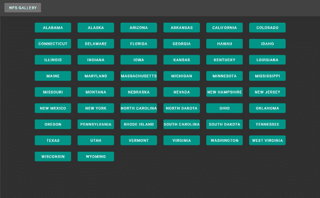
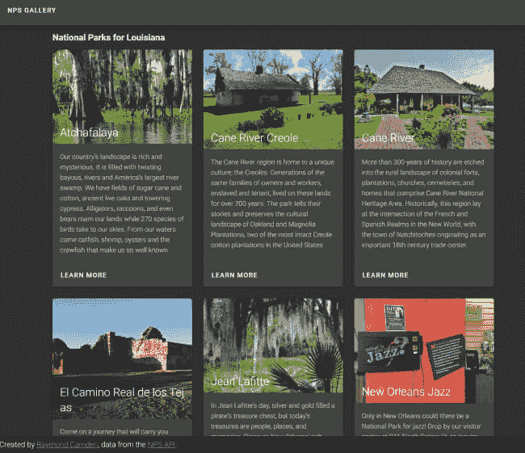

# 使用 Vue.js 的国家公园服务 API 演示

> 原文：<https://dev.to/raymondcamden/a-national-parks-service-api-demo-with-vue-js-4odn>

这个周末我在路上，花了一些时间用 Vue.js 构建了(又一个)应用程序。我不认为这个应用程序一定会做什么非常酷的事情。至少它更多的是“锻炼”了我的 Vue 肌肉，并提供了另一个我可以和大家分享的演示。一如既往，如果你有任何建议或反馈，请告诉我。如果像这些*的帖子对*没有帮助，也可以免费分享！

让我首先给出一个我构建的高层次概述。我先来几张截图。初始页面显示了所有 50 个州的列表。

[](https://res.cloudinary.com/practicaldev/image/fetch/s--2WK9LvcC--/c_limit%2Cf_auto%2Cfl_progressive%2Cq_auto%2Cw_880/https://static.raymondcamden.cimg/2019/09/nps1.png)

选择一个州将调用[国家公园系统 API](https://www.nps.gov/subjects/digital/nps-data-api.htm) 来查询该州的所有公园。然后我把它们呈现出来:

[](https://res.cloudinary.com/practicaldev/image/fetch/s--4HDooNlZ--/c_limit%2Cf_auto%2Cfl_progressive%2Cq_auto%2Cw_880/https://static.raymondcamden.cimg/2019/09/nps2.png)

在幕后，我使用了以下技术:

*   [Vue.js](https://vuejs.org/) 当然。:)
*   [检视路由器](https://router.vuejs.org/)
*   Vuex 处理调用我的 API 和缓存(我认为这有点有趣)。
*   为用户界面赋予。
*   我的无服务器功能。

在我深入研究代码之前，您可以在这里找到完整的存储库:[https://github . com/cfjedimaster/vue-demos/tree/master/NPS _ gallery](https://github.com/cfjedimaster/vue-demos/tree/master/nps_gallery)。你可以在这里运行演示:【https://npsgallery.raymondcamden.now.sh/

好吧，所以我不打算分享任何关于这一页的第一个视图。我在我的 Vuex 存储中存储了一个 50 个州(和缩写)的硬编码列表，我只需获取它们进行渲染。这里唯一有趣的部分是，我发现`<router-link>`将正确处理 URL 编码值:

```
<v-btn color="teal" width="100%" :to="`/state/${state}/${abbr}`">
{{state}}
</v-btn> 
```

<svg width="20px" height="20px" viewBox="0 0 24 24" class="highlight-action crayons-icon highlight-action--fullscreen-on"><title>Enter fullscreen mode</title></svg> <svg width="20px" height="20px" viewBox="0 0 24 24" class="highlight-action crayons-icon highlight-action--fullscreen-off"><title>Exit fullscreen mode</title></svg>

在上面的链接中，注意我可以放心地使用`state`值。我应该预料到这一点，但我很高兴看到它工作得很好。

从国家的角度来看，事情变得有趣了。首先是主视图组件，它非常简单，因为我的复杂性在别处。

```
<template>

  <v-container>
      <h3>National Parks for {{state}}</h3>

      <i v-if="loading">Please stand by - loading data.</i>

      <v-row>
        <v-col cols="4" v-for="(park,idx) in parks" :key="idx">
          <Park :park="park" />
        </v-col>
      </v-row>
  </v-container>

</template>

<script>
import Park from '../components/Park';

export default {
  components: { Park },
  data() {
    return {
      state:'',
      abbr:''
    }
  },
  computed: {
    loading() {
      return !this.parks.length;
    },
    parks() {
      return this.$store.state.selectedParks;
    }
  },
  async created() {
    // clear selecion
    this.$store.commit('clearSelection');

    this.state = this.$route.params.state;
    this.abbr = this.$route.params.abbr;
    this.$store.dispatch('loadParks', this.abbr);
  }
}
</script> 
```

<svg width="20px" height="20px" viewBox="0 0 24 24" class="highlight-action crayons-icon highlight-action--fullscreen-on"><title>Enter fullscreen mode</title></svg> <svg width="20px" height="20px" viewBox="0 0 24 24" class="highlight-action crayons-icon highlight-action--fullscreen-off"><title>Exit fullscreen mode</title></svg>

您可以看到，我通过绑定到来自我的商店的一个`parks`变量来呈现值。您会注意到我在我的`created`中调用了两个与商店相关的东西。我先叫`clearSelection`，然后叫`loadParks`。`clearSelection`从视图中移除任何先前载入的公园，显然`loadParks`发出了载入公园的请求。现在让我们来看看商店，因为这是事情变得有点复杂的地方。

```
import Vue from 'vue'
import Vuex from 'vuex'

Vue.use(Vuex)

import api from './api/nps';

export default new Vuex.Store({
  state: {
    states:{
      "AL": "Alabama",
      // stuff removed here
      "WY": "Wyoming"
    }, 
    parks:{

    },
    selectedParks:[]
  },
  mutations: {
    cache(state, args) {
      console.log('storing cache for '+args.abbr+ ' and '+args.parks.length + ' parks');
      state.parks[args.abbr] = args.parks;
    },
    clearSelection(state) {
      state.selectedParks = [];
    },
    select(state, parks) {
      state.selectedParks = parks
    }
  },
  actions: {
    async loadParks(context, abbr) {
      // check the cache
      if(context.state.parks[abbr]) {
        console.log('woot a cache exists');
        context.commit('select', context.state.parks[abbr]);
      } else {
        console.log('no cache, sad face');
        let results = await api.getParks(abbr);
        context.commit('cache', {abbr:abbr, parks:results});
        context.commit('select', context.state.parks[abbr]);
      }
    }
  }
}) 
```

<svg width="20px" height="20px" viewBox="0 0 24 24" class="highlight-action crayons-icon highlight-action--fullscreen-on"><title>Enter fullscreen mode</title></svg> <svg width="20px" height="20px" viewBox="0 0 24 24" class="highlight-action crayons-icon highlight-action--fullscreen-off"><title>Exit fullscreen mode</title></svg>

因此，我想在这里指出的最重要的事情是，我使用存储来包装对我的 API 的调用，并作为一个简单的缓存。每当你请求 X 州的公园时，我首先查看它是否被缓存，如果是，立即返回。否则我会调用 API。这是一个非常简单的系统，但我喜欢它是如何出来的，并且在性能方面它真的很有效。

API 部分实际上有两层。你可以看到我加载了`'./api/nps'`，这是另一个包装器:

```
const NPS_API = '/api/npswrapper';

export default {

    async getParks(state) {
        return new Promise(async (resolve, reject) =>{
          let results = await fetch(NPS_API+`?state=${state}`);
          let parks = await results.json();
          /*
            API returns park.images[], we want to change this to park.image to simplify it
          */
          let parkData = parks.data.map(p => {
            if(p.images && p.images.length > 0) {
                p.image = p.images[0].url;
            }
            return p;
          });
          resolve(parkData);  
        });
    }

} 
```

<svg width="20px" height="20px" viewBox="0 0 24 24" class="highlight-action crayons-icon highlight-action--fullscreen-on"><title>Enter fullscreen mode</title></svg> <svg width="20px" height="20px" viewBox="0 0 24 24" class="highlight-action crayons-icon highlight-action--fullscreen-off"><title>Exit fullscreen mode</title></svg>

这只是调用我的无服务器函数。NPS API 不支持 CORS，所以我需要它来处理这个问题。我还做了一点过滤，以确保我们得到图像。(虽然这似乎并不完美——我认为一些公园有 404 的图像。)最后一位是无服务器功能:

```
const fetch = require('node-fetch');

const NPS_KEY = process.env.NPS_KEY;

module.exports = async (req, res) => {

    let state = req.query.state;
    let httpResult = await fetch(`https://developer.nps.gov/api/v1/parks?stateCode=${state}&limit=100&fields=images&api_key=${NPS_KEY}`);
    let results = await httpResult.json();
    res.json(results);

}; 
```

<svg width="20px" height="20px" viewBox="0 0 24 24" class="highlight-action crayons-icon highlight-action--fullscreen-on"><title>Enter fullscreen mode</title></svg> <svg width="20px" height="20px" viewBox="0 0 24 24" class="highlight-action crayons-icon highlight-action--fullscreen-off"><title>Exit fullscreen mode</title></svg>

如果你想了解更多关于 serverless 和 Zeit 的信息，请查看我几天前写的文章。

反正就是这样！正如我常说的，我喜欢一些反馈，所以请在下面给我留言。

*标题图片由[塞巴斯蒂安·恩劳](https://unsplash.com/@sebastian_unrau?utm_source=unsplash&utm_medium=referral&utm_content=creditCopyText)在 Unsplash 上拍摄*