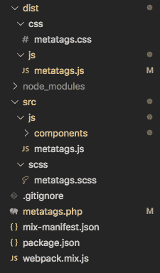

# 构建 Gutenberg 工具条插件第 2 部分:添加结构和资产捆绑

> 原文:[https://dev . to/vanaf 1979/building-a-Gutenberg-sidebar-plugin-part-2-adding-structure-and-asset-bundling-4582](https://dev.to/vanaf1979/building-a-gutenberg-sidebar-plugin-part-2-adding-structure-and-asset-bundling-4582)

[最初于 2019 年 9 月 8 日发布在我的网站上](https://since1979.dev/building-a-gutenberg-sidebar-plugin-part-2-adding-structure-and-asset-bundling/)

### 简介

在之前的文章中，我向你展示了如何使用 Oop Php 在 WordPress 注册 *Metatags* 插件。在本文中，我们将继续添加一个文件夹结构和一个 [Webpack 资产捆绑器](https://webpack.js.org/)，使用 [Laravel Mix](https://laravel-mix.com/) 处理 Gutenberg 编辑器所需的 Css 和 [React](https://reactjs.org/) Javascript。

我将快速向您展示如何建立一个 *Package.json* 文件和 *Laravel Mix* 来捆绑我们的资产。如果你对 Laravel Mix 不熟悉，请先阅读我的“[主题开发](https://since1979.dev/wordpress-laravel-mix-sass-and-es6-modules-in-theme-development/)中的 Laravel Mix、Sass 和 ES6 模块”文章。

### 文件夹结构。

我们首先需要向我们的项目添加一些结构和文件夹。此时，我们的插件目录中只有一个*metatags.php*，如果你在上一篇文章中创建了测试文件，那么应该有一个 *dist/css/metatags.css* 和一个 *dist/js/metatags.js* 文件。

因为我们将使用资产捆绑器，所以我们需要一个 *src/* 目录来存放我们的工作文件，以及一个 *dist/* 目录来生成捆绑文件。下面是完成的项目文件的截图。

[T2】](https://res.cloudinary.com/practicaldev/image/fetch/s--0pPpNsQa--/c_limit%2Cf_auto%2Cfl_progressive%2Cq_auto%2Cw_880/https://since1979.dev/wp-content/uploads/2019/08/metatags-gutenberg-plugin-file-structure.png)

### 来源目录

让我们从添加一个 src/目录到我们的项目开始。我们将把工作文件放在这个目录中。这意味着我们将在这个目录中编写代码。

在 *src/* 目录下创建以下文件。

*   ***src/scss/meta tags . scss***这个文件将保存这个项目的样式。
*   ***src/js/meta tags . js***这将是我们主要的 Javascript 文件。

### 分布目录

这个目录将保存由我们的资产捆绑器生成的文件，这些文件将用于运行插件。这意味着这些文件将是我们用 Metatags 类排队的文件..

如果您之前创建了测试文件，那么您应该已经设置了这个目录。如果没有，创建以下文件。

*   ***dist/CSS/meta tags . CSS***插件的主样式表。
*   ***dist/js/meta tags . js***插件的主 Javascript 文件。

### 。吉蒂尔

如果你想使用 Git 来版本化插件，你应该添加一个*。gitignore 具有以下内容的*文件。