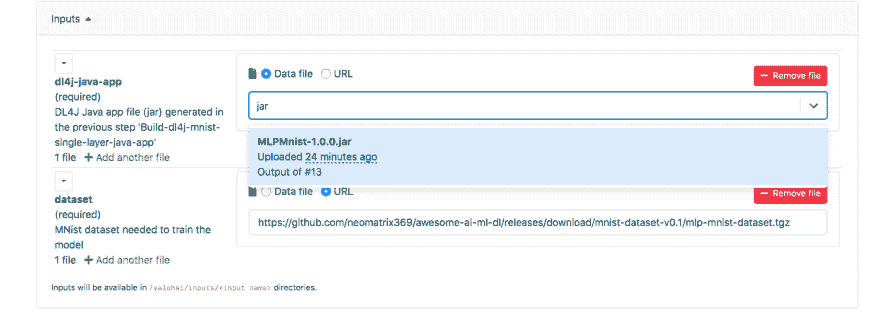
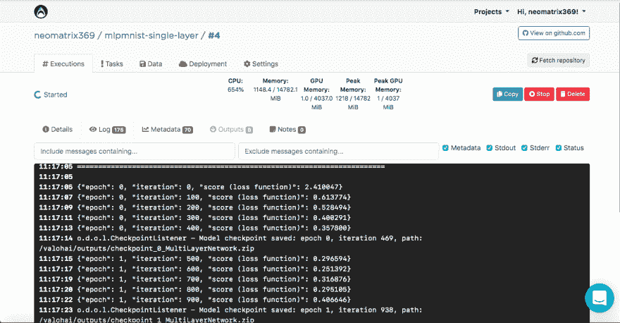
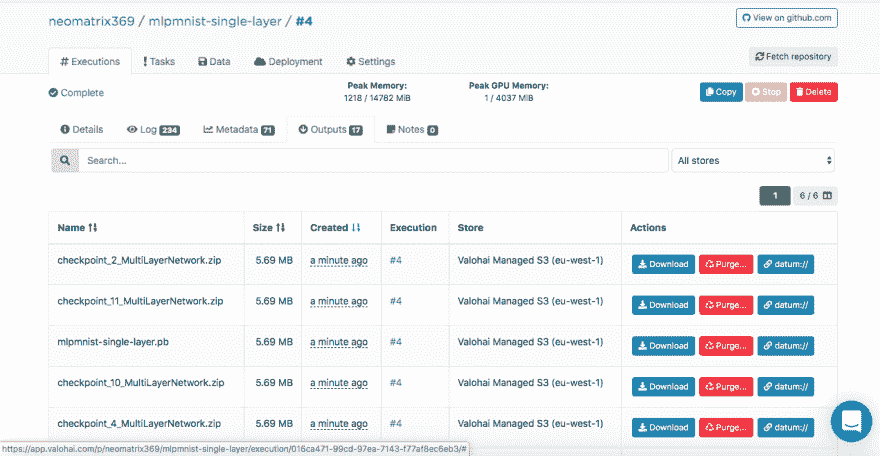
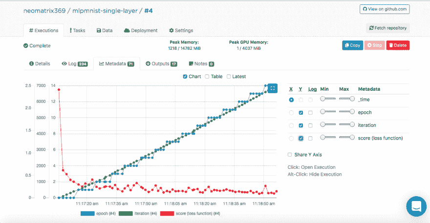
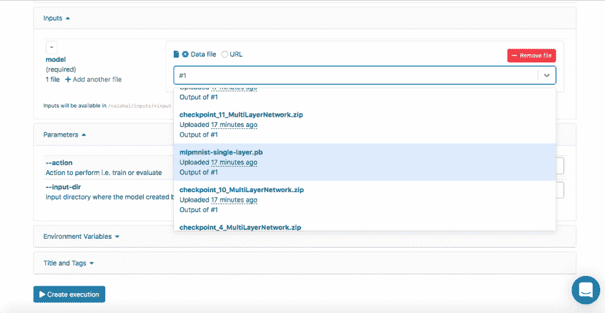
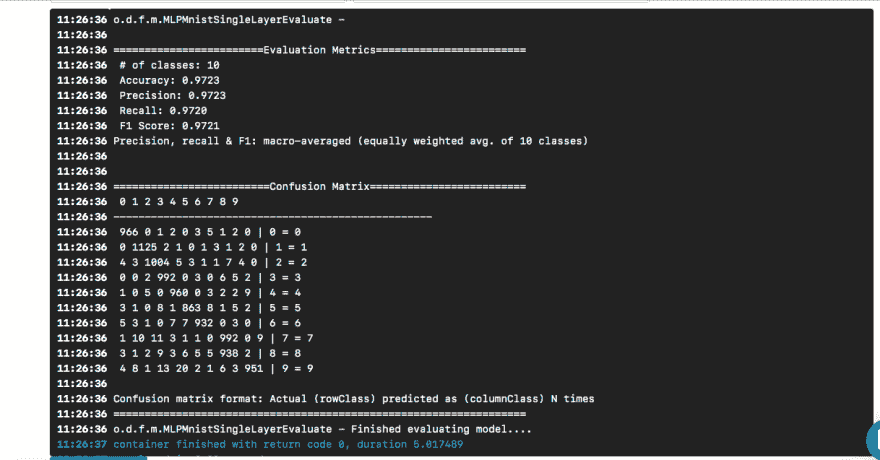

# 如何做 Java 的深度学习？

> 原文:[https://dev . to/neo matrix 369/how-to-do-deep-learning-for-Java-3f 04](https://dev.to/neomatrix369/how-to-do-deep-learning-for-java-3f04)

# [](#introduction)简介

不久前，我偶然发现了这款名为 [Valohai](https://valohai.com/) 的生命周期管理工具(或云服务),它的用户界面以及简单的设计和布局给我留下了深刻的印象。我和 [Valohai](https://valohai.com/) 的一名成员就当时的服务聊得很开心，并得到了一个演示。在此之前，我已经使用 [GNU Parallel](https://www.gnu.org/software/parallel/) 、JavaScript、Python 和 Bash 编写了一个简单的管道——以及另一个完全使用 [GNU Parallel](https://www.gnu.org/software/parallel/) 和 Bash 的管道。我还考虑过用现成的任务/工作流管理工具(如 Jenkins X、Jenkins Pipeline、Concourse 或 Airflow)替换移动部件，但由于各种原因，我没有继续这个想法。

回到我们最初的对话，我注意到很多关于 [Valohai](https://valohai.com/) 的例子和文档都是基于 Python 和 R 以及各自的框架和库。缺乏基于 Java/JVM 的例子或文档。所以我借此机会做了些事情。

我在 [Valohai](https://valohai.com/) 的鼓励下，使用著名的 Java 库[**DL4J**](https://deeplearning4j.org/)[-](https://deeplearning4j.org/)[**Deep Learning for Java**](https://deeplearning4j.org/)实现了一些东西。

在了解了 Valohai 的设计、布局和工作流程后，我对它的初步体验已经给了我很好的印象。它是开发者友好的，并且制作者已经考虑了开发者和基础设施工作流程的各个方面。在我们的世界中，后者主要由开发人员或系统运行团队运行，我们知道其中的细微差别和棘手问题。你可以从网站的[功能区](https://valohai.com/features/)找到更多关于它的功能。

***Achtung！*** *只是想让你知道，从这里开始，这篇文章将更加专业，可能会包含代码片段，并提到深度学习/机器学习和基础设施相关的术语。*

# [](#what-do-we-need-and-how)我们需要什么，如何需要？

对于任何机器学习或深度学习项目或倡议，目前两个重要的组件(从高级别角度来看)是代码，它们将创建并服务于整个生命周期将在其中执行的模型和基础设施。

当然，在上面提到的之前、期间和之后会有需要的步骤和组件，但是为了简单起见，让我们假设我们需要代码和基础设施。

**代码**
对于代码，我选择了一个使用 DL4J 的修改示例，它是一个 [MNist 项目](https://en.wikipedia.org/wiki/MNIST_database)，具有 60，000 个图像的训练集和 10，000 个手写数字图像的测试集。这个数据集可以通过 DL4J 库获得(就像 [Keras](https://keras.io/) 提供了它们的库存一样)。在 [DL4J Cheatsheet](https://deeplearning4j.org/docs/latest/deeplearning4j-cheat-sheet) 中的[**DatasetIterators**](https://github.com/eclipse/deeplearning4j/blob/master/nd4j/nd4j-backends/nd4j-api-parent/nd4j-api/src/main/java/org/nd4j/linalg/dataset/api/iterator/DataSetIterator.java)下查找[**MnistDataSetIterator**](https://github.com/eclipse/deeplearning4j/blob/master/deeplearning4j/deeplearning4j-data/deeplearning4j-datasets/src/main/java/org/deeplearning4j/datasets/iterator/impl/MnistDataSetIterator.java)以获得关于此特定数据集的更多详细信息。

在开始之前看一下我们将要使用的源代码，主要的 Java 类叫做 [**org.deeplearning4j .前馈. mnist . mlpmnissinglerayerrunner**](https://github.com/valohai/mlpmnist-dl4j-example/blob/master/src/main/java/org/deeplearning4j/feedforward/mnist/MLPMnistSingleLayerRunner.java)。

**基础设施**
现在很明显，我们已经决定使用 [Valohai](https://valohai.com/) 作为我们运行实验(模型的训练和评估)的基础设施来测试 Java 示例。Valohai 识别 git 库并直接挂钩到它们，允许执行我们的代码，而不管平台或语言如何——我们将看到这是如何工作的。这也意味着如果你是 *GitOps* 或 *Infrastructure-As-Code* 的坚定支持者，你会喜欢这个工作流程。

为此，我们只需要一个在 [Valohai](https://valohai.com/) 上的账户，我们可以利用一个[自由层账户](https://valohai.com/pricing/)，当我们[注册](https://app.valohai.com/accounts/signup/)时，可以访问各种配置的几个实例。更多详细信息，请参见[计划和定价](https://valohai.com/pricing/)下的自由层和对比图表。对于我们想做的，免费层是绰绰有余了。

# [](#deep-learning-for-java-and-valohai)面向 Java 和 Valohai 的深度学习

正如我们所同意的，我们将使用这两种技术来实现我们的目标，即训练一个单层模型并对其进行评估，以及在 [Valohai](https://valohai.com/) 上查看端到端体验。

我们将把必要的构建和运行时依赖捆绑到 Docker 映像中，并使用它来构建我们的 Java 应用程序，训练一个模型，并通过一个简单的 [valohai.yaml](https://github.com/valohai/mlpmnist-dl4j-example/blob/master/valohai.yaml) 文件在 [Valohai](https://valohai.com/) 平台上对其进行评估，该文件位于项目存储库的根文件夹中。

## [](#deep-learning-for-java-dl4j)面向 Java 的深度学习:DL4J

简单的部分是，我们在这里不需要做太多，只需构建 jar 并将数据集下载到 Docker 容器中。我们有一个预构建的 Docker 映像，其中包含构建 Java 应用程序所需的所有依赖项。我们已经将此图像推送到 [Docker Hub](https://hub.docker.com/) ，您可以通过搜索 [dl4j-mnist-single-layer](https://hub.docker.com/r/neomatrix369/dl4j-mnist-single-layer) 来找到它(我们将使用 YAML 文件中定义的特定标签)。我们选择使用 [GraalVM 19.1.1](https://github.com/oracle/graal) 作为这个项目的 Java 构建和运行时，因此它被嵌入到 Docker 映像中(关于 Docker 映像的定义，请参见 [Dockerfile](https://github.com/valohai/mlpmnist-dl4j-example/blob/master/Dockerfile) )。要了解更多关于 GraalVM 的信息，请查看 graalvm.org 官方网站的资源。

**编排**
当从命令行调用 uber jar 时，我们进入`MLPMnistSingleLayerRunner`类，该类根据传入的参数将我们导向预期的动作:

```
 public static void main(String[] args) throws Exception {
        MLPMnistSingleLayerRunner mlpMnistRunner = new MLPMnistSingleLayerRunner();

        JCommander.newBuilder()
                .addObject(mlpMnistRunner)
                .build()
                .parse(args);

        mlpMnistRunner.execute();
    } 
```

传递给 uber jar 的参数由该类接收，并由`execute()`方法处理。

我们可以通过`--` `action train`参数创建一个模型，并通过分别传递给 Java 应用程序(uber jar)的`--action evaluate`参数评估创建的模型。

完成这项工作的 Java 应用程序的主要部分可以在下面提到的两个 Java 类中找到。

**训练一个模型**

可以通过
从命令行调用

```
 ./runMLPMnist.sh --action train --output-dir ${VH_OUTPUTS_DIR}

    or

    java -Djava.library.path=""             \
         -jar target/MLPMnist-1.0.0-bin.jar \
         --action train --output-dir ${VH_OUTPUTS_DIR} 
```

这将在由执行开始时传入的`--output-dir`指定的文件夹中创建名为`mlpmnist-single-layer.pb`的模型(成功时，在执行结束时)。从 [Valohai](http://www.valohai.com) 的角度来看，应该是放入${VH_OUTPUTS_DIR}也就是我们做的(见 [valohai.yaml](https://github.com/valohai/mlpmnist-dl4j-example/blob/master/valohai.yaml) 文件)。

有关源代码，请参见类[MLPMNistSingleLayerTrain.java](https://github.com/valohai/mlpmnist-dl4j-example/blob/master/src/main/java/org/deeplearning4j/feedforward/mnist/MLPMnistSingleLayerTrain.java)，

**评估模型**

可以通过
从命令行调用

```
 ./runMLPMnist.sh --action evaluate --input-dir ${VH_INPUTS_DIR}/model

    or

    java -Djava.library.path=""             \
         -jar target/MLPMnist-1.0.0-bin.jar \
         --action evaluate --input-dir ${VH_INPUTS_DIR}/model 
```

这要求在调用应用程序时，名为`mlpmnist-single-layer.pb`的模型(由训练步骤创建)出现在由传入的`--input-dir`指定的文件夹中。

对于源代码，见类[MLPMNistSingleLayerEvaluate.java](https://github.com/valohai/mlpmnist-dl4j-example/blob/master/src/main/java/org/deeplearning4j/feedforward/mnist/MLPMnistSingleLayerEvaluate.java)。

我希望这个简短的插图能够清楚地说明训练和评估模型的 Java 应用程序一般是如何工作的。

这就是我们所需要的，但是请随意使用其余的[源](https://github.com/valohai/mlpmnist-dl4j-example)(以及 [README.md](https://github.com/valohai/mlpmnist-dl4j-example/blob/master/README.md) 和 bash 脚本)来满足您的好奇心和理解这是如何完成的！在帖子末尾的**资源**部分提供了关于如何使用 DL4J 的更多资源。

## [](#valohai)Valohai

作为一个平台，Valohai 允许我们松散地耦合我们的运行时环境、代码和数据集，正如你从下面 YAML 文件的结构中看到的。这样，不同的组件可以独立发展，而不会互相妨碍或依赖。因此，我们的 Docker 容器只包含构建和运行时组件。在执行时，我们在 Docker 容器中构建 uber jar，将其上传到一些内部或外部存储，然后通过另一个执行步骤从存储(或另一个位置)下载 uber jar 和数据集来运行训练。这样，两个执行步骤是分离的；例如，我们可以构建一次 jar，然后在同一个 jar 上运行数百个训练步骤。由于构建和运行时环境不应该经常改变，我们可以缓存它们，代码、数据集和模型源可以在执行时动态可用。

[**valohai.yaml**](https://docs.valohai.com/valohai-yaml/index.html)
将我们的 Java 项目与 valohai 基础设施集成的核心是定义 [**valohai.yaml**](https://docs.valohai.com/valohai-yaml/index.html) 文件中[执行](https://docs.valohai.com/core-concepts/executions.html)的步骤，该文件位于项目文件夹的根目录中。我们的 [valohai.yaml](https://github.com/valohai/mlpmnist-dl4j-example/blob/master/valohai.yaml) 长这样:

```
 ---

    - step:
        name: Build-dl4j-mnist-single-layer-java-app
        image: neomatrix369/dl4j-mnist-single-layer:v0.5
        command:
          - cd ${VH_REPOSITORY_DIR}
          - ./buildUberJar.sh
          - echo "~~~ Copying the build jar file into ${VH_OUTPUTS_DIR}"
          - cp target/MLPMnist-1.0.0-bin.jar ${VH_OUTPUTS_DIR}/MLPMnist-1.0.0.jar
          - ls -lash ${VH_OUTPUTS_DIR}
        environment: aws-eu-west-1-g2-2xlarge
    - step:
        name: Run-dl4j-mnist-single-layer-train-model
        image: neomatrix369/dl4j-mnist-single-layer:v0.5
        command:
          - echo "~~~ Unpack the MNist dataset into ${HOME} folder"
          - tar xvzf ${VH_INPUTS_DIR}/dataset/mlp-mnist-dataset.tgz -C ${HOME}
          - cd ${VH_REPOSITORY_DIR}
          - echo "~~~ Copying the build jar file from ${VH_INPUTS_DIR} to current location"
          - cp ${VH_INPUTS_DIR}/dl4j-java-app/MLPMnist-1.0.0.jar .
          - echo "~~~ Run the DL4J app to train model based on the the MNist dataset"
          - ./runMLPMnist.sh {parameters}
        inputs:
          - name: dl4j-java-app
            description: DL4J Java app file (jar) generated in the previous step 'Build-dl4j-mnist-single-layer-java-app'
          - name: dataset
            default: https://github.com/neomatrix369/awesome-ai-ml-dl/releases/download/mnist-dataset-v0.1/mlp-mnist-dataset.tgz
            description: MNist dataset needed to train the model
        parameters:
          - name: --action
            pass-as: '--action  {v}'
            type: string
            default: train
            description: Action to perform i.e. train or evaluate
          - name: --output-dir
            pass-as: '--output-dir  {v}'
            type: string
            default: /valohai/outputs/
            description: Output directory where the model will be created, best to pick the Valohai output directory
        environment: aws-eu-west-1-g2-2xlarge

    - step:
        name: Run-dl4j-mnist-single-layer-evaluate-model
        image: neomatrix369/dl4j-mnist-single-layer:v0.5
        command:
          - cd ${VH_REPOSITORY_DIR}
          - echo "~~~ Copying the build jar file from ${VH_INPUTS_DIR} to current location"
          - cp ${VH_INPUTS_DIR}/dl4j-java-app/MLPMnist-1.0.0.jar .
          - echo "~~~ Run the DL4J app to evaluate the trained MNist model"
          - ./runMLPMnist.sh {parameters}
        inputs:
          - name: dl4j-java-app
            description: DL4J Java app file (jar) generated in the previous step 'Build-dl4j-mnist-single-layer-java-app'    
          - name: model
            description: Model file generated in the previous step 'Run-dl4j-mnist-single-layer-train-model'
        parameters:
          - name: --action
            pass-as: '--action  {v}'
            type: string
            default: evaluate
            description: Action to perform i.e. train or evaluate
          - name: --input-dir
            pass-as: '--input-dir  {v}'
            type: string
            default: /valohai/inputs/model
            description: Input directory where the model created by the previous step can be found created
        environment: aws-eu-west-1-g2-2xlarge 
```

*步骤说明****Build-dl4j-mnist-single-layer-Java-app***
从 YAML 文件中我们可以看到，我们定义这个步骤首先使用 Docker 镜像，然后运行构建脚本来构建 uber jar。我们的 docker 映像具有构建环境依赖项设置(即 GraalVM JDK、Maven 等)来构建 Java 应用程序。我们不指定任何输入或参数，因为这是构建步骤。一旦构建成功，我们希望将名为`MLPMnist-1.0.0-bin.jar`(原始名称)的 uber jar 复制到`/valohai/outputs`文件夹(由`${VH_OUTPUTS_DIR}`表示)。该文件夹中的所有内容都会自动保存在项目的存储中，例如 AWS S3 存储桶。最后，我们定义要在 AWS 环境中运行的作业。

***注意:******valo hai 自由层* *do** es* *不能从 Docker 容器内部访问网络(默认情况下这是禁用的)，请联系支持人员启用此选项(我也必须这样做)，否则我们无法在构建期间下载我们的 Maven 和其他依赖项。*

*步骤说明****Run-dl4j-mnist-single-layer-train-model***
定义的语义与上一步类似，只是我们指定了两个输入，一个用于 uber jar ( `MLPMnist-1.0.0.jar`)，另一个用于 dataset(要解包到`${HOME}/.deeplearning4j`文件夹中)。我们将传递两个参数`--action train`和`--output-dir /valohai/outputs`。从该步骤创建的模型被收集到`/valohai/outputs/model`文件夹中(由`${VH_OUTPUTS_DIR}/model`表示)。

*注:在 Valohai Web UI* *的执行标签* *的输入字段中，除了使用 datum://或 http:// URLs 之外，我们还可以使用执行编号，即* `*#1*` *或* `*#2*` *来选择以前执行的输出。键入文件名的几个字母也有助于搜索整个列表。*

*步骤说明****Run-dl4j-mnist-single-layer-evaluate-model***
同样，这个步骤与上一步类似，只是我们将传入两个参数`--action evaluate`和`--input-dir /valohai/inputs/model`。此外，我们再次指定了在 YAML 文件中定义的两个`inputs:`部分，称为`dl4j-java-app`和`model`，它们都没有设置`default`。这将允许我们使用 web 界面选择我们希望评估的 uber jar 和模型——这是通过*步骤****Run-dl4j-mnist-single-layer-train-model***创建的。

希望这解释了上述定义文件中的步骤，但如果你需要进一步的帮助，请不要犹豫，看看[文档](https://docs.valohai.com/index.html)和[教程](https://docs.valohai.com/tutorials/index.html)。

[**瓦罗海网页界面**](https://app.valohai.com/accounts/login/)

一旦我们有了一个帐户，我们可以[登录](https://app.valohai.com/accounts/login/)并继续创建一个名为`mlpmnist-single-layer`的项目，将 git repo[https://github.com/valohai/mlpmnist-dl4j-example/](https://github.com/valohai/mlpmnist-dl4j-example/)链接到该项目并保存该项目，快速浏览教程以了解[如何使用 web 界面](https://docs.valohai.com/tutorials/index.html)创建项目。

现在您可以执行一个步骤，看看结果如何！

**构建 DL4J Java 应用程序步骤**

进入 web 界面的 **Executions** 选项卡，使用**【创建执行】**按钮复制一个现有的或创建一个新的执行，所有必要的默认选项将被填充，选择步骤***Build-dl4j-mnist-single-layer-Java-app***。

对于*环境*，我将选择 *AWS eu-west-1 g2.2xlarge* ，并单击页面底部的 ***【创建执行】*** 按钮，以查看执行开始。

[T2】](https://res.cloudinary.com/practicaldev/image/fetch/s--RqqLquMW--/c_limit%2Cf_auto%2Cfl_progressive%2Cq_auto%2Cw_880/https://miro.medium.com/max/1401/0%2A7t0fjo-_p-Doo09u.png)

**训练模型步骤**

进入 web 界面的**执行**页签，和上一步一样，选择步骤 ***运行-dl4j-mnist-单层-列车-模型*** *。*您必须选择在上一步中构建的 Java 应用程序(只需在字段中键入 *jar* ，数据集已经通过 ***valohai.yaml*** 文件进行了预填充:

[T2】](https://res.cloudinary.com/practicaldev/image/fetch/s--I5MFSgkK--/c_limit%2Cf_auto%2Cfl_progressive%2Cq_auto%2Cw_880/https://miro.medium.com/max/1342/0%2ACyy14Lb8JSfJZrdz.png)

点击 ***【创建执行】*** 开始此步骤。

[T2】](https://res.cloudinary.com/practicaldev/image/fetch/s---WYWWVJJ--/c_limit%2Cf_auto%2Cfl_progressive%2Cq_auto%2Cw_880/https://miro.medium.com/max/1399/0%2AA8BZUz7_k5MG371Y.png)

您将在日志控制台中看到模型摘要:

```
 [<--- snipped --->]
    11:17:05 =========================================================================
    11:17:05 LayerName (LayerType) nIn,nOut TotalParams ParamsShape
    11:17:05 =========================================================================
    11:17:05 layer0 (DenseLayer) 784,1000 785000 W:{784,1000}, b:{1,1000}
    11:17:05 layer1 (OutputLayer) 1000,10 10010 W:{1000,10}, b:{1,10}
    11:17:05 -------------------------------------------------------------------------
    11:17:05  Total Parameters: 795010
    11:17:05  Trainable Parameters: 795010
    11:17:05  Frozen Parameters: 0
    11:17:05 =========================================================================
    [<--- snipped --->] 
```

在执行期间和结束时，可以在**执行**主选项卡的**输出**子选项卡下找到创建的模型:

[T2】](https://res.cloudinary.com/practicaldev/image/fetch/s--BOymwmlg--/c_limit%2Cf_auto%2Cfl_progressive%2Cq_auto%2Cw_880/https://miro.medium.com/max/1398/0%2AMgtDO7qLplEnTAVS.png)

您可能已经注意到了**输出**子选项卡中的几个工件。这是因为我们在每个时期结束时都会保存一个检查点！在执行日志中寻找这些:

```
 [<--- snipped --->]
    11:17:14 o.d.o.l.CheckpointListener - Model checkpoint saved: epoch 0, iteration 469, path: /valohai/outputs/checkpoint_0_MultiLayerNetwork.zip
    [<--- snipped --->] 
```

检查点 zip 包含模型训练在该点的状态，保存在以下三个文件中:

```
 configuration.json
    coefficients.bin
    updaterState.bin 
```

**训练模型>元数据**

您可能已经注意到这些符号在执行日志中飞快地闪过:

```
 [<--- snipped --->]
    11:17:05 {"epoch": 0, "iteration": 0, "score (loss function)": 2.410047}
    11:17:07 {"epoch": 0, "iteration": 100, "score (loss function)": 0.613774}
    11:17:09 {"epoch": 0, "iteration": 200, "score (loss function)": 0.528494}
    11:17:11 {"epoch": 0, "iteration": 300, "score (loss function)": 0.400291}
    11:17:13 {"epoch": 0, "iteration": 400, "score (loss function)": 0.357800}
    11:17:14 o.d.o.l.CheckpointListener - Model checkpoint saved: epoch 0, iteration 469, path: /valohai/outputs/checkpoint_0_MultiLayerNetwork.zip
    [<--- snipped --->] 
```

这些符号触发 [Valohai](https://www.valohai.com) 选取这些值(JSON 格式)用于绘制执行指标，在执行期间和执行之后，可以在**执行**主选项卡中的**元数据**子选项卡下看到这些值:

[T2】](https://res.cloudinary.com/practicaldev/image/fetch/s--N-9Kry8G--/c_limit%2Cf_auto%2Cfl_progressive%2Cq_auto%2Cw_880/https://miro.medium.com/max/1396/0%2ASwM_Lc3efuH7h_9P.png)

我们能够通过将一个监听器类(名为 [ValohaiMetadataCreator](https://github.com/valohai/mlpmnist-dl4j-example/blob/master/src/main/java/org/deeplearning4j/feedforward/mnist/ValohaiMetadataCreator.java) )挂接到模型中来做到这一点，这样在训练期间，注意力会在每次迭代结束时传递给这个监听器类。在这个类的例子中，我们打印了 ***历元计数*** ， ***迭代计数*** ，以及 ***分数(损失函数值)，*** 下面是这个类的代码片段:

```
 public void iterationDone(Model model, int iteration, int epoch) {
            if (printIterations <= 0)
                printIterations = 1;
            if (iteration % printIterations == 0) {
                double score = model.score();
                System.out.println(String.format(
                        "{\"epoch\": %d, \"iteration\": %d, \"score (loss function)\": %f}",
                        epoch,
                        iteration,
                        score)
                );
            }
        } 
```

**评估模型步骤**

一旦通过前面的步骤成功地创建了模型，我们就可以开始评估它了。我们像前面一样创建一个新的执行，但是这次选择***Run-dl4j-mnist-single-layer-evaluate-model***步骤。在开始执行之前，我们需要再次选择 Java app(***MLPMnist-1 . 0 . 0 . jar***)和创建的模型(***MLPMnist-single-layer . Pb***)(如下所示):

[T2】](https://res.cloudinary.com/practicaldev/image/fetch/s--3BeJBPuk--/c_limit%2Cf_auto%2Cfl_progressive%2Cq_auto%2Cw_880/https://miro.medium.com/max/1397/0%2AX9kILtQUEgZtY-91.png)

选择所需的模型作为输入后，点击 ***【创建执行】*** 按钮。这是一个比前一个更快的执行步骤，我们将看到以下输出:

[T2】](https://res.cloudinary.com/practicaldev/image/fetch/s--YpXu4hRq--/c_limit%2Cf_auto%2Cfl_progressive%2Cq_auto%2Cw_880/https://miro.medium.com/max/1340/0%2Aazaua3UlAyVkPSPX.png)

控制台日志中会显示 ***评估指标*** 和 ***混淆矩阵*** 岗位模型分析。

我们可以看到，基于测试数据集，我们的训练活动已经产生了接近 **97%** 精度的模型。混淆矩阵有助于指出一个数字被错误地预测为另一个数字的情况。也许这对模型的创建者和数据集的维护者来说是一个很好的反馈，可以做一些进一步的研究。

问题仍然存在(并且超出了本文的范围)—当面对*真实世界的数据时，模型有多好？*

 *[**valo hai CLI**](https://docs.valohai.com/valohai-cli/installation.html?highlight=cli)
CLI 工具安装和上手都很简单，参见[命令行用法](https://docs.valohai.com/valohai-cli/installation.html?highlight=cli)。

如果您还没有克隆 git 存储库，那么应该这样做:

```
 $ git clone https://github.com/valohai/mlpmnist-dl4j-example/ 
```

然后，我们需要将通过上一节中的 web 界面创建的 Valohai 项目链接到存储在本地机器上的项目(我们刚刚克隆的项目)。运行下面的命令来做到这一点:

```
 $ cd mlpmnist-dl4j-example
    $ vh project --help   ### to see all the project-specific options we have for Valohai
    $ vh project link 
```

您将看到类似这样的内容:

```
 [  1] mlpmnist-single-layer
    ...
    Which project would you like to link with /path/to/mlpmnist-dl4j-example?
    Enter [n] to create a new project.: 
```

选择 1(或适合您的选项)，您应该会看到以下消息:

```
 😁  Success! Linked /path/to/mlpmnist-dl4j-example to mlpmnist-single-layer. 
```

使用 CLI 工具了解所有 CLI 选项的最快方法是:

```
 $ vh --help 
```

还有一件事，在继续之前，确保你的 [Valohai](https://valohai.com/) 项目与最新的 git 项目同步，通过这样做:

```
 $ vh project fetch 
```

[T2】](https://res.cloudinary.com/practicaldev/image/fetch/s--o-ej-MzR--/c_limit%2Cf_auto%2Cfl_progressive%2Cq_auto%2Cw_880/https://miro.medium.com/max/1407/0%2A9b0OmE6SelZXsvZ6.png)

(在 web 界面的右上方，显示有两个指向彼此的箭头图标)。

现在，我们可以使用
从 CLI 执行这些步骤

```
 $ vh exec run Build-dl4j-mnist-single-layer-java-app 
```

一旦执行开始，我们可以通过:
进行检查和监控

```
 $ vh exec info
    $ vh exec logs
    $ vh exec watch 
```

我们还可以同时通过 web 界面看到上述更新。

关于如何使用 [Valohai](https://valohai.com/) 的更多资源已经在帖子末尾的**资源**部分提供，还有一些关于如何使用 CLI 工具的博客帖子，参见[【1】|](https://blog.valohai.com/from-zero-to-hero-with-valohai-cli)[【2】](https://blog.valohai.com/from-zero-to-hero-with-valohai-part-2)。

# [](#conclusion)结论

正如你所看到的，DL4J 和 T2 单独或组合起来都很容易上手。此外，我们可以在组成我们实验的不同组件上进行开发，即构建/运行时环境、代码和数据集，并以松散耦合的方式将它们集成到执行中。

本文中使用的模板示例是开始构建更复杂项目的好方法。您可以使用 web 界面或 CLI 通过 [Valohai](https://valohai.com/) 完成您的工作！使用 CLI，您还可以将其与您的设置和脚本集成(甚至与 CRON 或 CI/CD 作业集成)。

此外，很明显，如果我在从事一个 AI/ML/DL 相关的项目，我*不需要关心创建和维护*一个端到端的管道(这是许多其他人和我过去不得不做的)——这要感谢 [**瓦罗海**](https://valohai.com/) 的人们的良好工作。

感谢[**sky mind**](http://skymind.com)([DL4J](https://deeplearning4j.org)背后的初创公司，用于创建、维护和保持免费)和 [**Valohai**](https://valohai.com/) 让这个工具和云服务可供免费和商业使用。

**请在下面的评论中留言或发推文告诉我这是否有帮助，请点击**[**@ theneomatrix 369**](http://twitter.com/@theNeomatrix369)**，我也欢迎您的反馈，看看您如何能** [**联系到我**](https://neomatrix369.wordpress.com/about/) **，以上请查看上述链接。**

# [](#resources)资源

*   [mlpmnist-dl4j-GitHub 上的示例项目](https://github.com/valohai/mlpmnist-dl4j-example)
*   [牛逼的 AI/ML/DL 资源](https://github.com/neomatrix369/awesome-ai-ml-dl/)
    *   [Java AI/ML/DL 资源](https://github.com/neomatrix369/awesome-ai-ml-dl/blob/master/README-details.md#java)
        *   [深度学习和 DL4J 资源](https://github.com/neomatrix369/awesome-ai-ml-dl/blob/master/README-details.md#deep-learning)
*   **附加 DL4J 资源**
    *   损失函数
        *   [DL4J 的损失功能接口](https://deeplearning4j.org/api/latest/org/nd4j/linalg/lossfunctions/ILossFunction.html)
        *   [5 回归损失函数所有机器学习者都应该知道](https://heartbeat.fritz.ai/5-regression-loss-functions-all-machine-learners-should-know-4fb140e9d4b0)
    *   估价
        *   [https://deep learning 4j . org/docs/latest/deep learning 4j-nn-evaluation](https://deeplearning4j.org/docs/latest/deeplearning4j-nn-evaluation)
*   **瓦罗海资源**
    *   [瓦罗海](https://www.valohai.com/) | [文档](https://docs.valohai.com/) | [博客](https://blogs.valohai.com/) | [GitHub](https://github.com/valohai) | [视频](https://www.youtube.com/channel/UCiR8Fpv6jRNphaZ99PnIuFg) | [展柜](https://valohai.com/showcase/) | [关于瓦罗海](https://github.com/neomatrix369/awesome-ai-ml-dl/blob/master/data/about-Valohai.md#valohai) | [懈怠](http://community-slack.valohai.com/)
    *   关于如何使用 CLI 工具的博文:[【1】](https://blog.valohai.com/from-zero-to-hero-with-valohai-cli)|[【2】](https://blog.valohai.com/from-zero-to-hero-with-valohai-part-2)
*   [超强粒](https://github.com/neomatrix369/awesome-graal) | [粒粒粒. org](http://graalvm.org)

## [](#about-me)关于我

Mani Sarkar 是一名充满激情的开发人员，主要从事 Java/JVM 领域的工作，目前作为一名自由软件工程师/数据/ml 工程师，他正在加强团队，并帮助他们在与小型团队和初创公司合作时加快速度。

**Twitter:**[@ the neomatrix 369](https://twitter.com/@theNeomatrix369)|**github:**[@ new matrix 369](https://github.com/neomatrix369)*