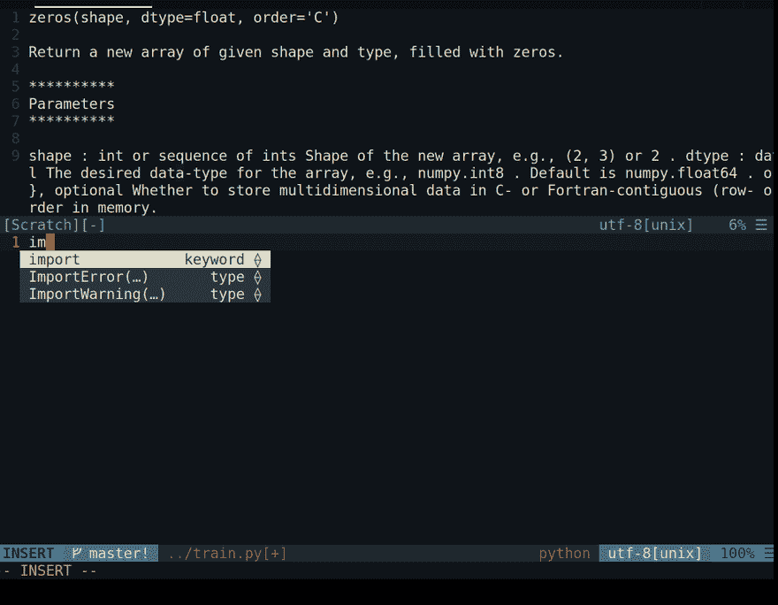
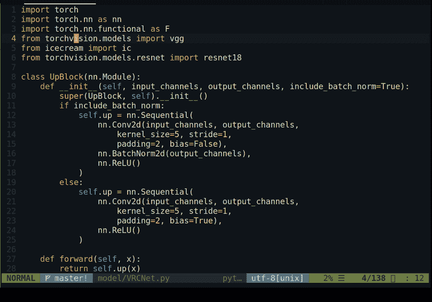
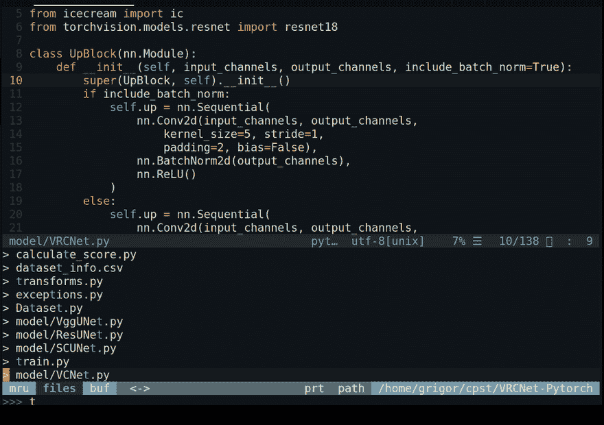

# 编辑器战争:VIM 作为一个完美的 Python IDE

> 原文:[https://dev . to/bezirganyan/editor-wars-vim-as-a-perfect-python-ide-19ne](https://dev.to/bezirganyan/editor-wars-vim-as-a-perfect-python-ide-19ne)

## 背景故事

现在，开发人员有许多文本编辑器和 ide，通常很难决定选择哪一个。因为它们中的大多数都提供了非常相似的界面和功能，所以初学者使用什么编辑器并不重要。然而，对于中级或高级开发人员来说，选择正确的编辑器可以显著提高性能。

现在有很多现代化的强大的编辑器和 ide，比如 JetBrains IDEs，Visual Studio Code，Atom 等。尽管如此，我还是想重点介绍一个相对较老的文本编辑器，它可以像其他文本编辑器一样强大(或者更强大:)，同时给你更好的输入体验。如果你没猜到，我说的是[vim](https://www.vim.org/):1991 年发布的文本编辑器，至今仍很流行。尽管 vim 对初学者不太友好，也不像其他 IDE 那样功能强大，但是通过几个插件和配置，它可以提供比标准 IDE 更好的性能。

在我之前的[帖子](https://dev.to/bezirganyan/who-said-that-vim-cannot-compete-with-ides-51k4)中，我谈到了配置 VIM 与其他 ide 竞争。它更加面向 C/C++，因为那时我的主要编码语言是 C++。一年前，我换了工作场所，Python 成了我的主要编程语言。因为几乎每个人都在我的工作场所使用 PyCharm 进行 Python 开发，所以我决定尝试一下。我不得不承认，PyCharm 是一个非常好的 IDE，我喜欢它的智能功能。然而，我怀念在 VIM 中的打字经历。为 PyCharm 安装 vim layout 也没有太大帮助，我决定花一天时间配置我的 vim，让它拥有我真正需要的 PyCharm 的所有功能。

现在让我们来看看我设法为 VIM 带来的一些特性，这些特性让我们不要错过 PyCharm IDE。

> 注意，这里提到的插件不是 python 特有的，但是因为我主要是在 python 上测试它们，所以我不能确定它们在其他语言上如何工作。如果你已经测试过它们，在评论区听听你的体验会很有趣:

## 配置

### 代码补全

[T2】](https://res.cloudinary.com/practicaldev/image/fetch/s--c7yVOX6A--/c_limit%2Cf_auto%2Cfl_progressive%2Cq_66%2Cw_880/https://thepracticaldev.s3.amazonaws.com/i/3o3iyl7z7eb2scudn6oe.gif)

在我之前的帖子中，我谈到了 [YouCompleteMe](https://github.com/ycm-core/YouCompleteMe) ，这是一个非常棒的开源插件，为许多语言提供了非常好的代码建议。这是我用 C++开发时发现的最好的插件之一，然而，对于 Python，我发现了一个更好的替代品。 [Kite](https://kite.com/) 声称使用机器学习来提供有用的代码补全。由于 Kite 是闭源的，我们不能确定他们是否真的使用了机器学习，但是我可以保证你会喜欢它的代码建议。

Kite 的一个缺点是它是闭源的，如果你是一个发誓开源的人，YouCompleteMe 仍然是一个不错的选择。

### 错误检测

对于语法检查和错误检测，我使用了 [ALE](https://github.com/dense-analysis/ale) (异步 Lint 引擎)插件，它允许您在键入时检查语法。它使用

> ALE 利用 NeoVim 和 Vim 8 作业控制功能和计时器对文本缓冲区的内容运行 linters，并在 Vim 中的文本发生变化时返回错误。这允许在文件保存回文件系统之前，在 Vim 中显示正在编辑的文件中的警告和错误

此外，在一些配置之后，ALE 可以检查 python 代码是否符合 PEP-8，如果不符合就修复它。

### 导航

快速有效的跨文件导航是快速开发的一个基本特性。vim 中一个众所周知的导航插件是[书呆子树](https://github.com/scrooloose/nerdtree)。然而，我发现[维姆醋](https://github.com/tpope/vim-vinegar)是一个更好的选择。它提供了更简洁的界面和更好的导航快捷方式。

[T2】](https://res.cloudinary.com/practicaldev/image/fetch/s--1sTWqxoG--/c_limit%2Cf_auto%2Cfl_progressive%2Cq_66%2Cw_880/https://thepracticaldev.s3.amazonaws.com/i/yrie8a33ljtzkty3828j.gif)

crtl-p 是另一个有用的插件，可以在 vim 中轻松导航。这是一个

> 全路径模糊**文件**，**缓冲**， **mru** ，**标签**，**...**Vim 的查找器。
> 
> *   纯 Vimscript 编写，适用于 MacVim、gVim 和 Vim 7.0+。
> *   完全支持 Vim 的 regexp 作为搜索模式。
> *   内置最近使用的(MRU)文件监控。
> *   内置项目的根查找器。
> *   一次打开多个文件。
> *   创建新的文件和目录。
> *   [可扩展](https://github.com/kien/ctrlp.vim/tree/extensions)。

[T2】](https://res.cloudinary.com/practicaldev/image/fetch/s--Us3-PxyL--/c_limit%2Cf_auto%2Cfl_progressive%2Cq_66%2Cw_880/https://thepracticaldev.s3.amazonaws.com/i/vh8dzz7vtpx3kg9188ei.gif)

### tmux

虽然 [tmux](https://github.com/tmux/tmux) 不是 vim 插件，但它确实改善了在 vim 中编码时的体验。我不仅可以随时随地通过 ssh 连接到我的机器，获得我的会话和布局，而且还将我的多任务处理能力提升到了一个全新的水平。
T3[T5](https://res.cloudinary.com/practicaldev/image/fetch/s--PJW2OBJf--/c_limit%2Cf_auto%2Cfl_progressive%2Cq_auto%2Cw_880/https://thepracticaldev.s3.amazonaws.com/i/rzbh78n9brricx46jaq6.png)

## 其他插件？

正如我在之前的帖子中提到的，有一个非常棒的网站，叫做 vimawesome.com，里面有各种各样的 vim 插件。您可以在那里找到更多的插件，使您的 vim 更接近实际的 IDE。

您可以在下面评论您的 vim 配置。顺便说一句，这是我的第一篇博文，所以我在评论区等待你的正面批评。