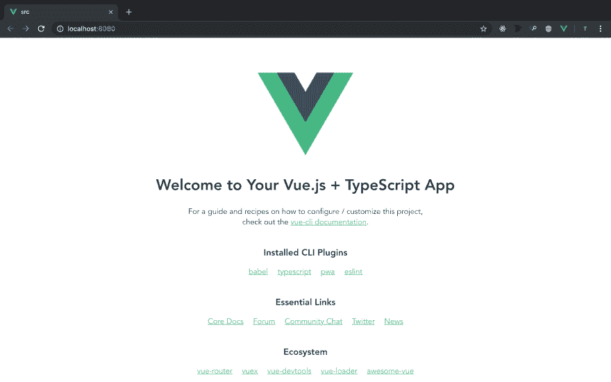
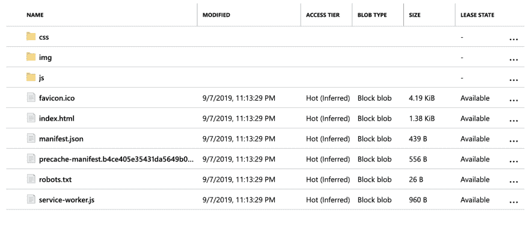

# Luka 00 -意图和部署

> 原文：<https://dev.to/teckert/luka-00-intent-and-deployment-29f0>

> 本文是使用 Rust/Wasm、Vue 和 TypeScript 开发逆向波兰符号计算器网络应用程序系列的一部分。你可以在 [GitHub Repo](https://github.com/t-eckert/luka) 上阅读更多信息并关注发展。

自从我在从 RustConf 回来的火车上，我已经考虑这个项目几个星期了。我做了一个关于 WASM 和铁锈的教程。[这个](https://rustwasm.github.io/docs/book/game-of-life/introduction.html)。我受到启发，更深入地使用 WASM (wasm？WAsm？).

当我学习 React 的时候，我做了一个逆向波兰符号计算器(RPN)。你可以在这里看到这个项目。没关系。这个项目是对那个项目的一个新的尝试，但力求改进以下几点:

*   更高的数学精度:在原文中，`(sqrt(2))^2 == 2.0000000000000004`，这是不成立的。我想我可以利用 Rust 的更高精度来获得更高的数学精度。(我觉得...)这里的目的是使用 Rust 生成 WASM 来进行计算，并将结果传递回 JavaScript 以在 Vue 中呈现。WASM 代码将生成我可以从 JavaScript 调用的函数。
*   成年 Bootstrap 没毛病。最初的项目使用 Bootstrap。自从参与那个项目以来，我已经学会了 CSS Grid 和如何真正设计网页风格。我想这样做的目的是为了实践，创造一个更独特的设计，并缩小网站的足迹。
*   学习！:我想了解更多关于 Rust、Vue、TypeScript、CSS 和 WASM 的知识。这是主要的驱动力。

至于这些日志，目标是显示像这样的项目是如何进展的。这不是线性的，我会犯错误。希望可以通过犯有趣的错误来帮助别人学习。

我想从拥有一个用于部署的端点开始。我要和 Azure 一起上 brand。我知道如何将 Vue 应用部署到 Azure——这是一个静态网站。我不知道这是否会随着 WASM 的加入而改变。这是这个项目将要回答的问题之一。

在部署之前，我至少需要一些东西来部署。我们来做个 Vue app 吧！

## 制作 Vue App

我想很好地将所有代码放在一起，但这在项目的早期阶段总是会发生变化。我正在考虑是在根目录下放置一个名为`src`的目录，还是将其命名为`luka`。我不确定哪个更清楚。项目是整个存储库，包括日志等等，还是仅仅是目录中的内容。

现在，我就叫它`src`。

在新创建的`src`目录中，运行`vue create .`(我承认我不得不谷歌一下)。我用 Babel、TS、PWA、CSS 预处理器和 Linter 创建了这个项目。

我找了那么多次打字稿来救我。我真的很喜欢一起使用 Vue 和 TS。

如果有一天人们想把它放在他们的手机上，PWA 支持是很棒的。谁知道呢。

我将尝试使用这个项目的类风格语法。至于 CSS 预处理器，我用的是 SCSS。如果你不熟悉 SCSS，它可以编译成 CSS，但是允许更大的功能集，并且可以减少你必须手动编写的样式。这里是一个很好的 SCSS 介绍。

应用程序生成后，我可以用`npm run serve`在浏览器中打开它。

太好了！

[](https://res.cloudinary.com/practicaldev/image/fetch/s--tn4eceJ2--/c_limit%2Cf_auto%2Cfl_progressive%2Cq_auto%2Cw_880/https://thepracticaldev.s3.amazonaws.com/i/52f9fki18r7b6rtdoxze.png)

现在我看着它。我觉得很傻，我的`src`目录里面还有一个`src`目录。也许我不应该。我不知道。在我们完成之前，事情可能会发生变化。

## 蔚蓝色的束缚

我在 Azure 工作。这就是我要放这个网站的地方。我就按照[这个教程](https://passos.com.au/deploying-vue-js-to-azure-static-websites/)来设置吧。我的实现和他的实现的一个区别是，我将使用新版 Azure Pipelines，它使用 YAML 进行配置。

不管我做了多少次，我运行的前六个构建/部署都被破坏了。我为那些可怜的部署特工感到难过。启动只是为了安装节点依赖关系，然后失败。抱歉。

一旦我纠正了一些早期的错误，我就碰到了这个错误:

```
[2019/09/08  05:45:30][ERROR]  Error  parsing  source  location  "d:\a\1\s\src\dist":  Failed  to  enumerate  directory  d:\a\1\s\src\dist\  with  file  pattern  *.  The  system  cannot  find  the  path  specified.  (Exception  from  HRESULT:  0x80070003)  For  more  details,  please  type  "AzCopy /?:Source"  or  use  verbose  option  /V. 
```

Enter fullscreen mode Exit fullscreen mode

我的部署动作的 YAML 是:

```
- task: AzureFileCopy@3
  inputs:
    SourcePath: 'src/dist'
    azureSubscription: 'XXXXXXXXXXXXXXXXXXXXXXXXXXXXXXXXX'
    Destination: 'AzureBlob'
    storage: 'lukarpn'
    ContainerName: '$web' 
```

Enter fullscreen mode Exit fullscreen mode

我最初认为问题出现是因为我没有使用本地路径。我指的是一条不存在的路径。我通过搜索“Azure 文件副本”和阅读`source`上的[文档](https://docs.microsoft.com/en-us/azure/devops/pipelines/tasks/deploy/azure-file-copy?view=azure-devops)找到了这个。我发现我需要使用变量`$(Build.Repository.LocalPath)`来正确定位要复制的文件。

好了，现在我尝试了

```
- task: AzureFileCopy@3
  inputs:
    SourcePath: '$(Build.Repository.LocalPath)/src/dist'
    azureSubscription: 'XXXXXXXXXXXXXXXXXXXXXXXXXXXXXXXXX'
    Destination: 'AzureBlob'
    storage: 'lukarpn'
    ContainerName: '$web' 
```

Enter fullscreen mode Exit fullscreen mode

这并没有解决问题。在教程帖子的评论中，我发现其他人也有同样的问题。如果您:

1.  使用建议的“部署 Vue 应用程序”默认管道。
2.  然后尝试使用 Azure 文件复制。
3.  您将收到一条错误消息，指出 Azure 文件复制仅适用于 Windows 版本代理。
4.  然后将构建代理从默认的 Ubuntu 更改为 Windows。
5.  除了这会产生一个 bug，因为堆栈脚本是如何在 PowerShell 中运行的(我认为...).
6.  解决方案是将默认的“npm 安装和构建”任务分成两部分:

原文:

```
- script: |
    cd src
    npm install
    npm run build
  displayName: 'npm  install  and  build' 
```

Enter fullscreen mode Exit fullscreen mode

固定:

```
- script: |
    cd src
    npm install
  displayName: 'npm  install'

- script: |
    cd src
    npm run build
  displayName: 'npm  build' 
```

Enter fullscreen mode Exit fullscreen mode

成功了！

[](https://i.giphy.com/media/9K2nFglCAQClO/giphy.gif)

## 迷你管道-回顾

我应该做的是在 repo 中创建一个名为“add-pipeline”的新管道，并在那里完成所有这些故障排除，然后将工作管道合并到“master”中。我没有。我已经为下一个项目学习了。至少在这个项目中，我不会因为这种糟糕的卫生习惯而惹恼其他人。

看着导致这一成功的一系列管道故障，我觉得这个实验已经增加了太多的宇宙熵:

[](https://res.cloudinary.com/practicaldev/image/fetch/s--3ImYxMr6--/c_limit%2Cf_auto%2Cfl_progressive%2Cq_auto%2Cw_880/https://thepracticaldev.s3.amazonaws.com/i/de6l2per1ugako9w59xp.png)

但至少我现在可以看到文件被上传到 Azure:

[](https://res.cloudinary.com/practicaldev/image/fetch/s--0fZb3zJ2--/c_limit%2Cf_auto%2Cfl_progressive%2Cq_auto%2Cw_880/https://thepracticaldev.s3.amazonaws.com/i/dzz95nfwse2hbdessdte.png)

通过访问 blob 的公共端点:[https://lukarpn.z14.web.core.windows.net/](https://lukarpn.z14.web.core.windows.net/)，可以找到成功的进一步证据。网站上线了！

[](https://res.cloudinary.com/practicaldev/image/fetch/s--dRcF06yx--/c_limit%2Cf_auto%2Cfl_progressive%2Cq_auto%2Cw_880/https://thepracticaldev.s3.amazonaws.com/i/dru89gwgez3aetxldy9s.png)

## 总结起来

这是该项目的一个很好的起点。下一步是开发一个简单的设计，在 Vue 中实现它，并创建支持它的 backing Rust。

开始提交:[7150 DFB 09421 aff 8 a2 f 9312070d 7415 AC 94 D2 AAF](https://github.com/t-eckert/luka/tree/7150dfb09421aff8a2f9312070d7415ac94d2aaf)
T3】结束提交:[f7a 706313 f 158 a 301 f 71d 29 C5 a 0 cc f1 c 6 b 7 EC 8 BC](https://github.com/t-eckert/luka/tree/f7a706313f158a301f71d29c5a0ccf1c6b7ec8bc)