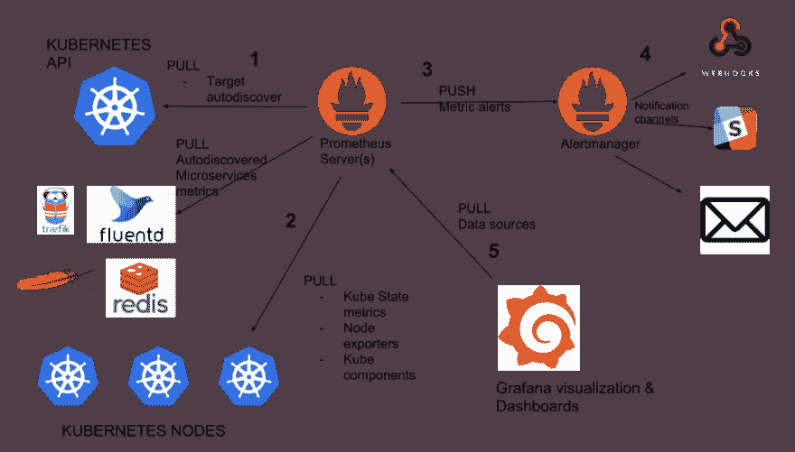

# 第 2 部分:监控、记录和报警

> 原文:[https://dev . to/spaghettifunk/part-2-监控-记录-报警-1bc7](https://dev.to/spaghettifunk/part-2-monitoring-logging-and-alarming-1bc7)

我正在写一个关于如何从头开始构建数据平台的系列文章，现在是第 2 部分的时候了！在第 1 部分中，我解释了如何开始构建你的数据平台。但是，当您的基础架构增长时，确保一切按预期运行就成了一项挑战。正如我的一个最亲爱的同事一直告诉我的:“监控和记录是一门艺术！”。

在第 2 部分中，我想告诉您如何为您的基础设施设置生产级监控系统。概念和警告比一些“复制粘贴”的代码更有价值，原因很简单，理解为什么做出某些选择很重要。

## 工具

[在之前的](https://dev.to/spaghettifunk/part-1-where-it-all-begins-1d72)中，我提到过我们正在使用一堆工具。当我开始把它们全部列出来的时候，我想:哇，看起来相对简单的东西却有这么多东西。我的意思是，我们想要实现的是**能够看到日志，并在发生事情时采取行动**。简单吧？不完全是。引用我的同事的话:监视和记录绝对是一门艺术:)

先把问题分成子问题。在学校里，他们教我们，当问题太大时，我们必须`divide`它和`conquer`它(如果你对拉丁语很感兴趣，也叫`divide et impera`)。

### 问题 1:日志记录

因为我们想了解我们的基础设施和应用程序中发生了什么，所以我们应该首先开始处理日志记录。一般来说，应用程序在 **STDOUT** 上写日志。因为我们使用 Kubernetes，这意味着我们能够从 Kubernetes 自带的`logging`控制台读取日志。因为我们能够读取日志，这意味着我们可以收集日志。我们如何收集它们？正如我在[上一篇文章](https://dev.to/spaghettifunk/part-1-where-it-all-begins-1d72)中提到的，我们使用 [Elasticsearch](https://www.elastic.co/products/elasticsearch) 来索引日志。为了收集这些数据，我们使用了[流畅位](https://github.com/fluent/fluent-bit/)。

#### 方案一:通顺位

Fluent Bit 允许从不同来源收集信息，缓冲并将其发送到不同的输出。我们使用的[头盔图](https://github.com/helm/charts/tree/master/stable/fluent-bit)在 Kubernetes 中作为`daemon set`运行(这里是[关于守护进程集的更多信息)。这保证了在 Kubernetes 集群中的每台机器上都有一个 Fluent Bit 实例。该流程将从`standard output`收集 kubernetes 中每个 pod 的信息，并将它们重定向到另一个系统。我们选择了**卡夫卡**。](https://kubernetes.io/docs/concepts/workloads/controllers/daemonset/)

现在，我们的日志被安全地发送到卡夫卡中的一个主题，并准备好被其他东西消费。

### 问题二:系统度量

应用程序在标准输出上写日志，但是`machines`不写日志，对吧？那么，我如何知道一台机器是如何工作的呢？我如何知道磁盘上的`CPU`是飞速增长还是`I/O operations`是我的应用程序的瓶颈？这就是[节点输出者](https://github.com/prometheus/node_exporter)发挥作用的地方。

### 解决方案二:节点导出器

节点导出器能够从底层操作系统收集指标。这是非常强大的，因为现在我们能够收集我们需要的系统信息。又一次有[舵图](https://github.com/helm/charts/tree/master/stable/prometheus-node-exporter)来救我们了。

### 问题 3:应用度量

酷，但是如果一个应用程序能够给我比简单的日志记录更多的信息呢？例如，如果我的数据库能够给我当前的系统信息，如`memory consumption`或`average query latency`，该怎么办？那很难。这些既不是日志，也不是来自机器的指标。虽然，它们可供我们使用。这时[普罗米修斯](https://prometheus.io/)进入竞技场。

### 方案三:普罗米修斯

Prometheus 是一个系统和服务监控系统。它以给定的时间间隔从配置的目标收集度量，评估规则表达式，显示结果，并在观察到某个条件为真时触发预警。**宾果**。这听起来像是能为我们做很多事情的工具。但是它在全局中处于什么位置呢？让我们看看下面的图片

[T2】](https://res.cloudinary.com/practicaldev/image/fetch/s--4jyTKvqC--/c_limit%2Cf_auto%2Cfl_progressive%2Cq_auto%2Cw_880/https://478h5m1yrfsa3bbe262u7muv-wpengine.netdna-ssl.com/wp-content/uploads/2018/08/prometheus_kubernetes_diagram_overview.png)

这张照片是我从这篇伟大的文章中摘下来的，它清楚地描述了普罗米修斯的所作所为。基本上，它的作用是**拉**和**推**信息。但是需要知道的是，普罗米修斯标准化了信息产生的方式，这样它们就可以被解析，并在以后的阶段被查询。

因为我们的数据平台有多个 Kubernetes 集群(请记住控制平面、生产、开发等)，所以需要在所有这些集群中安装 Prometheus。感谢令人敬畏的开发者社区，有一个我们可以使用的[掌舵图](https://github.com/helm/charts/tree/master/stable/prometheus-operator)。这个操作符允许我们在 [`federation`](https://prometheus.io/docs/prometheus/latest/federation/) 模式下使用普罗米修斯，这在这个上下文中*非常重要*。联合概念允许控制平面中的 prometheus 从其他 prometheus 服务获取信息，这样我们就可以将所有指标集中在一个唯一的点上。

### 问题 4:获取日志

我们决定创建`controlplane`来集中关于其他环境的信息，并对我们平台上的情况有一个总体了解。自从我们将日志推送到 Kafka 之后，我们现在需要消费它们，并以人类可读的格式存储它们。

有一个著名的首字母缩略词叫做`ELK`，它代表 Elasticsearch，Logstash，Kibana。到目前为止，我们提到了 **E** 和 **K** ，但从未提到过 **L** 。好吧，那个时刻刚刚到来。

### 解决方案 4: Logstash

Logstash 是一个开源的服务器端数据处理管道，它可以同时从多个来源获取数据，对其进行转换，然后将其发送到您最喜欢的“stash”这是弹性套装的一部分，它是确保我们能够对所有进入的内容进行相同类型的记录的基础部分。

我们的输入是我们之前提到的 Kafka 主题，我们的输出是 Elasticsearch，然后数据将被索引和“隐藏”。[舵图](https://github.com/helm/charts/blob/master/stable/logstash)帮助你安装应用程序，通过修改`values.yml`的这个[部分](https://github.com/helm/charts/blob/master/stable/logstash/values.yaml#L286)，你可以轻松地阅读卡夫卡。我们发现的主要问题在`@timestamp`领域。事实上，我们不得不对`values.yml`进行一点修改，以避免在读取时间戳时出现问题。

下面的代码片段将帮助您解决这样的问题