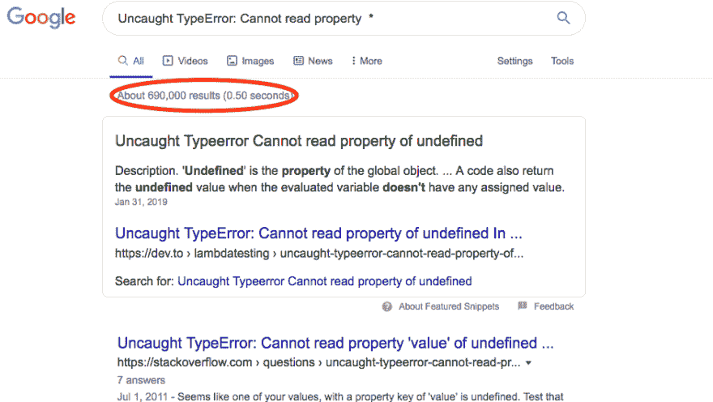
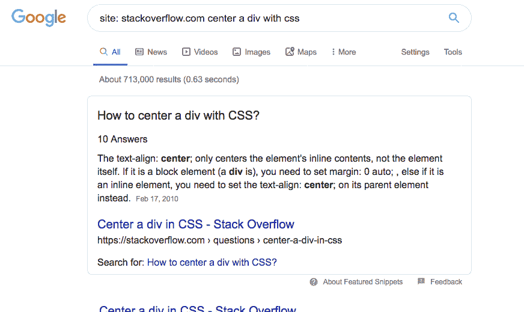
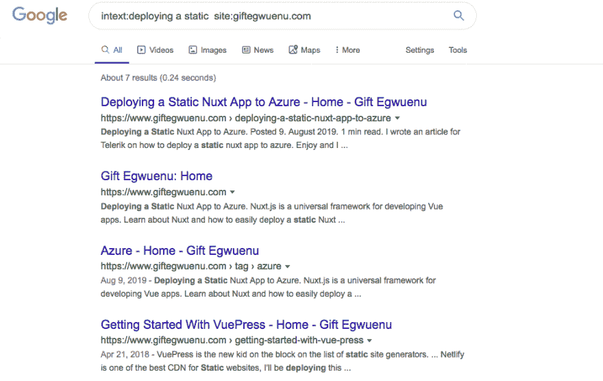
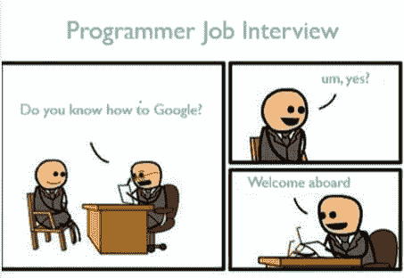

# 谷歌搜索的艺术

> 原文:[https://dev.to/lauragift21/the-art-of-googling-4c04](https://dev.to/lauragift21/the-art-of-googling-4c04)

受这篇来自 localghost.dev 的文章的启发，我决定写我自己的文章，但有所改变。在这篇文章中，我将概述一些提高你的谷歌搜索技能的技巧，并分享我作为一名软件工程师在过去的一周里搜索的东西。这应该很有趣吧，让我们来看看！

[T2】](https://res.cloudinary.com/practicaldev/image/fetch/s--lqNGqPer--/c_limit%2Cf_auto%2Cfl_progressive%2Cq_66%2Cw_880/https://user-images.githubusercontent.com/17781315/64488351-d7182580-d23e-11e9-92b8-20ebeba95cfd.gif)

谷歌是一个巨大的数据库，储存着你在世界上需要的所有信息。你可以在上面找到任何东西，不管它是否与技术有关。在我们的例子中，我将把重点放在这个话题的技术方面。我已经做了近 3 年的开发人员，我知道的一件事是我并不了解所有的事情。作为一名开发人员，在我的日常工作中，我倾向于从 Google 中寻找答案，我查找如何编写特定的语法，甚至检查数组的含义。这些信息对我来说是可用的，如果我遇到错误，查找我不确定的东西或寻求帮助是正常的。作为开发人员，您需要的一项关键技能是能够有效地搜索问题或错误的解决方案。

## 提高你的谷歌搜索技巧的有用提示

*   **使用通配符星号(*):** 这是我最近在搜索带有特定错误的答案时学到的一个技巧。您可以将整个错误复制到 google search，并获得一些相关的结果，因为您添加了一些特定于您的应用程序的关键字。但是为了得到最好的结果，你可以编辑它，并在你的搜索中添加星号通配符，这将改善你的搜索结果，并给出你所需要的精确答案。

[T2】](https://res.cloudinary.com/practicaldev/image/fetch/s--LpO6gkB1--/c_limit%2Cf_auto%2Cfl_progressive%2Cq_auto%2Cw_880/https://user-images.githubusercontent.com/17781315/64489479-95da4280-d24b-11e9-9af7-0e82eb71ea8d.png)

*   **使用特定域名:**添加特定域名还可以帮助你在谷歌上搜索时优化搜索结果。如果您知道要搜索的特定站点，即堆栈溢出。您可以将网站名称`site: sitename`附加到您的搜索中，这样它将只返回来自该网站的结果。

[T2】](https://res.cloudinary.com/practicaldev/image/fetch/s--d8KqzemG--/c_limit%2Cf_auto%2Cfl_progressive%2Cq_auto%2Cw_880/https://user-images.githubusercontent.com/17781315/64489528-2add3b80-d24c-11e9-8630-e1fcc30ec7a2.png)

*   **使用好的关键词:**找到适合你搜索的结果取决于你使用什么样的关键词。搜索时，包括一个与你要搜索的问题密切相关的关键词(例如 JavaScript、数组方法等)。

*   **使用 intitle 搜索标题，使用 intext 搜索文本:**您可以优化搜索，只返回特定网站的文本或标题。这将有助于深入搜索结果，准确返回您正在搜索的内容。当搜索标题时，你可以使用`intitle`作为前缀，使用`intext:`作为网站正文的文本。

[T2】](https://res.cloudinary.com/practicaldev/image/fetch/s--SaUM-Yfh--/c_limit%2Cf_auto%2Cfl_progressive%2Cq_auto%2Cw_880/https://user-images.githubusercontent.com/17781315/64489754-9e804800-d24e-11e9-9aed-06291295dd46.png)

## 过去一周我搜索了什么

既然我已经介绍了一些帮助你提高谷歌搜索技能的技巧，现在我将分享一些我在过去一周谷歌过的术语。

### 周一

*   用 JavaScript 过滤一个数组——我正在做一件家务，需要看看 Filter 方法是如何工作的
*   免费的屏幕录制软件-我非常需要这个
*   Egwuenu 代表什么(老实说我不知道这里发生了什么)

### 星期二

*   纳米学位奖学金——想到获得奖学金的可能性，看到价格后失去了兴趣
*   在 Mac 上截图
*   用网格将 div 居中

### 星期三

*   亚马逊徽标 SVG
*   缩小 SVG -试图减小 SVG 图像的大小
*   将 Nuxt 部署到 Azure——查找我写的一篇文章
*   撤消 git 提交

### 星期四

*   添加断点 Visual Studio 代码
*   Azure 订阅已禁用-正在尝试找出我的 azure 应用关闭的原因
*   清除 expo ios 的错误-我在使用 react 本机应用程序时遇到了问题
*   嵌入式开放式集体烘烤器

### 星期五

*   向 React 本机应用程序添加数据
*   调试 React 本机应用程序
*   虚拟化列表:缺少项目的键
*   带有 React Native 的网格-检查这是否是一个带有 React Native 的东西
*   网格文档

## 结论

写这篇文章的目的是告诉你，不是每个开发人员都是 10 倍的工程师。我们都会在某个时候抬头搜索一些东西，我也在某处读到过，知道搜索什么和如何搜索比花时间死记硬背要好。我可以告诉你，我知道一旦你掌握了这种艺术，谷歌搜索技术能为你的职业生涯带来什么，但我会让你自己去发现它，你会很高兴你做到了。

用我在谷歌上找到的一个迷因来结束这篇文章(明白吗？😉)

[T2】](https://res.cloudinary.com/practicaldev/image/fetch/s--gsPFfoZe--/c_limit%2Cf_auto%2Cfl_progressive%2Cq_auto%2Cw_880/https://user-images.githubusercontent.com/17781315/64488909-43962300-d245-11e9-913c-42b58c199ebb.jpg)

[最初发表在我的博客上](https://www.giftegwuenu.com/the-art-of-googling)